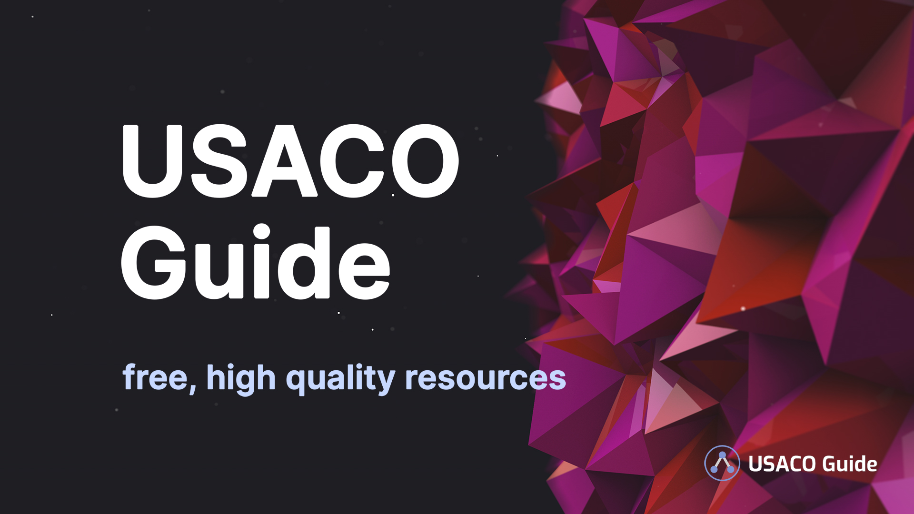

# USACO Guide

A free collection of curated, high-quality resources to take you from Bronze to
Platinum and beyond.

Thank you to the following companies:

- [Vercel](https://vercel.com/?utm_source=cp-initiative&utm_campaign=oss),
  hosting & continuous deployment
- [Algolia](https://algolia.com/), search functionality
- [DigitalOcean](https://m.do.co/c/a07c32d07394), forum hosting
- And [more](docs/Companies.md)!

## Documentation

- To get this site running locally, refer to the
  [Front End Documentation](docs/Front%20End%20Documentation.md).
- For information regarding Content Writing, refer to the
  [Content Documentation](docs/Content%20Documentation.md).

## Contributing

See [CONTRIBUTING.md](CONTRIBUTING.md). All contributions are welcome! To get
started, simply pick an
[issue](https://github.com/cpinitiative/usaco-guide/issues) you'd like to work
on, leave a comment, and submit a Pull Request!

Join our Discord server: https://discord.gg/UKbyewj2Ft

## Our Team

The USACO Guide is run by the
[Competitive Programming Initiative](https://joincpi.org/). We're looking for
Content Authors to join our team to help us improve the Guide! Learn more
[here](https://docs.google.com/document/d/13xR2A2mOftVzlC6QTSkm3zLLdFtI1NhlzRWJ81FfU9U/edit).

### Core Staff

- Benjamin Qi
- Nathan Wang
- Andi Qu
- Siyong Huang
- Darren Yao
- Andrew Wang
- Michael Cao
- Nathan Chen

### Content Authors

- Jeffrey Meng (since Oct 2020)
- Óscar Garries Urbina (since Jan 2021)
- Qi Wang (since Jan 2021)
- Dong Liu (since Jan 2021)
- Neo Wang (since Jan 2021)
- Jesse Choe (since Feb 2021)
- Mrinall Umasudhan (since Feb 2021)
- Maggie Liu (Since Feb 2021)
- Kevin Sheng (Since Apr 2021)
- Ananth Kashyap (Since Apr 2021)
- _This could be you!
  [Apply here](https://docs.google.com/document/d/13xR2A2mOftVzlC6QTSkm3zLLdFtI1NhlzRWJ81FfU9U/edit)._

## Tech Stack

Our front-end is built with:

- React
- Gatsby
- Typescript
- Tailwind CSS & Tailwind UI
- MDX (JSX in Markdown) with XDM compiler
- Firebase
- Deployed with
  [Vercel](https://vercel.com/?utm_source=cp-initiative&utm_campaign=oss)

## Contact Info

If you have any questions, please reach out to us at usacoguide@gmail.com.

## License

 This
work is licensed under a
<a rel="license" href="http://creativecommons.org/licenses/by-nc-sa/4.0/">Creative
Commons Attribution-NonCommercial-ShareAlike 4.0 International License</a>.
