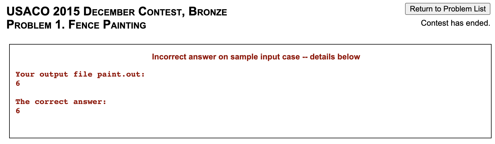

export const problems = {
	cses: [new Problem('CSES', 'Weird Algorithm', '1068', 'Very Easy')],
	fence: [new Problem('Bronze', 'Fence Painting', '567', 'Very Easy')],
};


<LanguageSection>

<CPPSection>

<Resources>
	<Resource source="IUSACO" title="2.1 - Input and Output">
		module is based off this
	</Resource>
	<Resource source="CPH" title="1.2 - Input and Output">
		cin, getline, files
	</Resource>
	<Resource source="PAPS" title="2.4 - Input and Output">
		cin, getline
	</Resource>
</Resources>

</CPPSection>

<JavaSection>

<Resources>
	<Resource source="IUSACO" title="2.1 - Input and Output">
		module is based off this
	</Resource>
</Resources>

</JavaSection>

<PySection>
</PySection>

</LanguageSection>

<!-- We use `using namespace std;` so that we don't have to preface standard library functions with `std::` each time we use them. -->

## Standard I/O

In most websites (such as CodeForces and CSES), input and output are **standard**. Here, we'll provide examples that take three integers as input and prints their sum. Feel free to test these out at [ide.thecodingwizard.me](https://ide.thecodingwizard.me)!

<Info title="Out of the methods below, which one should I use?">

It doesn't matter. Whichever you're most comfortable with!

</Info>

<LanguageSection>

<CPPSection>

### Method 1: [<iostream\>](http://www.cplusplus.com/reference/iostream/)

```cpp
#include <iostream>
using namespace std;

int main() {
	int a, b, c; cin >> a >> b >> c;
	cout << "sum is " << a+b+c << "\n";
}
```

### Method 2: [<cstdio\>](http://www.cplusplus.com/reference/cstdio/)

This library includes the `scanf` and `printf` functions, which are slightly more complicated to use, but are significantly faster (generally only an issue with large input sizes):

```cpp
#include <cstdio>
using namespace std;

int main() {
	int a, b, c;
	// %d specifies that a value of type int is being input.
	// Use %lld (a few judging platforms might need %I64d)
	// to input a long long (64-bit) integer.
	// Many other specifiers are also available; see link for more details.
	// Be sure to add a & character (address-of operator) when using
	// scanf, UNLESS you are inputing a string with %s.
	// It is possible to input multiple values at a time as shown below.
	scanf("%d%d%d", &a, &b, &c);

	// Specifiers for printf are mostly the same as those used
	// by scanf, with the notable exception of floating-point numbers.
	// Use a backslash character followed by the lowercase
	// letter n to denote a newline.
	// The address-of operator, &, is not used here.
	printf("sum is %d\n", a+b+c);
}
```

The first method can be sped up so that the difference in speed is not significant; see [Fast I/O](/general/fast-io) for details.

</CPPSection>

<JavaSection>

### Java

In your CS classes, you've probably implemented input and output using standard input and standard output, or using [`Scanner`](https://docs.oracle.com/javase/7/docs/api/java/util/Scanner.html) to read input and [`System.out.print`](https://docs.oracle.com/en/java/javase/15/docs/api/java.base/java/lang/System.html) to print output. These methods work, but `Scanner` and `System.out.print` are slow when we have to handle inputting and outputting tens of thousands of lines. Thus, we use [`BufferedReader`](https://docs.oracle.com/en/java/javase/15/docs/api/java.base/java/io/BufferedReader.html) and [`PrintWriter`](https://docs.oracle.com/en/java/javase/15/docs/api/java.base/java/io/PrintWriter.html) instead, which are faster because they buffer the input and output and handle it all at once as opposed to parsing each line individually. However, `BufferedReader` is harder to use than `Scanner`. 

Here is a Java template for input and output that which combines `BufferedReader` and `PrintWriter`, based off Kattis's [`Kattio.java`](https://open.kattis.com/help/java). Note that we import the entire `util` and `io` libraries for ease of use. 

```java
/** Simple yet moderately fast I/O routines.
 *
 * Example usage:
 *
 * Kattio io = new Kattio();
 *
 * while (io.hasMoreTokens()) {
 *    int n = io.nextInt();
 *    double d = io.nextDouble();
 *    double ans = d*n;
 *
 *    io.println("Answer: " + ans);
 * }
 *
 * io.close();
 *
 *
 * Some notes:
 *
 * - When done, you should always do io.close() or io.flush() on the
 *   Kattio-instance, otherwise, you may lose output.
 *
 * - The nextInt(), nextDouble(), and nextLong() methods will throw an
 *   exception if there is no more data in the input, so it is generally
 *   a good idea to use hasMoreTokens() to check for end-of-file.
 *
 * @author: Kattis
 */

import java.util.*;
import java.io.*;

class Kattio extends PrintWriter {
	private BufferedReader r;
	private StringTokenizer st = new StringTokenizer("");
	private String token;

	// standard input
	public Kattio() { this(System.in,System.out); }
	public Kattio(InputStream i, OutputStream o) {
		super(o);
		r = new BufferedReader(new InputStreamReader(i));
	}
	// USACO-style file input
	public Kattio(String problemName) throws IOException { 
		super(new FileWriter(problemName+".out"));
		r = new BufferedReader(new FileReader(problemName+".in"));
	}

	private String peek() {
		if (token == null)
			try {
				while (!st.hasMoreTokens()) {
					String line = r.readLine();
					if (line == null) return null;
					st = new StringTokenizer(line);
				}
				token = st.nextToken();
			} catch (IOException e) { }
		return token;
	}
	public boolean hasMoreTokens() { return peek() != null; }
	public String next() {
		String ans = peek(); 
		token = null;
		return ans;
	}
	
	public int nextInt() { return Integer.parseInt(next()); }
	public double nextDouble() { return Double.parseDouble(next()); }
	public long nextLong() { return Long.parseLong(next()); }
}

public class Main {
	static Kattio io = new Kattio();
	public static void main(String[] args) {
		int a = io.nextInt();
		int b = io.nextInt();
		int c = io.nextInt();
		io.print("sum is ");
		io.println(a + b + c);
		io.close(); // make sure to include this line -- closes io and flushes the output
	}
}
```

The input methods in our `Kattio` class mimic those of `Scanner`. Given an instance `io`:


| Method | Description |
| --- | --- |
| `io.next()` | Reads the next token (up to a whitespace) and returns a `String` |
| `io.nextInt()` | Reads the next token (up to a whitespace) and returns as an `int` |
| `io.nextLong()` | Reads the next token (up to a whitespace) and returns as a `long` |
| `io.nextDouble()` | Reads the next token (up to a whitespace) and returns as a `double` |
| `io.println()` | Prints the argument to designated output stream and adds a newline |
| `io.print()` | Prints the argument to designated output stream |
| `io.close()` | Closes the output stream and flushes the output |

<Warning>

If you don't call [`io.close()`](https://docs.oracle.com/en/java/javase/15/docs/api/java.base/java/io/PrintWriter.html#close()) at the end or [`io.flush()`](https://docs.oracle.com/en/java/javase/15/docs/api/java.base/java/io/PrintWriter.html#flush()), you won't see any output!

</Warning>

<Info title="PrintWriter Buffering">

The original `Kattio` code had `super(new BufferedOutputStream(o));` on line 37. But since `PrintWriter` [uses buffered output](https://stackoverflow.com/questions/32177690/is-printwriter-buffered), I don't think including `BufferedOutputStream` is necessary.

Similarly, you may see `PrintWriter`s for file output initialized like the following (ex. [here](http://www.usaco.org/current/data/sol_circlecross_bronze_feb17.html)).

```java
PrintWriter pw = new PrintWriter(new BufferedWriter(new FileWriter("problemname.out")));
```

but 

```java
PrintWriter pw = new PrintWriter(new FileWriter("problemname.out"));
```

should suffice.

</Info>

</JavaSection>

<PySection>

### Python

The most intuitive way to do input/output is using the built in [`input()`](https://docs.python.org/3/library/functions.html#input) and [`print()`](https://docs.python.org/3/library/functions.html#print) methods. The `input()` method will return the next line, and can be processed using different python methods. The `print()` method takes in a string and an optional string `end` (defaults to `'\n'`). Below is an annotated demonstration on different input/output scenarios.

```py
# read in a string
myStr = input()
# prints the string on its own line
print(myStr)

# take in an integer n on a single line
n = int(input())
# prints integer n with " test" after it
print(n, end=" test")
```

We can also [`split`](https://docs.python.org/3/library/stdtypes.html#str.split) along with [`map`](https://docs.python.org/3/library/functions.html#map) or a [list comprehension](https://docs.python.org/3/tutorial/datastructures.html#list-comprehensions) to read in multiple integers on the same line (separated by whitespace).

```py
# read in a series of numbers on one line into a list
nums = [int(x) for x in input().split()]
# does the same thing
nums = list(map(int, input().split()))
```

We can use something similar to the above if we are unpacking a fixed number of integers.

```py
# read in integers n and m, both on the same line
n, m = [int(x) for x in input().split()]
# does the same thing
n, m = map(int, input().split())
```


So taking three integers as input and printing their sum is quite simple:

```py
a,b,c = map(int, input().split())
print("sum is",a+b+c)
```

<IncompleteSection>

is there some other source which covers this?

</IncompleteSection>

</PySection>

</LanguageSection>

## Example Problem - Weird Algorithm

<FocusProblem problem={problems.cses[0]} />

Try to implement this yourself!

<Resources>
	<Resource source="GCP" title="1.3 -  CSES Problem Set" starred>
		example C++ solution for this problem
	</Resource>
</Resources>

<LanguageSection>

<CPPSection>

As noted in the resource above, this problem requires _64-bit integers_.

<!-- **Note:** If you went through the recommended sections of Sololearn from [Choosing a Language](/general/choosing-lang#resources-for-learning-how-to-code), then you should be able to implement this yourself. -->

<Spoiler title="Solution">

```cpp
#include <iostream>
using namespace std;

int main() {
	long long x; cin >> x;
	while (x != 1) {
		cout << x << " ";
		if (x%2 == 0) x /= 2;
		else x = 3*x+1;
	}
	cout << x;
}
```

</Spoiler>

</CPPSection>

<JavaSection>

As noted in the resource above, this problem requires _64-bit integers_.

### Method 1 - `Scanner` and `System.out.print`

<Spoiler title="Method 1">

```java
import java.io.*;
import java.util.*;

public class Main {
	static Scanner r = new Scanner(System.in);
	public static void main(String[] args) {
		long x = r.nextLong();
		while (x != 1) {
			System.out.print(x+" ");
			if (x%2 == 0) x /= 2;
			else x = 3*x+1;
		}
		System.out.println(x);
	}
}
```

</Spoiler>

### Method 2 - `BufferedReader` and `PrintWriter`

<Spoiler title="Method 2">

```java
import java.io.*;
import java.util.*;

public class Main {
	static BufferedReader r = new BufferedReader(new InputStreamReader(System.in));
	static PrintWriter pw = new PrintWriter(System.out);
	public static void main(String[] args) throws IOException {
		long x = Long.parseLong(r.readLine());
		while (x != 1) {
			System.out.print(x+" ");
			if (x%2 == 0) x /= 2;
			else x = 3*x+1;
		}
		pw.println(x);
		pw.close(); // make sure to include this line -- closes pw and flushes the output
	}
}
```

</Spoiler>

### Method 3 - `Kattio`

Essentially the same as method 2.

<Spoiler title="Method 3">

```java
// Kattio template code above

public class Main {
	static Kattio io = new Kattio();
	public static void main(String[] args) {
		long x = io.nextLong();
		while (x != 1) {
			io.print(x+" ");
			if (x%2 == 0) x /= 2;
			else x = 3*x+1;
		}
		io.println(x);
		io.close(); // make sure to include this line -- closes io and flushes the output
	}
}
```

</Spoiler>

</JavaSection>

<PySection>

<Spoiler title="Solution">

```py
x = int(input())
while x != 1:
	print(x, end = " ")
	if x % 2 == 0:
		x /= 2
	else:
		x = 3 * x + 1
print(x)
```

</Spoiler>

</PySection>

</LanguageSection>

## File I/O

<FocusProblem problem={problems.fence[0]} />

In USACO, input is read from a file called `problemname.in`. After the program is run, output must be printed to a file called `problemname.out`. Note that you'll have to rename the `.in` and `.out` files depending on the problem. For example, in the above problem you would use `paint.in` and `paint.out`.

<LanguageSection>

<CPPSection>

### Method 1: `freopen`

You will need the [<cstdio\>](http://www.cplusplus.com/reference/cstdio/) library.

```cpp
#include <cstdio>
using namespace std;

int main() {
	freopen("problemname.in", "r", stdin);
	freopen("problemname.out", "w", stdout);
	// rest of your code ...
	// can use cin or scanf
}
```

### Method 2: [`<fstream>`](http://www.cplusplus.com/reference/fstream/)

You cannot use C-style I/O (`scanf`, `printf`) with this method.

```cpp
#include <fstream>
using namespace std;

int main() {
	ifstream fin("problemname.in");
	ofstream fout("problemname.out");
	// rest of your code ...

}
```

</CPPSection>

<JavaSection>

### Java

Again, `BufferedReader` and `PrintWriter` should be used. The provided constructor `public Kattio(String problemName)` handles file input / output for you.

</JavaSection>

<PySection>

### Python

See [here](https://docs.python.org/3/tutorial/inputoutput.html#reading-and-writing-files) for documentation about file I/O.

The most intuitive way to do file I/O in Python is by redirecting the system input and output to files. After doing this, you can then use the above `input()` and `print()` methods as usual.

```py
import sys

sys.stdin = open("problemname.in", "r")
sys.stdout = open("problemname.out", "w")
```

<Warning title="USACO Note">

Since USACO currently uses python 3.4.0, [f-strings](https://realpython.com/python-f-strings/) are not supported (they will result in a missing output file).

</Warning>

</PySection>

</LanguageSection>

## Example Solution - Fence Painting

<Resources>
	<Resource
		source="USACO"
		title="Technical Specifications for Contests"
		url="http://www.usaco.org/index.php?page=instructions"
		starred
	>
		Make sure to read this.
	</Resource>
</Resources>

<br />

Importantly, USACO will automatically add a newline to the end of your file if it does not end with one. Make sure not to output trailing spaces, or you will get an error such as the following:



For an explanation of the solutions below, check the [Rectangle Geometry](/bronze/rect-geo#naive-solution) module.

<LanguageSection>

<CPPSection>

### Method 1

Use [freopen](http://www.cplusplus.com/reference/cstdio/freopen/). If you comment out both of the lines containing `freopen` then the program reads from standard in and writes to standard out as usual.

<Spoiler title="Method 1">

```cpp
#include <iostream>
#include <vector>
using namespace std;

int main() {
	freopen("paint.in","r",stdin);
	// reuse standard in to read from "paint.in"
	freopen("paint.out","w",stdout);
	// reuse standard out to write to "paint.out"
	vector<bool> cover(100);
	int a, b, c, d; cin >> a >> b >> c >> d;
	for (int i = a; i < b; ++i) cover[i] = 1;
	for (int i = c; i < d; ++i) cover[i] = 1;
	int ans = 0;
	for (int i = 0; i < 100; ++i) ans += cover[i];
	cout << ans;
	// cout << ans << endl; is OK
	// cout << ans << "\n"; is OK
	// cout << ans << " "; is NOT OK
	// cout << ans << "\n\n"; is NOT OK
}
```

</Spoiler>

### Method 2

Use [ifstream & ofstream](http://www.cplusplus.com/doc/tutorial/files/).

<Spoiler title="Method 2">

```cpp
#include <fstream>
#include <vector>
using namespace std;

int main() {
	ifstream fin("paint.in");
	ofstream fout("paint.out");
	vector<bool> cover(100);
	int a, b, c, d; fin >> a >> b >> c >> d;
	for (int i = a; i < b; ++i) cover[i] = 1;
	for (int i = c; i < d; ++i) cover[i] = 1;
	int ans = 0;
	for (int i = 0; i < 100; ++i) ans += cover[i];
	fout << ans;
}
```

</Spoiler>


</CPPSection>

<JavaSection>

### Method 1 - `Scanner` and `PrintWriter`

<Spoiler title="Method 1">

```java
import java.util.*;
import java.io.*;

public class template {
	public static void main(String[] args) throws FileNotFoundException, IOException {
		Scanner r = new Scanner(new File("paint.in"));
		PrintWriter pw = new PrintWriter(new FileWriter("paint.out"));

		int a = r.nextInt(), b = r.nextInt();
		int c = r.nextInt(), d = r.nextInt();

		int[] cover = new int[100];
		for (int i = a; i < b; i++) cover[i] = 1;
		for (int i = c; i < d; i++) cover[i] = 1;
		int ans = 0;
		for (int i = 0; i < 100; i++) ans += cover[i];

		pw.println(ans);
		pw.close(); // make sure to include this line -- closes pw and flushes the output
	}
}
```

</Spoiler>


### Method 2 - `BufferedReader` and `PrintWriter`

<Spoiler title="Method 2">

```java
import java.io.*;
import java.util.*;

public class Main {
	public static void main(String[] args) throws IOException {
		BufferedReader br = new BufferedReader(new FileReader("paint.in"));
		PrintWriter pw = new PrintWriter(new FileWriter("paint.out"));
		int[] cover = new int[100];

		StringTokenizer st = new StringTokenizer(br.readLine());
		int a = Integer.parseInt(st.nextToken()), b = Integer.parseInt(st.nextToken());
		st = new StringTokenizer(br.readLine());
		int c = Integer.parseInt(st.nextToken()), d = Integer.parseInt(st.nextToken());

		for (int i = a; i < b; i++) cover[i] = 1;
		for (int i = c; i < d; i++) cover[i] = 1;
		int ans = 0;
		for (int i = 0; i < 100; i++) ans += cover[i];

		pw.println(ans);
		pw.close(); // make sure to include this line -- closes pw and flushes the output
	}
}
```


</Spoiler>

### Method 3 - `Kattio`

Essentially the same as method 2. Note how `static` initialization of `io` is different compared to standard input / output since we need to catch [`IOException`](https://docs.oracle.com/javase/7/docs/api/java/io/IOException.html)s.

<Spoiler title="Method 3">

```java
// Kattio template code above

public class Main {
	static Kattio io;
	static {
		try {
			io = new Kattio("paint");
		} catch(IOException e) {}
	}
	public static void main(String[] args) {
		int a = io.nextInt(), b = io.nextInt();
		int c = io.nextInt(), d = io.nextInt();

		int[] cover = new int[100];
		for (int i = a; i < b; i++) cover[i] = 1;
		for (int i = c; i < d; i++) cover[i] = 1;
		int ans = 0;
		for (int i = 0; i < 100; i++) ans += cover[i];

		io.println(ans);
		io.close(); // make sure to include this line -- closes io and flushes the output
	}
}
```

</Spoiler>

</JavaSection>

<PySection>

### Method 1


<Spoiler title="Method 1">

```py
with open('paint.in','r') as inp:
	cover = [0] * 100
	lines = [line for line in inp]
	a, b = map(int,lines[0].split())
	c, d = map(int,lines[1].split())
	for i in range(a, b):
		cover[i] = 1
	for i in range(c, d):
		cover[i] = 1
	ans = 0
	for i in range(100):
		ans += cover[i]
	with open('paint.out','w') as out:
		print(ans,file=out)
		# or out.write(str(ans))
```

</Spoiler>

### Method 2

Redirecting file input using `sys`, as mentioned above.

<Spoiler title="Method 2">

```py
import sys

sys.stdin = open("paint.in", "r")
sys.stdout = open("paint.out", "w")
cover = [0] * 100
a, b = map(int, input().split())
c, d = map(int, input().split())
for i in range(a, b):
	cover[i] = 1
for i in range(c, d):
	cover[i] = 1
ans = 0
for i in range(100):
	ans += cover[i]
print(ans)
```

</Spoiler>


</PySection>

</LanguageSection>
