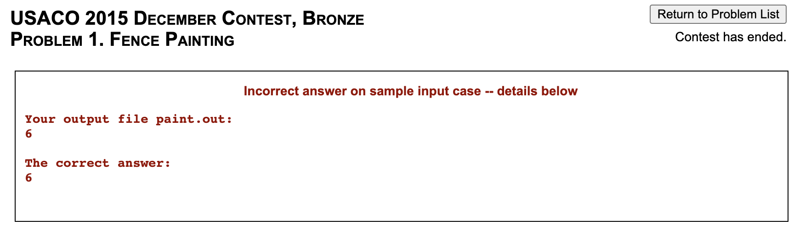

<LanguageSection>

<CPPSection>

<Resources>
	<Resource source="IUSACO" title="2.1 - Input and Output">
		module is based off this
	</Resource>
	<Resource source="CPH" title="1.2 - Input and Output">
		cin, getline, files
	</Resource>
	<Resource source="PAPS" title="2.4 - Input and Output">
		cin, getline
	</Resource>
</Resources>

</CPPSection>

<JavaSection>

<Resources>
	<Resource source="IUSACO" title="2.1 - Input and Output">
		module is based off this
	</Resource>
</Resources>

</JavaSection>

<PySection />

</LanguageSection>

<!-- We use `using namespace std;` so that we don't have to preface standard library functions with `std::` each time we use them. -->

The code snippets below will read in three integers as part of a single line and
output their sum. For example, given the input

```
1 2 3
```

the output will be as follows:

```
The sum of these three numbers is 6
```

Feel free to test them out at [ide.usaco.guide](https://ide.usaco.guide/).

<Info title="Out of the methods below, which one should I use?">

It doesn't matter. Whichever you're most comfortable with!

</Info>

## Standard I/O

In most websites (such as CodeForces and CSES), and in USACO problems after
December 2020, input and output are **standard**.

<LanguageSection>

<CPPSection>

### Method 1 - [`<iostream>`](https://www.cplusplus.com/reference/iostream/)

More straightforward to use. Calling the extraction operator `operator>>` on
[`cin`](https://www.cplusplus.com/reference/iostream/cin/) reads
whitespace-separated data from standard input. Similarly, calling the insertion
operator `operator<<` on
[`cout`](https://www.cplusplus.com/reference/iostream/cout/) writes to standard
output. The [escape sequence](https://en.cppreference.com/w/cpp/language/escape)
`\n` represents a new line.

```cpp
#include <iostream>
using namespace std;

int main() {
	int a;
	int b;
	int c;
	cin >> a >> b >> c;
	// "\n" can be replaced with endl as well
	cout << "The sum of these three numbers is " << a + b + c << "\n";
}
```

<Info title="endl vs \n">

[`endl`](https://www.cplusplus.com/reference/ostream/endl/) and `\n` are _not_
equivalent; see [Fast I/O](/general/fast-io) for details.

</Info>

### Method 2 - [`<cstdio>`](https://www.cplusplus.com/reference/cstdio/)

This library includes the
[`scanf`](https://www.cplusplus.com/reference/cstdio/scanf/) and
[`printf`](https://www.cplusplus.com/reference/cstdio/printf/) functions, which
are slightly more complicated to use.

```cpp
#include <cstdio>
using namespace std;

int main() {
	int a;
	int b;
	int c;
	/*
	 * %d specifies that a value of type int is being input.
	 * To input a 64-bit (long long) number,
	 * use %lld instead (some OJs might need %I64 instead).
	 * Many other specifiers are also available; see link for more details.
	 *
	 * Be sure to add a & character (address-of operator) when using
	 * scanf, UNLESS you are inputing a string with %s.
	 *
	 * It is possible to input multiple values at a time as shown below.
	 */
	scanf("%d %d %d", &a, &b, &c);

	/*
	 * Specifiers for printf are mostly the same as those used
	 * by scanf, with the notable exception of floating-point numbers.
	 * Use a backslash character followed by the lowercase
	 * letter n to denote a newline.
	 * The address-of operator (&) is not used here.
	 */
	printf("The sum of these three numbers is %d\n", a + b + c);
}
```

<Info title="Input Speed">

The second method is significantly faster (generally only an issue with large
input sizes). However, the first method can be sped up so that the difference in
speed is not significant; see [Fast I/O](/general/fast-io) for details.

</Info>

</CPPSection>

<JavaSection>

### Method 1 - [`Scanner`](https://docs.oracle.com/javase/7/docs/api/java/util/Scanner.html) and [`System.out.print`](https://docs.oracle.com/en/java/javase/15/docs/api/java.base/java/lang/System.html)

In your CS classes, you've probably implemented input and output using standard
input and standard output, or using `Scanner` to read input and
`System.out.print` to print output.

```java
import java.util.Scanner;

public class Main {
	public static void main(String[] args) {
		Scanner sc = new Scanner(System.in);
		int a = sc.nextInt();
		int b = sc.nextInt();
		int c = sc.nextInt();
		System.out.print("The sum of these three numbers is ");
		System.out.println(a + b + c);
	}
}
```

This works, but `Scanner` and `System.out.print` are slow when we have to handle
inputting and outputting tens of thousands of lines.

<Info title="Input Speed">

See the [Fast I/O module](/general/fast-io) for a comparison of input speeds as
well as faster methods of input than those described in this module.

</Info>

### Method 2 - [`BufferedReader`](https://docs.oracle.com/en/java/javase/15/docs/api/java.base/java/io/BufferedReader.html) and [`PrintWriter`](https://docs.oracle.com/en/java/javase/15/docs/api/java.base/java/io/PrintWriter.html)

These are faster because they buffer the input and output and handle it all at
once as opposed to parsing each line individually. However, `BufferedReader` is
harder to use than `Scanner`. It has quite a few more methods and the `io`
library must be imported for its use as well. A
[`StringTokenizer`](https://docs.oracle.com/en/java/javase/15/docs/api/java.base/java/util/StringTokenizer.html)
is used to split the input line by whitespace into tokens, which are then
accessed individually by the `nextToken()` method.

```java
import java.io.*;
import java.util.StringTokenizer;

public class Main {
	public static void main(String[] args) throws IOException {
		BufferedReader r = new BufferedReader(new InputStreamReader(System.in));
		PrintWriter pw = new PrintWriter(System.out);

		StringTokenizer st = new StringTokenizer(r.readLine());
		int a = Integer.parseInt(st.nextToken());
		int b = Integer.parseInt(st.nextToken());
		int c = Integer.parseInt(st.nextToken());
		pw.print("The sum of these three numbers is ");
		pw.println(a + b + c);
		/*
		 * Make sure to include the line below, as it
		 * flushes and closes the output stream.
		 */
		pw.close();
	}
}
```

#### Method 3 - I/O Template

<Warning>

Since the code in this section could potentially be considered more than just
basic Java functionality, you should not refer to this during a USACO contest.

</Warning>

The following template (a shortened version of Kattis's
[`Kattio.java`](https://open.kattis.com/help/java)) wraps `BufferedReader` and
`PrintWriter` and takes care of the string processing for you. You may or may
not find this more convenient than method 2.

```java
import java.io.*;
import java.util.*;

/**
 * Simple yet moderately fast I/O routines.
 * Some notes:
 *
 * - When done, you should always do io.close() or io.flush() on the
 *   Kattio-instance, otherwise, you may lose output.
 *
 * - The nextInt(), nextDouble(), and nextLong() methods will throw an
 *   exception if there is no more data in the input.
 *
 * @author: Kattis
 */

class Kattio extends PrintWriter {
	private BufferedReader r;
	private StringTokenizer st;
	// standard input
	public Kattio() { this(System.in,System.out); }
	public Kattio(InputStream i, OutputStream o) {
		super(o);
		r = new BufferedReader(new InputStreamReader(i));
	}
	// USACO-style file input
	public Kattio(String problemName) throws IOException {
		super(problemName+".out");
		r = new BufferedReader(new FileReader(problemName+".in"));
	}
	// returns null if no more input
	public String next() {
		try {
			while (st == null || !st.hasMoreTokens())
				st = new StringTokenizer(r.readLine());
			return st.nextToken();
		} catch (Exception e) {}
		return null;
	}
	public int nextInt() { return Integer.parseInt(next()); }
	public double nextDouble() { return Double.parseDouble(next()); }
	public long nextLong() { return Long.parseLong(next()); }
}

public class Main {
	public static void main(String[] args) {
		Kattio io = new Kattio();
		int a = io.nextInt();
		int b = io.nextInt();
		int c = io.nextInt();
		io.print("The sum of these three numbers is ");
		io.println(a + b + c);
		/*
		 * Make sure to include the line below, as it
		 * flushes and closes the output stream.
		 */
		io.close();
	}
}
```

<Optional title="extends">

`extends` is used so that `Kattio` inherits methods from `PrintWriter`
(including `print()`, `println()` and `close()`). If you're interested, see
[here](https://www.w3schools.com/java/ref_keyword_extends.asp) for more details.

</Optional>

The input methods in our `Kattio` class mimic those of `Scanner`. Given an
instance `io`:

| Method            | Description                                                                                                                                                                                                                           |
| ----------------- | ------------------------------------------------------------------------------------------------------------------------------------------------------------------------------------------------------------------------------------- |
| `io.next()`       | Reads the next token (up to a whitespace) and returns a `String`                                                                                                                                                                      |
| `io.nextInt()`    | Reads the next token (up to a whitespace) and returns as an `int`                                                                                                                                                                     |
| `io.nextLong()`   | Reads the next token (up to a whitespace) and returns as a `long`                                                                                                                                                                     |
| `io.nextDouble()` | Reads the next token (up to a whitespace) and returns as a `double`                                                                                                                                                                   |
| `io.print(arg)`   | Prints `arg` to designated output stream                                                                                                                                                                                              |
| `io.println(arg)` | Prints `arg` to designated output stream and adds a newline                                                                                                                                                                           |
| `io.close()`      | Closes the output stream and flushes the output. Make sure to call this (or [`io.flush()`](<https://docs.oracle.com/en/java/javase/15/docs/api/java.base/java/io/PrintWriter.html#flush()>)) at the end, or you won't see any output! |

<Info title="PrintWriter Buffering">

The original `Kattio` code had `super(new BufferedOutputStream(o));` on line 23.
But since `PrintWriter` will automatically wrap an `OutputStream` with a
`BufferedWriter`
([source](https://stackoverflow.com/questions/32177690/is-printwriter-buffered)),
including `BufferedOutputStream` is unnecessary.

Similarly, you may see `PrintWriter`s for file output initialized like the
following (ex.
[here](http://www.usaco.org/current/data/sol_circlecross_bronze_feb17.html)):

```java
PrintWriter pw = new PrintWriter(new BufferedWriter(new FileWriter("problemname.out")));
```

This is equivalent to what we use in this module:

```java
PrintWriter pw = new PrintWriter("problemname.out");
```

</Info>

</JavaSection>

<PySection>

### Method 1 - [`input()`](https://docs.python.org/3/library/functions.html#input) and [`print()`](https://docs.python.org/3/library/functions.html#print)

The most intuitive way to do input/output is using the built in `input()` and
`print()` methods. The `input()` method will return the next line, and can be
processed using various Python methods. The `print()` method takes in a string
and an optional string `end` (defaults to `'\n'`). Below is an annotated
demonstration on different input/output scenarios.

```py
# Read in a string
my_str = input()
# Prints the string on its own line
print(my_str)

# Take in an integer n on a single line
n = int(input())
# Prints n with " test" (no newline) after it
print(n, end=" test")
```

### Method 2 - [`stdin`](https://docs.python.org/3/library/sys.html#sys.stdin) and [`stdout`](https://docs.python.org/3/library/sys.html#sys.stdout)

The first method of reading input can be far slower (sometimes hundreds of times
slower!) than using `stdin`. Coupled with Python's relatively slow execution
speed, reading input quickly becomes incredibly important.

```py
# Import the sys module to use stdin/stdout
import sys

# sys.stdin/stdout is similar to a file in that we read lines for input/output
my_str = sys.stdin.readline()
sys.stdout.write(str(myStr) + '\n')
# Renaming the read/write methods for convenience
input = sys.stdin.readline
print = sys.stdout.write

# Taking an integer as input
my_int = int(input())
# sys.stdout.write requires you to format code manually
print(str(my_int) + '\n')

"""
For larger inputs, you can buffer the problem's input,
and sort through it yourself. This is the fastest input method for python.
"""
all_data = sys.stdin.read().split('\n')
```

We can also use
[`split`](https://docs.python.org/3/library/stdtypes.html#str.split),
[`map`](https://docs.python.org/3/library/functions.html#map) or a
[list comprehension](https://docs.python.org/3/tutorial/datastructures.html#list-comprehensions)
to read in multiple whitespace-separated integers on the same line.

```py
import sys

# Read in a series of numbers on one line into a list
nums = [int(x) for x in input().split()]
# This does the same thing
nums = list(map(int, input().split()))

# stdin/stdout, just replace input() with sys.stdin.readline()
nums = list(map(int, sys.stdin.readline().split()))
```

We can use something similar to the above if we are unpacking a fixed number of
integers.

```py
import sys

# Read in integers n and m on the same line with a list comprehension
n, m = [int(x) for x in input().split()]
# Do the same thing but with map instead
n, m = map(int, input().split())

# stdin and stdout
n, m = map(int, sys.stdin.readline().split())
```

So taking three integers as input and printing their sum is quite simple. On a
larger scale (thousands of integers), using stdin and stdout becomes far more
important for speed:

```py
import sys

a, b, c = map(int, input().split())
print("The sum of these three numbers is", a + b + c)

# stdin and stdout
a, b, c = map(int, sys.stdin.readline().split())
print("The sum of these three numbers is", a + b + c)
```

</PySection>

</LanguageSection>

## Example Problem - Weird Algorithm

<FocusProblem problem="weird" />

Try to implement this yourself!

<Resources>
	<Resource source="GCP" title="1.3 -  CSES Problem Set" starred>
		example C++ solution for this problem
	</Resource>
</Resources>

<LanguageSection>

<CPPSection>

As noted in the resource above, this problem requires _64-bit integers_.

<Spoiler title="Solution">

```cpp
#include <iostream>
using namespace std;

int main() {
	long long x;
	cin >> x;
	while (x != 1) {
		cout << x << " ";
		if (x % 2 == 0) {
			x /= 2;
		} else {
			x = 3 * x + 1;
		}
	}
	cout << x << endl;
}
```

</Spoiler>

</CPPSection>

<JavaSection>

As noted in the resource above, this problem requires _64-bit integers_.

### Method 1 - `Scanner` and `System.out.print`

<Spoiler title="Method 1">

```java
import java.util.Scanner;

public class Main {
	public static void main(String[] args) {
		Scanner r = new Scanner(System.in);
		long x = r.nextLong();
		while (x != 1) {
			System.out.print(x + " ");
			if (x % 2 == 0) {
				x /= 2;
			} else {
				x = 3 * x + 1;
			}
		}
		System.out.println(x);
	}
}
```

</Spoiler>

### Method 2 - `BufferedReader` and `PrintWriter`

<Spoiler title="Method 2">

```java
import java.io.*;

public class Main {
	public static void main(String[] args) throws IOException {
		BufferedReader r = new BufferedReader(new InputStreamReader(System.in));
		PrintWriter pw = new PrintWriter(System.out);
		long x = Long.parseLong(r.readLine());
		while (x != 1) {
			pw.print(x + " ");
			if (x % 2 == 0) {
				x /= 2;
			} else {
				x = 3 * x + 1;
			}
		}
		pw.println(x);
		/*
		 * Make sure to include the line below, as it
		 * flushes and closes the output stream.
		 */
		pw.close();
	}
}
```

</Spoiler>

#### With `Kattio`

<Spoiler title="Kattio">

```java
import java.io.*;
import java.util.*;

public class Main {
	public static void main(String[] args) {
		Kattio io = new Kattio();
		long x = io.nextLong();
		while (x != 1) {
			io.print(x + " ");
			if (x % 2 == 0) {
				x /= 2;
			} else {
				x = 3 * x + 1;
			}
		}
		io.println(x);
		/*
		 * Make sure to include the line below, as it
		 * flushes and closes the output stream.
		 */
		io.close();
	}

	// CodeSnip{Kattio}
}
```

</Spoiler>

</JavaSection>

<PySection>

<Spoiler title="Solution">

```py
x = int(input())
while x != 1:
	print(x, end=" ")
	if x % 2 == 0:
		x //= 2
	else:
		x = 3 * x + 1
print(x)
```

</Spoiler>

</PySection>

</LanguageSection>

## File I/O

<Info title="Update">

USACO problems from December 2020 onwards use standard I/O rather than file I/O.
You'll still need to use file I/O to submit to earlier problems.

</Info>

In older USACO problems, the input and output file names are given and follow
the convention `problemname.in`. After the program is run, output must be
printed to a file called `problemname.out`.

<FocusProblem problem="fence" />

You must use the correct file names when opening the `.in` and `.out` files,
depending on the problem. The file names are given on USACO problems which
require file opening. For example, you would open `paint.in` and `paint.out` in
the above problem.

<LanguageSection>

<CPPSection>

### Method 1 - [`freopen`](https://www.cplusplus.com/reference/cstdio/freopen/)

You will need the `<cstdio>` library. The `freopen` statements reuse standard
I/O for file I/O. Afterwards, you can simply use `cin` and `cout` (or `scanf`
and `printf`) to read and write data.

```cpp
#include <iostream>
#include <cstdio>
using namespace std;

int main() {
	freopen("problemname.in", "r", stdin);
	// the following line creates/overwrites the output file
	freopen("problemname.out", "w", stdout);

	// cin now reads from the input file instead of standard input
	int a;
	int b;
	int c;
	cin >> a >> b >> c;

	// cout now prints to the output file instead of standard output
	cout << "The sum of these three numbers is " << a + b + c << "\n";
}
```

To test your solution locally without file I/O, just comment out the lines with
`freopen`.

For convenience, we can define a function that will redirect `stdin` and
`stdout` based on the problem name:

```cpp
#include <iostream>
#include <cstdio>
using namespace std;

// the argument is the input filename without the extension
void setIO(string s) {
	freopen((s + ".in").c_str(), "r", stdin);
	freopen((s + ".out").c_str(), "w", stdout);
}

int main() {
	setIO("problemname");
	int a;
	int b;
	int c;
	cin >> a >> b >> c;
	cout << "The sum of these three numbers is " << a + b + c << "\n";
}
```

### Method 2 - [`<fstream>`](https://www.cplusplus.com/reference/fstream/)

You cannot use C-style I/O (`scanf`, `printf`) with this method.

```cpp
#include <fstream>
using namespace std;

int main() {
	ifstream fin("problemname.in");
	ofstream fout("problemname.out");

	int a;
	int b;
	int c;
	fin >> a >> b >> c;
	fout << "The sum of these three numbers is " << a + b + c << "\n";
}
```

</CPPSection>

<JavaSection>

### Java

Again, `BufferedReader` and `PrintWriter` should be used. Note how `static`
initialization of `r` and `pw` is slightly different.

```java
import java.io.*;
import java.util.StringTokenizer;

public class Main {
	public static void main(String[] args) throws IOException {
		BufferedReader r = new BufferedReader(new FileReader("problemname.in"));
		PrintWriter pw = new PrintWriter("problemname.out");

		StringTokenizer st = new StringTokenizer(r.readLine());
		int a = Integer.parseInt(st.nextToken());
		int b = Integer.parseInt(st.nextToken());
		int c = Integer.parseInt(st.nextToken());
		pw.print("The sum of these three numbers is ");
		pw.println(a + b + c);
		/*
		 * Make sure to include the line below, as it
		 * flushes and closes the output stream.
		 */
		pw.close();
	}
}
```

#### With `Kattio`

```java
import java.io.*;
import java.util.*;

public class Main {
	public static void main(String[] args) throws IOException {
		Kattio io = new Kattio("problemname");
		int a = io.nextInt();
		int b = io.nextInt();
		int c = io.nextInt();
		io.print("The sum of these three numbers is ");
		io.println(a + b + c);
		/*
		 * Make sure to include the line below, as it
		 * flushes and closes the output stream.
		 */
		io.close();
	}

	// CodeSnip{Kattio}
}
```

</JavaSection>

<PySection>

### Python

See
[here](https://docs.python.org/3/tutorial/inputoutput.html#reading-and-writing-files)
for documentation about file I/O.

The most intuitive way to do file I/O in Python is by redirecting the system
input and output to files. After doing this, you can then use the above
`input()` and `print()` methods as usual.

```py
import sys

sys.stdin = open("problemname.in", "r")
sys.stdout = open("problemname.out", "w")
```

A different approach to file I/O in Python is to still use the `open()` method,
but use the built-in functions `.readline()` or `.readlines()`:

```py
"""
Note: The second argument can be omitted in the open()
command for read-only files
"""
fin = open("problemname.in", "r")
fout = open("problemname.out", "w")

# One way to read the file using .readline()
line1 = fin.readline()
# readline() will pick up where you left off
line2 = fin.readline()
line3 = fin.readline()

# Another way is to use a for loop and .readlines()
line_list = []
for line in fin.readlines():
	pass  # Process input here

# printing line_list would give [line1, line2, line3]

# Output:
fout.write(output_text)  # Write to the output file

# f-strings:
variable1 = 1
variable2 = 2
example_str = f"Hello {variable1} {variable2} World!"
# Printing example_str would give Hello 1 2 World!
```

- `fin.readline()` will return the next line as a string. This method is useful
  for problems where you only have to read a short amount of lines but you still
  need to map each value to a variable.

- `fin.readlines()` returns all of the file's content as a list, separated by
  newlines (`"\n"`). Combined with a for loop, this method provides a concise
  way to separate variables in the same line in a problem. Keep in mind that
  each line entry in the list will still have a `"\n"` at the end.

- `fout.write(data)` will write the variable `data` to the file. `data` must be
  a string, and you can convert non-string variables with `str(my_var)`. The
  `write()` method will NOT write a new line at the end. You must also run
  `fout.write("\n")` if you wish to write a new line.

- f-strings were added in Python 3.6, and generally look nicer than
  concatenating (adding) strings. To define an f-string, simply add the letter
  `f` right before the start of the string, and any variables or expressions
  enclosed in curly braces (`{}`) will be put into the string. As an example,
  `fout.write(f"{var1} {var2} {var3+var4}")` looks much cleaner than
  `fout.write(str(var1)+" "+str(var2)+" "+str(var3+var4))`

After you read a line, you may wish to process it further. Python has many
built-in string methods and functions:

- `str.strip()` removes any trailing or leading whitespace. You should always
  run this method after reading a line, to ensure that there is no extra
  whitespace: `line = fin.readline().strip()`

- `map(func, iterable)` will run a function (the `func` argument) against each
  element of an iterable (list) you pass it. This is useful for changing a list
  of strings into a list of ints: `nums = list(map(int, ["1", "2", "3"]))`.
  Please note that `map()` returns a Map object, and you need to convert it into
  a list with `list()`.

- `str.split(delim)` will split the string. If no argument is passed, it will
  split by space. This is useful if you want to separate a string of
  space-separated integers into ints: `nums = list(map(int, line.split()))`

</PySection>

</LanguageSection>

## Example Solution - Fence Painting

<Resources>
	<Resource
		source="USACO"
		title="Technical Specifications for Contests"
		url="http://www.usaco.org/index.php?page=instructions"
		starred
	>
		Make sure to read this.
	</Resource>
</Resources>

<br />

For an explanation of the solutions below, check the
[Rectangle Geometry](/bronze/rect-geo#slow-solution) module.

<LanguageSection>

<CPPSection>

### Method 1 - `freopen`

<Spoiler title="Method 1">

```cpp
#include <iostream>
#include <vector>
using namespace std;

int main() {
	// Use standard input to read from "paint.in"
	freopen("paint.in", "r", stdin);
	// Use standard output to write to "paint.out"
	freopen("paint.out", "w", stdout);

	vector<bool> cover(100);
	int a;
	int b;
	int c;
	int d;;
	cin >> a >> b >> c >> d;
	for (int i = a; i < b; i++) {
		cover[i] = true;
	}
	for (int i = c; i < d; i++) {
		cover[i] = true;
	}

	int ans = 0;
	for (int i = 0; i < cover.size(); i++) {
		ans += cover[i];
	}
	cout << ans << endl;
}
```

</Spoiler>

### Method 2 - `<fstream>`

<Spoiler title="Method 2">

```cpp
#include <fstream>
#include <vector>
using namespace std;

int main() {
	ifstream fin("paint.in");
	ofstream fout("paint.out");

	vector<bool> cover(100);
	int a;
	int b;
	int c;
	int d;;
	fin >> a >> b >> c >> d;
	for (int i = a; i < b; i++) {
		cover[i] = true;
	}
	for (int i = c; i < d; i++) {
		cover[i] = true;
	}

	int ans = 0;
	for (int i = 0; i < cover.size(); i++) {
		ans += cover[i];
	}
	fout << ans << endl;
}
```

</Spoiler>

</CPPSection>

<JavaSection>

### Method 1 - `Scanner` and `PrintWriter`

<Spoiler title="Method 1">

```java
import java.io.*;
import java.util.Scanner;

public class Main {
	public static void main(String[] args) throws IOException {
		Scanner r = new Scanner(new File("paint.in"));
		PrintWriter pw = new PrintWriter("paint.out");

		int a = r.nextInt();
		int b = r.nextInt();
		int c = r.nextInt();
		int d = r.nextInt();

		int[] cover = new int[100];
		for (int i = a; i < b; i++) {
			cover[i] = 1;
		}
		for (int i = c; i < d; i++) {
			cover[i] = 1;
		}

		int ans = 0;
		for (int i = 0; i < cover.length; i++) {
			ans += cover[i];
		}
		pw.println(ans);
		/*
		 * Make sure to include the line below, as it
		 * flushes and closes the output stream.
		 */
		pw.close();
	}
}
```

</Spoiler>

### Method 2 - `BufferedReader` and `PrintWriter`

<Spoiler title="Method 2">

```java
import java.io.*;
import java.util.StringTokenizer;

public class Main {
	public static void main(String[] args) throws IOException {
		BufferedReader r = new BufferedReader(new FileReader("paint.in"));
		PrintWriter pw = new PrintWriter("paint.out");

		StringTokenizer st = new StringTokenizer(r.readLine());
		int a = Integer.parseInt(st.nextToken());
		int b = Integer.parseInt(st.nextToken());

		st = new StringTokenizer(br.readLine());
		int c = Integer.parseInt(st.nextToken());
		int d = Integer.parseInt(st.nextToken());

		int[] cover = new int[100];
		for (int i = a; i < b; i++) {
			cover[i] = 1;
		}
		for (int i = c; i < d; i++) {
			cover[i] = 1;
		}

		int ans = 0;
		for (int i = 0; i < cover.length; i++) {
			ans += cover[i];
		}
		pw.println(ans);
		/*
		 * Make sure to include the line below, as it
		 * flushes and closes the output stream.
		 */
		pw.close();
	}
}
```

</Spoiler>

#### With `Kattio`

<Spoiler title="Kattio">

```java
import java.io.*;
import java.util.*;

public class Main {
	public static void main(String[] args) throws IOException{
		Kattio io = new Kattio("paint");
		int a = io.nextInt();
		int b = io.nextInt();
		int c = io.nextInt();
		int d = io.nextInt();

		int[] cover = new int[100];
		for (int i = a; i < b; i++) {
			cover[i] = 1;
		}
		for (int i = c; i < d; i++) {
			cover[i] = 1;
		}

		int ans = 0;
		for (int i = 0; i < cover.length; i++) {
			ans += cover[i];
		}
		io.println(ans);
		/*
		 * Make sure to include the line below, as it
		 * flushes and closes the output stream.
		 */
		io.close();
	}

	// CodeSnip{Kattio}
}
```

</Spoiler>

</JavaSection>

<PySection>

### Method 1

<Spoiler title="Method 1">

```py
with open('paint.in', 'r') as inp:
	lines = [line for line in inp]
	a, b = map(int, lines[0].split())
	c, d = map(int, lines[1].split())

	cover = [0] * 100
	for i in range(a, b):
		cover[i] = 1
	for i in range(c, d):
		cover[i] = 1

	ans = 0
	for i in range(len(cover)):
		ans += cover[i]
	with open('paint.out', 'w') as out:
		print(ans, file=out)  # out.write(str(ans) + '\n') also works
```

</Spoiler>

### Method 2

Redirecting file input using `sys`, as mentioned above.

<Spoiler title="Method 2">

```py
import sys

sys.stdin = open("paint.in", "r")
sys.stdout = open("paint.out", "w")

a, b = map(int, input().split())
c, d = map(int, input().split())

cover = [0] * 100
for i in range(a, b):
	cover[i] = 1
for i in range(c, d):
	cover[i] = 1

ans = 0
for i in range(len(cover)):
	ans += cover[i]
print(ans)
```

</Spoiler>

</PySection>

</LanguageSection>

## USACO Note - Extra Whitespace

Importantly, USACO will automatically add a newline to the end of your file if
it does not end with one.

<Warning>

Occasionally, there is a period of time near the beginning of the contest window
where the model outputs do not end in newlines. This renders the problem
unsolvable.

</Warning>

Make sure not to output trailing spaces, or you will get an error such as the
following:



Here are some examples of what is allowed and what isn't when the intended
output consists of a single integer `ans`:

<LanguageSection>

<CPPSection>

### C++

```cpp
cout << ans;  // OK, no newline
cout << ans << endl;  // OK, newline
cout << ans << "\n";  // OK, newline
cout << ans << " ";  // NOT OK, extra space
cout << ans << "\n\n";  // NOT OK, extra newline
```

</CPPSection>

<JavaSection>

### Java

```java
pw.print(ans);  // OK, no newline
pw.println(ans);  // OK, newline
pw.print(ans + "\n");  // OK, newline
pw.print(ans + " ");  // NOT OK, extra space
pw.print(ans + "\n\n");  // NOT OK, extra newline
```

</JavaSection>

<PySection>

### Python

```py
print(ans, end='')  # OK, no newline
print(ans)  # OK, newline
print(str(ans) + '\n', end='')  # OK, newline
print(str(ans) + " ", end='')  # NOT OK, extra space
print(str(ans) + '\n')  # NOT OK, extra newline
```

</PySection>

</LanguageSection>
