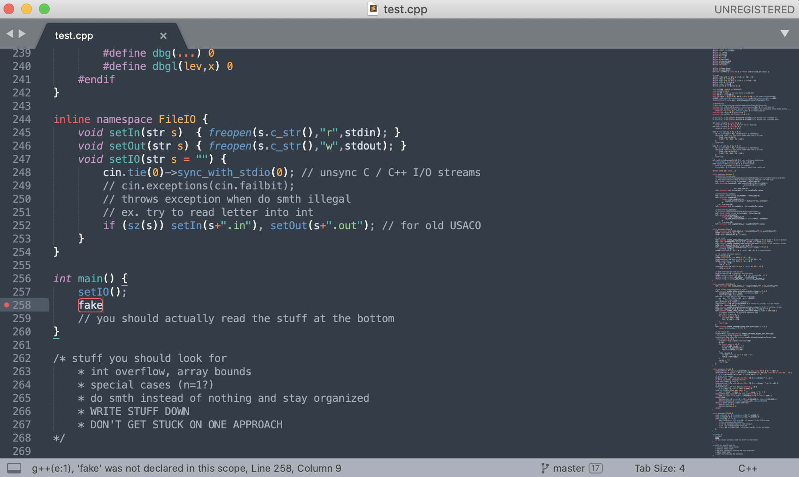

If you're just starting out, it's easier to begin by running code online and
worry about running locally later. You can find more information about running
code online [here](/general/running-code-online).

<Resources>
	<Resource
		source="IOI"
		title="2017 Contest Environment"
		url="https://ioi2017.org/contest/environment/"
	>
		for reference, software you can use at IOI
	</Resource>
</Resources>

## Code Editors vs IDEs

First, you'll need to decide whether to use a code editor such as
[Sublime Text](https://www.sublimetext.com/) or an
[integrated development environment (IDE)](https://en.wikipedia.org/wiki/Integrated_development_environment)
such as [Visual Studio Code](https://code.visualstudio.com/). An IDE provides
many features beyond just a code editor, though as you won't need most of them
for competitive programming, a code editor alone may suit your needs.
[More Info](https://www.quora.com/What-is-the-difference-between-a-text-editor-and-an-IDE)

<Info title="Which code editor or IDE should I use?">

Depends on your personal preference. Try multiple and see which one you like
best.

</Info>

## Using an IDE

<LanguageSection>

<CPPSection>

If you've only run code online before, it's probably easiest to start by
installing Visual Studio Code. Please let us know if you have trouble with this
process!

<Resources>
	<Resource
		source="Microsoft"
		title="Visual Studio Code"
		url="https://code.visualstudio.com/"
		starred
	>
		See <a href="https://www.csc.kth.se/~jsannemo/slask/main.pdf#page=30">PAPS 2.1</a>{' '}
		and the{' '}
		<a href="https://code.visualstudio.com/docs/cpp/config-linux">docs</a> for
		C++ setup instructions.
	</Resource>
	<Resource
		source="Jetbrains"
		title="CLion"
		url="https://www.jetbrains.com/clion/"
	>
    	<!-- prettier-ignore -->
		Requires a license, but{' '}
		<a href="https://www.jetbrains.com/community/education/#students">free for students</a>.
	</Resource>
	<Resource source="Geany" title="Geany" url="https://www.geany.org/">
		Lightweight, frequently used at IOI.
	</Resource>
	<Resource
		source="Code::Blocks"
		title="Code::Blocks"
		url="http://www.codeblocks.org/"
	>
		Windows & Linux.{' '}
		<a href="https://codeforces.com/blog/entry/61780">Apparently</a> was
		unstable at IOI.
	</Resource>
	<Resource
		source="Apple"
		title="XCode"
		url="https://developer.apple.com/xcode/"
	>
		Mac only.
	</Resource>
</Resources>

</CPPSection>

<JavaSection>

It can be useful to use a Java IDE to take advantage of the powerful debugging
features in Java.

<Resources>
	<Resource
		source="JetBrains"
		title="IntelliJ IDEA Community"
		url="https://www.jetbrains.com/idea/"
	>
		free
	</Resource>
	<Resource
		source="Eclipse Foundation"
		title="Eclipse"
		url="https://www.eclipse.org/eclipseide/"
	>
		free
	</Resource>
	<Resource
		source="King's College London"
		title="BlueJ"
		url="https://bluej.org/"
	>
		free
	</Resource>
</Resources>

</JavaSection>

<PySection>

### Windows

Python comes with a program, known as **IDLE** (Integrated Development and
Learning Environment), that allows one to write and run Python code. It supports
many features, such as syntax highlighting and automatic indentation, that one
would normally expect from an code editor.

Alternatively, you can install editing software like VSCode.

### Linux

You can use built-in terminal editors, like `vim` and `nano`. You can also
install editing software like VSCode. [For people who opened vim and can't exit]
(https://stackoverflow.com/questions/11828270/how-do-i-exit-the-vim-editor)

</PySection>

</LanguageSection>

## Using Command Line

<LanguageSection>

<CPPSection>

Alternatively, you can edit your code with an editor of your choice and run your
C++ programs via the command line (e.g., Terminal on Mac). See
[this module](/general/cpp-command) for information about installing, compiling,
and running C++ from the command line.

<Resources>
	<Resource title="Sublime Text 3" url="https://www.sublimetext.com/" starred>
		Fast, lightweight, easy to use. Unlimited free evaluation period, though it
		will repeatedly ask you to purchase a license.
	</Resource>
	<Resource title="Vim" url="https://www.vim.org/">
		Classic text editor, usually preinstalled on Linux. Also see Neovim, MacVim.
		Probably the easiest way to print syntax-highlighted code on Mac, see [this
		post](https://stackoverflow.com/questions/1656914/printing-code-with-syntax-highlighting).
	</Resource>
	<Resource title="Atom" url="https://atom.io/">
		From the makers of Github.
	</Resource>
</Resources>

<Spoiler title="Sublime Text Notes (Ben)">

I prefer Sublime Text because it opens instantly, it's simple to use, and it's
easy on the eyes. Also, it's not too hard to write your own
[custom commands](https://stackoverflow.com/questions/24276143/can-i-create-my-own-command-in-sublime-and-how-to-associate-python-implementatio)
in Python.

- I prefer the _Mariana_ color scheme in place of the default.
  - From the command palette (Cmd-Shift-P), follow
    `UI: Select Color Scheme -> Mariana`
- [Package - Sublime Linter (GCC)](https://packagecontrol.io/packages/SublimeLinter-gcc)

  - highlights compilation errors and warnings from `-Wall`
  - can use
    [`PackageResourceViewer`](https://packagecontrol.io/packages/PackageResourceViewer)
    to change linter settings. From the command palette, follow
    `PackageResourceViewer -> Open Resource -> SublimeLinter-gcc -> linter.py`.
    Now you can modify `linter.py` to compile with the same options that you
    normally use. For example, my `linter.py` looks like the following:

  ```py
  class GPlusPlus(Linter):
      name = "g++"
      cmd = "g++ ${args} -"
      regex = OUTPUT_RE
      multiline = True
      on_stderr = None

      defaults = {
          "selector": "source.c++",
          "args": ["-c", "-DLOCAL", "-std=c++17", "-O2", "-Wall", "-Wextra", "-Wshadow", "-Wconversion", "-Wfloat-equal", "-Wduplicated-cond", "-Wlogical-op"],
          "-I +": [],
          "-x": "c++",
          "-o": getGarbabgeFilePath(),
      }
  ```

Here's what linting looks like:



Additional notes:

- I compile and run from the command line rather than building from within
  sublime text (i.e., I don't use Cmd-B).
- [`subl` symlink](https://www.sublimetext.com/docs/3/osx_command_line.html)
  - Using `/usr/local/bin/subl` instead of `~/bin/subl` worked for me on OS X
    Mojave.
- [Package - Fast Olympic Coding](https://github.com/Jatana/FastOlympicCoding)
  (I don't use)
  - test manager can be useful
  - linting is covered by the above
  - stress testing is covered in
    [Debugging](/general/debugging-lang#stress-testing)
  - can't get debug to work

</Spoiler>

## Including `<bits/stdc++.h>`

If you have installed `g++` as described
[here](/general/cpp-command?lang=cpp#installing-g), you can use
`#include <bits/stdc++.h>` in place of separately including libraries.

<Resources>
	<Resource source="CPH" title="1.1 - C++ Code Template" starred />
	<Resource
		source="SO"
		title="How does #include <bits/stdc++.h> work in C++?"
		url="https://stackoverflow.com/questions/25311011/how-does-include-bits-stdc-h-work-in-c/25311052#25311052"
	/>
	<Resource source="GFG" title="<bits/stdc++.h>" url="bitsstdc-h-c" />
</Resources>

### Usage

This is usable with
[GCC](https://en.wikipedia.org/wiki/GNU_Compiler_Collection). However, Mac OS X
uses [Clang](https://en.wikipedia.org/wiki/Clang) while Windows uses
[Microsoft Visual C++ (MVSC)](https://en.wikipedia.org/wiki/Microsoft_Visual_C%2B%2B)
by default. `<bits/stdc++.h>` is **not** a standard header file, so it will not
work with the latter two. This is one of the reasons why you should **not** use
`<bits/stdc++.h>` outside of competitive programming.

<Resources>
	<Resource
		source="SO"
		title="Why should I not #include <bits/stdc++.h>?"
		url="https://stackoverflow.com/questions/31816095/why-should-i-not-include-bits-stdc-h"
		starred
	>
		wow, people are really mad about this!
	</Resource>
	<Resource
		source="SO"
		title="#include <bits/stdc++.h> with visual studio does not compile"
		url="https://stackoverflow.com/questions/25337300/include-bits-stdc-h-with-visual-studio-does-not-compile"
	/>
</Resources>

### Using `<bits/stdc++.h>` Without Installing `g++`

If you installed Clang on Mac, then you can download `stdc++.h` from
[here](https://raw.githubusercontent.com/tekfyl/bits-stdc-.h-for-mac/master/stdc%2B%2B.h)
and move it into a folder named `bits` that is located in the same directory as
where all other C++ header files are located.

<Resources>
	<Resource
		source="SO"
		title="How can I include <bits/stdc++.h> in XCode?"
		url="https://stackoverflow.com/questions/28994148/how-can-i-include-bits-stdc-in-xcode"
	>
		solutions that may or may not work
	</Resource>
</Resources>

### Precompiling `<bits/stdc++.h>`

Including `<bits/stdc++.h>` may significantly slow down compilation time. Using
this trick usually speeds up compilation time to less than a second.

<Resources>
	<Resource
		source="CF"
		title="Speed up g++ Compile Time"
		url="https://codeforces.com/blog/entry/53909"
	/>
</Resources>

1.  Find out where `bits/stdc++.h` is located on your machine. To do so, compile
    your C++ file `file.cpp` that includes `bits/stdc++.h` with the following
    command.

    ```sh
    g++ -H file.cpp
    ```

    This will generate a list of included libraries. You should see a path of
    the form `/path_to/bits/stdc++.h` near the top of the list.

2.  Precompile the header:

    ```sh
    g++ -add-flags-here /path_to/bits/stdc++.h
    ```

    where `-add-flags-here` includes the compilation flags you normally use (ex.
    `-std=c++17 -O2`)

3.  Recompile your C++ file. Should be faster this time since the precompiled
    header will be used.

    ```sh
    g++ -add-flags-here -Winvalid-pch file.cpp
    ```

    The `-Winvalid-pch` will warn you if the precompiled header is _not_ used.
    For example, if I precompiled `stdc++.h` with `-std=c++17` but I compiled my
    C++ program with `-std=c++11 -Winvalid-pch`, I would get a warning such as
    the following:

    ```
    file.cpp:1:25: warning: bits/stdc++.h.gch: not used because `__cpp_nontype_template_parameter_auto' not defined [-Winvalid-pch]
        1 | #include "bits/stdc++.h"
          |                         ^
    ```

</CPPSection>

<JavaSection>

### Installation

#### Linux

First, you can check if you have Java already installed by running
`java --version` in the terminal. If it returns something like this:

```
openjdk 11.0.9.1 2020-11-04
OpenJDK Runtime Environment (build 11.0.9.1+1-Ubuntu-0ubuntu1.20.04)
OpenJDK 64-Bit Server VM (build 11.0.9.1+1-Ubuntu-0ubuntu1.20.04, mixed mode, sharing)
```

That means you have Java installed already. On the other hand, if you get
something like this:

```
Command 'java' not found
```

You will have to download and install JDK. On most Linux distros, the JDK can be
downloaded via the built in package manager.

##### Ubuntu/Debian

On Ubuntu, Debian, and other Ubuntu/Debian based distos, the JDK can be
installed via `apt`. You can install the Java JDK from the default repositories
by running: `sudo apt install default-jdk`.

After this finishes installing, if you run `java --version` again, you should
get something like above.

##### Arch

On Arch and other Arch based distos (like Manjaro), the JDK can be installed via
`pacman`. You can install the Java JDK from the default repositories by running:
`sudo pacman -S jdk-openjdk`.

After this finishes installing, if you run `java --version` again, you should
get something like above.

##### Fedora

On Fedora and other Red Hat based distos, the JDK can be installed via `dnf`.
You can install the Java JDK from the default repositories by running:
`sudo dnf install java-openjdk-devel.x86_64`.

After this finishes installing, if you run `java --version` again, you should
get something like above.

#### Windows

First, can check if you already have Java installed by running `java --version`
in `cmd`. If it returns something like this:

```
openjdk 11.0.9.1 2020-11-04
OpenJDK Runtime Environment AdoptOpenJDK (build 11.0.9.1+1)
OpenJDK 64-Bit Server VM AdoptOpenJDK (build 11.0.9.1+1, mixed mode)
```

That means that you have Java installed already. On the other hand, if you get
something like this:

```
'java' is not recognized as an internal or external command,
operable program or batch file.
```

You will have to download and install JDK from
[here](https://github.com/AdoptOpenJDK/openjdk11-binaries/releases/download/jdk-11.0.9.1%2B1/OpenJDK11U-jdk_x64_windows_hotspot_11.0.9.1_1.msi).

After it finishes installing, if you run `java --version` again, you should get
something like above. Note: the installer should automatically add Java into the
system `PATH`, but in the event that it doesn't, you can find more information
on how to do that
[here](https://www.poftut.com/how-to-set-java-jre-and-jdk-home-path-and-environment-variables-on-windows).

#### macOS

First, can check if you already have Java installed by running `java --version`
in the terminal. If it returns something like this:

```
openjdk 11.0.9.1 2020-11-04
OpenJDK Runtime Environment AdoptOpenJDK (build 11.0.9.1+1)
OpenJDK 64-Bit Server VM AdoptOpenJDK (build 11.0.9.1+1, mixed mode)
```

That means that you have Java installed already. On the other hand, if you get
something like this:

```
-bash: java: command not found
```

You will have to download and install JDK from
[here](https://github.com/AdoptOpenJDK/openjdk11-binaries/releases/download/jdk-11.0.9.1%2B1/OpenJDK11U-jdk_x64_mac_hotspot_11.0.9.1_1.pkg).

After it finishes installing, if you run `java --version` again, you should get
something like above.

### Compiling and Running

Running a Java file off of the command-line is relatively simple after the JDK
is downloaded.

Consider this code of `Main.java` and assume it is in a file on your computer:

```java
public class Main {
	public static void main(String[] args) {
		System.out.println("Hello World!");
	}
}
```

Use the `cd` command on your console to get to the directory that contains
`Main.java`. Then, run the following command to compile the code:

```
javac Main.java
```

If it runs successfully, a file called `Main.class` will show up in the same
directory, which can be executed with the next command:

```
java Main
```

If everything goes accordingly, the console should output `Hello World!`.

If you do USACO-style file I/O, meaning that files are in the "local directory",
then the files must be located in the same directory as the source code (if you
use the above method). You can find a Java testing script for USACO
[here](/general/debugging-lang#stress-testing).

</JavaSection>

<PySection>

### Installation

#### Windows and Mac

Download Python through [the official website](https://python.org).

#### Linux

If you have `apt` (the package manager), you can install Python 3 with

`sudo apt install python3.8`

You can also
[build from source and install](https://github.com/python/cpython#build-instructions).

Make sure that you are using the correct version of Python. Python 2 is quite
different from Python 3 (but parts of the version number beyond 2. or 3. do not
matter much). We generally recommend newcomers to use Python 3, but if you are
used to programming in Python 2, that is OK too.

**The Python version can matter when using the command line to run Python;**
sometimes, `python3` must be used instead of `python` in order to run Python 3.
Try both commands, and pay attention to the version that Python prints to
determine if this is the case on your system. For example:

```
python --version   # prints Python 2.7.13
python3 --version  # prints Python 3.8.1
```

</PySection>

</LanguageSection>
