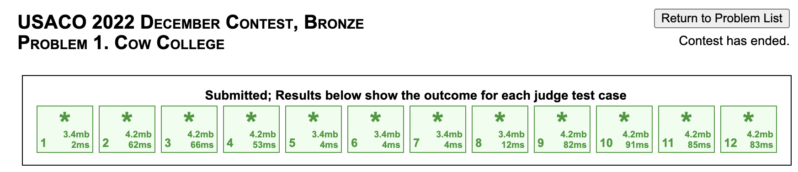

## Q: What is the USACO?

The [USA Computing Olympiad](http://www.usaco.org/) is a national programming
competition that occurs four times a year, with December, January, February, and
US Open (March) contests. The regular contests are four hours long, and the US
Open is five hours long. Each contest contains three problems. Solutions are
evaluated and scored against a set of predetermined test cases. Scoring is out of
1000 points, with each problem being weighted equally (\~333 points). There are four divisions of contests: Bronze, Silver, Gold, and Platinum. After each contest, students who
meet the contest-dependent cutoff for promotion will compete in the next division
for future contests.

## Q: How do I participate in a USACO contest?

Register for a (free) account on [usaco.org](http://www.usaco.org/), then wait until
the four-day contest window starts. When the contest window begins,
the USACO homepage will update with instructions on how to participate.

### Q: I'm not receiving an email after registering on [usaco.org](http://www.usaco.org/) with my gmail account. Who do I ask for help?

This is a known issue. If you encounter any technical issues with [usaco.org](http://www.usaco.org/), contact the USACO contest director ([Brian Dean](mailto:bcdean@clemson.edu)).
**Do not** submit to the USACO Guide contact form; the USACO Guide is not
affiliated with the USACO, so we won't be able to help you.

### Q: Do I need to participate in the USACO December contest before participating in the other contests?

No.

## Q: How are USACO contests scored?

<Resources>
	<Resource
		source="USACO"
		title="Past Contests"
		url="http://www.usaco.org/index.php?page=contests"
		starred
	/>
  <Resource
    source="USACO"
    title="Contest Instructions and Rules"
    url="http://www.usaco.org/index.php?page=instructions"
    starred
  />
</Resources>

USACO contests are scored out of $1000$ points. Each problem is worth
$1000/3 = 333.333 \dots$ points. When a solution to a problem is submitted,
it is run against a number of test cases (see the second link above for
details). All test cases for a problem (typically 10-30) are weighted
equally, except the sample test case(s), which do not count toward your score.<Asterisk>In older contests, sample test cases counted toward your score.</Asterisk> Inputs and outputs for
test cases other than the sample test cases are not visible during the contest.

For example, [Cow College](http://www.usaco.org/index.php?page=viewproblem2&cpid=1251)
has 1 sample test case (test case 1) and 11 non-sample test cases (test cases 2-12).
For each of test cases 2-12 you get correct, you earn
$333.333 \dots/11 = 30.3030\dots$ points.

### Q: Does passing all the test cases guarantee that my solution is correct?

No, it is entirely possible that there is a test case for which your solution
fails. In the extremely rare case that test cases are added
after the end of the contest, solutions that previously received full
credit often fail to receive full credit afterward.

In general, it is extremely difficult to check that your solution is correct
with 100% certainty, but one way to check that there isn't anything obviously
wrong with your solution is to [stress test](/general/basic-debugging?lang=cpp#stress-testing)
against a model solution.

## Q: What programming language should I use for USACO?

The most popular languages that USACO supports are C++, Java, and Python. In
general, we recommend the following:

- If you already know one or more of these languages, just use the one you are
  most comfortable with.
- If you don't know any of these languages, you might as well start with C++, as
  C++ users generally don't need to worry as much about their solutions being a
  constant factor too slow. Furthermore, most modules currently lack Java and
  Python support.

Don't overthink choosing a language -- you can always change languages later!

We cover choosing a language in more detail in our
["Choosing a Language"](/general/choosing-lang) module.

## Q: How do I submit a solution to a past USACO problem?

[This module](/general/input-output) includes example solutions and instructions
on how to submit them.

## Q: How do promotions work?

All contestants start in the Bronze division. At the end of the contest,
a "cutoff score" for each division is determined
based on the difficulty of the contest. If your score is at least the cutoff
score for your division, then you get permanently promoted to the next division.
Historically, the cutoff score has always been a multiple of $50$ points in the
range $600\ldots 850$ (typically $750$).

If you get a perfect score during the contest (i.e., you fully solve all three
problems), then you get an _in-contest promotion_, where you immediately get
promoted to the next division. You can start the next division's contest
whenever you want during the contest window; your four- or five-hour timer
resets when you start the contest. Once promoted, contestants remain in their
new division as there are no demotions.

Once you are familiar with your language of choice, you can solve the following
problem to check your understanding:

<FocusProblem problem="promotion" />

## Q: How do I prepare for USACO?

Learn algorithms, do practice problems, and reflect on why you're missing
problems. Make sure you learn from every problem you do, and you'll improve over
time. If you're looking for a guided roadmap to improve at USACO, check out the
[USACO Guide](/) (that's this site!).

If you want to get better at USACO, the key thing is to **do more practice**!

### Q: What's the best resource to get better at USACO?

We made the [USACO Guide](/) specifically to provide high-quality resources to
help people get better at USACO; we encourage you to give it a shot! We also
list [additional resources](/general/resources-cp) that you may find helpful.
Additionally, USACO has its own
[resources page](http://usaco.org/index.php?page=resources).

### Q: What topics do I need to know for each of the USACO divisions?

While there is no official USACO syllabus, we've compiled topics for each
division from historical contests:

- [USACO Bronze Topics](/bronze)
- [USACO Silver Topics](/silver)
- [USACO Gold Topics](/gold)
- [USACO Platinum Topics](/plat)

### Q: Where can I find more practice problems?

1. The [USACO](http://www.usaco.org/) website has problems from 2011 onwards.

   - We provide a list of recent USACO problems (2015 onwards)
     [here](/general/usaco-monthlies).
   - Older USACO problems may be easier than recent USACO contest problems due
     to increases in difficulty.

2. [Codeforces](https://codeforces.com/problemset) -- you can search by tag,
   difficulty level, etc.
3. [CSAcademy Archive](https://csacademy.com/contest/archive/)
4. For additional sources of problems, check the [contests](/general/contests)
   page.

### Q: Should I also use the [USACO Training Pages](http://www.usaco.org/index.php?page=training)?

You might find them useful. Keep in mind that they:

- Are _not_ beginner friendly, as noted by Rob Kolstad himself
  [here](https://www.quora.com/Is-USACO-training-pages-good-or-not).
- Don't allow you to view the solution for a problem until you solve it. Don't
  allow you to move past a section until you've solved all the problems in it.
  - Though some people consider this a plus (as mentioned
    [here](https://codeforces.com/blog/entry/98621)).
- Don't cover many topics that appear frequently in current contests (such as
  segment trees), as noted [here](https://codeforces.com/blog/entry/52652).

## Q: I'm stuck. Where can I get help for USACO?

We recommend you go to the
[(unofficial) USACO Forum](https://forum.usaco.guide/) to get help when you're
stuck. Alternatively, you can join the
[(unofficial) USACO Discord Server](https://discord.com/invite/bessMBe). They
have channels called `#discussion` and `#help` dedicated to questions
about competitive programming.

### Q: Why does the website give me WA when my code gives the correct answer on my own computer?

It's likely due to undefined behavior; see [this module](/general/debugging-checklist?lang=cpp#wrong-answer-or-runtime-error) for more information.

### Q: What's wrong with my code?

Please follow **all** the instructions in [this forum post](https://forum.usaco.guide/t/how-to-ask-for-help-on-a-problem/338). You can try asking on the forum,
but if it's clear that you haven't followed all of the instructions, likely
the only response you will receive is to follow the instructions more carefully.

## Q: Where can I find USACO test data and official solutions?

From the problem page, click "Return to Problem List," and then "Test Data"
or "Solution" under the corresponding problem.

### Q: When should I read the USACO official solutions?

It really comes down to personal preference; there's no right or wrong answer --
do what works for you! With that being said, we've asked numerous top USACO
competitors what they think about this question. This module lists their
thoughts on [how to effectively practice for USACO](/general/practicing).

## Q: Should I implement every problem that I solve?

Usually, yes (unless the problem is significantly too easy for you). Solving
competitive programming problems consists of two parts: coming up with the
algorithm, and implementing the algorithm. You should implement so that you
practice both parts.

## Q: What Codeforces rating corresponds to each of the USACO divisions?

Codeforces rating and USACO divisions can't be directly compared since CF
emphasizes solving more problems in a shorter time period (CF contests have 5-8
problems in 2-3 hours, while USACO contests have 3 problems in 4-5 hours).
However, here are some _very rough_ estimates:

- USACO Bronze competitors are probably \<1300 rated on CF, and Bronze problems
  correspond to 900-1500 rated CF problems.
- USACO Silver competitors are probably 1200-1500 rated on CF, and Silver
  problems correspond to 1200-1900 rated CF problems.
- USACO Gold competitors are probably 1500-1800 rated on CF, and Gold problems
  correspond to 1500-2200 rated CF problems.
- USACO Platinum competitors are probably 1650+ rated on CF, and Platinum
  problems correspond to 1900+ rated CF problems. (Note that at the Platinum
  level there is a _lot_ of variation in CF ratings.)

Again, CF problems and contests are _significantly different_ from USACO!

## Q: Is collaborative work allowed?

Collaborating with others during the contest is strictly prohibited to maintain fairness and integrity. USACO contests are designed to assess individual problem-solving skills, and collaboration provides an unfair advantage. However, outside of the contest environment, students are encouraged to study and prepare together, sharing knowledge and techniques to improve their skills collectively.

## Q: What are the constraints on memory and time for C++, Python, and Java programs?
In USACO contests, programs written in various programming languages are subject to specific constraints to ensure fair and efficient competition. These constraints include both time limits and memory allocations, which vary slightly depending on the language used.
Time Constraints: Each input test case is allotted a specific time limit for program execution. This time limit typically ranges around 4 seconds, although it can vary depending on the complexity of the problem and the specific contest. Within this time frame, the program must complete its execution and produce the correct output. Exceeding the time limit results in the program being terminated, leading to a verdict of "Time Limit Exceeded".

- Memory Constraints: Programs are allocated a certain amount of memory for their execution. The allocated memory is used to store variables, data structures, and other program-related information during execution. It's essential for participants to manage memory efficiently to avoid exceeding the allocated memory limit, which would lead to a "Memory Limit Exceeded" verdict.
Here's a table summarizing the constraints for different programming languages in USACO contests:
| Programming Language | Time Limit   | Memory Allocation |
|----------------------|--------------|-------------------|
| Java                 | Around 4 sec | Around 256 MB    |
| C++                  | Around 2 sec | Around 256 MB    |
| Python               | Around 4 sec | Around 256 MB    |

## Q: Where can I find the answer to a question that isn't answered here?

You can probably find the answer at [usaco.org](http://www.usaco.org/index.php) or by googling.

You can also ask a question by submitting the "Contact Us" form on the
bottom-left of this page, or on the [USACO Forum](https://forum.usaco.guide/).

## Closing Thoughts

We hope you've found this FAQ useful! Best of luck on your competitive
programming journey!
