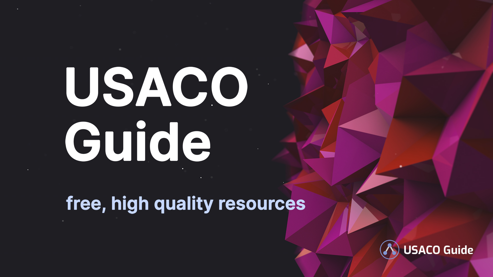

## Contact Us

Please help us complete this guide by **giving feedback** using the "Contact Us"
button<Asterisk>It's located on the bottom left of the screen. If you can't see
it, open the hamburger menu by clicking the icon on the top left of the
screen.</Asterisk> or clicking the Feedback icon on the right of the screen. You
can give feedback about anything!

If you found the guide useful, or if you got stuck while using the guide, please
also let us know! :)

## About This Guide

<Warning title="This guide is NOT a syllabus!!">

Topics on this guide reflect _past_ problems, not _future_ problems. Contest
problems may contain topics that aren't mentioned in this guide, and topics that
appear in one division of this guide may appear in lower divisions in future
contests.

</Warning>

- For Bronze, Silver, and Gold contestants, we aim to be a "**one stop shop**,"
  meaning that this is the only site you have to use to be exposed to most (if
  not all) of the topics required for Bronze to Gold.<Asterisk>Of course, you
  should still use other websites as necessary.</Asterisk>
- For Platinum contestants, we'll try our best to cover the main topics.
- The "Advanced" section contains material that is relevant for USACO Camp and
  beyond.

**Note:** We are currently focusing on the General - Gold sections. Modules that
are part of Platinum and Advanced will remain mostly incomplete for the time
being.

<!--  <Asterisk>There are too many topics for us to effectively cover all of them. If you want to do well in Platinum, you will have to find additional resources on your own in addition to this site</Asterisk> -->

## How to Use This Guide

- Use the **Module Progress** dropdowns (to the right of the module title and at
  the bottom of the page) to track your progress through this guide! Changes
  will be reflected by the navigation bar on the left.
- If you're stuck, ask for help in the
  [USACO Forum](https://forum.usaco.guide/), an unofficial Q&A forum for USACO
  contestants and competitive programmers.
- Read through all starred resources before continuing!
- We highly recommend doing all starred problems. If you need more practice, try
  some of the unstarred ones.
  - Difficulty represents how challenging a problem is expected to be to someone
    after they read through the module, and is **not** comparable across
    modules.
  - It's okay to skip "Very Hard" or "Insane" problems in Bronze - Gold and
    return to them later.
- See [Introducing Modules](/general/modules) for more information.

**Skipping around** is especially recommended for higher level contestants
(Gold/Platinum). Feel free to
<TextTooltip content="You can do this by scrolling to the end of a module">mark
a module</TextTooltip> as "Skipped" and come back to it at a later time!

For lower level contestants, the guide is generally<Asterisk>There are some
exceptions; for example, the last module in "Silver -> Sorting" assumes
knowledge of the first two modules in "Silver -> Sorted Sets & Maps." In any
case, we will list prerequisites to each module as needed.</Asterisk> designed
to be completed in order. However, feel free to skip certain modules and come
back to it later.

## Making an Account

We highly recommend that you make an account by clicking the "Settings" button
on the bottom left of the screen (or in the hamburger menu on mobile). That way,
your settings and your progress will be backed up to our servers and synced
across devices.

## Changing Your Language

To change your language, click the "Settings" button on the bottom left corner
of the screen (or in the hamburger menu, depending on the size of the window).
Content may be different depending on which language is selected!

<LanguageSection>

<CPPSection>

Your current language is **C++**.

</CPPSection>

<JavaSection>

Your current language is **Java**.

<Warning>

Currently very limited support for Java beyond Gold.

</Warning>

</JavaSection>

<PySection>

Your current language is **Python**.

<Warning>

Currently very limited support for Python.

</Warning>

</PySection>

</LanguageSection>

## For Instructors

If you're an instructor/club officer teaching for _free_, please feel free to
use whatever parts you'd like from this guide, though please provide credit + a
link to this site! Additionally, feel free to
[reach out to us](mailto:usacoguide@gmail.com) if you have a specific request
for what material you'd find helpful.

_Licensing notes_: No part of this site may be used,<Asterisk>Exceptions exist
(generally for free classes); see the full license for more details</Asterisk>
reproduced, redistributed, commercialized, or sold without prior written
permission. [Learn more here.](/license)
