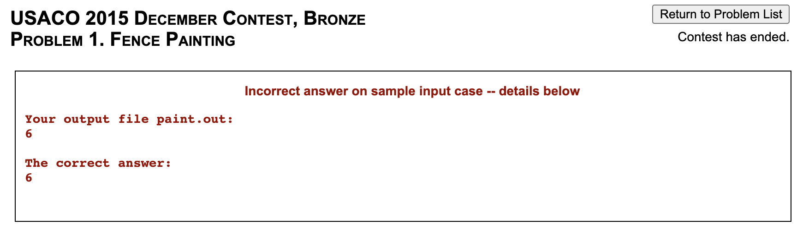

import { Problem } from "../models";

export const problems = {
    cses: [
      new Problem("CSES", "Weird Algorithm", "1068", "Very Easy"),
    ],
    fence: [
      new Problem("Bronze", "Fence Painting", "567", "Very Easy"),
    ],
};

<Resources>
  <Resource source="IUSACO" title="2.1 - Input and Output">module is based off this</Resource>
  <Resource source="CPH" title="1.2 - Input and Output">cin, getline, files</Resource>
  <Resource source="PAPS" title="2.4 - Input and Output">cin, getline</Resource>
</Resources>

<!-- We use `using namespace std;` so that we don't have to preface standard library functions with `std::` each time we use them. -->

## Standard I/O

In most websites (such as CodeForces and CSES), input and output are **standard**.

<Problems problems={problems.cses} />

Note that this problem requires **64-bit integers**.

<LanguageSection>

<CPPSection>

### C++

The [<iostream\>](http://www.cplusplus.com/reference/iostream/) library suffices.

```cpp
#include <iostream>
using namespace std;

int main() {
    int x; cin >> x;
    cout << "FOUND " << x << "\n";
}
```

Alternatively, you can use the [<cstdio\>](http://www.cplusplus.com/reference/cstdio/) library's `scanf` and `printf` functions, which are slightly more complicated to use, but are significantly faster (generally only an issue with large input sizes):

```cpp
#include <cstdio>
using namespace std;

int main() {
    int x, y;
    // %d specifies that a value of type int is being input.
    // Use %lld (a few judging platforms might need %I64d)
    // to input a long long (64-bit) integer.
    // Many other specifiers are also available; see link for more details.
    // Be sure to add a & character (address-of operator) when using
    // scanf, UNLESS you are inputing a string with %s.
    // It is possible to input multiple values at a time as shown below.
    scanf("%d%d", &x, &y);

    // Specifiers for printf are mostly the same as those used
    // by scanf, with the notable exception of floating-point numbers.
    // Use a backslash character followed by the lowercase
    // letter n to denote a newline.
    // The address-of operator, &, is not used here.
    printf("Found %d and %d\n", x, y);
}
```

The first method can be sped up so that the difference in speed is not significant; see the [Fast I/O](./fast-io) module for details.

</CPPSection>

<JavaSection>

### Java

In your CS classes, you've probably implemented input and output using standard input and standard output, or using [`Scanner`](https://docs.oracle.com/javase/7/docs/api/java/util/Scanner.html) to read input and `System.out.print` to print output. These methods work, but `Scanner` and `System.out.print` are slow when we have to handle inputting and outputting tens of thousands of lines. Thus, we use `BufferedReader` and `PrintWriter` instead, which are faster because they buffer the input and output and handle it all at once as opposed to parsing each line individually.

Here is a Java template for input and output, which is effectively a faster Scanner. We import the entire `util` and `io` libraries for ease of use. Note that this **must** be declared within a file named `template.java`.

```java
import java.io.*;
import java.util.*;

public class template {
    static class InputReader {
        BufferedReader reader;
        StringTokenizer tokenizer;
        public InputReader(InputStream stream) {
            reader = new BufferedReader(new InputStreamReader(stream), 32768);
            tokenizer = null;
        }
        String next() { // reads in the next string
            while (tokenizer == null || !tokenizer.hasMoreTokens()) {
                try {
                    tokenizer = new StringTokenizer(reader.readLine());
                } catch (IOException e) {
                    throw new RuntimeException(e);
                }
            }
            return tokenizer.nextToken();
        }
        public int nextInt() { return Integer.parseInt(next()); } // reads in the next int
        public long nextLong() { return Long.parseLong(next()); } // reads in the next long
        public double nextDouble() { return Double.parseDouble(next()); } // reads in the next double
    }
    static InputReader r = new InputReader(System.in);
    static PrintWriter pw = new PrintWriter(System.out);
    public static void main(String[] args) {

        // YOUR CODE HERE

        pw.close(); // flushes the output once printing is done
    }
}
```

Here's a brief description of the methods in our `InputReader` class, with an instance `r`, and `PrintWriter` with an instance `pw`.


| Method             | Description                                                         |
| ------------------ | ------------------------------------------------------------------- |
| `r.next()`         | Reads the next token (up to a whitespace) and returns a `String`    |
| `r.nextInt()`      | Reads the next token (up to a whitespace) and returns as an `int`   |
| `r.nextLong()`     | Reads the next token (up to a whitespace) and returns as a `long`   |
| `r.nextDouble()`   | Reads the next token (up to a whitespace) and returns as a `double` |
| `pw.println()`     | Prints the argument to designated output stream and adds newline    |
| `pw.print()`       | Prints the argument to designated output stream                     |


Here's an example to show how input/output works. Let's say we want to write a program that takes three numbers as input and prints their sum.

```java
// InputReader template code above
static InputReader r = new InputReader(System.in);
static PrintWriter pw = new PrintWriter(System.out);

public static void main(String[] args) {
    int a = r.nextInt();
    int b = r.nextInt();
    int c = r.nextInt()
    pw.println(a + b + c);
    pw.close();
}
```

</JavaSection>

</LanguageSection>

## File I/O

<Problems problems={problems.fence} />

In USACO, input is read from a file called `problemname.in`. After the program is run, output must be printed to a file called `problemname.out`. Note that you'll have to rename the `.in` and `.out` files depending on the problem. For example, in the above problem you would use `paint.in` and `paint.out`.

<LanguageSection>

<CPPSection>

### Method 1: `freopen`

You will need the [<cstdio\>](http://www.cplusplus.com/reference/cstdio/) library. 

```cpp
#include <cstdio>
using namespace std;

int main() {
    freopen("problemname.in", "r", stdin);
    freopen("problemname.out", "w", stdout);
    // rest of your code ...
    // can use cin or scanf
}
```

### Method 2: [`<fstream>`](http://www.cplusplus.com/reference/fstream/)

You cannot use C-style I/O (`scanf`, `printf`) with this method.

```cpp
#include <fstream>
using namespace std;

int main() {
    ifstream fin("problemname.in");
    ofstream fout("problemname.out");
    // rest of your code ...

}
```

</CPPSection>

<JavaSection>

We can slightly modify the template above to support file I/O. Note how  `r` and `pw` must be initialized in a different way.

```java
import java.util.*;
import java.io.*;

public class template {
    static class InputReader {
        BufferedReader reader;
        StringTokenizer tokenizer;
        public InputReader() throws FileNotFoundException {
            reader = new BufferedReader(new FileReader("problemname.in"));
            tokenizer = null;
        }
        String next() {
            while (tokenizer == null || !tokenizer.hasMoreTokens()) {
                try {
                    tokenizer = new StringTokenizer(reader.readLine());
                } catch (IOException e) {
                    throw new RuntimeException(e);
                }
            }
            return tokenizer.nextToken();
        }
        public int nextInt() { return Integer.parseInt(next()); }
        public long nextLong() { return Long.parseLong(next()); }
        public double nextDouble() { return Double.parseDouble(next()); }
    }
    public static void main(String[] args) throws FileNotFoundException, IOException {
        InputReader r = new InputReader();
        PrintWriter pw = new PrintWriter(new FileWriter("problemname.out"));

        // YOUR CODE HERE

        pw.close(); // flushes the output once printing is done
    }
}
```


Some sources say to use

```java
PrintWriter pw = new PrintWriter(new BufferedWriter(new FileWriter("problemname.out")));
```

instead. There is no need for this since `PrintWriter` [uses buffered output](https://stackoverflow.com/questions/32177690/is-printwriter-buffered).

</JavaSection>

</LanguageSection>

## Example Solutions - Fence Painting

<Resources>
    <Resource source="USACO" title="Technical Specifications for Contests" url="http://www.usaco.org/index.php?page=instructions" starred>Make sure to read this.</Resource>
</Resources>

<br />

Importantly, USACO will automatically add a newline to the end of your file if it does not end with one. Make sure not to output trailing spaces, or you will get an error such as the following:



<LanguageSection>

<CPPSection>

### Method 1

Use [freopen](http://www.cplusplus.com/reference/cstdio/freopen/). If you comment out both of the lines containing `freopen` then the program reads from standard in and writes to standard out as usual.

```cpp
#include <iostream>
#include <vector>
using namespace std;

int main() {
    freopen("paint.in","r",stdin); // reuse standard in to read from "paint.in"
    freopen("paint.out","w",stdout); // reuse standard out to write to "paint.out"
    vector<bool> cover(100);
    int a, b, c, d; cin >> a >> b >> c >> d;
    for (int i = a; i < b; ++i) cover[i] = 1;
    for (int i = c; i < d; ++i) cover[i] = 1;
    int ans = 0; 
    for (int i = 0; i < 100; ++i) ans += cover[i];
    cout << ans;
    // cout << ans << endl; is OK
    // cout << ans << "\n"; is OK
    // cout << ans << " "; is NOT OK
    // cout << ans << "\n\n"; is NOT OK
}
```

### Method 2

Use [ifstream & ofstream](http://www.cplusplus.com/doc/tutorial/files/).

```cpp
#include <fstream>
#include <vector>
using namespace std;

int main() {
    ifstream fin("paint.in");
    ofstream fout("paint.out");
    vector<bool> cover(100);
    int a, b, c, d; fin >> a >> b >> c >> d;
    for (int i = a; i < b; ++i) cover[i] = 1;
    for (int i = c; i < d; ++i) cover[i] = 1;
    int ans = 0; 
    for (int i = 0; i < 100; ++i) ans += cover[i];
    fout << ans;
}
```

</CPPSection>

<JavaSection>

### Method 1

```java
import java.io.*;
import java.util.*;

public class paintSol { // must be declared in paintSol.java
    public static void main(String[] args) throws IOException {
        BufferedReader br = new BufferedReader(new FileReader("paint.in"));
        PrintWriter pw = new PrintWriter(new FileWriter("paint.out"));
        int[] cover = new int[100];

        StringTokenizer st = new StringTokenizer(br.readLine());
        int a = Integer.parseInt(st.nextToken()), b = Integer.parseInt(st.nextToken());
        st = new StringTokenizer(br.readLine());
        int c = Integer.parseInt(st.nextToken()), d = Integer.parseInt(st.nextToken());

        for (int i = a; i < b; i++) cover[i] = 1;
        for (int i = c; i < d; i++) cover[i] = 1;
        int ans = 0; 
        for (int i = 0; i < 100; i++) ans += cover[i];
        pw.println(ans); 
        pw.close(); // make sure to include this line -- flushes the output.
    }
}
```

### Method 2

Alternatively, we can use the `InputReader` given above.

```java
import java.util.*;
import java.io.*;

public class template {
    static class InputReader {
        BufferedReader reader;
        StringTokenizer tokenizer;
        public InputReader() throws FileNotFoundException {
            reader = new BufferedReader(new FileReader("paint.in"));
            tokenizer = null;
        }
        String next() {
            while (tokenizer == null || !tokenizer.hasMoreTokens()) {
                try {
                    tokenizer = new StringTokenizer(reader.readLine());
                } catch (IOException e) {
                    throw new RuntimeException(e);
                }
            }
            return tokenizer.nextToken();
        }
        public int nextInt() { return Integer.parseInt(next()); }
        public long nextLong() { return Long.parseLong(next()); }
        public double nextDouble() { return Double.parseDouble(next()); }
    }
    public static void main(String[] args) throws FileNotFoundException, IOException {
        InputReader r = new InputReader();
        PrintWriter pw = new PrintWriter(new FileWriter("paint.out"));

        int a = r.nextInt(), b = r.nextInt();
        int c = r.nextInt(), d = r.nextInt();

        int[] cover = new int[100];
        for (int i = a; i < b; i++) cover[i] = 1;
        for (int i = c; i < d; i++) cover[i] = 1;
        int ans = 0; 
        for (int i = 0; i < 100; i++) ans += cover[i];
        
        pw.println(ans); 
        pw.close(); // flush output
    }
}
```

</JavaSection>

<PySection>

See [here](https://docs.python.org/3/tutorial/inputoutput.html#reading-and-writing-files) for documentation about file I/O.

```py
fin = open("paint.in","r")
fout = open("paint.out","w")
cover = [0 for i in range(100)]
a,b = map(int,fin.readline().split())
c,d = map(int,fin.readline().split())
for i in range(a,b):
    cover[i] = 1
for i in range(c,d):
    cover[i] = 1
ans = 0
for i in range(100):
    ans += cover[i]
fout.write(str(ans))
```

</PySection>

</LanguageSection>