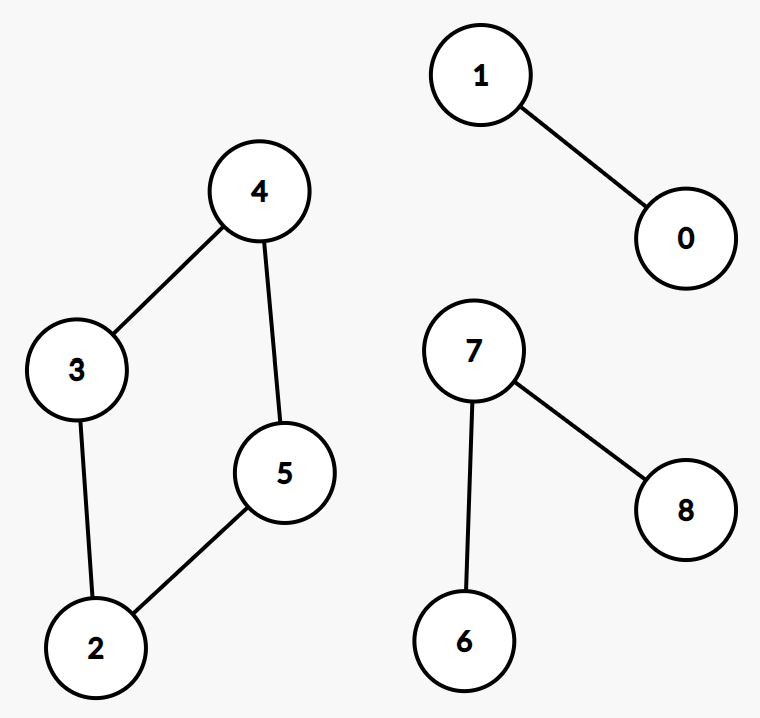
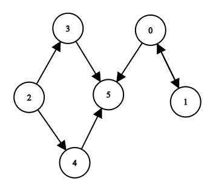
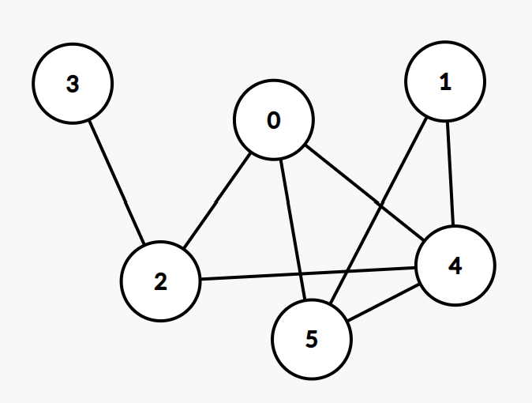
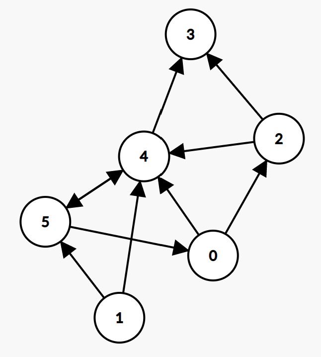

Note: Graphs will become a key topic in higher divisions. For Bronze, graphs are
just a nice way to think about the structure of our data.

Graphs can be used to represent many things, from images to wireless signals,
but one of the simplest analogies is to a map. Consider a map with several
cities and bidirectional roads connecting the cities. Some problems relating to
graphs are:

1.  Is city $A$ connected to city $B$? Consider a region to be a group of cities
    such that each city in the group can reach any other city in said group, but
    no other cities. How many regions are in this map, and which cities are in
    which region? (Silver)

2.  What's the shortest distance I have to travel to get from city $A$ to city
    $B$? (Gold)

For now, it suffices to learn how graphs are represented (usually **adjacency
lists**).

<Resources>
	<Resource
		source="CSA"
		title="Introduction to Graphs"
		url="introduction_to_graphs"
		starred
	>
		interactive
	</Resource>
	<Resource
		source="CSA"
		title="Graph Representations"
		url="graph_representation"
		starred
	>
		interactive - adjacency lists and matrices
	</Resource>
	<Resource source="CPH" title="11 - Basics of Graphs" starred>
		graph terminology, representation
	</Resource>
	<Resource source="IUSACO" title="10.1 to 10.3 - Graph Theory">
		graph basics and representation, trees
	</Resource>
	<Resource source="PAPS" title="6.4 - Graphs">
		adjacency matrices, lists, maps
	</Resource>
</Resources>

<!-- <Resource
	source="TC"
	title="Intro to Graphs Section 1"
	url="introduction-to-graphs-and-their-data-structures-section-1"
 /> -->

## What Does a Bronze Graph Problem Look Like?

All of the problems below fall into at least one of the following two
categories:

- The graph's structure is special (it's a tree, path, or a cycle).
- To solve the problem, all you need to do is iterate over the adjacency list of
  every vertex.

Knowing [DFS](/silver/dfs) can be helpful but it should not be required.

## Problems

<Problems problems="general" />

## Check Your Understanding

<Quiz>
  <Quiz.Question>
    How many connected components are in the following graph?
    
    <Quiz.Answer>
      1
      <Quiz.Explanation>
        
      </Quiz.Explanation>
    </Quiz.Answer>
    <Quiz.Answer>
      2
      <Quiz.Explanation>
        
      </Quiz.Explanation>
    </Quiz.Answer>
    <Quiz.Answer correct>
      3
      <Quiz.Explanation>
        Correct. The connected components consist of $\{0, 1\}, \{2, 3, 4, 5\}, \{6, 7, 8\}$
      </Quiz.Explanation>
    </Quiz.Answer>
    <Quiz.Answer>
      8
      <Quiz.Explanation>
        There are 8 nodes, but not 8 connected components.
      </Quiz.Explanation>
    </Quiz.Answer>
  </Quiz.Question>

  <Quiz.Question>
    How would we represent the following graph with an adjacency list?
    
    <Quiz.Answer>
      $
      \begin{pmatrix}
      1 & 1 & 0 & 0 & 0 & 1\\
      1 & 1 & 0 & 0 & 0 & 0\\
      0 & 0 & 1 & 1 & 1 & 0\\
      0 & 0 & 0 & 1 & 0 & 1\\
      0 & 0 & 0 & 0 & 1 & 1\\
      0 & 0 & 0 & 0 & 0 & 1\\
      \end{pmatrix}
      $
      <Quiz.Explanation>
        Incorrect. This is an adjacency matrix representation of the graph, not an adjacency list.
      </Quiz.Explanation>
    </Quiz.Answer>
    <Quiz.Answer>
      $0: [1, 5]$

      $1: [0]$

      $2: [3, 4]$

      $3: [2, 5]$

      $4: [2, 5]$

      $5: [0, 3, 4]$
      <Quiz.Explanation>
        Incorrect. This adjacency list representation assumes that all edges are undirected, which isn't the case.
      </Quiz.Explanation>
    </Quiz.Answer>
    <Quiz.Answer correct>
      $0: [1, 5]$

      $1: [0]$

      $2: [3, 4]$

      $3: [5]$

      $4: [5]$

      $5: []$
      <Quiz.Explanation>
        Correct.
      </Quiz.Explanation>
    </Quiz.Answer>
    <Quiz.Answer>
      $
      \begin{pmatrix}
      1 & 1 & 0 & 0 & 0 & 1\\
      1 & 1 & 0 & 0 & 0 & 0\\
      0 & 0 & 1 & 1 & 1 & 0\\
      0 & 0 & 1 & 1 & 0 & 1\\
      0 & 0 & 1 & 0 & 1 & 1\\
      1 & 0 & 0 & 1 & 1 & 1\\
      \end{pmatrix}
      $
      <Quiz.Explanation>
        Incorrect. This is an adjacency matrix representation of the undirected version of the graph.
      </Quiz.Explanation>
    </Quiz.Answer>
  </Quiz.Question>
  <Quiz.Question>
    Which characteristic does a tree NOT have?
    <Quiz.Answer>
      There is one unique path between any pair of nodes.
    </Quiz.Answer>
    <Quiz.Answer>
      There are $n-1$ edges, where $n$ is the total number of nodes in the tree.
    </Quiz.Answer>
    <Quiz.Answer>
      It is fully connected.
    </Quiz.Answer>
    <Quiz.Answer correct>
      It has at least one cycle.
    <Quiz.Explanation>
        Correct. Trees are always acyclic.
      </Quiz.Explanation>
    </Quiz.Answer>
  </Quiz.Question>
  <Quiz.Question>
    What is the space complexity for adjacency lists and adjacency matrices respectively? Let $n$ be the total number of nodes and $m$ be the total number of edges.
    <Quiz.Answer correct>
      $\mathcal{O}(n + m)$ and $\mathcal{O}(n^2)$
      <Quiz.Explanation>
        Correct. An adjacency list consists of $n$ dynamic arrays, where the total sum of their lengths is $m$. Thus, since there are $n$ references and $m$ total elements for each edge, it has a space complexity of $\mathcal{O}(n+m)$. An adjacency matrix is an $n \times n$ matrix, leading us to an $\mathcal{O}(n^2)$ space complexity.
      </Quiz.Explanation>
    </Quiz.Answer>
    <Quiz.Answer>
      $\mathcal{O}(m^2)$ and $\mathcal{O}(n + m)$
      <Quiz.Explanation>
        See explanation for correct answer.
      </Quiz.Explanation>
    </Quiz.Answer>
    <Quiz.Answer>
      $\mathcal{O}(n^2)$ and $\mathcal{O}(n + m)$
      <Quiz.Explanation>
        Incorrect. It's the other way around.
      </Quiz.Explanation>
    </Quiz.Answer>
    <Quiz.Answer>
      $\mathcal{O}(m)$ and $\mathcal{O}(n^2)$
      <Quiz.Explanation>
        An adjacency list also contains $n$ references for each list, so its space complexity is $\mathcal{O}(n+m)$.
      </Quiz.Explanation>
    </Quiz.Answer>
  </Quiz.Question>
  <Quiz.Question>
    What is the degree of node 1 in the following graph?
    
    <Quiz.Answer>
      0
    </Quiz.Answer>
    <Quiz.Answer>
      1
    </Quiz.Answer>
    <Quiz.Answer correct>
      2
      <Quiz.Explanation>
        Correct. Node 1 is connected to 2 other nodes.
      </Quiz.Explanation>
    </Quiz.Answer>
    <Quiz.Answer>
      3
    </Quiz.Answer>
  </Quiz.Question>
  <Quiz.Question>
    True or false: there is a cycle in the following graph.
    
    <Quiz.Answer correct>
      True
      <Quiz.Explanation>
        Correct. Nodes 0, 4, and 5 form a cycle.
      </Quiz.Explanation>
    </Quiz.Answer>
    <Quiz.Answer correct>
      False
    </Quiz.Answer>
  </Quiz.Question>
</Quiz>
