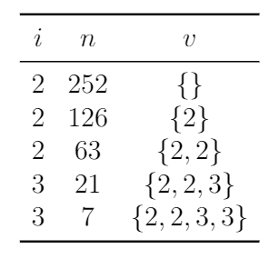

import { Problem } from '../models';

export const problems = {
	sample: [new Problem('CSES', 'Counting Divisors', '1713', 'Easy', false, [])],
	general: [
		new Problem(
			'AC',
			'Div Game',
			'https://atcoder.jp/contests/abc169/tasks/abc169_d',
			'Easy',
			false,
			['Prime Factorization'],
			'Prime factorize the given number. Consider each prime in the factorization separately. For each prime, decrement the exponent by 1 the first time, 2 the second time, and so on, until we can no longer continue without repeating a previously used exponent.'
		),
		new Problem('CSES', 'Common Divisors', '1081', 'Normal', true, [], 'cses-1081'),
		new Problem('CSES', 'Sum of Divisors', '1082', 'Normal', false, [], ''),
		new Problem(
			'CF',
			'Orac and LCM',
			'1349/problem/A',
			'Normal',
			false,
			['Prime Factorization'],
			'orac-lcm'
		),
	],
};

If you've never encountered any **number theory** before, AoPS is a good place to start.

<Resources>
	<Resource
		source="AoPS@Art of Problem Solving"
		title="Alcumus"
		url="https://artofproblemsolving.com/alcumus/problem"
		starred
	>
		practice problems, set focus to number theory!
	</Resource>
	<Resource
		source="AoPS@Art of Problem Solving"
		title="Intro to NT"
		url="https://artofproblemsolving.com/store/item/intro-number-theory?gtmlist=Bookstore_AoPS_Side"
	>
		good book
	</Resource>
</Resources>

## Resources

<Resources>
	<Resource source="IUSACO" title="13.1, 13.2 - Elementary Number Theory">
		module is based off this
	</Resource>
	<Resource
		source="David Altizio"
		title="Divisors and Divisibility"
		url="https://davidaltizio.web.illinois.edu/Divisors%20and%20Divisibility%20Overview.pdf"
		starred
	>
		{' '}
	</Resource>
	<Resource source="CPH" title="21.1 - Primes & Factors" starred></Resource>
	<Resource source="PAPS" title="16.1, 16.2 - Number Theory"></Resource>
</Resources>

<!-- <Resource source="CF" title="CodeNCode - Number Theory Course" url="77137">lots of advanced stuff you don't need to know at this level</Resource>
   -->

## Prime Factorization

<FocusProblem problem={problems.sample[0]} />

A number $a$ is called a **divisor** or a **factor** of a number $b$ if $b$ is divisible by $a$, which means that there exists some integer $k$ such that $b = ka$. Conventionally, $1$ and $n$ are considered divisors of $n$. A number $n > 1$ is **prime** if its only divisors are $1$ and $n$. Numbers greater than \(1\) that are not prime are **composite**.

Every number has a unique **prime factorization**: a way of decomposing it into a product of primes, as follows:

$$
n = {p_1}^{a_1} {p_2}^{a_2} \cdots {p_k}^{a_k}
$$

where the $p_i$ are distinct primes and the $a_i$ are positive integers.

Now, we will discuss how to find the prime factorization of an integer.

<LanguageSection>

<CPPSection>

```cpp
vector<int> factor(int n) {
	vector<int> ret;
	for (int i = 2; i * i <= n; i++) {
		while (n % i == 0) {
			ret.push_back(i);
			n /= i;
		}
	}
	if (n > 1) ret.push_back(n);
	return ret;
}
```

</CPPSection>

<PySection>

```py
def factor(n):
	ret = []
	i = 2
	while i * i <= n:
		while n % i == 0:
			ret.append(i)
			n //= i
		i += 1
	if n > 1:
		ret.append(n)
	return ret
```

</PySection>

</LanguageSection>

This algorithm runs in $O(\sqrt{n})$ time, because the for loop checks divisibility for at most $\sqrt{n}$ values. Even though there is a while loop inside the for loop, dividing $n$ by $i$ quickly reduces the value of $n$, which means that the outer for loop runs less iterations, which actually speeds up the code.

Let's look at an example of how this algorithm works, for $n = 252$.



At this point, the for loop terminates, because $i$ is already 3 which is greater than $\lfloor \sqrt{7} \rfloor$. In the last step, we add $7$ to the list of factors $v$, because it otherwise won't be added, for a final prime factorization of $\{2, 2, 3, 3, 7\}$.

### Solution - Counting Divisors

<IncompleteSection />

## GCD & LCM

### GCD

The **greatest common divisor (GCD)** of two integers $a$ and $b$ is the largest integer that is a factor of both $a$ and $b$. In order to find the GCD of two numbers, we use the **Euclidean Algorithm**, which is as follows:

$$
\gcd(a, b) = \begin{cases}
	 a & b = 0 \\
	 \gcd(b, a \bmod b) & b \neq 0 \\
\end{cases}
$$

This algorithm is very easy to implement using a recursive function, as follows:

<LanguageSection>

<JavaSection>

```java
public int gcd(int a, int b){
	if (b == 0) return a;
	return gcd(b, a % b);
}
```

</JavaSection>

<CPPSection>

```cpp
int GCD(int a, int b){
	if (b == 0) return a;
	return GCD(b, a % b);
}
```

For C++14 and below, use the built-in `__gcd(a,b)`. C++17 has built in `gcd(a,b)`.

</CPPSection>

<PySection>

```py
def gcd(a, b):
	if b == 0:
		return a
	return gcd(b, a % b)
```

</PySection>

</LanguageSection>

This function runs in $O(\log ab)$ time because $a\le b \implies b\%a <\frac{b}{2}$.

The worst-case scenario for the Euclidean algorithm is when $a$ and $b$ are consecutive Fibonacci numbers $F_n$ and $F_{n + 1}$. for an explanation). In this case, the algorithm will calculate $\gcd(F_n, F_{n + 1}) = \gcd(F_{n - 1}, F_n) = \dots = \gcd(0, F_1)$. This means that finding $\gcd(F_n, F_{n + 1})$ takes $n + 1$ steps, which is proportional to $\log \left(F_n F_{n+1}\right)$.

<!-- (See [this Math Stack Exchange answer](https://math.stackexchange.com/questions/2477328/why-are-fibonacci-numbers-bad-for-euclids-algorithm-and-how-to-derive-this-uppe) -->
<!-- ^ this doesn't seem very helpful -->
<!-- Since $F_n = O(\varphi^n)$, the worst-case complexity of this algorithm is $O(\log ab)$. -->

### LCM

The **least common multiple (LCM)** of two integers $a$ and $b$ is the smallest integer divisible by both $a$ and $b$. The LCM can easily be calculated from the following property with the GCD:

$$
\operatorname{lcm}(a, b) = \frac{a \cdot b}{\gcd(a, b)}=\frac{a}{\gcd(a,b)}\cdot b.
$$

<Warning>

Dividing by $\gcd(a,b)$ first might prevent integer overflow.

</Warning>

If we want to take the GCD or LCM of more than two elements, we can do so two at a time, in any order. For example,

$$
\gcd(a_1, a_2, a_3, a_4) = \gcd(a_1, \gcd(a_2, \gcd(a_3, a_4))).
$$

## Problems

<Problems problems={problems.general} />
