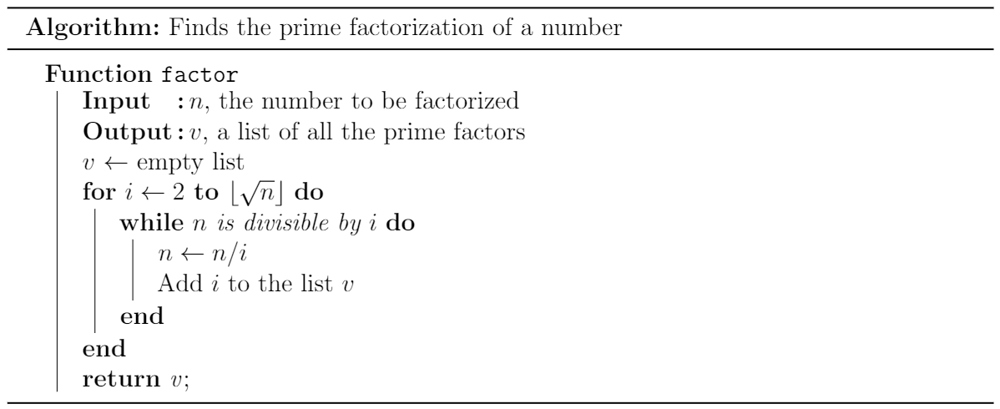

import { Problem } from "../models";

export const problems = {
    sample: [
      new Problem("CF", "VK Cup Wildcard R1 C - Prime Factorization", "problemset/problem/162/C", "Intro|Very Easy", false, []),
    ],
    kat: [
      new Problem("Kattis","Modular Arithmetic", "modulararithmetic"),
    ],
    general: [
      new Problem("AC", "Div Game", "https://atcoder.jp/contests/abc169/tasks/abc169_d", "Easy", false, ["Prime Factorization"], "Prime factorize the given number. Consider each prime in the factorization separately. For each prime, decrement the exponent by 1 the first time, 2 the second time, and so on, until we can no longer continue without repeating a previously used exponent."),
      new Problem("CF", "Orac and LCM", "contest/1349/problem/A", "Normal", false, ["Prime Factorization"], "Prime factorize each number. For each prime, the second-to-lowest exponent of the prime that occurs in any of the numbers in the input is the exponent of this prime that will appear in the final answer."),
      new Problem("Gold", "Cow Poetry", "897", "Normal", false, ["Knapsack", "Exponentiation"], "First consider the case where there are only two lines with the same class."),
      new Problem("Gold", "Exercise", "1043", "Normal", false, ["Knapsack", "Prime Factorization"], "Prime factorize $K$."),
    ],
};

<Resources>
  <Resource source="IUSACO" title="13 - Elementary Number Theory">module is based off this</Resource>
  <Resource source="AoPS" title="Alcumus" url="https://artofproblemsolving.com/alcumus/problem" starred>practice problems, set focus to number theory!</Resource>
  <Resource source="AoPS" title ="Intro to NT" url="https://artofproblemsolving.com/store/item/intro-number-theory?gtmlist=Bookstore_AoPS_Side">good book :D</Resource>
  <Resource source="CPH" title="21.1, 21.2 - Number Theory">primes and factors, modular arithmetic</Resource>
  <Resource source="PAPS" title="16.1, 16.2, 16.4 - Number Theory"></Resource>
</Resources>

<!-- <Resource source="CF" title="CodeNCode - Number Theory Course" url="blog/entry/77137">lots of advanced stuff you don't need to know at this level</Resource>
   -->

## Prime Factorization

<Problems problems={problems.sample} />

A number $a$ is called a **divisor** or a **factor** of a number $b$ if $b$ is divisible by $a$, which means that there exists some integer $k$ such that $b = ka$. Conventionally, $1$ and $n$ are considered divisors of $n$. A number $n > 1$ is **prime** if its only divisors are $1$ and $n$. Numbers greater than \(1\) that are not prime are **composite**.

Every number has a unique **prime factorization**: a way of decomposing it into a product of primes, as follows:
$$
n = {p_1}^{a_1} {p_2}^{a_2} \cdots {p_k}^{a_k}
$$
where the $p_i$ are distinct primes and the $a_i$ are positive integers.

Now, we will discuss how to find the prime factorization of an integer.



<IncompleteSection>

replace with code in all langs?

</IncompleteSection>

This algorithm runs in $O(\sqrt{n})$ time, because the for loop checks divisibility for at most $\sqrt{n}$ values. Even though there is a while loop inside the for loop, dividing $n$ by $i$ quickly reduces the value of $n$, which means that the outer for loop runs less iterations, which actually speeds up the code.

Let's look at an example of how this algorithm works, for $n = 252$.


At this point, the for loop terminates, because $i$ is already 3 which is greater than $\lfloor \sqrt{7} \rfloor$. In the last step, we add $7$ to the list of factors $v$, because it otherwise won't be added, for a final prime factorization of $\{2, 2, 3, 3, 7\}$.

## Divisibility

### GCD

The **greatest common divisor (GCD)** of two integers $a$ and $b$ is the largest integer that is a factor of both $a$ and $b$. In order to find the GCD of two numbers, we use the **Euclidean Algorithm**, which is as follows:

$$
\gcd(a, b) = \begin{cases}
     a & b = 0 \\
     \gcd(b, a \bmod b) & b \neq 0 \\
\end{cases}
$$

This algorithm is very easy to implement using a recursive function, as follows:

<LanguageSection>

<JavaSection>

```java
public int gcd(int a, int b){
    if (b == 0) return a;
    return gcd(b, a % b);
}
```

</JavaSection>

<CPPSection>

```cpp
int GCD(int a, int b){
	if (b == 0) return a;
	return GCD(b, a % b);
}
```

For C++14 and below, use the built-in `__gcd(a,b)`. C++17 has built in `gcd(a,b)`.

</CPPSection>

</LanguageSection>

This function runs in $O(\log \max(a,b))$ time.

<IncompleteSection>

proof?

</IncompleteSection>

### LCM

The **least common multiple (LCM)** of two integers $a$ and $b$ is the smallest integer divisible by both $a$ and $b$.

The LCM can easily be calculated from the following property with the GCD:

$$
\operatorname{lcm}(a, b) = \frac{a \cdot b}{\gcd(a, b)}=\frac{a}{\gcd(a,b)}\cdot b.
$$

<Warning>

Dividing by $\gcd(a,b)$ first might prevent integer overflow.

</Warning>

If we want to take the GCD or LCM of more than two elements, we can do so two at a time, in any order. For example,

$$
\gcd(a_1, a_2, a_3, a_4) = \gcd(a_1, \gcd(a_2, \gcd(a_3, a_4))).
$$

## Modular Arithmetic

<Resources>
	<Resource source="David Altizio" title="Modular Arithmetic" url="https://davidaltizio.web.illinois.edu/ModularArithmetic.pdf" starred> </Resource>
</Resources>

In **modular arithmetic**, instead of working with integers themselves, we work with their remainders when divided by $m$. We call this taking modulo $m$. For example, if we take $m = 23$, then instead of working with $x = 247$, we use $x \bmod 23 = 17$. Usually, $m$ will be a large prime, given in the problem; the two most common values are $10^9 + 7$, and $998\,244\,353=119\cdot 2^{23}+1$. Modular arithmetic is used to avoid dealing with numbers that overflow built-in data types, because we can take remainders, according to the following formulas:

$$
(a+b) \bmod m = (a \bmod m + b \bmod m) \bmod m
$$

$$
(a-b) \bmod m = (a \bmod m - b \bmod m) \bmod m
$$

$$
(a \cdot b) \pmod{m} = ((a \bmod m) \cdot (b \bmod m)) \bmod m
$$

$$
a^b \bmod {m} = (a \bmod m)^b \bmod m
$$

### Modular Exponentiation

<Resources>
	<Resource source="cp-algo" title="Binary Exponentiation" url="algebra/binary-exp.html"> </Resource>
</Resources>

**Modular Exponentiation** can be used to efficently compute $x ^ n \mod m$. To do this, let's break down $x ^ n$ into binary components. For example, $5 ^ {10}$ = $5 ^ {1010_2}$ = $5 ^ 8 \cdot 5 ^ 4$. Then, if we know $x ^ y$ for all $y$ which are powers of two ($x ^ 1$, $x ^ 2$, $x ^ 4$, $\dots$ , $x ^ {2^{\lfloor{\log_2n} \rfloor}}$, we can compute $x ^ n$ in $\mathcal{O}(\log n)$. Finally, since $x ^ y$ for some $y \neq 1$ equals $2 \cdot x ^ {y - 1}$, and $x$ otherwise, we can compute these sums efficently. To deal with $m$, observe that modulo doesn't affect multiplications, so we can directly implement the above "binary exponentiation" algorithm while adding a line to take results $\pmod m$.

Here is code to compute $x ^ n \pmod m$:

<LanguageSection>

<CPPSection>

```cpp
long long binpow(long long x, long long n, long long m) {
    x %= m; //note: m*m must be less than 2^63-1 to avoid long long overflow
    long long res = 1;
    while (n > 0) {
        if (n % 2 == 1) //if n is odd
            res = res * x % m;
        x = x * x % m;
        n /= 2; //divide by two
    }
    return res;
}
```

</CPPSection>

</LanguageSection>

### Modular Inverse

<IncompleteSection>

sample problem: compute modular inverse

</IncompleteSection>

We'll only consider **prime** moduli here. Division can be performed using modular inverses.

<Resources>
	<Resource source="cp-algo" title="Modular Multiplicative Inverse" url="algebra/module-inverse.html">Various ways to take modular inverse</Resource>
</Resources>


#### With Exponentiation

To find the modular inverse of some number, simply raise it to the power of $\mathrm{MOD} - 2$, where $\mathrm{MOD}$ is the modulus being used, using the function described above. The reasons for raising the number to $\mathrm{MOD} - 2$ can be explained with **Fermat's Little Theorem**.

<IncompleteSection>

explain theorem?

</IncompleteSection>

The modular inverse is the equivalent of the reciprocal in real-number arithmetic; to divide $a$ by $b$, multiply $a$ by the modular inverse of $b$.

Because it takes $\mathcal{O}(\log \mathrm{MOD})$ time to compute a modular inverse, frequent use of division inside a loop can significantly increase the running time of a program. If the modular inverse of the same number(s) is/are being used many times, it is a good idea to precalculate it.

Also, one must always ensure that they do not attempt to divide by 0. Be aware that after applying modulo, a nonzero number can become zero, so be very careful when dividing by non-constant values.

#### With Extended Euclidean Algorithm

<Optional>

See the module in the [Advanced](../adv/extend-euclid) section.

</Optional>

## Problems

<Problems problems={problems.general} />
