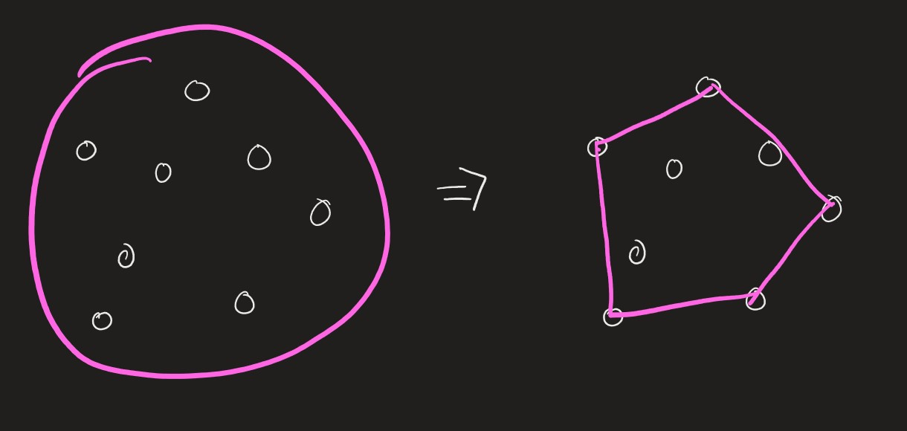
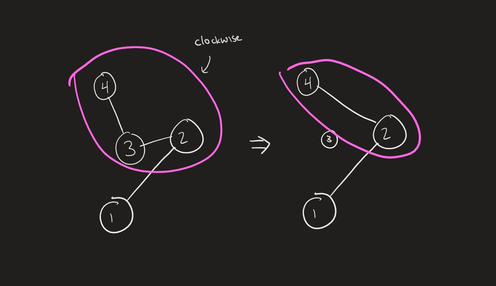

<!-- [convex hull](https://en.wikipedia.org/wiki/Convex_hull_algorithms). -->

## Introduction

The **Convex Hull** is the subset of points that forms the smallest convex
polygon which encloses all points in the set. To visualize this, imagine that
each point is a pole. Then, imagine what happens if you were to wrap a rope
around the outside of all the poles, and then pull infinitely hard, such that
the connections between any two points that lie on the edge of the rope are
lines. The set of points that touch the rope is the convex hull.

<Spoiler title="Convex Hull Visualization">



</Spoiler>

<FocusProblem problem="sample" />

## With Graham Scan

<Resources>
	<Resource
		source="Wikipedia"
		title="Graham Scan"
		url="https://en.wikipedia.org/wiki/Graham_scan"
	/>
	<Resource
		source="VisuAlgo"
		title="Graham Scan Visualization"
		url="https://visualgo.net/en/convexhull"
	/>
	<Resource
		source="UCSD"
		title="Original Graham Scan Paper"
		url="http://www.math.ucsd.edu/~ronspubs/72_10_convex_hull.pdf"
	/>
</Resources>

<Youtube id="9rQMLpQn5xQ" />

### Solution

<Resources>
	<Resource
		source="Benq"
		title="Graham Scan Implementation"
		url="https://github.com/bqi343/USACO/blob/master/Implementations/content/geometry%20(13)/Polygons/ConvexHull2.h"
	/>
</Resources>

<LanguageSection>

<CPPSection>

The Graham Scan algorithm works in 3 steps. First, it sorts all of the $n$
points by their counterclockwise angle around a pivot $P_0$, breaking ties by
distance. This algorithm uses the leftmost (and bottommost if there is a tie),
point as $P_0$.

We maintain a stack containing the points such that the following invariant
holds: every three consecutive points $a,b,c$ of the stack form a
counterclockwise turn. In other words, $c$ lies to the left of the line from $a$
to $b$. This condition implies that the points of the stack form the vertices of
a convex polygon.

To start the creation of the convex hull, we choose 2 points. The pivot (first
point), and the second point based on our initial sorting. After that, we
attempt to add each point in $\texttt{cand}$ to the stack.

Denote our stack as $\texttt{hull}$, the top element of $\texttt{hull}$ as
$\texttt{hull}[i]$ and $\texttt{cand}[j]$ as the $j$-th sorted candidate point.
Before adding $\texttt{cand}[j]$ to the stack, we check whether
$\texttt{hull}[i-1] \rightarrow \texttt{hull}[i] \rightarrow \texttt{cand}[j]$
forms a counterclockwise turn.

- If so, then we add $\texttt{cand}[j]$ to the stack and the invariant holds.
  Continue with $\texttt{cand}[j+1]$.
- Otherwise, $\texttt{hull}[i]$ lies within the convex hull of the other points
  in the stack along with $\texttt{cand}[j]$, so we pop $\texttt{hull}[i]$ from
  the stack and continue with $\texttt{cand}[j]$.

<Spoiler title="Illustration">



</Spoiler>

<Spoiler title="Worked Example">

> Find the convex hull of the points $(1,2),(2,3),(5,3),(3,2),(2,0),(6,2)$.

[Animation](https://convexhull.tiiny.site/) (created with
[GeoDeb](https://github.com/lukakalinovcic/geodeb)).

Another convex hull visualization with more points can be found
[here.](https://lukakalinovcic.github.io/geodeb/gallery/hull.html)

Using the steps from our Graham Scan:

1. Sorting the points by counterclockwise angle: Our leftmost point is $(1,2)$,
   so we then sort all the points by their counterclockwise angle. If the angles
   are the same, we can tiebreak by distance. Our resulting sorted points are
   $(2,0),(6,2),(3,2),(5,3),(2,3)$ with initial pivot $(1,2)$. Note that
   $(6,2), (3,2)$, are colinear but since $(6,2)$ is further away it breaks the
   tie, thus placing it before $(3,2)$.

2. Maintaining the stack:

   Our initial stack elements are $(1,2),(2,0)$. Then, starting from
   $\texttt{cand}[2]$, we process each point.

   First, we check if the turn between $(1,2), (2,0)$, and $(3,2)$, is
   counterclockwise, which it is. Hence, the point $\texttt{cand}[2]=(3,2)$ is
   inserted on our stack.

   Our stack now corresponds to the points: $(1,2),(2,0),(3,2)$.

   Then, we check the turn $(2,0),(3,2),(6,2)$, which is clockwise. Hence, we
   pop the stack until the counterclockwise property can be satisfied. In this
   case, only $(3,2)$ is popped. Afterwards, we push $(6, 2)$ to our stack
   because it satisfies the counterclockwise property.

   Our stack now corresponds to the points: $(1,2),(2,0),(6,2)$.

   Then, we check whether the turn between $(2,0), (6,2), (5,3)$ is
   counterclockwise, which it is, so we push $(5,3)$ to our stack.

   Our stack now corresponds to the points: $(1,2),(2,0),(6,2),(5,3)$.

   Then, we check whether the turn between $(6,2),(5,3),(2,3)$ is
   counterclockwise, which it is, so we push $(2,3)$ to our stack.

   Since we have processed all points, we have completed the cycle, and our
   convex hull is complete.

   Our stack now is then $(1,2),(2,0),(6,2),(5,3),(2,3)$, which are the vertices
   of the convex hull.

</Spoiler>

```cpp
#include <bits/stdc++.h>

using namespace std;

#define FOR(i, a, b) for (int i = (a); i < (b); i++)
#define FORE(i, a, b) for (int i = (a); i <= (b); i++)
#define F0R(i, a) for (int i = 0; i < (a); i++)
#define trav(a, x) for (auto &a : x)

#define f first
#define s second
#define bk back()
#define pb push_back

#define sz(x) int((x).size())
#define bg(x) begin(x)
#define all(x) bg(x), end(x)

int N, Q;

const int MX = 2e5 + 5;

using T = long long; // or long long
const T EPS = 1e-9; // might want to change
using P = pair<T,T>; using vP = vector<P>; using Line = pair<P,P>;

T sq(T a) { return a*a; } // square
T norm(const P& p) { return sq(p.f)+sq(p.s); } // x^2 + y^2

// basic operations
P operator-(const P& l, const P& r) {
	return P(l.f-r.f,l.s-r.s);
}

T cross(const P& a, const P& b) { return a.f*b.s-a.s*b.f; } // cross product
T cross(const P& p, const P& a, const P& b) { // cross product
	return cross(a-p,b-p);
}

using vi = vector<int>;
using vP = vector<P>;

vi hullInd(const vP& v) {
	int ind = int(min_element(all(v))-begin(v));
	vi cand, hull{ind};
	F0R(i,sz(v)) if (v[i] != v[ind]) cand.pb(i);

	sort(all(cand),[&](int a, int b) { // sort by angle, tiebreak by distance
		P x = v[a]-v[ind], y = v[b]-v[ind];
		T t = cross(x,y);
		return t != 0 ? t > 0 : norm(x) < norm(y);
	});

	trav(c,cand) { // for every point
		while (sz(hull) > 1 && cross(v[end(hull)[-2]],v[hull.bk],v[c]) <= 0) {
			hull.pop_back(); // pop until counterclockwise and size > 1
		}
		hull.pb(c);
	}

	return hull;
}


int main()
{
	ios_base::sync_with_stdio(0);
	cin.tie(0);

	for(;;) {
		int n; cin >> n;
		if(!n) break;
		vP pts(n);

		F0R(i, n) {
			long long a, b;
			cin >> a >> b;
			pts[i] = P(a, b);
		}

		vi ret = hullInd(pts); // gets hull indices of convex hull

		cout << sz(ret) << '\n';
		trav(a, ret) {
			cout << pts[a].first << " " << pts[a].second << '\n';
		}
	}
}
```

</CPPSection>

</LanguageSection>

## With Monotone Chain

<Resources>
	<Resource
		source="CPH"
		title="Monotone Chain"
		url="/CPH.pdf#page=288"
		starred
	/>
	<Resource
		source="Wikipedia"
		title="Monotone Chain"
		url="https://en.wikibooks.org/wiki/Algorithm_Implementation/Geometry/Convex_hull/Monotone_chain"
	/>
	<Resource
		source="Benq"
		title="Monotone Chain Implementation"
		url="https://github.com/bqi343/USACO/blob/master/Implementations/content/geometry%20(13)/Polygons/ConvexHull%20(13.2).h"
	/>
</Resources>

### Solution

With the Monotone Chain algorithm, we start by sorting the given $n$ points in ascending order with respect to their $x$ coordinates. If two points have the same $x$ coordinate, then we will look at the $y$ coordinate. 

Next, we will calculate the convex hull in two parts - the upper and the lower hull. Firstly, we observe that the starting and ending points of both upper and lower hulls are the same. They are the points with the lowest and highest $x$ value respectively, $P_0$ and $P_{n-1}$. We start by adding $P_0$ and $P_1$ to the hull. (Note that $P_1$ doesn't necessarily have to be on the convex hull at the end). Then, starting from $P_2$, we iterate through the sorted points and add them to the hull. Let's denote the current point being added as $P_{k}$ and the last point still on the hull as $P_{i}$. When adding new points, we want to make sure that there is no right turn among all segments of the hull, just like in the Graham Scan algorithm discussed above. To achieve this, the segment $P_{i-1}P_i$ should always be on the right side of the segment $P_{i-1}P_k$. This can be calculated by using a cross-product: 

- If $(P_i - P_{i-1}) \times (P_k - P_{i-1}) < 0$, the point $P_i$ lies on the left side of the segment $P_{i-1}P_k$. In this case, we have to remove point $P_i$ from the hull and repeat this check. 
- If $(P_i - P_{i-1}) \times (P_k - P_{i-1}) = 0$, the point $P_i$ lies on the segment $P_{i-1}P_k$. Whether to include multiple collinear points depends on the question, but for the given question above, we will remove the point $P_i$ as well and repeat the check. 
- Otherwise, the point $P_i$ lies on the right side of the segment $P_{i-1}P_k$. In this case, we can add $P_k$ to the hull and process the next point $P_{k+1}$ from the given point list. 

After all the points have been processed, we have found the lower hull and will begin to find the upper hull in the same manner. This time, we add point $P_{n-2}$ to the hull and iterate from the end of the points, $P_{n-3}$, to the starting point $P_0$. (The point $P_{n-2}$ also doesn't necessarily have to be the convex hull and could be removed if it causes a right turn). 

At the end, we have got all points of the convex hull in the counterclockwise order. To do this in the clockwise order, one only has to change the condition for $(P_i - P_{i-1}) \times (P_k - P_{i-1})$ from more than 0 to less than 0. In this case, the upper hull will be found first and then the lower hull. 

This algorithm takes $\mathcal{O}(n \log n)$ time to sort the points and $\mathcal{O}(n)$ time to calculate the hull, giving a final time complexity of $\mathcal{O}(n \log n)$. 


<Spoiler title="Worked Example">

Let's consider the same example from the Graham Scan algorithm. 

> Find the convex hull of the points $(1,2),(2,3),(5,3),(3,2),(2,0),(6,2)$.

Following the steps of the Monotone Chain algorithm:

1. Sorting the given points primarily by their $x$ coordinates and secondarily by their $y$ coordinates. The sorted list would be $(1,2)$, $(2,0)$, $(2,3)$, $(3,5)$, $(5,3)$, $(6,2)$

2. Find the lower hull:

   Firstly, we add the first two points into the hull. The list representing the hull would now contain these two elements $[(1,2), (2,0)]$. Let's start iterate through the rest of the points. Our $P_k$ now is $(2,3)$. The cross product, $((2,0) - (1,2)) \times ((2,3) - (1,2)) = (1,-2) \times (1,1) = (1 \cdot 1) - (-2 \cdot 1 ) = 3$, is more than 0, which tells us that there is no right turn, and we can move to our next point, $(3,5)$. The list now contains $[(1,2), (2,0), (2,3)]$. 
	 
	 The cross product $((2,0) - (2,3)) \times ((2,0) - (3,5)) = -3$ is less than zero, meaning there is a right turn from $(2,0)(2,3)$ to $(2,3)(3,5)$. Therefore, we remove point $(2,3)$ from our hull. The hull now contains $[(1,2), (2,0)]$. We then test the cross product $((1,2) - (2,0)) \times ((1,2) - (3,5)) = 7$, which is positive, so we add point $(3,5)$ to our hull. The hull now contains $[(1,2), (2,0), (3,5)]$. 

	 We keep testing the remaining points. We want to know if there is a right turn from $(2,0)(3,5)$ to $(3,5)(5,3)$, and there is, so we remove point $(3,5)$. Next, we test the two segments, $(1,2)(2,0)$ and $(2,0)(5,3)$. There is a left turn, so we add point $(5,3)$ and move to the next point. Our list looks now like this:  $[(1,2), (2,0), (5,3)]$. 

	 Then, we test the segments $(2,0)(5,3)$ and $(5,3)(6,2)$. The cross product $((5,3) - (2,0)) \times ((6,2) - (2,0))$ is negative, so there is a right turn. We remove $(5,3)$ from the list and now test the segments $(1,2)(2,0)$ and $(2,0)(6,2)$. There is a left turn, so we add point $(6,2)$ to our hull. The hull now contains $[(1,2), (2,0), (6,2)]$. As point $(6,2)$ is the last element in the list, we have found the lower hull of the given set of points. 

3. Find the upper hull: 

   We first add the point $(5,3)$ to the end of the list and process the point $(3,5)$. The cross product for $((6,2) - (5,3)) \times ((6,2) - (3,5))$ is zero, meaning these three points are collinear. Therefore, we remove point $(5,3)$ from the list. As there is no enough points left in the upper hull, we add point $(3,5)$ to the list. The hull contains $[(1,2), (2,0), (6,2), (3,5)]$. Note the points $[(1,2), (2,0), (6,2)]$ belong to the lower hull and the point $(6,2)$ as the end point also belongs to the upper hull.  

	 Then we process the next point $(2,3)$. The segments $(6,2)(3,5)$ and $(3,5)(2,3)$ form a left turn, so we can add point $(2,3)$ to our hull. The list contains $[(1,2), (2,0), (6,2), (3,5), (2,3)]$. 

	 The next point is $(2,0)$. The segments $(3,5)(2,3)$ and $(2,3)(2,0)$ form a left turn, so we can add point $(2,3)$ to our hull. The list contains $[(1,2), (2,0), (6,2), (3,5), (2,3), (2,0)]$.

	The next point is $(1,2)$. There is a right turn from $(2,3)(2,0)$ to $(2,0)(1,2)$, so we remove point $(2,0)$ from the list. The list contains $[(1,2), (2,0), (6,2), (3,5), (2,3)]$. We test again for segments $(3,5)(2,3)$ and $(2,3)(1,2)$. There is a right turn, so we remove point $(2,3)$. The list contains $[(1,2), (2,0), (6,2), (3,5)]$. We once again test segments $(6,2)(3,5)$ and $(3,5)(1,2)$. There is a left turn, so we add point $(1,2)$ to the list. We have reached the beginning of our list so we can terminate here. As $(1,2)$ was added while calculating the lower hull, we then remove the last element, i.e. the added point $(1,2)$, from the list. Now, we have the upper hull calculated as well. The final result is $[(1,2), (2,0), (6,2), (3,5)]$. These are the vertices of our convex hull in counterclockwise order. 

</Spoiler>
	
<LanguageSection>

<CPPSection>
```cpp
#include <bits/stdc++.h>
using namespace std;

using pii = pair<int, int>;

vector<pii> points;
vector<pii> hull;

// cross product, the signed area of these there points
int area(pii O, pii P, pii Q)
{
	return (P.first - O.first) * (Q.second - O.second) -
		   (P.second - O.second) * (Q.first - O.first);
}

void monotone_chain()
{
	// sort with respect to the x and y coordinates
	sort(points.begin(), points.end());
	// distinct the points
	points.erase(unique(points.begin(), points.end()), points.end());
	int n = points.size();

	// 1 or 2 points are always in the convex hull
	if (n < 3)
	{
		hull = points;
		return;
	}

	// lower hull
	for (int i = 0; i < n; i++)
	{
		// if with the new point points[i], a right turn will be formed,
		// then we remove the last point in the hull and test further
		while (hull.size() > 1 &&
			   area(hull[hull.size() - 2], hull.back(), points[i]) <= 0)

			hull.pop_back();
		// otherwise, add the point to the hull
		hull.push_back(points[i]);
	}

	// upper hull, following the same logic as the lower hull
	auto lower_hull_length = hull.size();
	for (int i = n - 2; i >= 0; i--)
	{
		// we can only remove a point if there are still points left in the upper hull
		while (hull.size() > lower_hull_length &&
			   area(hull[hull.size() - 2], hull.back(), points[i]) <= 0)
			hull.pop_back();
		hull.push_back(points[i]);
	}
	// delete point[0] that has been added twice
	hull.pop_back();
}

int main()
{
	cin.tie(0)->sync_with_stdio(false);

	int n;
	cin >> n;
	while (n != 0)
	{
		points.assign(n, {});
		hull = {};
		for (auto &p : points)
			cin >> p.first >> p.second;
		monotone_chain();

		cout << hull.size() << "\n";
		for (auto &p : hull)
			cout << p.first << " " << p.second << "\n";

		cin >> n;
	}

	return 0;
}
```
</CPPSection>

<JavaSection>

```java
import java.util.*;
import java.io.*;

public class ConvexHull {
	public static void main(String[] args) throws IOException {
		BufferedReader in = new BufferedReader(new InputStreamReader(System.in));

		int N = Integer.parseInt(in.readLine());
		while (N > 0) {
			// use a hashset to distinct the points
			Set<V2> input = new HashSet<V2>(N);
			for (int i = 0; i < N; i++) {
				StringTokenizer st = new StringTokenizer(in.readLine());
				input.add(new V2(Integer.parseInt(st.nextToken()), 
					Integer.parseInt(st.nextToken())));
			}
			V2[] points = new V2[input.size()];
			input.toArray(points);
			var hull = monotoneChain(points);

			System.out.println(hull.size());
			for (V2 p : hull) {
				System.out.println(String.format("%d %d", p.X, p.Y));
			}

			N = Integer.parseInt(in.readLine());
		}
		in.close();
	}

	// calculation the convex hull of given points in counterclockwise order
	private static List<V2> monotoneChain(V2[] P) {
		// for the set with less than 3 points the set of these points is already
		// the convex hull
		if (P.length < 3) {
			return Arrays.asList(P);
		}

		List<V2> hull = new ArrayList<V2>();
		// sort the points with respect to their x value in ascending order. In case
		// of a tie, sort by their y values
		Arrays.sort(P);

		// lower hull
		for (int i = 0; i < P.length; i++) {
			/*
			 * if the last point in hull is on the left side of the current point, 
			 * i.e. it forms a right turn, 
			 * then we can remove the last point until there are only left turns
			 */
			while (hull.size() > 1 && 
					sign(hull.get(hull.size() - 2), hull.get(hull.size() - 1), P[i]) <= 0)
				hull.remove(hull.size() - 1);
			hull.add(P[i]);
		}

		// upper hull
		int k = hull.size();
		for (int i = P.length - 2; i >= 0; i--) {
			while (hull.size() > k && 
					sign(hull.get(hull.size() - 2), hull.get(hull.size() - 1), P[i]) <= 0) {
				hull.remove(hull.size() - 1);
			}
			hull.add(P[i]);
		}
		// The first point was added twice, so remove it
		hull.remove(hull.size() - 1);

		return hull;
	}

	/*
	 * returns -1 if segment OP is on the left side of segment OQ; 
	 * and returns 1 vice versa; returns 0 if O, P and Q are colinear. 
	 */
	private static int sign(V2 O, V2 P, V2 Q) {
		int area = area(O, P, Q);
		if (area < 0)
			return -1;
		else if (area > 0)
			return 1;
		return 0;
	}

	// cross product trick, the signed area of these there points
	private static int area(V2 O, V2 P, V2 Q) {
		return P.minus(O).cross(Q.minus(O));
	}

	private static class V2 implements Comparable<V2> {
		public int X;
		public int Y;

		public V2(int x, int y) {
			X = x;
			Y = y;
		}

		public V2 minus(V2 other) {
			return new V2(X - other.X, Y - other.Y);
		}

		// "cross" (wedge) product of 2d vector. if you are not familiar with this,
		// you might want to do some research at first
		public int cross(V2 o) {
			return X * o.Y - Y * o.X;
		}

		@Override
		public int compareTo(ConvexHull.V2 o) {
			int r = X - o.X;
			if (r == 0)
				return Y - o.Y;
			return r;
		}

		@Override
		public boolean equals(Object obj) {
			if (obj == null || !getClass().equals(obj.getClass()))
				return false;
			return ((V2) obj).X == this.X && ((V2) obj).Y == this.Y;
		}

		@Override
		public int hashCode() {
			int hash = 17;
			hash = hash * 13 + X;
			hash = hash * 13 + Y;
			return hash;
		}
	}
}
```
</JavaSection>

</LanguageSection>


## Rotating Calipers

<FocusProblem problem="sample2" />

### Solution

<Resources>
	<Resource
		source="CF"
		title="Rotating calipers technique and applications"
		url="46162"
	/>
</Resources>

<IncompleteSection />

## Problems

<Problems problems="general" />
