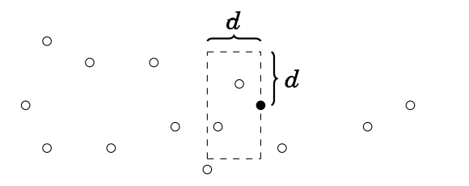

Imagine you have a vertical line that "sweeps" the plane from left to right.
That's the main idea behind the sweep line.

You might be thinking "wait - isn't keeping track of the sweep line at all
possible positions super inefficient?" And you'd be correct. However, we don't
actually need to keep track of the sweep line at all possible positions - only
at the "critical" positions (e.g. points and intersections).

<IncompleteSection>

should the reader already be familiar with the 1D case (union of intervals on
number line?) never explicitly mentioned in module

</IncompleteSection>

<Resources>
  <Resource source="CPH" title="30.1, 30.2 - Sweep Line Algorithms" />
  <Resource
    source="TC"
    title="Line Sweep Algorithms"
    url="line-sweep-algorithms"
   />
</Resources>

## Closest Pair

<FocusProblem problem="closest" />

### Solution 1

**Time Complexity:** $\mathcal{O}(N\log N)$

We will use a divide and conquer algorithm. First, sort the points by x-coordinate. Now, let $P$ be the subarray of points in the current step. Then, partition $P$ into two groups $L$ and $R$ representing the left and right halves of $P$. Let $\delta_l$ and $\delta_r$ be the answer of $L$ and $R$ respectively, and define $\delta$ as $\min(\delta_l, \delta_r)$.

Then $\delta$ is the upperbound of the answer. If a more optimal answer exists, it must bridge the two halves of the array (i.e. one of its endpoints is in $L$ and the other is in $R$). Let $mx$ be the x-coordinate of any median of $P$. Define two sets $L'$ and $R'$ such that $L' = \{p_i | x_i \leq mx, mx - x_i \leq \delta\}$ and $R' = \{p_i | x_i \geq mx, x_i - mx \leq \delta\}$

A brute force matching algorithm that computes $\texttt{dist}(p, q)$ for all $p \in L'$, $q \in R'$ would have a worst-case runtime of $(\frac n 2)^2 = \mathcal{O}(n^2)$ (recall that $L'$ and $R'$ may have up to $\frac N 2$ points). However, because we are searching for distances of at most $\delta$, it suffices for each $p \in L'$ to check all points $\{q | q \in R', p.y - \delta \leq q.y \leq p.y + \delta\}$.

It can be shown that for each point $p$, there is a constant number of points that satisfy this property. Because each point in $R'$ is at least $\delta_r \geq \delta$ apart, arranging the points in the worst case would result in 6 points in the corners and sides of the bounding rectangle.


<!--- https://i.imgur.com/FuvFPUR.png -->

To achieve the desired $\mathcal{O}(n)$ complexity per layer, we need to be able to efficiently get the points sorted by both x-coordinate (for dividing $P$) and y-coordinate (for matching between $L'$ and $R'$). This can be achieved by taking advantage of the merge-sort-like algorithm: sort by x-coordinate in the beginning, then for each step, merge the y-coordinates recursively.

Because each step now runs in linear time and there is a total of $\lceil \log n \rceil$ steps, by the [master theorem](https://en.wikipedia.org/wiki/Master_theorem_(analysis_of_algorithms)) our solution now runs in $\mathcal{O}(n\log n)$.

<LanguageSection>
<CPPSection>

```cpp
#include <bits/stdc++.h>
using namespace std;

struct Point {
	long double x, y;
	bool operator<(const Point &other) {
		if (x == other.x) { return y < other.y; }
		return x < other.x;
	}
};

const pair<Point, Point> INF{{-1e9, -1e9}, {1e9, 1e9}};

long double dist(const pair<Point, Point> &a) {
	long double d1 = a.first.x - a.second.x;
	long double d2 = a.first.y - a.second.y;
	return sqrt(d1 * d1 + d2 * d2);
}

pair<Point, Point> get_closest_points(const pair<Point, Point> &a,
                                      const pair<Point, Point> &b) {
	return dist(a) < dist(b) ? a : b;
}

/**
 * Brute force for points with near
 * the median point in the sorted array
 */
pair<Point, Point> strip_solve(vector<Point> &points) {
	pair<Point, Point> ans = INF;
	for (int i = 0; i < (int)points.size(); i++) {
		for (int j = i + 1; j < (int)points.size() && j - i < 9; j++) {
			ans = get_closest_points(ans, {points[i], points[j]});
		}
	}
	return ans;
}

/** Solve the problem for range [l, r] */
pair<Point, Point> solve(vector<Point> &points, int l, int r) {
	if (l == r) { return INF; }
	int mid = (l + r) / 2;

	// The smallest distance in range [l, mid]
	pair<Point, Point> ans_left = solve(points, l, mid);
	// The smallest distance in range [mid+1, r]
	pair<Point, Point> ans_right = solve(points, mid + 1, r);
	pair<Point, Point> ans;

	ans = get_closest_points(ans_left, ans_right);
	long double delta = dist(ans);

	Point mid_point = points[mid];
	vector<Point> strip;
	for (int i = l; i < r; i++) {
		if (abs(points[i].x - mid_point.x) <= delta) { strip.push_back(points[i]); }
	}
	sort(strip.begin(), strip.end(),
	     [](Point a, Point b) { return a.y < b.y || (a.y == b.y && a.x < b.x); });
	return get_closest_points(ans, strip_solve(strip));
}

int main() {
	int n;
	while (scanf("%d", &n) && n > 0) {
		vector<Point> v;
		for (int i = 0; i < n; i++) {
			long double x, y;
			scanf("%Lf %Lf", &x, &y);
			v.push_back({x, y});
		}
		sort(v.begin(), v.end());
		pair<Point, Point> ans = solve(v, 0, v.size());
		printf("%0.2Lf %0.2Lf %0.2Lf %0.2Lf\n", ans.first.x, ans.first.y, ans.second.x,
		       ans.second.y);
	}
}
```

</CPPSection>
</LanguageSection>

### Solution 2

**Time Complexity:** $\mathcal{O}(N\log N)$

Extending Solution 1, we can use a set instead of divide and conquer. Once again, we define $\delta$ as the shortest distance between two points so far. After sorting the points by x-coordinate, we iterate through them while maintaining a running window containing the y-coordinates of all points in $[x-\delta,x]$.


<!--- https://imgur.com/a/iA4cVvk -->

As we visit point $P$, we utilize the set to consider all points with y-coordiate in $[P_y-\delta, P_y+\delta]$. The set contains $[P_x-\delta, P_x]$ because of how it is maintained as a running window. Now we have the same bounding box as Solution 1, with at most 6 points inside.

For each point, we recalculate $\delta = \min(\delta, \delta_p)$, and update our set accordingly. Each point is inserted and removed from the set at most once, so the algorithm yields $\mathcal{O}(n\log n)$.

<LanguageSection>
<CPPSection>

```cpp
#include <bits/stdc++.h>
using namespace std;

using ld = long double;

int main() {
	int n;
	while (cin >> n && n > 0) {
		vector<pair<ld, ld>> points(n);
		for (auto &p : points) { cin >> p.first >> p.second; }

		sort(points.begin(), points.end());

		auto get_dist = [](const pair<ld, ld> &a, const pair<ld, ld> &b) -> ld {
			return (a.first - b.first) * (a.first - b.first) +
			       (a.second - b.second) * (a.second - b.second);
		};

		ld min_dist = LLONG_MAX;
		set<pair<ld, ld>> s = {{points[0].second, points[0].first}};

		array<ld, 4> ans;
		for (int i = 1, j = 0; i < points.size(); i++) {

			ld d = sqrt(min_dist);
			while (j < i && points[j].first < points[i].first - d) {
				s.erase({points[j].second, points[j].first});
				j++;
			}

			auto l = s.lower_bound({points[i].second - d, 0});
			auto r = s.upper_bound({points[i].second + d, 0});

			for (auto it = l; it != r; ++it) {
				ld d = get_dist(points[i], {it->second, it->first});
				if (min_dist > d) {
					min_dist = d;
					// ans = {points[i], {it->second, it->first}};
					ans = {points[i].first, points[i].second, it->second, it->first};
				}
			}
			s.insert({points[i].second, points[i].first});
		}

		cout << setprecision(2) << fixed << ans[0] << ' ' << ans[1] << ' ' << ans[2]
		     << ' ' << ans[3] << '\n';
	}
}
```

</CPPSection>
</LanguageSection>

## Line Segments

<FocusProblem problem="segSam" />

### Solution
Let's simplify the problem a little bit and focus on finding any overlapping segments.

To find a pair of overlapping segments, use a sweep line approach by sweeping a vertical line across the scene from left to right, pausing at every segment endpoint.

We simulate this by sorting all the segment endpoints by $x$ and walking through the sorted array (called 'events' in the code below). As we scan, we keep track of active segments
using a set (called 'active_segments' in the code below). When we hit the beginning point of a segment, add it to the active set, and remove it from the active set when we hit the ending point of a segment.

Inserting or removing the active segments from the set takes $\mathcal{O}(\log n)$ per operation.

The active set of segments is ordered by $y$ coordinate. If two segments overlap, they are adjacent in the set, so every time we insert or remove a segment, we check if the adjacent segments overlap.

Here is an animation of how it works:

<video width="960" height="720" controls>
	<source src="/animations/cowsteeplechase.mp4" type="video/mp4"/>
</video>

## Implementation

Time complexity: $\mathcal{O}(n\log n)$.

<LanguageSection>
<CPPSection>

```cpp
#include <bits/stdc++.h>

using namespace std;

long long sweep_line_x;

// BeginCodeSnip{Point Structure}
struct Point {
	long long x, y, segment_idx;
	bool operator<(const Point &other) {
		return x == other.x ? y < other.y : x < other.x;
	}
};
int operator*(Point p1, Point p2) { return sign(p1.x * p2.y - p1.y * p2.x); }

Point operator-(Point p1, Point p2) {
	Point p = {p1.x - p2.x, p1.y - p2.y};
	return p;
}
// EndCodeSnip

// BeginCodeSnip{Segment Structure}
struct Segment {
	long long a, b;
	long long x, y;
	long long idx;
};

bool operator<(Segment a, Segment b) {
	return a.idx != b.idx && coordinate(a) <= coordinate(b);
}

bool operator==(Segment a, Segment b) { return a.idx == b.idx; }
// EndCodeSnip

int sign(long long x) {
	if (x == 0) {
		return 0;
	} else {
		return x < 0 ? -1 : +1;
	}
}

double coordinate(Segment a) {
	if (a.a == a.x) { return a.b; }
	return a.b + (a.y - a.b) * (sweep_line_x - a.a) / (a.x - a.a);
}

/*
 * To check if two segments intersect we will use the
 * signed area of the ABC triangle. This can be derived
 * from the cross product of the vectors AB and AC.
 */
bool intersect(Segment a, Segment b) {
	Point p1 = {a.a, a.b}, q1 = {a.x, a.y}, p2 = {b.a, b.b}, q2 = {b.x, b.y};
	return ((q2 - p1) * (q1 - p1)) * ((q1 - p1) * (p2 - p1)) >= 0 &&
	       ((q1 - p2) * (q2 - p2)) * ((q2 - p2) * (p1 - p2)) >= 0;
}

long long orientation(Point a, Point b, Point c) {
	return (b.x - a.x) * (c.y - a.y) - (c.x - a.x) * (b.y - a.y);
}

int main() {
	ifstream in("cowjump.in");
	int n;
	in >> n;
	vector<Segment> segments;
	vector<Point> events;
	for (int i = 0; i < n; i++) {
		int a, b, x, y;
		in >> a >> b >> x >> y;

		segments.push_back({a, b, x, y, i});
		events.push_back({a, b, i});
		events.push_back({x, y, i});
	}

	sort(events.begin(), events.end());

	// Keep track of active segments
	set<Segment> active_segments;

	// The two overlapping segments
	int first_segment, second_segment;
	for (int i = 0; i < 2 * n; i++) {
		first_segment = events[i].segment_idx;
		sweep_line_x = events[i].x;
		// Check if the point is the end or the beginning of a segment
		auto it = active_segments.find(segments[first_segment]);

		if (it != active_segments.end()) {
			// Ending segment & Check the intersection of the segments above and

			auto after = next(it), before = it;
			if (before != active_segments.begin() && after != active_segments.end()) {
				before--;
				if (intersect(segments[before->idx], segments[after->idx])) {
					first_segment = before->idx;
					second_segment = after->idx;
					break;
				}
			}
			active_segments.erase(it);
		} else {
			// New segment & check for intersection
			it = active_segments.lower_bound(segments[first_segment]);

			// Check the intersection of the segments above and below
			if (it != active_segments.end() &&
			    intersect(segments[first_segment], *it)) {
				second_segment = it->idx;
				break;
			}
			if (it != active_segments.begin()) {
				it--;
				if (intersect(segments[it->idx], segments[first_segment])) {
					second_segment = it->idx;
					break;
				}
			}
			active_segments.insert(segments[first_segment]);
		}
	}

	if (first_segment > second_segment) { swap(first_segment, second_segment); }

	// Which segment of the two is the answer
	int ans = 0;
	for (int i = 0; i < n; i++) {
		if (i != second_segment && intersect(segments[i], segments[second_segment])) {
			ans++;
		}
	}

	ofstream("cowjump.out") << (ans > 1 ? second_segment + 1 : first_segment + 1);
}
```

</CPPSection>
</LanguageSection>

### Problems

<Problems problems="seg" />

## Manhattan MST

<FocusProblem problem="manSam" />

The key observation is that although there are many points, they're spread across a pretty small surface.
Because of this, instead of using Kruskal's or Prim's algorithm, we can use Dijkstra's.
Starting from an arbitrary point, we run Dijkstra's algorithm with a priority queue that will sort the points by their distance to the MST.

*Time Complexity:* $\mathcal{O}(S^3\log S)$, where S is the grid size

<LanguageSection>
<CPPSection>

```cpp
#include <bits/stdc++.h>
using namespace std;

const int GRID_SZ = 1000;
const int dx[4] = {-1, 0, 1, 0};
const int dy[4] = {0, 1, 0, -1};

int main() {
	int n;
	cin >> n;

	// The distance from the starting point
	vector<vector<int>> d(GRID_SZ, vector<int>(GRID_SZ, -1));
	// mat[x][y] = if (x, y) point is in the input;
	vector<vector<bool>> mat(GRID_SZ, vector<bool>(GRID_SZ));

	priority_queue<pair<int, pair<int, int>>, vector<pair<int, pair<int, int>>>,
	               greater<pair<int, pair<int, int>>>>
	    pq;
	for (int i = 0; i < n; i++) {
		int x, y;
		cin >> x >> y;
		mat[x][y] = 1;
		if (i == 0) {
			d[x][y] = 0;
			pq.push({0, {x, y}});
		}
	}

	auto inside = [&](int x, int y) {
		return 0 <= x && 0 <= y && x < GRID_SZ && y < GRID_SZ;
	};

	// Dijkstra's algorithm
	int ans = 0;
	while (!pq.empty()) {
		int x = pq.top().second.first;
		int y = pq.top().second.second;
		int dist = pq.top().first;
		pq.pop();

		if (dist != d[x][y]) { continue; }
		if (mat[x][y]) {
			mat[x][y] = 0;
			ans += dist;
			d[x][y] = 0;
			pq.push({0, {x, y}});
			if (dist) { continue; }
		}

		for (int dir = 0; dir < 4; dir++) {
			int newx = x + dx[dir];
			int newy = y + dy[dir];
			// Check if it's a new point or if the distance has improved
			if (inside(newx, newy) &&
			    (d[newx][newy] == -1 || dist + 1 < d[newx][newy])) {
				d[newx][newy] = dist + 1;
				pq.push({d[newx][newy], {newx, newy}});
			}
		}
	}

	cout << ans << endl;
}
```

</CPPSection>
</LanguageSection>

<Problems problems="man" />

<!--
TC 760 ComponentsForever -->

## Radial Sweep

Instead of a vertical line sweeping the plane from left to right, **radial
sweep** involves a ray that rotates around a central point (like a radar
screen):


In this case, we sort points/events by their
[bearing](<https://en.wikipedia.org/wiki/Bearing_(angle)>) instead of by their
x- and y-coordinates. Besides that, the mechanics are the same as those of
normal line sweep.

<FocusProblem problem="radialSam" />

### Solution - Seeing the Boundary

**Complexity:** $\mathcal O(N + Rp_i \log R)$

In this problem, there are three types of events: when our ray hits a fence
post, enters a rock, or exits a rock.

The second and third types of events can be found for each rock by sorting the
rays to its vertices by bearing and then taking the two endpoints of the sorted
list. These two rays are the two tangents to the rock.

We can then perform a radial sweep to find the fence posts that Farmer Don can
see - these fence posts are simply the ones where the number of type-2 and
type-3 events we've processed so far are equal.

Note that some optimizations (e.g. not constructing the list of fence posts
explicitly) may be required to get 100 points.

<LanguageSection>

<CPPSection>

```cpp
#include <bits/stdc++.h>
#define x first
#define y second
typedef long long ll;
using namespace std;

const double PI = 4 * atan(1);

struct Event {
	short type, id;
	pair<ll, ll> loc;
};

pair<ll, ll> origin, polygon[22];

// Cross product
ll cross(pair<ll, ll> a, pair<ll, ll> b) {
	return (a.y - origin.y) * (b.x - origin.x) - (a.x - origin.x) * (b.y - origin.y);
}

// Which half of the plane some point lies in
int half(pair<ll, ll> p) {
	if (p.x != origin.x) return (p.x < origin.x) - (p.x > origin.x);
	return (p.y < origin.y) - (p.y > origin.y);
}

// Custom comparator to sort by bearing
bool operator<(Event a, Event b) {
	int ah = half(a.loc), bh = half(b.loc);
	if (ah == bh) {
		ll c = cross(a.loc, b.loc);
		if (c == 0) return a.type > b.type;
		return c > 0;
	}
	return ah < bh;
}

// Generates the next fence post in clockwise order
Event get_next_post(Event curr, int n) {
	if (curr.loc.x == n) {
		if (curr.loc.y) return {0, 0, {n, curr.loc.y - 1}};
		return {0, 0, {n - 1, 0}};
	} else if (!curr.loc.x) {
		if (curr.loc.y != n) return {0, 0, {0, curr.loc.y + 1}};
		return {0, 0, {1, n}};
	} else if (curr.loc.y == n) {
		if (curr.loc.x != n) return {0, 0, {curr.loc.x + 1, n}};
		return {0, 0, {n, n - 1}};
	} else {
		if (curr.loc.x) return {0, 0, {curr.loc.x - 1, 0}};
		return {0, 0, {0, 1}};
	}
}

vector<Event> events;
bool before[44444];

int main() {
	cin.tie(0)->sync_with_stdio(0);
	int n, r;
	cin >> n >> r >> origin.x >> origin.y;

	for (int i = 0; i < r; i++) {
		int m;
		cin >> m;
		for (int j = 0; j < m; j++) cin >> polygon[j].x >> polygon[j].y;
		// Sort the polygon's vertices to find the 2 "tangents" from the origin
		sort(polygon, polygon + m,
		     [](pair<ll, ll> a, pair<ll, ll> b) { return cross(a, b) > 0; });
		events.push_back({1, i, polygon[0]});
		events.push_back({-1, i, polygon[m - 1]});
	}
	sort(events.begin(), events.end());

	int active = 0;
	// Do an initial sweep to handle rocks containing the ray with bearing 0
	// This way, `active` won't be messed up
	for (Event i : events) {
		if (i.type == 1) before[i.id] = true;
		if (i.type == -1 && !before[i.id]) active++;
	}

	int ans = 0, ptr = 0;
	Event curr_post = {0, 0, {origin.x, n}};
	for (Event i : events) {
		while (ptr != 4 * n && curr_post < i) {
			// If there are no rocks that our current ray intersects...
			if (!active) ans++;
			ptr++;
			curr_post = get_next_post(curr_post, n);
		}

		if (i.type == 1) active++;
		else active--;
	}
	if (!active) ans += 4 * n - ptr;

	cout << ans;
	return 0;
}
```

</CPPSection>

</LanguageSection>

### Problems

<Problems problems="radial" />
