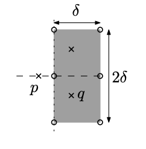

Imagine you have a vertical line that "sweeps" the plane from left to right.
That's the main idea behind the sweep line.

You might be thinking "wait - isn't keeping track of the sweep line at all
possible positions super inefficient?" And you'd be correct. However, we don't
actually need to keep track of the sweep line at all possible positions - only
at the "critical" positions (e.g. points and intersections).

<IncompleteSection>

should the reader already be familiar with the 1D case (union of intervals on
number line?) never explicitly mentioned in module

</IncompleteSection>

<Resources>
  <Resource source="CPH" title="30.1, 30.2 - Sweep Line Algorithms" />
  <Resource
    source="TC"
    title="Line Sweep Algorithms"
    url="line-sweep-algorithms"
   />
</Resources>

## Closest Pair

<FocusProblem problem="closest" />

### Solution 1

**Time Complexity:** $\mathcal{O}(n\log n)$

We will use a divide and conquer algorithm. First, sort the points by x-coordinate. Now, let $P$ be the subarray of points in the current step. Then, partition $P$ into two groups $L$ and $R$ representing the left and right halves of $P$. Let $\delta_l$ and $\delta_r$ be the answer of $L$ and $R$ respectively, and define $\delta$ as $\min(\delta_l, \delta_r)$. 

Then $\delta$ is the upperbound of the answer. If a more optimal answer exists, it must bridge the two halves of the array (i.e. one of its endpoints is in $L$ and the other is in $R$). Let $mx$ be the x-coordinate of any median of $P$. Define two sets $L'$ and $R'$ such that $L' = \{p_i | x_i \leq mx, mx - x_i \leq \delta\}$ and $R' = \{p_i | x_i \geq mx, x_i - mx \leq \delta\}$

A brute force matching algorithm that computes $\texttt{dist}(p, q)$ for all $p \in L'$, $q \in R'$ would have a worst-case runtime of $(\frac n 2)^2 = \mathcal{O}(n^2)$ (recall that $L'$ and $R'$ may have up to $\frac N 2$ points). However, because we are searching for distances of at most $\delta$, it suffices for each $p \in L'$ to check all points $\{q | q \in R', p.y - \delta \leq q.y \leq p.y + \delta\}$. 

It can be shown that for each point $p$, there is a constant number of points that satisfy this property. Because each point in $R'$ is at least $\delta_r \geq \delta$ apart, arranging the points in the worst case would result in 6 points in the corners and sides of the bounding rectangle.


<!--- https://i.imgur.com/FuvFPUR.png -->

To achieve the desired $\mathcal{O}(n)$ complexity per layer, we need to be able to efficiently get the points sorted by both x-coordinate (for dividing $P$) and y-coordinate (for matching between $L'$ and $R'$). This can be achieved by taking advantage of the merge-sort-like algorithm: sort by x-coordinate in the beginning, then for each step, merge the y-coordinates recursively. 

Because each step now runs in linear time and there is a total of $\lceil \log n \rceil$ steps, by the [master theorem](https://en.wikipedia.org/wiki/Master_theorem_(analysis_of_algorithms)) our solution now runs in $\mathcal{O}(n\log n)$. 

### Solution 2

(Set)

## Line Segments

<FocusProblem problem="segSam" />

### Solution

<IncompleteSection />

### Problems

<Problems problems="seg" />

## Manhattan MST

<FocusProblem problem="manSam" />

(KACTL code)

explanation? topcoder prob has

<Problems problems="man" />

<!--
TC 760 ComponentsForever -->

## Radial Sweep

Instead of a vertical line sweeping the plane from left to right, **radial
sweep** involves a ray that rotates around a central point (like a radar
screen):


In this case, we sort points/events by their
[bearing](<https://en.wikipedia.org/wiki/Bearing_(angle)>) instead of by their
x- and y-coordinates. Besides that, the mechanics are the same as those of
normal line sweep.

<FocusProblem problem="radialSam" />

### Solution - Seeing the Boundary

**Complexity:** $\mathcal O(N + Rp_i \log R)$

In this problem, there are three types of events: when our ray hits a fence
post, enters a rock, or exits a rock.

The second and third types of events can be found for each rock by sorting the
rays to its vertices by bearing and then taking the two endpoints of the sorted
list. These two rays are the two tangents to the rock.

We can then perform a radial sweep to find the fence posts that Farmer Don can
see - these fence posts are simply the ones where the number of type-2 and
type-3 events we've processed so far are equal.

Note that some optimizations (e.g. not constructing the list of fence posts
explicitly) may be required to get 100 points.

<LanguageSection>

<CPPSection>

```cpp
#include <bits/stdc++.h>
#define x first
#define y second
typedef long long ll;
using namespace std;

const double PI = 4 * atan(1);

struct Event {
	short type, id;
	pair<ll, ll> loc;
};

pair<ll, ll> origin, polygon[22];

// Cross product
ll cross(pair<ll, ll> a, pair<ll, ll> b) {
	return (a.y - origin.y) * (b.x - origin.x) - (a.x - origin.x) * (b.y - origin.y);
}

// Which half of the plane some point lies in
int half(pair<ll, ll> p) {
	if (p.x != origin.x) return (p.x < origin.x) - (p.x > origin.x);
	return (p.y < origin.y) - (p.y > origin.y);
}

// Custom comparator to sort by bearing
bool operator<(Event a, Event b) {
	int ah = half(a.loc), bh = half(b.loc);
	if (ah == bh) {
		ll c = cross(a.loc, b.loc);
		if (c == 0) return a.type > b.type;
		return c > 0;
	}
	return ah < bh;
}

// Generates the next fence post in clockwise order
Event get_next_post(Event curr, int n) {
	if (curr.loc.x == n) {
		if (curr.loc.y) return {0, 0, {n, curr.loc.y - 1}};
		return {0, 0, {n - 1, 0}};
	} else if (!curr.loc.x) {
		if (curr.loc.y != n) return {0, 0, {0, curr.loc.y + 1}};
		return {0, 0, {1, n}};
	} else if (curr.loc.y == n) {
		if (curr.loc.x != n) return {0, 0, {curr.loc.x + 1, n}};
		return {0, 0, {n, n - 1}};
	} else {
		if (curr.loc.x) return {0, 0, {curr.loc.x - 1, 0}};
		return {0, 0, {0, 1}};
	}
}

vector<Event> events;
bool before[44444];

int main() {
	cin.tie(0)->sync_with_stdio(0);
	int n, r;
	cin >> n >> r >> origin.x >> origin.y;

	for (int i = 0; i < r; i++) {
		int m;
		cin >> m;
		for (int j = 0; j < m; j++) cin >> polygon[j].x >> polygon[j].y;
		// Sort the polygon's vertices to find the 2 "tangents" from the origin
		sort(polygon, polygon + m, [](pair<ll, ll> a, pair<ll, ll> b) {
			return cross(a, b) > 0;
		});
		events.push_back({1, i, polygon[0]});
		events.push_back({-1, i, polygon[m - 1]});
	}
	sort(events.begin(), events.end());

	int active = 0;
	// Do an initial sweep to handle rocks containing the ray with bearing 0
	// This way, `active` won't be messed up
	for (Event i : events) {
		if (i.type == 1) before[i.id] = true;
		if (i.type == -1 && !before[i.id]) active++;
	}

	int ans = 0, ptr = 0;
	Event curr_post = {0, 0, {origin.x, n}};
	for (Event i : events) {
		while (ptr != 4 * n && curr_post < i) {
			// If there are no rocks that our current ray intersects...
			if (!active) ans++;
			ptr++;
			curr_post = get_next_post(curr_post, n);
		}

		if (i.type == 1) active++;
		else active--;
	}
	if (!active) ans += 4 * n - ptr;

	cout << ans;
	return 0;
}
```

</CPPSection>

</LanguageSection>

### Problems

<Problems problems="radial" />
