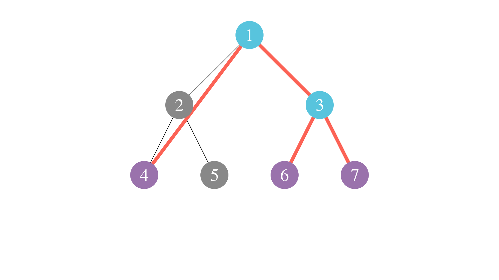

<Resources>
	<Resource
		source="YouTube"
		title="CP Tutorial: Virtual/Auxiliary Tree"
		url="https://www.youtube.com/watch?v=czySm7bUHgY"
	>
	</Resource>
	<Resource
		source="CF"
		title="Virtual trees method"
		url="https://codeforces.com/blog/entry/140066"
	>
	</Resource>
	<Resource
		source="OIWiki"
		title="OIWiki - Virtual Tree"
		url="https://oi-wiki.org/graph/virtual-tree/"
	>
	</Resource>
	<Resource
		source="YKW"
		title="YouKn0wWho Academy - Virtual Tree / Auxiliary Tree"
		url="https://youkn0wwho.academy/topic-list/virtual_tree"
	>
	</Resource>

</Resources>

Often, when running operations or dynamic programming on trees, we only need to
keep track of a few key nodes and their relationships. If we are able to isolate
the few relevant nodes that keep the structure of the tree intact, while still
maintaining the relationships between key nodes, we can cut our time complexity
down significantly.

## Example - Leaf Color

<FocusProblem problem="leafcolor" />

### Naive Solution

We can sum the number of vertex sets $T$ that satisfy the condition with degree
$1$ vertices having color $c$ across all $c \in [1,N]$ to obtain an answer.

We define $\texttt{dp}[v]$ to be the number of induced subgraphs that are trees
rooted at $v$ such that all **leaves** have color $c$. When transitioning,
initialize $\texttt{dp}[v] = 1$. Transitions are as follows:

- For every child $u$ of $v$, we can either attach one of the induced subgraphs
  that are trees containing $u$ or ignore $u$ completely:

  $$
  \texttt{dp}[v] = \texttt{dp}[v] \cdot (1 + \texttt{dp}[u])
  $$

- However, if $a_v \neq c$, then we have to remove the case where the induced
  subgraph is just $v$ itself, because this violates the condition:
  $$
  \texttt{dp}[v] = \texttt{dp}[v] - 1
  $$

To extract our answer, we can iterate over every possible root $r$ of our
induced subgraph.

- If $a_r =c$, then we can directly add $\texttt{dp}[v]$ to our answer.
- Otherwise, we need to make sure that $r$ is not degree $1$ in any of the
  induced subgraphs we add. Thus, we subtract all the cases when $r$ is attached
  to exactly one of its children.

Thus, our answer will be

$$
\sum_{a_r = c} \texttt{dp}[r] + \sum_{a_r \neq c} \left( \texttt{dp[r]} - \sum_{s \in \text{Children}(r)} \texttt{dp[s]} \right).
$$

The time complexity for this approach is $\mathcal{O}(n^2)$, because for each
color, we iterate over all $n$ nodes.

Here is a (TLE) code that demonstrates this approach:

```cpp
#include <bits/stdc++.h>
using namespace std;

using ll = long long;

constexpr int MAX_N = 2e5 + 1;
constexpr int MOD = 998244353;

int n, a[MAX_N];
ll dp[MAX_N], ans;
vector<int> adj[MAX_N];

int dfs_dp(int v, int p, int c) {
	dp[v] = 1;
	for (int u : adj[v]) {
		if (u == p) continue;
		dp[v] *= (dfs_dp(u, v, c) + 1);
		dp[v] %= MOD;
	}
	if (a[v] != c) dp[v]--;

	ans += dp[v];
	ans %= MOD;

	if (a[v] != c) {
		for (int u : adj[v]) {
			if (u == p) continue;
			ans += MOD - dp[u];
			ans %= MOD;
		}
	}

	return dp[v];
}

int main() {
	cin >> n;

	for (int i = 0; i < n; i++) { cin >> a[i]; }

	for (int i = 1; i < n; i++) {
		int u, v;
		cin >> u >> v;
		u--;
		v--;
		adj[u].push_back(v);
		adj[v].push_back(u);
	}

	for (int col = 1; col <= n; col++) { dfs_dp(0, 0, col); }

	cout << ans;
}
```

### Virtual Tree Optimization

To accelerate our dynamic programming approach, we can observe that our dynamic
programming transitions are relatively simple when involving certain types of
nodes.

The most simple case of this is when a node $v$ has no nodes of color $c$ in its
subtree. Here, we can simply conclude $\texttt{dp[v]}=0$, because it is
impossible to construct an induced subgraph in the subtree of $v$ with leaves of
color $c$.

Another case of simple transitions is when only one child $u$ of $v$ has any
nodes of color $c$. Then, from our previously established dp transitions, we
observe that $\texttt{dp}[v]$ is equivalent to $\texttt{dp}[u]$.

Let $S$ be the set of nodes excluding these two cases. More formally, if we let
$S_c = \{ v \in V \mid a_v = c \}$, then

$$
S = S_c \cup \{\text{LCA}(u,v) \mid u, v \in S_c\}.
$$

We define $S$ to be the _virtual tree_ or _auxillary tree_ of $S_c$. We can also
define $p'_v$, the virtual parent of $v$ as the lowest node in $S$ such that
$p'_v \neq v$ and $\text{LCA}(p'_v,v) = p'_v$, and $v$ as a virtual child of
$p'_v$.


Here is an example of a virtual tree, with nodes in $S_c$ colored purple, and the rest of the virtual tree in blue:



From here, we can calculate our dp values similarly to before, except we only
process nodes in $S$, and we consider virtual children instead of direct
children.

Notice that when calculating our answer, we also only need to consider nodes in
$S$. Nodes not in $S$ can not be the root because only one of their children
have nodes of color $c$ in their subtree, meaning that we will end up with a
degree $1$ node not of color $c$.

Thus, our time complexity will be $\mathcal{O}(\sum_c |S|)$, since we iterate
over the set $S$ for each distinct color.

In the following section, we prove that $|S|$ is bounded by $\mathcal{O}(S_c)$,
and also demonstrate how to construct a virtual tree.

### Virtual Tree Construction

A well-known method to construct the virtual tree of set $S_0$ is as follows:

- Sort the points in $S_0$ by DFS order, and add them to $S$
- Calculate the LCA of any two adjacent key points in $S_0$, and add that to $S$
- Build the virtual tree based on the ancestor-descendant relationship of the
  original tree

For a rough proof of correctness, consider the following:

> Observe that a vertex $v \in S$ must either satisfy $v \in S_0$ or there exist
> at least two distinct children of $v$ with key points in their subtrees.
>
> The former is taken care of immediately in step 1. In the latter case, as a
> property of DFS order, there must exist key points $a,b$ in the subtree of $v$
> such that $a,b$ are in distinct subtrees and $a,b$ are adjacent in the DFS
> order when only considering key points. Because $v$ is $\text{LCA}(a,b)$, our
> construction necessarily holds true. A corollary of our construction is that
> $|S|$ is indeed bounded by $\mathcal{O}(|S_0|)$ - in fact, a tight bound is
> $|S| \leq 2 \cdot |S_0|-1$.

### Implementation

Below is an implementation for the task, which also contains general code for
constructing virtual trees. Because $\sum_c |S|$ is $\mathcal{O(n)}$, and we
sort by DFS order, our final time complexity is $\mathcal{O}(n\log n)$.

```cpp
#include <bits/stdc++.h>
using namespace std;

using ll = long long;

constexpr int MAX_N = 2e5 + 1;
constexpr int LG = 18;
constexpr int MOD = 998244353;

int n, a[MAX_N];
ll dp[MAX_N], ans;
int tin[MAX_N], tout[MAX_N], d[MAX_N], lift[MAX_N][LG], timer;
vector<int> adj[MAX_N], vadj[MAX_N], at_a[MAX_N];

void dfs(int v, int p) {
	at_a[a[v]].push_back(v);
	tin[v] = timer++;

	lift[v][0] = p;
	for (int i = 1; i < LG; i++) { lift[v][i] = lift[lift[v][i - 1]][i - 1]; }

	for (int u : adj[v]) {
		if (u == p) { continue; }
		dfs(u, v);
	}

	tout[v] = timer++;
}

int is_ancestor(int u, int v) { return tin[u] <= tin[v] && tout[v] <= tout[u]; }

int lca(int u, int v) {
	if (is_ancestor(u, v)) { return u; }
	if (is_ancestor(v, u)) { return v; }

	for (int i = LG - 1; i >= 0; i--) {
		if (!is_ancestor(lift[u][i], v)) { u = lift[u][i]; }
	}
	return lift[u][0];
}

bool sort_tin(const int &a, const int &b) { return tin[a] < tin[b]; }

vector<int> vtree(const vector<int> &key) {
	if (key.empty()) return {};

	vector<int> res = key;
	sort(res.begin(), res.end(), sort_tin);

	for (int i = 1; i < (int)key.size(); i++) {
		res.push_back(lca(key[i - 1], key[i]));
	}

	sort(res.begin(), res.end(), sort_tin);
	res.erase(unique(res.begin(), res.end()), res.end());

	for (int v : res) { vadj[v].clear(); }

	for (int i = 1; i < (int)res.size(); i++) {
		vadj[lca(res[i - 1], res[i])].push_back(res[i]);
	}

	return res;
}

int main() {
	cin >> n;

	for (int i = 0; i < n; i++) { cin >> a[i]; }

	for (int i = 1; i < n; i++) {
		int u, v;
		cin >> u >> v;
		u--;
		v--;
		adj[u].push_back(v);
		adj[v].push_back(u);
	}

	dfs(0, 0);

	for (int col = 1; col <= n; col++) {
		vector<int> vt = vtree(at_a[col]);
		reverse(vt.begin(), vt.end());

		for (int v : vt) {
			dp[v] = 1;
			for (int u : vadj[v]) {
				dp[v] *= (dp[u] + 1);
				dp[v] %= MOD;
			}
			if (a[v] != col) { dp[v]--; }

			ans += dp[v];
			ans %= MOD;
			if (a[v] != col) {
				for (int u : vadj[v]) {
					ans += MOD - dp[u];
					ans %= MOD;
				}
			}
		}
	}

	cout << ans << '\n';
}
```

## Problems

<Warning>

Note that
[Bridges: The Final Battle](https://codeforces.com/problemset/gymProblem/100551/D)
requires concepts from
[Offline Deletion](https://usaco.guide/adv/offline-del?lang=cpp) and
[BCCs and 2CCs](https://usaco.guide/adv/BCC-2CC?lang=cpp) to solve.

</Warning>

<Problems problems="general" />
