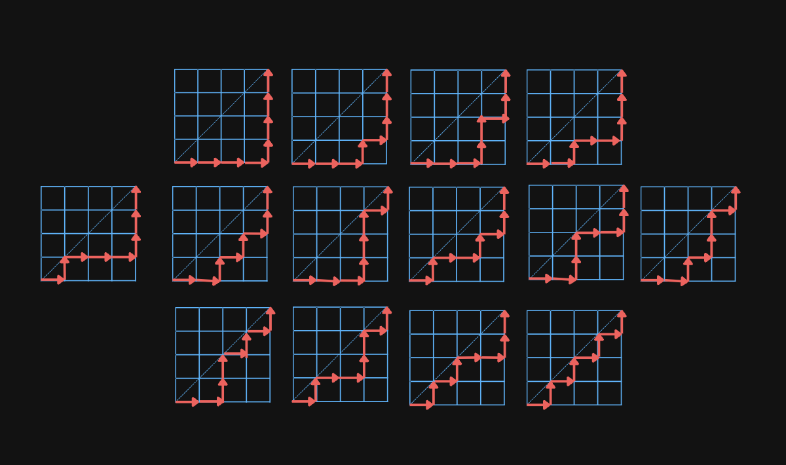

<Resources>
	<Resource
		source="cp-algo"
		title="Catalan Numbers"
		url="https://cp-algorithms.com/combinatorics/catalan-numbers.html"
		starred
	>
		Well documented article.
	</Resource>
</Resources>

The [Catalan numbers](https://en.wikipedia.org/wiki/Catalan_number) are a sequence of positive integers that can be very useful in counting problems in combinatorics.
The $n$-th Catalan can be expressed as follows using binomial coefficients:

$$
C_n=\frac{1}{n+1}\cdot \binom{2n}{n}=\frac{(2n)!}{(n+1)!\,n!}
$$

They also have the recurrence formula
$$
C_{n+1}= \sum^{n}_{i=0}{C_i \cdot C_{n-i}} \,\,\, \text{ for } n \ge 0 \\
$$
which can also be expressed as
$$
C_n=\frac{2(2n-1)}{n+1} \cdot C_{n-1}
$$

The first $5$ Catalan numbers are

<center>

| n | 0| 1 | 2 | 3 | 4 | 5 |
|---| -| - | - | - | - | - |
| $C_n$| 1 | 1 | 2 | 5 | 14| 42 |

</center>

# Applications

The Catalan numbers can be used to represent a wide variety of things.

For example, $C_n$ is equal to the number of valid parenthesis expressions of length $2n$.
Take, for instance, $C_3=5$:
* `()()()`
* `(())()`
* `()(())`
* `((()))`
* `(()())`

It's also equal to the number of full binary trees with $n+1$ leaves.
The following image shows the $5$ binary trees with $4$ leaves:


$C_n$ is also the number of monotonic lattice paths along the edges of a $n \times n$ grid that don't pass above the diagonal.
The paths start in the lower left corner and ends in the upper right corner.

For example, there are $C_4=14$ paths in a $4 \times 4$ grid:



The next two examples are a bit more niche, but they're still interesting to think about.

Consider a convex polygon with $n+2$ sides divided into $n$ triangles by connecting vertices with non-intersecting lines.
The number of different ways to divide the polygon in this way is equal to $C_n$.

Here's the particular case for $n=3$ in which we have $C_3=5$:


$C_n$ is also equal to the number of [mountain ranges](https://mathcircle.berkeley.edu/sites/default/files/BMC6/pdf0607/catalan.pdf#page=2) of length $2n$ consisting of $n$ upstrokes and $n$ downstrokes.


# Bracket Sequences I

<FocusProblem problem="sample" />

## Explanation

The problem is a direct application of Catalan numbers. The answer for $N$ is the $N/2$ Catalan Number.

## Implementation

**Time Complexity:** $\mathcal{O}(N)$

<LanguageSection>
<CPPSection>

```cpp
#include <iostream>

using namespace std;

const int MOD = 1e9 + 7;
const int MAXN = 1e6;

long long fac[MAXN + 1];
long long inv[MAXN + 1];

// BeginCodeSnip{Combinatorics Functions (from the module)}
long long exp(long long x, long long n, long long m) {
	x %= m;  // note: m * m must be less than 2^63 to avoid ll overflow
	long long res = 1;
	while (n > 0) {
		if (n % 2 == 1) { res = res * x % m; }
		x = x * x % m;
		n /= 2;
	}
	return res;
}

void factorial(long long p) {
	fac[0] = 1;
	for (int i = 1; i <= MAXN; i++) { fac[i] = fac[i - 1] * i % p; }
}

void inverses(long long p) {
	inv[MAXN] = exp(fac[MAXN], p - 2, p);
	for (int i = MAXN; i >= 1; i--) { inv[i - 1] = inv[i] * i % p; }
}

long long choose(long long n, long long r, long long p) {
	return fac[n] * inv[r] % p * inv[n - r] % p;
}
// EndCodeSnip

int main() {
	long long n;
	cin >> n;

	if (n % 2) {
		cout << 0 << endl;
		return 0;
	}

	factorial(MOD);
	inverses(MOD);

	cout << exp(n / 2 + 1, MOD - 2, MOD) * choose(n, n / 2, MOD) % MOD << endl;
}
```

</CPPSection>
<PySection>

```py
MAXN = 10**6
MOD = 10**9 + 7

fac = [0] * (MAXN + 1)
inv = [0] * (MAXN + 1)


# BeginCodeSnip{Combinatorics Functions (from the module)}
def exp(x: int, n: int, m: int) -> int:
	x %= m
	res = 1
	while n > 0:
		if n % 2 == 1:
			res = res * x % m
		x = x * x % m
		n //= 2
	return res


def factorial():
	fac[0] = 1
	for i in range(1, MAXN + 1):
		fac[i] = fac[i - 1] * i % MOD


def inverses():
	inv[MAXN] = exp(fac[MAXN], MOD - 2, MOD)
	for i in range(MAXN, 0, -1):
		inv[i - 1] = inv[i] * i % MOD


def choose(n: int, r: int) -> int:
	if n < r:
		return 0
	return fac[n] * inv[r] % MOD * inv[n - r] % MOD


# EndCodeSnip

n = int(input())

if n % 2 != 0:
	print(0)
else:
	factorial()
	inverses()
	result = exp(n // 2 + 1, MOD - 2, MOD) * choose(n, n // 2) % MOD
	print(result)
```

</PySection>
</LanguageSection>

# Problems

<Problems problems="catalan-practice" />
