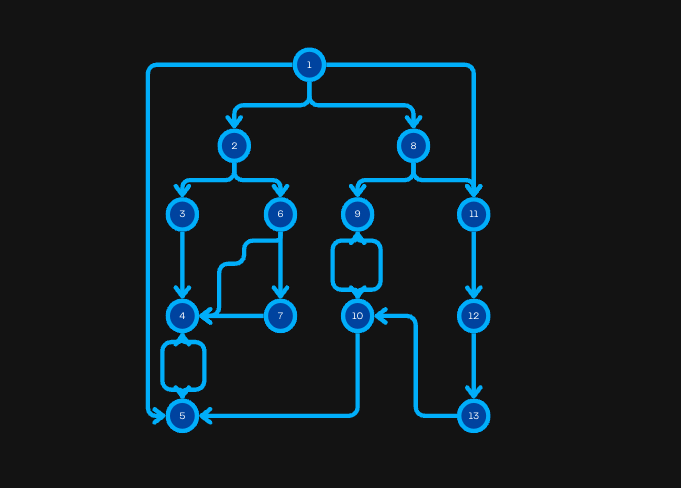

## Paths

<FocusProblem problem="critical" />

<Resources>
	<Resource
		source="Wiki"
		title="Dominator"
		url="https://en.wikipedia.org/wiki/Dominator_(graph_theory)"
		starred
	>
  	Wiki Definition
 	</Resource>
	<Resource
		source="Blog"
		title="Dominator Tree"
		url="https://tanujkhattar.wordpress.com/2016/01/11/dominator-tree-of-a-directed-graph/"
	>
    Well-covered article
    </Resource>
	<Resource
		source="Blog"
		title="Visualizing Dominators"
		url="https://sbaziotis.com/compilers/visualizing-dominators.html"
		starred
	>
    Well-covered article
    </Resource>
</Resources>

### Solution 

### Naive approach

Critical nodes in a DAG are commonly known as **dominators**. Let's define $Dom(u)$ as the set of nodes that dominate node $u$.

The dominator of the starting node is itself. The set of dominators for any other node $u$ is the intersection of the set of dominators for all ancestors
$p$ of node $u$.

$$
Dom(u)=
\begin{cases}
u,\text{ if u is the starting point}\\ 
{u}  \cup (\cap_{p \in ancestor(u)} Dom(p)) 
\end{cases}
$$

The following code uses the above rucerrence.
<LanguageSection>
<CPPSection>

```cpp
#include <bits/stdc++.h>
 
using namespace std;
 
const int NMAX = 1e5;
 
int n, m;
vector<int> g[NMAX];
vector<bitset<NMAX>> dom;
bool seen[NMAX];
 
void get_dominant_verticies(int node, int parent) {
	if(!seen[node]) {
		dom[node] = ~dom[node];
		seen[node] = true;
	}
 
	dom[node] &= dom[parent];
	dom[node][node] = true;
 
	for(auto son : g[node]) {
		get_dominant_verticies(son, node);
	} 
}
 
int main() {
	cin >> n >> m;
	dom.resize(n+1);
	for(int i = 1; i <= m; i++) {
		int x, y;
		cin >> x >> y;
		g[x].push_back(y);
	}
 
	dom[1] = 1;
	seen[1] = true;
	get_dominant_verticies(1, 0);
 
	set<int> dominators = {n};
	for(int i = 1; i <= n; i++) {
		for(int j = 1; j < i; j++) {
			if(dom[i][j]) {
				dominators.insert(j);
			}
		}
	}
 
	cout << (int)dominators.size() << '\n';
	for(auto node : dominators) {
		cout << node << ' ';
	}
 
	return 0;
}

```

</CPPSection>
</LanguageSection>

**Time complexity:** $\mathcal{O}(N \cdot M)$.

Unfortunately, this is too slow. 

### A faster approach

In this approach we attempt building the [dominator tree](https://en.wikipedia.org/wiki/Dominator_(graph_theory)) of the graph. A dominator tree is a tree where each node's children are thos nodes it immediately dominates. The start node is the root of the tree. The immediate dominator - or shortly **idom** - of a node $u$ is a node $v$ that strictly dominates node $u$ and every other dominator of node $u$ strictly dominates node $v$. The definition of the dominator tree gives us the following property: If node $v$ dominates node $u$, then node $v$ is an ancestor of node $u$, thus the answe of the problem is the path from the root to node $n$ in the dominator tree.

From now on, we'll discuss the construction of the dominator tree, but first we need to precompute some helpful values:

$$
e(u) = \text{the entry time in node u during a DFS}
$$
$$
sdom(u)= min(v \vert \text{there is a path from v to u: } v = v_0 \rightarrow v_1 \rightarrow v_2 \rightarrow v_3 \dots \rightarrow v_k = u \text{ such that } e(v_i)<e(u), \forall i \in [1,k]) 
$$

The following graph depicts the semi-dominator for every node. The full-color edges represent the edges part of the DFS tree.




#### Important properties
1. If $u \neq S$, then $sdom(u)$ is a proper ancestor of $u$ is the DFS tree.
2. If $u \neq S$, then idom(u) is an ancestor - not necessarily proper - of $u$ in the DFS tree.
3. Let $u \neq S$. If, for every vertex $x$ which is an ancestor of $u$ and has sdom(u) as its proper ancestor, $sdom(x) \geq sdom(u)$ then $idom(u)=sdom(u)$.
4. Let $w \neq S$. Let u be a vertex for which $sdom(u)$ is minimum among all vertices u satisfying “$sdom(w)$ is a proper ancestor of $u$ and $u$ is an ancestor of $w$”.  If $sdom(u) \leq sdom(w)$ then $idom(w) = idom(u)$.
5. Let $w \neq S$. Let $u$ be a vertex for which $sdom(u)$ is minimum among all vertices $u$ satisfying “$sdom(w)$ is a proper ancestor of $u$ and $u$ is an ancestor of $w$”.  Then:

$$
idom(w)=\begin{cases}
sdom(w), & \text{ If } sdom(u)=sdom(w),\\
idom(w), & \text{otherwise}.
\end{cases}
$$

#### Precompute Sdom

The following identity enables us the compute $sdom$:
$$
sdom(u) = min((y \vert (y, u) \in E \text{ and } y \le u) \cup (sdom(x) \vert x>u \\\text{ and there is and edge (x, y) such that x is ancestor of y}) )
$$
In other words, $sdom(u)$ is the minimum node in the intersection of the following groups:
1. All the nodes $y$ with $y \le u \text{ and } (y,u) \in E$
2. $sdom(x)$ where $x > u \text{ and } (u, y) \in E$ 

<LanguageSection>
<CPPSection>

```cpp
#include <iostream>
#include <vector>
#include <stack>
#include <functional>
#include <set>

using namespace std;

int main() {
    int n, m;
    vector<vector<int>> g, rg, bucket;
    cin >> n >> m;
    g.resize(n);
    rg.resize(n);
    bucket.resize(n);
    for(int i = 0; i < m; i++) {
        int x, y;
        cin >> x >> y;
        x--, y--;
        g[x].push_back(y);
    }
    int timer = 0;
    vector<int> sdom(n, 0), e(n, -1), parent(n, 0), inv(n, 0), dsu(n, 0), label(n, 0), dom_parent(n, 0);
    // Precompute values
    function<void(int)> dfs = [&](int node) {
        e[node] = timer;
        inv[timer] = node;
        sdom[timer] = dsu[timer] = label[timer] = timer;
        timer++;
        for(int son : g[node]) {
            if(e[son] == -1) {
                dfs(son);
                parent[e[son]] = e[node];
            }
            rg[e[son]].push_back(e[node]);
        }
    };
    // DSU function
    function<int(int, int)> Find = [&](int u, int v) {
        if(u == dsu[u]) { return v ? -1 : u; }
        int comp = Find(dsu[u], v+1);
        if(comp < 0) { return u; }
        if(sdom[label[dsu[u]]] < sdom[label[u]])
            label[u] = label[dsu[u]];
        dsu[u] = comp;
        return v ? comp : label[u];
    };
    auto Unite = [&](int x, int y) {
        dsu[y] = x;
    };
    dfs(0);
    vector<int> dom(n);
    for(int i = n-1; i >= 0; i--) {
        for(int p : rg[i]) {
            sdom[i] = min(sdom[i], sdom[Find(p, 0)]);
        }
        if(i > 0) {
            bucket[sdom[i]].push_back(i);
        }
        for(int node : bucket[i]) {
            int p = Find(node, 0);
            if(sdom[p] == sdom[node]) {
                dom[node] = sdom[node];
            } else {
                dom[node] = p;
            }
        }
        if(i > 0) {
            Unite(parent[i], i);
        }
    }
    for(int i = 1; i < n; i++) {
        if(dom[i] != sdom[i]) {
            dom[i] = dom[dom[i]];
        }
        dom_parent[inv[i]] = inv[dom[i]];
    }
    vector<int> dominators;
    int node = n-1;
    while(node != 0) {
        dominators.push_back(node+1);
        node = dom_parent[node];
    }
    dominators.push_back(1);
    cout << (int)dominators.size() << '\n';
    reverse(dominators.begin(), dominators.end());
    for(int node : dominators) { cout << node << ' '; }
}
```

</CPPSection>
</LanguageSection>
**Time complexity:** $\mathcal{O}((N+M) \cdot \log{N})$

## Cycles

- GP of Wroclaw 2020 H
- [The Meeting Place Cannot be Changed](https://codeforces.com/problemset/problem/982/F)
- USACO Camp - Acyclic Graphs

<Problems problems="list" />