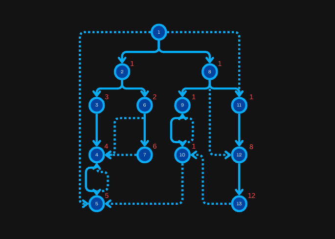

<FocusProblem problem="critical" />

<Resources>
	<Resource
		source="Princeton"
		title="Dominator slides"
		url="https://www.cs.princeton.edu/courses/archive/spr11/cos423/Lectures/DominatorsA.pdf#page=18"
		starred
	>
		Made by the creator of the algorithm himself!
	</Resource>
	<Resource
		source="Wiki"
		title="Dominator"
		url="https://en.wikipedia.org/wiki/Dominator_(graph_theory)"
	>
		Wiki Definition
 	</Resource>
	<Resource
		source="Blog"
		title="Dominator Tree"
		url="https://tanujkhattar.wordpress.com/2016/01/11/dominator-tree-of-a-directed-graph/"
	/>
	<Resource
		source="Blog"
		title="Visualizing Dominators"
		url="https://sbaziotis.com/compilers/visualizing-dominators.html"
		starred
	/>
</Resources>

## Initial Approach

These critical nodes that the problem talks about are commonly known as **dominators**.
Let's define $\texttt{dom}(u)$ as the set of nodes that dominate node $u$.

The dominator of the starting node is itself, and the set of dominators
for any other node $u$ is the intersection of the set of dominators for all ancestors $p$ of node $u$.

$$
\texttt{dom}(u)=
\begin{cases}
  u\quad\text{ if } u \text{ is the starting point} \\
  {u}\cup \left(\bigcap_{p \in \texttt{ancestor}(u)} \texttt{dom}(p)\right)\quad\text{otherwise}
\end{cases}
$$

### Implementation

The following code uses the above recurrence.
However, it's too slow and uses too much memory.
We'll try to optimize this moving on!

**Time complexity:** $\mathcal{O}(N^2)$.

<LanguageSection>
<CPPSection>

```cpp
#include <bitset>
#include <iostream>
#include <vector>

using std::bitset;
using std::cout;
using std::endl;
using std::vector;

const int MAX_N = 1e5;

int main() {
	int city_num;
	int flight_num;
	std::cin >> city_num >> flight_num;
	vector<vector<int>> rev_adj(city_num);
	for (int f = 0; f < flight_num; f++) {
		int a, b;
		std::cin >> a >> b;
		// notice that we need the edges in reverse
		rev_adj[--b].push_back(--a);
	}

	vector<bitset<MAX_N>> dom(city_num);
	dom[0].set(0);  // the dominator of the starting node is itself
	for (int c = 1; c < city_num; c++) { dom[c].set(); }

	bool changed;
	// iteratively update the dom sets of each node
	do {
		changed = false;

		// make a new vector where the updated doms reside
		vector<bitset<MAX_N>> new_dom(city_num);
		new_dom[0].set(0);
		for (int c = 1; c < city_num; c++) {
			bitset<MAX_N> updated = bitset<MAX_N>().set();
			for (int prev : rev_adj[c]) { updated &= dom[prev]; }
			updated.set(c);

			if (updated != dom[c]) { changed = true; }
			new_dom[c] = updated;
		}

		dom = new_dom;
	} while (changed);

	vector<int> critical;
	for (int c = 0; c < city_num; c++) {
		if (dom[city_num - 1][c]) { critical.push_back(c); }
	}

	cout << critical.size() << '\n';
	for (int i = 0; i < critical.size(); i++) {
		cout << critical[i] + 1 << " \n"[i == critical.size() - 1];
	}
}
```

</CPPSection>
</LanguageSection>

## Optimizing With Trees

In this approach, we are going to build the [dominator tree](https://en.wikipedia.org/wiki/Dominator_(graph_theory)) of the graph.

Before we discuss this though, let's set up some terms we're going to use throughout this module:

* A node $u$ **strictly dominates** another node $v$ if $u$ dominates $v$ and $u \ne v$.
* Let the **immediate dominator** of $u$, or $\texttt{idom}(u)$, be the unique node $v$ such that it strictly dominates node $u$ and every other dominator of node $u$ strictly dominates node $v$.
* Let $e(u)$ be the entry time in node $u$ doing a [Euler tour](/gold/tree-euler).
* Let the **semi-dominator** of $u$, or $\texttt{sdom}(u)$, be a $v$ such that there's a path from $v$ to $u$
  and $e(i) \ge e(u)$ for every intermediate node $i$ along the path from $u$ to $v$, excluding the ends.
  If there's multiple nodes that satisfy this requirement, we take the node $v$ with the smallest $e(v)$.
* Let the **relative dominator** of $u$, or $\texttt{rdom}(u)$, be the vertex $x \ne \texttt{sdom}(u)$ on the path from $\texttt{sdom}(u)$ to $u$ in the Euler tour tree with the lowest sdom node number.
  Unlike with the sdom, ties in this function can be broken arbitrarily.

A dominator tree is a tree where each node's children are those nodes it immediately dominates. The start node is the root of the tree.

Given this definition, we can see that if a node dominates another, then the former is
an ancestor of the latter in the dominator tree.
Thus, the answer to the CSES problem is the set of all nodes that lie on the path from the root to node $n$ in the tree.

The following graph shows the sdom for every node.
The full-color edges represent the edges part of the DFS tree.



### Important properties

Proofs of these properties are located later in the module.
For all of these properties, let $u$ be a node that isn't the starting node.

1. $\texttt{sdom}(u)$ is a proper ancestor of $u$ is the DFS tree.
2. If $\texttt{rdom}(u)=u$, then $\texttt{idom}(u)=\texttt{sdom}(u)$.
3. If not, then $\texttt{idom}(u)=\texttt{idom}(\texttt{rdom}(u))$

## Algorithm Overview

Before we get into the nitty-gritty, here's a brief outline of how exactly we're going to build up this dominator tree.

1. Compute the sdom of every node besides the start.
2. Compute the *rdom* of every node besides the start.
3. Visit all the vertices in the DFS tree and calculate their immediate dominator using the second and third properties that were listed above.
   Notice that due to how we defined the rdom of a node, a preorder traversal will always visit the rdom of a node before the node itself if the two aren't the same.

The first and second steps are awfully vague- let's clear those up now, shall we?

### Computing $\texttt{sdom}$

We can compute $\texttt{sdom}(u)$ as the minimum node in the intersection of the following groups:
1. All the nodes $y$ such that there's an edge from $y$ to $u$ and $e(y) \le e(u)$.
2. All the values of $\texttt{sdom}(x)$ where $x$ is any node such that there's an edge from $u$ to $x$ and $e(x) > e(u)$.
   To be more mathematically precise, we can define this group as
   $$
   \{\texttt{sdom}(x)\ |\ (u, x) \in E\text{ and }e(x)>e(u)\}
   $$

The [proof](https://tanujkhattar.wordpress.com/2016/01/11/dominator-tree-of-a-directed-graph/) of why this works is beyond the scope of this module.

### Implementing $\texttt{sdom}$

We first perform a preorder DFS traversal of the graph from the source node and keep track of all the entry times of the nodes.

Then, we compute the sdom for all nodes by applying the formula mentioned in the previous section.
To do this, we iterate over the traversal in *reverse order* and maintain the nodes we've gone over in a [DSU](/gold/dsu).

However, the DSU we use for this algorithm is going to be a little different.
We unite nodes as usual, but the `find` function differs.

Say $x$ is the root of the component we're calling `find` on.
The node we're calling `find` on happens to be `x`, then we return `x` as usual.
However, if it's some other node, then we return a node with the minimum sdom that lies on the path from $u$ to $x$.

To process node $u$ we iterate over all nodes $v$ that have an edge directed towards it.
If $v$ comes before $u$ in the preorder traversal, then $v$ is an ancestor of $u$ and would not have been processed till now.
In that case, `find(v)` would return $v$ itself.

If not, then `find(v)` would return a node $x$ lying on the path from $v$ to the root in its DSU component with the smallest sdom.

If you're still a bit confused by this explanation, pseudocode for it is located
on slide 33 of the Princeton slides given at the start of this module.

### Computing $\texttt{rdom}$

The rdom of a node is the node with the sdom that comes earliest in the traversal.
Since this reduces to finding the minimum of a value along a certain path in a tree,
we can implement this using an augmentation of [binary jumping](/plat/binary-jump).

### Implementation

**Time Complexity:** $\mathcal{O}((N+M) \cdot \log N)$

<LanguageSection>
<CPPSection>

```cpp
#include <algorithm>
#include <cassert>
#include <cmath>
#include <cstdint>
#include <functional>
#include <iostream>
#include <vector>

using std::cout;
using std::endl;
using std::vector;

// BeginCodeSnip{Tree Class for rdom}
template <typename T> class Tree {
  private:
	const int root = 0;
	const vector<int> &parents;
	const vector<T> &vals;
	const int log2dist;
	vector<vector<int>> pow2ends;
	vector<vector<T>> pow2mins;
	vector<int> depth;

  public:
	Tree(const vector<int> &parents, const vector<T> &vals)
	    : parents(parents), vals(vals),
	      log2dist(std::ceil(std::log2(parents.size() + 1))),
	      pow2ends(parents.size(), vector<int>(log2dist + 1)),
	      pow2mins(parents.size(), vector<T>(log2dist + 1)) {
		assert(parents[root] == -1);

		vector<vector<int>> children(parents.size());
		for (int n = 0; n < parents.size(); n++) {
			if (parents[n] != -1) { children[parents[n]].push_back(n); }
		}
		depth = vector<int>(parents.size());
		vector<int> frontier{root};
		while (!frontier.empty()) {
			int curr = frontier.back();
			frontier.pop_back();
			for (int n : children[curr]) {
				depth[n] = depth[curr] + 1;
				frontier.push_back(n);
			}
		}

		for (int n = 0; n < parents.size(); n++) {
			pow2mins[n][0] = vals[n];
			pow2ends[n][0] = parents[n];
		}
		for (int p = 1; p <= log2dist; p++) {
			for (int n = 0; n < parents.size(); n++) {
				int halfway = pow2ends[n][p - 1];
				if (halfway == -1) {
					pow2ends[n][p] = -1;
					pow2mins[n][p] = pow2mins[n][p - 1];
				} else {
					pow2ends[n][p] = pow2ends[halfway][p - 1];
					pow2mins[n][p] =
					    std::min(pow2mins[n][p - 1], pow2mins[halfway][p - 1]);
				}
			}
		}
	}

	/**
	 * @return the min value on the path from the ancestor to its descendant,
	 *         not including the ancestor.
	 */
	T min_val(int ancestor, int desc) {
		int dist = depth[desc] - depth[ancestor];
		T ret = vals[desc];
		int at = desc;
		for (int pow = 0; pow <= log2dist; pow++) {
			if ((dist & (1 << pow)) != 0) {
				ret = std::min(ret, pow2mins[at][pow]);
				at = pow2ends[at][pow];
			}
		}
		assert(at == ancestor);
		return ret;
	}
};
// EndCodeSnip

int main() {
	int city_num;
	int flight_num;
	std::cin >> city_num >> flight_num;
	vector<vector<int>> adj(city_num);
	vector<vector<int>> rev_adj(city_num);
	for (int f = 0; f < flight_num; f++) {
		int a, b;
		std::cin >> a >> b;
		adj[--a].push_back(--b);
		rev_adj[b].push_back(a);
	}

	// Variables used for the Euler Tour
	vector<int> visit_order;
	// visit_time is initialized with INF so nodes that aren't reachable
	// during the DFS won't mess up our sdom calculation
	vector<int> visit_time(city_num, INT32_MAX);
	vector<int> visit_parent(city_num, -1);
	vector<bool> visited(city_num, false);
	std::function<void(int, int)> dfs;
	dfs = [&](int at, int prev) {
		if (visited[at]) { return; }
		visited[at] = true;

		visit_time[at] = visit_order.size();
		visit_order.push_back(at);
		visit_parent[at] = prev;
		for (int next : adj[at]) { dfs(next, at); }
	};
	dfs(0, -1);

	// We use a function-based interface instead of a class-based one due to
	// heavy reliance on previously calculated values
	vector<int> dsu_parent(city_num, -1);
	vector<int> dsu_min(city_num, INT32_MAX);
	std::function<int(int)> find;
	find = [&](int x) {
		if (dsu_parent[x] == -1) { return x; }
		if (dsu_parent[dsu_parent[x]] != -1) {
			int parent_res = find(dsu_parent[x]);
			if (visit_time[parent_res] < visit_time[dsu_min[x]]) {
				dsu_min[x] = parent_res;
			}
			dsu_parent[x] = dsu_parent[dsu_parent[x]];
		}
		assert(dsu_min[x] != INT32_MAX);
		return dsu_min[x];
	};

	vector<int> sdom(city_num, -1);
	for (int i = visit_order.size() - 1; i > 0; i--) {
		int c = visit_order[i];
		// Iterate over all nodes with a directed edge to c
		for (int from : rev_adj[c]) {
			int find_res = find(from);
			// Take the node with the earliest visit time in the traversal
			if (sdom[c] == -1 || visit_time[find_res] < visit_time[sdom[c]]) {
				sdom[c] = find_res;
			}
		}

		// Link c to its parent in the DFS tree
		dsu_parent[c] = visit_parent[c];
		dsu_min[c] = sdom[c];
	}

	// Initialize the values in the tree
	vector<std::pair<int, int>> sdom_times(city_num, {INT32_MAX, -1});
	for (int c : visit_order) {
		if (c != 0) {
			// The tree takes the minimum of these pairs, but what we
			// really want is the node itself- therefore, we store both
			sdom_times[c] = {visit_time[sdom[c]], c};
		}
	}
	Tree tree(visit_parent, sdom_times);

	vector<int> rdom(city_num, -1);
	for (int c : visit_order) {
		if (c != 0) {
			// Use the definition of the rdom
			rdom[c] = tree.min_val(sdom[c], c).second;
		}
	}

	// Use the properties previously given to compute the idom
	vector<int> idom(city_num, -1);
	for (int c : visit_order) {
		if (c != 0) { idom[c] = rdom[c] == c ? sdom[c] : idom[rdom[c]]; }
	}

	// Trace the idom tree from the finish node to the start node,
	// finding all dominators along the way
	vector<int> critical{0};
	int at = city_num - 1;
	while (at != 0) {
		critical.push_back(at);
		at = idom[at];
	}

	std::sort(critical.begin(), critical.end());

	cout << critical.size() << '\n';
	for (int i = 0; i < critical.size() - 1; i++) { cout << critical[i] + 1 << ' '; }
	cout << critical.back() + 1 << endl;
}
```

</CPPSection>
</LanguageSection>

## Cycles

<FocusProblem problem="cycles-critical" />

### Explanation

The problem asks as to find the an intersection node of all cycles, if it exists.

First, let's remove the nodes that don't belong to any cycle.
To todo this, we can recursively remove the nodes without any outgoing edge.
By "recursively," we mean that after finishing with a node we can check its parents to see if the parents have no outgoing edges as well.

Now our graph is basically a bunch of cycles.
Assuming that the intersection of all cycles is not empty, we reduce the cycles node by node.
The last node standing is be the intersection.

### Implementation

**Time Complexity:** $\mathcal{O}(N)$

<LanguageSection>
<CPPSection>

```cpp
#include <functional>
#include <iostream>
#include <unordered_set>
#include <vector>

using namespace std;

int main() {
	ios::sync_with_stdio(false);
	cin.tie(NULL);

	int n, m;
	cin >> n >> m;

	vector<unordered_set<int>> in(n), out(n);
	for (int i = 0; i < m; i++) {
		int x, y;
		cin >> x >> y;
		out[--x].insert(--y);
		in[y].insert(x);
	}

	// Recursively remove nodes without outgoing edges
	function<void(int)> dfs = [&](int node) {
		if (!out[node].empty()) { return; }
		for (int p : in[node]) {
			out[p].erase(node);
			dfs(p);
		}
		in[node].clear();
	};
	// Check for nodes with no outgoing edges
	for (int i = 0; i < n; i++) {
		if (out[i].empty()) { dfs(i); }
	}

	// Reduce cycles by popping out nodes
	vector<int> todo;
	vector<bool> seen(n);
	for (int i = 0; i < n; i++) {
		if ((int)out[i].size() == 1) {
			todo.push_back(i);
			seen[i] = true;
		}
	}
	while (!todo.empty()) {
		int node = todo.back();
		todo.pop_back();

		int next = *out[node].begin();
		if (node == next) { continue; }

		in[next].erase(node);
		in[next].insert(in[node].begin(), in[node].end());
		for (int p : in[node]) {
			out[p].erase(node);
			out[p].insert(next);
			if ((int)out[p].size() == 1 && !seen[p]) {
				todo.push_back(p);
				seen[p] = true;
			}
		}

		out[node].clear();
		in[node].clear();
	}

	// Get the last node standing.
	// If there are multiple nodes, then there is no intersection
	int ans = -1;
	for (int i = 0; i < n; i++) {
		if (!out[i].empty()) {
			if (ans == -1) {
				ans = i + 1;
			} else {
				ans = -1;
				break;
			}
		}
	}

	cout << ans << endl;
}
```

</CPPSection>
</LanguageSection>

<Problems problems="list-critical" />
