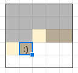

## Knuth's Optimization

<IncompleteSection />

### Tutorials

<Resources>
	<Resource
		source="Jeffrey Xiao"
		title="Knuth's Optimization"
		url="https://jeffreyxiao.me/blog/knuths-optimization"
	 />
	<Resource source="GCP" title="15.4.3 - Knuth's Optimization"/>
</Resources>

## Miscellaneous Techniques

<Resources>
	<Resource source="CF" title="zscoder - Nontrivial DP Techniques" url="47764">
		Miscellaneous techniques
	</Resource>
</Resources>

<!-- <Optional title="Application">

Queue with 2 stacks is used to remove a factor of $\mathcal{O}(\log N)$ in [USACO Plat - Mowing Mischief](http://www.usaco.org/index.php?page=viewproblem2&cpid=926).

</Optional> -->

### "Connected Component" DP Problems

<Problems problems="connected_component" />

## DP on Broken Profile

<!-- <Resources>
	<Resource
		source="cp-algo"
		title="DP on Broken Profile"
		url="dynamic_programming/profile-dynamics.html"
	/>
</Resources> -->

Broken profile DP is a subset of bitmask DP. Problems falling under this
category generally have the following properties:

1. They're about filling a 2D grid.
2. One of the dimensions is much smaller than the other.
3. When filling the grid, each cell depends only on adjacent cells.
4. The cells don't have many possible values (usually only 2).

The third property is especially important, as it means that we can process the
cells column-by-column (imagine a snake wrapping around the grid). We then only
need to care about the rightmost processed cell in each row (hence the name
"broken profile").

The fourth property suggests that we should use a bitmask to represent that
broken profile.

<Warning>

Note that the bitmask doesn't necessarily have to represent the state of the
_cells_. In some problems (e.g. CEOI 2006 Connect), it can represent the state
of the cell _borders_ instead.

</Warning>

<FocusProblem problem="brokenFocus" />

### Tutorial

**Time Complexity:** $\mathcal O(NM 2^N)$.

We'll process the grid cells column-by-column, row-by-row.

Let $\texttt{dp}[i][j][mask]$ be the number of ways to tile the grid so that:

- All cells from cell $(0, 0)$ to cell $(i, j - 1)$ are **covered**.
- All cells from cell $(i + 1, j)$ to cell $(N - 1, M - 1)$ are **empty**.
- $mask$ represents whether each of the remaining $N$ cells are **empty**, with
  the $k$-th bit corresponding to the cell in column $k$.

For example, the following state would contribute toward
$\texttt{dp}[1][3][10100_2]$: 

The answer will be $\texttt{dp}[N - 1][M - 1][0]$.

We now have three cases when calculating $\texttt{dp}[i][j][mask]$:

- The $i$-th bit of the mask is 0, meaning that cell $(i, j)$ is **covered**.
  - Case 1: we used a vertical tile to cover it.
    - Cell $(i, j - 1)$ must have been empty, so there are
      $\texttt{dp}[i - 1][j][mask \oplus 2^i]$ ways to do this.
  - Case 2: we used a horizontal tile to cover it.
    - This is only possible if $i > 0$.
    - Cells $(i - 1, j)$, $(i - 1, j - 1)$, and $(i, j - 1)$ must have been
      covered, so there are $\texttt{dp}[i - 1][j][mask \oplus 2^{i - 1}]$ ways
      to do this.
    - This corresponds to
      `if (i && !(mask & (1 << i)) && !(mask & (1 << i - 1)))` in the code
      below.
- The $i$-th bit of the mask is 1, meaning that cell $(i, j)$ is **empty**.
  - Cell $(i, j - 1)$ must have been covered, so there are
    $\texttt{dp}[i - 1][j][mask \oplus 2^i]$ ways to do this.
    - This is the same as case 1 of when the $i$-th bit of the mask is 0, so we
      handle them simultaneously in the code below.

Note that the indices we need to use may become negative and will thus require
wrapping. To simplify calculations and bypass this, simply drop the first two
dimensions of the DP array, as $\texttt{dp}[i][j]$ depends only on
$\texttt{dp}[i - 1][j]$.

### Code

<LanguageSection>

<CPPSection>

```cpp
#include <bits/stdc++.h>
using namespace std;

const int MOD = 1e9 + 7;

int dp[1 << 10][2];

int main() {
	cin.tie(0)->sync_with_stdio(0);
	int n, m;
	cin >> n >> m;
	dp[0][0] = 1;
	for (int j = 0; j < m; j++) for (int i = 0; i < n; i++) {
		for (int mask = 0; mask < (1 << n); mask++) {
			dp[mask][1] = dp[mask ^ (1 << i)][0]; // Vertical/no tile
			if (i && !(mask & (1 << i)) && !(mask & (1 << i - 1))) // Horizontal tile
				dp[mask][1] += dp[mask ^ (1 << i - 1)][0];

			if (dp[mask][1] >= MOD) dp[mask][1] -= MOD;
		}
		for (int mask = 0; mask < (1 << n); mask++) dp[mask][0] = dp[mask][1];
	}
	cout << dp[0][0];
	return 0;
}
```

</CPPSection>

</LanguageSection>

### Broken profile DP Problems

<Problems problems="broken" />
