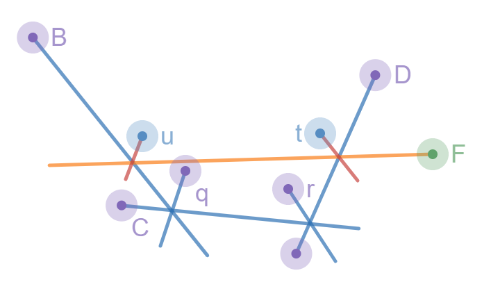

# Half-Plane Intersection

<Resources>
	<Resource
		source="CF"
		title="Blogewoosh - Half-Plane Intersection w/ Ternary Search"
		url="61710"
		starred
	/>
	<Resource
		source="Petr"
		title="Linear Half-Plane Intersection"
		url="https://petr-mitrichev.blogspot.com/2016/07/a-half-plane-week.html"
		starred
	>
		Expected linear time!
	</Resource>
</Resources>

A half-plane can be defined as a planar region that consists of all points on one side of an infinite straight line, and none on the other side. We can apply computational geometry here, as an intersection can be represented as a convex polygon, where every point inside it is also inside all half-planes. If we can construct this polygon, we can retrieve the intersections.

We can state that $N$ is the number of half-planes in our set. We represent lines and half-planes by a point and a vector, or in other terms, any point that lies on said line and the direction vector of the line. Each half-plane allows the region to the left of its direction vector. We can define the angle of a given half-plane as the polar coordinates of its direction vector. We can also state that a resulting intersection is always either bounded or empty, in cases where this doesn't hold, we can add 4 more half-planes which increase the size of the bounding box. For now, we shall also assume that parallel half-planes will not be present. To get a more visual representation of this, see the image below:


This half-plane has an equation $y = 2x -2$ and can be represented as $P = (1,0)$ with the direction vector $PQ$ as $(1,2)$.
I will now describe various ways of solving this problem, explaining algorithms in increasing efficiency:

## Explanation

### Brute Force

This problem can be solved using brute force by computing the intersection point of the lines and all pairs of half-planes and then, for every point, checking if it is inside all of the other half-planes. There are $\mathcal{O}(N^2)$ intersection points that need to be checked against $\mathcal{O}(N)$ half-planes, resulting in the final complexity being $\mathcal{O}(N^3)$. We can then create a convex hull on the set of intersection points which were also included in the half-planes. The vertices of this convex hull are the intersection points of the half-plane lines, as they, of course, would mean they are points in every half-plane since it is points of intersection. This approach works to gain a solution; however, it's impractical to apply in a real-world scenario due to its extremely poor efficiency.

### Incremental

A slightly faster approach to this problem would be to incrementally construct the intersection of the half-planes one by one. We cut the convex polygon by a line $N$ amount of times, removing the redundant planes each time.

If we represent the convex polygon as a set of line segments, we can cut it with a half-plane by finding the points of intersection of the segments with the half-plane line, replacing all the line segments in the middle with a new segment corresponding to a half-plane. This can be implemented in $\mathcal{O}(N)$ time, and decrease the bounding box with each half-plane, resulting in an $\mathcal{O}(N^2)$ complexity.

This is much better than our initial approach. However, it's still relatively inefficient as we still have to loop over $\mathcal{O}(N)$ half-planes with every iteration. We will make some alterations to this algorithm in the next approach for a more reasonable solution.

### Sort and Increment Algorithm

We can use some properties of the output of the previous algorithm to optimize it. We know that the resulting region of the intersection of half-planes is convex, therefore it will consist of some segments of half-planes in order of their angles. In other words, if we incrementally intersect the half-planes in the order of their angles, storing them in a double-ended queue, we will only need to remove half-planes from the front and the back of the queue.

Let's say that the half-plane angles are sorted from $-π$ to $π$ and that we are about to start the $k$-th step of the algorithm. We can say that we have already constructed the intersection of the half-planes up to $k-1$. Because the half-planes are sorted by angle, we can be sure that $k$ will form a convex turn with the $k-1$ half-plane. From this, we can say:
* Some of the half-planes that are located at the back of the intersection may become redundant, in which case we shall pop from the queue from the back of the double-ended queue.
* Some of the half-planes that are located at the front of the intersection may become redundant, in which case we shall pop from the queue from the back of the double-ended queue.
* The intersection may become empty from this, in which case we shall simply terminate the algorithm and return the intersection as empty.

In this case, redundant means that it doesn't change the intersection, or the half-plane could be removed and the intersection wouldn't change.

To visualize this, we shall let $H = A,B,C,D,E$. This is the set of half-planes that are currently present in the intersection. For the points, we can define them as $P = p,q,r,s$ which are intersection points of adjacent half-planes from $H$. This could be represented as such below:


Say we want to intersect it with a new half-plane $F$; it may make some existing half-planes redundant.


We can see $F$ here represented in orange. It makes the half-planes $A$ and $E$ redundant. Therefore, we can remove them from the front and back of the queue and add $F$ at the end. Then, we obtain a new intersection between $H = B,C,D,F$ with $P = q,r,t,u$. This can be shown below:



This is the main principle of the algorithm. However, there are a few special cases we should cover. In the case of parallel half-planes, there are 2 possible scenarios, either two that are parallel with the same direction or different directions. We should approach parallel lines with different directions the same as if we have to increase the size of the bounding box, since there will have to be at least one of the half-planes within the bounding box in between the two since they are sorted by angle. This means that the only case we have to deal with is where there are two half-planes with the same angle. To do this is straightforward: simply keep the leftmost half-plane and erase the rest since the others will eventually become redundant anyway.

So, as an overview of the algorithm:
* Sort the set of half-planes by angle; it takes $\mathcal{O}(NlogN)$ time.
* Iterate over the set. For each, perform incrementation and pop either from the front or back of the double-ended queue as necessary; it takes linear time since every half-plane can only be added or removed once.
* Once this has been completed, the convex polygon that results from the intersection can be obtained by computing the intersection points of adjacent half-planes in the double-ended queue. It will take linear time. This results in our final complexity as $\mathcal{O}(NlogN)$. In a special case where the half-planes are pre-sorted, this algorithm could be completed in $\mathcal{O}(N)$. However, for the majority of cases, we will be looking at $\mathcal{O}(N \log N)$, most of which is coming from the sorting by angle.

## Implementation

**Time Complexity: $\mathcal{O}(N \log N)$**

<LanguageSection>
<CPPSection>

```cpp
#include <algorithm>
#include <climits>
#include <deque>
#include <vector>

const long double eps =
    1e-9;                  /** @Small epsilon for floating-point comparison */
const int inf = INT32_MAX; /** @Infinite value for bounding box */

struct Point {
	long double x, y;
	explicit Point(long double x = 0, long double y = 0) : x(x), y(y) {}

	/** @comment Operator overloads for Point operations */
};

struct Halfplane {
	Point p, pq;       /** @Point and direction vector of half-plane */
	long double angle; /** @Angle of the direction vector */

	Halfplane() {}
	Halfplane(const Point &a, const Point &b) : p(a), pq(b - a) {
		angle = atan2l(pq.y, pq.x); /** @Compute angle of direction vector */
	}

	/** @Check if a point r is outside the half-plane */
	bool out(const Point &r) { return cross(pq, r - p) < -eps; }

	/** @Operators for sorting half-planes based on angle */
};

/** @Compute the intersection of a set of half-planes */
std::vector<Point> halfplane_intersect(std::vector<Halfplane> &halfplanes) {
	Point box[4] = {Point(inf, inf), Point(-inf, inf), Point(-inf, -inf),
	                Point(inf, -inf)};
	/** @Define a bounding box as 4 half-planes */

	/** @Add bounding box halfplanes to the input set */
	for (int i = 0; i < 4; i++) {
		Halfplane aux(box[i], box[(i + 1) % 4]);
		halfplanes.push_back(aux);
	}

	/** @Sort half-planes by angle (counter-clockwise) */
	std::sort(halfplanes.begin(), halfplanes.end());

	/** @Remove duplicates (half-planes with same direction) */
	halfplanes.erase(std::unique(halfplanes.begin(), halfplanes.end()),
	                 halfplanes.end());

	std::deque<Halfplane> active_halfplanes; /** @Active set of half-planes */
	int len = 0;                             /** @Length of active_halfplanes */

	/** @Process each sorted half-plane */
	for (int i = 0; i < int(halfplanes.size()); i++) {
		/** @Remove invalid half-planes from the end of active set */
		while (len > 1 &&
		       halfplanes[i].out(inter(active_halfplanes[len - 1],
		                               active_halfplanes[len - 2]))) {
			active_halfplanes.pop_back();
			len--;
		}

		/** @Remove invalid half-planes from the beginning of active set */
		while (len > 1 && halfplanes[i].out(inter(active_halfplanes[0],
		                                          active_halfplanes[1]))) {
			active_halfplanes.pop_front();
			len--;
		}

		/** @Add current half-plane to active set */
		active_halfplanes.push_back(halfplanes[i]);
		len++;
	}

	/** @Check if there are less than 3 valid half-planes */
	if (len < 3) return std::vector<Point>(); /** @No intersection */

	/** @Compute intersection points of active half-planes */
	std::vector<Point> intersection_points(len);
	for (int i = 0; i < len - 1; i++) {
		intersection_points[i] =
		    inter(active_halfplanes[i], active_halfplanes[i + 1]);
	}
	intersection_points.back() =
	    inter(active_halfplanes[len - 1], active_halfplanes[0]);

	return intersection_points; /** @Return intersection points */
}
```

</CPPSection>
</LanguageSection>

## Problems

<Problems problems="half" />

# LineContainer (aka $\mathcal{O}(N \log N)$ CHT)

<Resources>
	<Resource
		source="KACTL"
		title="LineContainer"
		url="https://github.com/kth-competitive-programming/kactl/blob/master/content/data-structures/LineContainer.h"
		starred
	>
		source of code that I (Ben) use
	</Resource>
	<Resource
		source="cp-algo"
		title="Li-Chao Tree"
		url="geometry/convex_hull_trick.html"
		starred
	>
		related topic (but not the same)
	</Resource>
</Resources>

<!-- 	<Resource
		source="CF"
		title="retrograd - Half-Plane Set"
		url="61710?#comment-457662"
	>
		Code
	</Resource> -->

<FocusProblem problem="sample_cht" />

## Explanation

Instead of focusing on the pillars that should be destroyed, let's instead focus
on the pillars that remain.

The total cost consists of the cost due to height differences plus the cost of
destroying unused pillars. The latter cost is equal to the cost to destroy all
pillars minus the cost to destroy the remaining pillars.

Since the cost to destroy all pillars is constant, we can thus turn the problem
into one about building pillars instead of destroying them!

From this, we get a basic DP recurrence. Let $dp[i]$ be the minimum cost to
build the bridge so that the last build pillar is pillar $i$.

$dp[1] = -w_1$ and the following recurrence holds:

$$
\begin{aligned}
	dp[i] &= \min_{j < i}(dp[j] + (h_j - h_i)^2 - w_i)\\
		  &= \min_{j < i}(dp[j] + h_j^2 - 2h_ih_j) + h_i^2 - w_i
\end{aligned}
$$

Notice how

$$
dp[j] + h_j^2 - 2h_ih_j
$$

effectively describes a linear function $y = mx + c$, where $m = -2h_j$,
$x = h_i$, and $c = dp[j] + h_j^2$

This means that we can use CHT to compute $dp[i]$ efficiently!

However, since $m$ is not monotonic, we can't use linear CHT using a deque, so
we must settle with $\mathcal{O}(N \log N)$.

I implemented CHT using a `std::set` here, but other implementations using
things like the Li-Chao tree should work similarly.

## Implementation

**Time Complexity: $\mathcal{O}(N \log N)$**

<LanguageSection>
<CPPSection>

```cpp
#include <bits/stdc++.h>
typedef long long ll;
using namespace std;

struct Line {
	bool type;
	double x;
	ll m, c;
};

bool operator<(Line l1, Line l2) {
	if (l1.type || l2.type) return l1.x < l2.x;
	return l1.m > l2.m;
}

set<Line> cht;
ll h[100001], w[100001], tot = 0, dp[100001];

bool has_prev(set<Line>::iterator it) { return it != cht.begin(); }
bool has_next(set<Line>::iterator it) {
	return it != cht.end() && next(it) != cht.end();
}

double intersect(set<Line>::iterator l1, set<Line>::iterator l2) {
	return (double)(l1->c - l2->c) / (l2->m - l1->m);
}

void calc_x(set<Line>::iterator it) {
	if (has_prev(it)) {
		Line l = *it;
		l.x = intersect(prev(it), it);
		cht.insert(cht.erase(it), l);
	}
}

bool bad(set<Line>::iterator it) {
	if (has_next(it) && next(it)->c <= it->c) return true;
	return (has_prev(it) && has_next(it) &&
	        intersect(prev(it), next(it)) <= intersect(prev(it), it));
}

void add_line(ll m, ll c) {
	set<Line>::iterator it;

	it = cht.lower_bound({0, 0, m, c});
	if (it != cht.end() && it->m == m) {
		if (it->c <= c) return;
		cht.erase(it);
	}

	it = cht.insert({0, 0, m, c}).first;
	if (bad(it)) cht.erase(it);
	else {
		while (has_prev(it) && bad(prev(it))) cht.erase(prev(it));
		while (has_next(it) && bad(next(it))) cht.erase(next(it));

		if (has_next(it)) calc_x(next(it));
		calc_x(it);
	}
}

ll query(ll h) {
	Line l = *prev(cht.upper_bound({1, (double)h, 0, 0}));
	return l.m * h + l.c;
}

int main() {
	ios_base::sync_with_stdio(0);
	cin.tie(0);
	int n;
	cin >> n;
	for (int i = 1; i <= n; i++) cin >> h[i];
	for (int i = 1; i <= n; i++) {
		cin >> w[i];
		tot += w[i];
	}

	dp[1] = -w[1];
	for (int i = 2; i <= n; i++) {
		add_line(-2 * h[i - 1], dp[i - 1] + h[i - 1] * h[i - 1]);
		dp[i] = query(h[i]) - w[i] + h[i] * h[i];
	}

	cout << tot + dp[n];
	return 0;
}
```

</CPPSection>
</LanguageSection>

## Problems

<Problems problems="sample" />

<Problems problems="lc_probs" />
