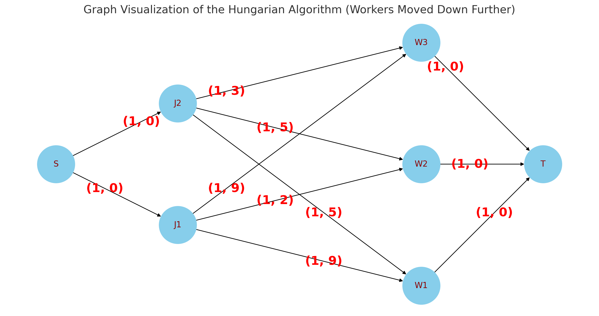

In this section I will briefly walk over my understanding of min cost flow. I
would highly recommend reading through
[CP-Algorithm's Min Cost Flow](https://cp-algorithms.com/graph/min_cost_flow.html)
to understand the solution idea first. Additionally, check the
[TopCoder tutorial](https://www.topcoder.com/community/competitive-programming/tutorials/minimum-cost-flow-part-two-algorithms/)
for a more detailed explanation.

## Triangle Inequality

In graph theory, the **Triangle Inequality** states that if there is an edge
$u \rightarrow v$ with weight $w$, and $d_k$ be the shortest path to node $k$
(for some reasonable definition of shortest path), then $d_v - d_u \leq w$.

<Resources>

<Resource
	source="Wikipedia"
	title="Triangle Inequality"
	url="https://en.wikipedia.org/wiki/Triangle_inequality"
>
	Mainly in geometry, but it has the gist of the idea.
</Resource>

</Resources>

## Johnson's Algorithm

The main idea of **Johnson's Algorithm** is that if all edge weights are
positive, then running Dijkstra's from each node would result in a
$\mathcal{O}(VE \log E)$ algorithm. If there are any negative edges, **Johnson's
Algorithm** defines a potential function $\pi$, such that for every edge
$u,v,w$, the following holds: $w>=\pi(u)-\pi(v)$. Then, each edge weight can be
transformed into $w \rightarrow w + \pi(v)-\pi(u)$, resulting in positive
weight. This condition coincides with the **Triangle Inequality**, so we can
arbitrarily pick a node and run a $\mathcal{O}(VE)$ shortest path algorithm to
determine this function.

<Resources>

<Resource
	source="GFG"
	title="Johnson's Algorithm for All-pairs shortest paths"
	url="https://www.geeksforgeeks.org/johnsons-algorithm/"
/>
<Resource
	source="Wikipedia"
	title="Johnson's Algorithm"
	url="https://en.wikipedia.org/wiki/Johnson%27s_algorithm"
/>

</Resources>

## Minimum Cost Flow

The general idea of Min Cost Flow is to repeatedly push flow along the shortest
path. Since flow graphs have negative edges, each step naively would take
$\mathcal{O}(VE)$ time. To speed it up, we can use the same potential function
from **Johnson's Algorithm** to employ Dijkstra for this process. In this case
we _must_ use distance from $S$, the source node, as the $\pi$ function. At each
step, run Dijkstra's using the $\pi$ function, update the $\pi$ function to
match the current distances, and then push flow along the shortest path,
reversing edges as needed. Once flow is met or the sink is unreachable,
terminate.

<Info title="Important Clarification">

Note that the $\pi$ function stores values _before_ the edge reverses happen.
Luckily the **triangle inequality**'s equality case is along the shortest path,
meaning that in a flow network it holds both forwards and backwards along edges
in the shortest path. This means that although the $\pi$ function does not store
the shortest paths, it still satisfies the **triangle inequality** for all
edges.

$\pi(u)-\pi(v)=w \implies \pi(v)-\pi(u)=-w$

</Info>

<Resources>

<Resource
	source="CP-Algorithms"
	title="Minimum-cost flow"
	url="https://cp-algorithms.com/graph/min_cost_flow.html"
	starred
>
	Note: Does not use optimal solution, but explains the concept well.
</Resource>
<Resource
	source="TopCoder"
	title="Minimum Cost Flow Algorithms"
	url="https://www.topcoder.com/community/competitive-programming/tutorials/minimum-cost-flow-part-two-algorithms/"
	starred
 />

</Resources>

## Implementation

With all this being said, here is my implementation.

<!-- Confirmed Here: https://codeforces.com/contest/818/submission/82266882 -->

```cpp
template <int MN, int MM>
struct MCF  // MN = nodes, MM = edges [assume edges one-directional]
{
  public:
	int N, M, S, T;
	int flow[MM * 2], cap[MM * 2], hd[MN], nx[MM * 2], to[MM * 2], cost[MM * 2];
	int pi[MN], p[MN], d[MN];
	int vis[MN];
	void init(int n, int s, int t) {
		N = n, S = s, T = t;
		memset(hd, -1, sizeof hd);
	}
	void adde1(int a, int b, int f, int c) {
		nx[M] = hd[a], hd[a] = M;
		to[M] = b, cost[M] = c, cap[M] = f;
		M++;
	}
	void adde(int a, int b, int f, int c) {
		adde1(a, b, f, c);
		adde1(b, a, 0, -c);
	}
	void setpi() {
		std::queue<int> q;
		memset(pi, 0x3e, sizeof pi);
		memset(vis, 0, sizeof vis);
		q.push(S);
		pi[S] = 0;
		for (int n; !q.empty();) {
			n = q.front();
			q.pop();
			for (int id = hd[n], x; ~id; id = nx[id]) {
				if (cap[id] - flow[id] <= 0) continue;
				x = to[id];
				if (ckmin(pi[x], pi[n] + cost[id])) assert(++vis[x] <= N), q.push(x);
			}
		}
	}
	struct state {
	  public:
		int n, d;
		bool operator>(state o) const { return d > o.d; }
	};
	void dijk() {
		std::priority_queue<state, std::vector<state>, std::greater<state>> q;
		memset(p, -1, N * sizeof p[0]);
		memset(vis, 0, N * sizeof vis[0]);
		memset(d, 0x3e, N * sizeof d[0]);

		d[S] = 0;
		q.push({S, 0});
		for (int n; !q.empty();) {
			n = q.top().n;
			q.pop();
			if (vis[n]) continue;
			vis[n] = 1;
			for (int id = hd[n], x, w; ~id; id = nx[id]) {
				if (cap[id] - flow[id] <= 0) continue;
				x = to[id];
				w = cost[id] + pi[n] - pi[x];
				if (ckmin(d[x], w + d[n])) p[x] = id, q.push({x, d[x]});
			}
		}
	}
	int mincost(int F) {
		setpi();
		int C = 0;
		while (F > 0) {
			dijk();
			if (d[T] == INF) return INF;
			int c = d[T] + pi[T] - pi[S], f = F;
			for (int x = T; x != S; x = to[p[x] ^ 1]) ckmin(f, cap[p[x]] - flow[p[x]]);
			C += c * f;
			for (int x = T; x != S; x = to[p[x] ^ 1]) {
				flow[p[x]] += f;
				flow[p[x] ^ 1] -= f;
			}
			F -= f;
			for (int i = 0; i < N; ++i) pi[i] += d[i];
		}
		return C;
	}
};
```

Also check out
[Benq's Implementation](<https://github.com/bqi343/USACO/blob/master/Implementations/content/graphs%20(12)/Flows%20(12.3)/MCMF.h>)
and
[KACTL's Implementation](https://github.com/kth-competitive-programming/kactl/blob/master/content/graph/MinCostMaxFlow.h)
(which are a lot better than mine).

## Problems

<Problems problems="general" />

## Applications

### Assignment Problem

<FocusProblem problem="assignment" />

The assignment problem is best understood as a min cost max flow problem. In our
formulation, we will assign $W$ workers to $J$ jobs, $J \ge W$, and the cost of
assigning the $i$th job to the $j$th worker is $C_{i,j}$.

We will create a flow network with a source node $S$, job nodes $J_i$, worker
nodes $W_j$, and a sink node $E$.

We will have the following edges:

- $(S, J_i)$ with $(capacity, cost) = (1, 0)$
- $(J_i, W_j)$ with $(1, C_{i,j})$
- $(W_j, E)$ with $(1, 0)$

The answer will be the minimum cost of the max flow of the graph. An example:



To solve this, we will use the min cost max flow algorithm detailed above. In
every iteration of the algorithm, we will assign a job to a worker. In each
iteration, we will first assign the job to an auxiliary worker, then we will try
to find an augmenting path with minimum cost. To optimize this, we will only run
Dijkstra on the worker nodes. For details, refer to the code.

Since there are $J$ iterations (for each job) and each iteration takes $O(W^2)$
time, the overall time complexity is $O(J W^2)$.

### Implementation

From Wikipedia (which is then copied from e-maxx):

```cpp
#include <bits/stdc++.h>
using namespace std;

int ckmin(int &a, int b) { return a > b ? ((a = b), true) : false; }

/**
 * @return the jobs of each worker in the optimal assignment,
 * or -1 if the worker is not assigned
 */
template <class T> vector<int> hungarian(const vector<vector<T>> &C) {
	int J = C.size();
	int W = C[0].size();
	assert(J <= W);

	// job[w] = job assigned to w-th worker, or -1 if no job assigned
	// note: a W-th worker was added for convenience
	vector<int> job(W + 1, -1);
	vector<T> h(W);  // Johnson potentials

	const T inf = numeric_limits<T>::max();
	// assign j_cur-th job using Dijkstra with potentials
	for (int j_cur = 0; j_cur < J; j_cur++) {
		int w_cur = W;  // unvisited worker with minimum distance
		job[w_cur] = j_cur;

		vector<T> dist(W + 1, inf);  // Johnson-reduced distances
		dist[W] = 0;
		vector<bool> vis(W + 1);     // whether visited yet
		vector<int> prv(W + 1, -1);  // previous worker on shortest path
		while (job[w_cur] != -1) {   // Dijkstra step: pop min worker from heap
			T min_dist = inf;
			vis[w_cur] = true;
			int w_next = -1;  // next unvisited worker with minimum distance

			// consider extending shortest path by w_cur -> job[w_cur] -> w
			for (int w = 0; w < W; w++) {
				if (!vis[w]) {
					// sum of reduced edge weights w_cur -> job[w_cur] -> w
					T edge = C[job[w_cur]][w] - h[w];
					if (w_cur != W) {
						edge -= C[job[w_cur]][w_cur] - h[w_cur];
						assert(edge >= 0);
					}
					if (ckmin(dist[w], dist[w_cur] + edge)) { prv[w] = w_cur; }
					if (ckmin(min_dist, dist[w])) { w_next = w; }
				}
			}
			w_cur = w_next;
		}

		for (int w = 0; w < W; w++) {  // update potentials
			ckmin(dist[w], dist[w_cur]);
			h[w] += dist[w];
		}

		while (w_cur != W) {  // update job assignment
			job[w_cur] = job[prv[w_cur]];
			w_cur = prv[w_cur];
		}
	}

	return job;
}

int main() {
	int n;
	cin >> n;
	vector<vector<int>> c(n, vector<int>(n));

	for (int i = 0; i < n; i++) {
		for (int j = 0; j < n; j++) { cin >> c[i][j]; }
	}

	vector<int> mat = hungarian(c);
	int cost = 0;
	for (int i = 0; i < n; i++) { cost += c[mat[i]][i]; }
	cout << cost << endl;
	for (int i = 0; i < n; i++) { cout << mat[i] + 1 << ' ' << i + 1 << endl; }
}
```

<Resources>

<Resource
	source="Wikipedia"
	title="Hungarian Algorithm"
	url="https://en.wikipedia.org/wiki/Hungarian_algorithm#Connection_to_successive_shortest_paths"
	starred>
</Resource>
<Resource
	source="YouTube - Algorithms Thread"
	title="Hungarian for non Hungarians"
	url="https://www.youtube.com/watch?v=cVBzMXYc4ss"
 />
<Resource
	source="Topcoder"
	title="Assignment Problem and Hungarian Algorithm"
	url="https://www.topcoder.com/community/competitive-programming/tutorials/assignment-problem-and-hungarian-algorithm/"
 />

</Resources>

<Problems problems="appl" />
