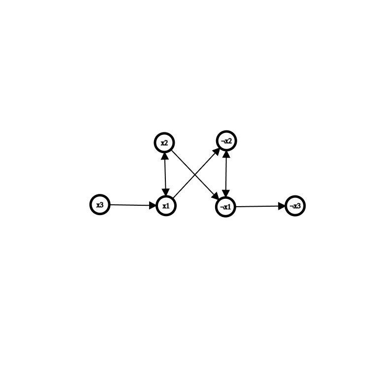

## SCCs

<FocusProblem problem="ex" />

The definition of a kingdom in this problem is equivalent to the definition of a strongly connected component. We can compute these components using either **Kosaraju's** or **Tarjan's** algorithms, both of which are described below.

### Kosaraju's Algorithm

<Resources>
	<Resource source="CPH" title="17 - Strong Connectivity" />
	<Resource source="Wikipedia" title="Kosaraju's Algorithm" url="https://en.wikipedia.org/wiki/Kosaraju%27s_algorithm" />
</Resources>

<!-- <Resource
	source="Benq"
	title="Kosaraju's Implementation"
	url="https://github.com/bqi343/USACO/blob/master/Implementations/content/graphs%20(12)/DFS/SCCK.h"
>
	concise implementation of Kosaraju's Algorithm
</Resource> -->

### Solution (Kosaraju's)

<LanguageSection>
<CPPSection>

```cpp
#include <bits/stdc++.h>
using namespace std;

using vi = vector<int>;
#define pb push_back

const int mx = 1e5 + 1;

// adj_t is the transpose of adj
vi adj[mx], adj_t[mx], S;
bool vis[mx];
int id[mx];

void dfs(int x, int pass, int num = 0) {
	vis[x] = true;
	vi &ad = (pass == 1) ? adj[x] : adj_t[x];
	for (const int &e : ad) {
		if (!vis[e]) dfs(e, pass, num);
	}

	S.pb(x);
	if (pass == 2) id[x] = num;
}

int main() {
	cin.tie(0)->sync_with_stdio(0);

	int n, m;
	cin >> n >> m;

	while (m--) {
		int a, b;
		cin >> a >> b;
		adj[a].pb(b);
		adj_t[b].pb(a);
	}

	for (int i = 1; i <= n; i++) {
		if (!vis[i]) dfs(i, 1);
	}

	memset(vis, false, sizeof vis);

	int components = 0;

	for (int i = n - 1; i >= 0; i--) {
		if (!vis[S[i]]) {
			components++;
			dfs(S[i], 2, components);
		}
	}

	cout << components << "\n";

	for (int i = 1; i <= n; i++) cout << id[i] << " ";
}
```

</CPPSection>
<JavaSection>

```java
import java.io.*;
import java.util.*;

public class Main {
	static final int N = 100001;
	static boolean[] vis = new boolean[N + 1];
	// Adjacency list of neighbor
	static List<Integer>[] adj = new ArrayList[N + 1];
	// adjT is the transpose of adj
	static List<Integer>[] adjT = new ArrayList[N + 1];
	static int[] id = new int[N + 1];
	static List<Integer> dfsOrder = new ArrayList<>();

	public static void main(String[] args) {
		Kattio io = new Kattio();
		int n = io.nextInt();
		int m = io.nextInt();
		for (int i = 1; i <= n; i++) {
			adj[i] = new ArrayList<>();
			adjT[i] = new ArrayList<>();
		}
		for (int i = 0; i < m; i++) {
			int a = io.nextInt();
			int b = io.nextInt();
			adj[a].add(b);
			adjT[b].add(a);
		}

		for (int i = 1; i <= n; i++) {
			if (!vis[i]) { dfs(i, 1, i); }
		}

		Arrays.fill(vis, false);
		int components = 0;
		for (int i = n - 1; i >= 0; i--) {
			if (!vis[dfsOrder.get(i)]) {
				components++;
				dfs(dfsOrder.get(i), 2, components);
			}
		}

		io.println(components);
		for (int i = 1; i <= n; i++) { io.print(id[i] + " "); }
		io.close();
	}

	private static void dfs(int x, int pass, int num) {
		vis[x] = true;
		List<Integer> ad = (pass == 1) ? adj[x] : adjT[x];
		for (int e : ad) {
			if (!vis[e]) { dfs(e, pass, num); }
		}
		dfsOrder.add(x);
		if (pass == 2) { id[x] = num; }
	}

	// CodeSnip{Kattio}
}
```

</JavaSection>
</LanguageSection>

### Tarjan's Algorithm

<Resources>
	<Resource source="CPC" title="7 - Graphs 1" url="07_graphs_1" />
	<Resource source="CP2" title="4.2.9 - Finding SCCs"/>
	<Resource source="Wikipedia" title="Tarjan's SCC Algorithm" url="https://en.wikipedia.org/wiki/Tarjan%27s_strongly_connected_components_algorithm" />
</Resources>

<!-- <Resource
	source="Benq"
	title="Tarjan's Implementation"
	url="https://github.com/bqi343/USACO/blob/master/Implementations/content/graphs%20(12)/DFS/SCCT.h"
>
	concise implementation of Tarjan's Algorithm
</Resource> -->

### Solution (Tarjan's)

<LanguageSection>

<CPPSection>

```cpp
#include <bits/stdc++.h>
using namespace std;
/**
 * Description: Tarjan's, DFS once to generate
 * strongly connected components in topological order. $a,b$
 * in same component if both $a\to b$ and $b\to a$ exist.
 * Uses less memory than Kosaraju b/c doesn't store reverse edges.
 * Time: O(N+M)
 * Source: KACTL
 * https://github.com/kth-competitive-programming/kactl/blob/master/content/graph/SCC.h
 * Verification: https://cses.fi/problemset/task/1686/
 */
struct SCC {
	int N, ti = 0;
	vector<vector<int>> adj;
	vector<int> disc, comp, st, comps;
	void init(int _N) {
		N = _N;
		adj.resize(N), disc.resize(N), comp = vector<int>(N, -1);
	}
	void ae(int x, int y) { adj[x].push_back(y); }
	int dfs(int x) {
		int low = disc[x] = ++ti;
		st.push_back(x);  // disc[y] != 0 -> in stack
		for (int y : adj[x])
			if (comp[y] == -1) low = min(low, disc[y] ?: dfs(y));
		if (low == disc[x]) {  // make new SCC, pop off stack until you find x
			comps.push_back(x);
			for (int y = -1; y != x;) comp[y = st.back()] = x, st.pop_back();
		}
		return low;
	}
	void gen() {
		for (int i = 0; i < N; i++)
			if (!disc[i]) dfs(i);
		reverse(begin(comps), end(comps));
	}
};

int main() {
	int n, m, a, b;
	cin >> n >> m;

	SCC graph;
	graph.init(n);
	while (m--) {
		cin >> a >> b;
		graph.ae(--a, --b);
	}
	graph.gen();
	int ID[200000]{};
	int ids = 0;
	for (int i = 0; i < n; i++) {
		if (!ID[graph.comp[i]]) { ID[graph.comp[i]] = ++ids; }
	}
	cout << ids << '\n';
	for (int i = 0; i < n; i++) {
		cout << ID[graph.comp[i]] << " \n"[i == n - 1];
	}
}
```

</CPPSection>

</LanguageSection>

### Problems

<Problems problems="general" />

## 2-SAT

### Resources

<Resources>
	<Resource source="CF" title="2-SAT" url="16205" />
	<Resource source="cp-algo" title="2-SAT" url="https://cp-algorithms.com/graph/2SAT.html#algorithm" />
	<Resource source="Algorithms Live!" title="2SAT" url="https://youtu.be/0nNYy3rltgA" />
</Resources>

## Introduction
The 2-Satisfiability (2-SAT) problem is a specific type of [Boolean satisfiability problem](https://en.wikipedia.org/wiki/Boolean_satisfiability_problem) where each clause in the given formula contains exactly two literals. The task is to determine whether there exists an assignment of truth values to the variables such that the entire formula is satisfied. A literal is either a variable or its negation. The formula is represented in [Conjunctive Normal Form (CNF)](https://en.wikipedia.org/wiki/Conjunctive_normal_form), which means it is a conjunction (AND) of clauses, where each clause is a disjunction (OR) of exactly two literals.

## Algorithm
To solve a 2-SAT problem, consider a Boolean formula in Conjunctive Normal Form (CNF) where each clause contains exactly two literals, such as

$$
(\lnot x_1 \lor x_2) \land (x_1 \lor \lnot x_2) \land (\lnot x_1 \lor \lnot x_2) \land (x_1 \lor \lnot x_3)
$$
The algorithm proceeds by constructing an implication graph, a directed graph where each variable $x_i$ and its negation $\lnot x_i$ are represented as nodes. For each clause $(a \lor b)$, we add two directed edges: $\lnot a \rightarrow b$ and $\lnot b \rightarrow a$. These edges reflect the logical implications necessary to satisfy each clause.

Once the implication graph is constructed, the next step is to identify the [strongly connected components (SCCs)](https://en.wikipedia.org/wiki/Strongly_connected_component) of the graph. This can be achieved using **Kosaraju's** or **Tarjan's** algorithm, both of which run in linear time. An SCC is a maximal subgraph where every node is reachable from every other node within the subgraph, indicating a tight group of variables and implications.

After identifying the SCCs, we check for consistency. Specifically, we need to ensure that no variable $x_i$ and its negation $\lnot x_i$ belong to the same SCC. If such a scenario occurs, it indicates a logical contradiction because it implies that $x_i$ must be both true and false simultaneously, rendering the formula unsatisfiable.

If the graph passes the consistency check, we proceed to determine a satisfying assignment for the variables. This is done by processing the SCCs in topologically sorted order. [Topological sorting](https://en.wikipedia.org/wiki/Topological_sorting) of the SCCs respects the direction of the implications, ensuring that dependencies are correctly managed. Starting from any SCC with no incoming edges, we assign a truth value to one variable in each SCC. Typically, we set variables to true initially and then propagate this assignment through the graph, ensuring that all implications are satisfied. If a variable is already assigned a truth value due to previous propagations, we skip it to avoid conflicts.

For example, in the formula
$
(\lnot x_1 \lor x_2) \land (x_1 \lor \lnot x_2) \land (\lnot x_1 \lor \lnot x_2) \land (x_1 \lor \lnot x_3)
$, the implication graph would have edges $(\lnot x_1 \rightarrow \lnot x_2), (x_1 \rightarrow x_2), (x_1 \rightarrow \lnot x_2), (\lnot x_1 \rightarrow \lnot x_3), (x_2 \rightarrow x_1), (\lnot x_2 \rightarrow \lnot x_1), (x_2 \rightarrow \lnot x_1)$ and $(x_3 \rightarrow x_1)$.

After constructing the graph and finding the SCCs, we check for consistency. Assuming no contradictions are found, we then assign truth values based on the topological order of the SCCs.


This approach ensures that the 2-SAT problem can be solved efficiently, in linear time relative to the number of variables and clauses, leveraging the properties of directed graphs and the power of SCCs to manage logical dependencies and implications systematically. This makes the 2-SAT problem a notable example of a problem that is solvable in polynomial time, despite being a specific case of the generally intractable Boolean satisfiability problem.

## Implementation
Now, let's implement the entire algorithm for solving the 2-SAT problem using Kosaraju's algorithm. First, we construct the graph of implications $('adj')$ and find all strongly connected components (SCCs). Kosaraju's algorithm efficiently identifies SCCs in $O(n + m)$ time complexity. During the second traversal of the graph, Kosaraju's algorithm visits these SCCs in topological order, allowing us to assign a component number $comp[v]$to each vertex $v$.

Subsequently, to determine the satisfiability of the 2-SAT problem:
- For each variable $x$, we compare $comp[x]$ and $comp[\lnot x]$. If $comp[x] = comp[\lnot x]$, it 	indicates that both $x$ and $\lnot x$ belong to same SCCs, implying a contradiction.
- In such cases, we return $false$ to indicate that no valid assignment satisfies the 2-SAT problem.

Below is the implementation of the solution for the 2-SAT problem, utilizing the graph of implications $adj$ and its transpose $adj^T$, where vertices $2k$ and $2k+1$ correspond to variable $k$ and its negation respectively.

<LanguageSection>
<CPPSection>
```cpp
struct TwoSatSolver {
	int n_vars;
	int n_vertices;
	vector<vector<int>> adj, adj_t;
	vector<bool> used;
	vector<int> order, comp;
	vector<bool> assignment;

	TwoSatSolver(int _n_vars)
	    : n_vars(_n_vars), n_vertices(2 * n_vars), adj(n_vertices),
	      adj_t(n_vertices), used(n_vertices), order(), comp(n_vertices, -1),
	      assignment(n_vars) {
		order.reserve(n_vertices);
	}

	// Depth-first search for the first pass in Kosaraju's algorithm
	void dfs1(int v) {
		used[v] = true;
		for (int u : adj[v]) {
			if (!used[u]) { dfs1(u); }
		}
		order.push_back(
		    v);  // Append node to order list after visiting all reachable nodes
	}

	// Depth-first search for the second pass in Kosaraju's algorithm
	void dfs2(int v, int cl) {
		comp[v] = cl;
		for (int u : adj_t[v]) {
			if (comp[u] == -1) { dfs2(u, cl); }
		}
	}

	bool solve() {
		order.clear();
		used.assign(n_vertices, false);
		for (int i = 0; i < n_vertices; ++i) {
			if (!used[i]) { dfs1(i); }
		}

		comp.assign(n_vertices, -1);
		for (int i = 0, j = 0; i < n_vertices; ++i) {
			int v = order[n_vertices - i - 1];
			if (comp[v] == -1) { dfs2(v, j++); }
		}

		assignment.assign(n_vars, false);
		for (int i = 0; i < n_vertices; i += 2) {
			if (comp[i] == comp[i + 1]) {
				return false;  // If variable and its negation are in the same
				               // component, unsatisfiable
			}
			assignment[i / 2] =
			    comp[i] >
			    comp[i + 1];  // Assign true/false based on component ids
		}
		return true;  // Satisfiable
	}

	void add_disjunction(int a, int na, int b, int nb) {
		// na and nb signify whether a and b are to be negated

		// Convert variable index and negation to node index
		a = 2 * a ^ na;
		b = 2 * b ^ nb;

		// Get the negation node index
		int neg_a = a ^ 1;
		int neg_b = b ^ 1;

		// Add implication from negation
		adj[neg_a].push_back(b);
		adj[neg_b].push_back(a);

		// Add reverse implication for the transposed graph
		adj_t[b].push_back(neg_a);
		adj_t[a].push_back(neg_b);
	}
};

static void example_usage() {
	TwoSatSolver solver(3);                      // a, b, c
	solver.add_disjunction(0, false, 1, true);   //     a  v  not b
	solver.add_disjunction(0, true, 1, true);    // not a  v  not b
	solver.add_disjunction(1, false, 2, false);  //     b  v      c
	solver.add_disjunction(0, false, 0, false);  //     a  v      a
	assert(solver.solve() == true);
	auto expected = vector<bool>(True, False, True);
	assert(solver.assignment == expected);
}
}
;
```
</CPPSection>
</LanguageSection>
<FocusProblem problem="satEx" />

It is a straightforward 2SAT problem. Each topping corresponds to a variable. When a topping $x$ is preferred with '+', we include $x$ in our clause. For preference '-', we include $\lnot x$ in the clause.

## Solution
<LanguageSection>
<CPPSection>
```cpp
#include <bits/stdc++.h>
using namespace std;

// BeginCodeSnip{2SAT}
struct TwoSatSolver {
	int n_vars;
	int n_vertices;
	vector<vector<int>> adj, adj_t;
	vector<bool> used;
	vector<int> order, comp;
	vector<bool> assignment;

	TwoSatSolver(int _n_vars)
	    : n_vars(_n_vars), n_vertices(2 * n_vars), adj(n_vertices),
	      adj_t(n_vertices), used(n_vertices), order(), comp(n_vertices, -1),
	      assignment(n_vars) {
		order.reserve(n_vertices);
	}

	// Depth-first search for the first pass in Kosaraju's algorithm
	void dfs1(int v) {
		used[v] = true;
		for (int u : adj[v]) {
			if (!used[u]) { dfs1(u); }
		}
		order.push_back(
		    v);  // Append node to order list after visiting all reachable nodes
	}

	// Depth-first search for the second pass in Kosaraju's algorithm
	void dfs2(int v, int cl) {
		comp[v] = cl;
		for (int u : adj_t[v]) {
			if (comp[u] == -1) { dfs2(u, cl); }
		}
	}

	bool solve() {
		order.clear();
		used.assign(n_vertices, false);
		for (int i = 0; i < n_vertices; ++i) {
			if (!used[i]) { dfs1(i); }
		}

		comp.assign(n_vertices, -1);
		for (int i = 0, j = 0; i < n_vertices; ++i) {
			int v = order[n_vertices - i - 1];
			if (comp[v] == -1) { dfs2(v, j++); }
		}

		assignment.assign(n_vars, false);
		for (int i = 0; i < n_vertices; i += 2) {
			if (comp[i] == comp[i + 1]) {
				return false;  // If variable and its negation are in the same
				               // component, unsatisfiable
			}
			assignment[i / 2] =
			    comp[i] >
			    comp[i + 1];  // Assign true/false based on component ids
		}
		return true;  // Satisfiable
	}

	void add_disjunction(int a, int na, int b, int nb) {
		// na and nb signify whether a and b are to be negated

		// Convert variable index and negation to node index
		a = 2 * a ^ na;
		b = 2 * b ^ nb;

		// Get the negation node index
		int neg_a = a ^ 1;
		int neg_b = b ^ 1;

		// Add implication from negation
		adj[neg_a].push_back(b);
		adj[neg_b].push_back(a);

		// Add reverse implication for the transposed graph
		adj_t[b].push_back(neg_a);
		adj_t[a].push_back(neg_b);
	}
};
// EndCodeSnip

int main() {
	int n, m;
	cin >> n >> m;
	TwoSatSolver solver(m);

	for (int i = 1; i <= n; i++) {
		int tops1, tops2;
		char pref1, pref2;
		cin >> pref1 >> tops1 >> pref2 >> tops2;
		tops1--, tops2--;
		solver.add_disjunction(tops1, pref1 == '+', tops2, pref2 == '+');
	}

	if (!solver.solve()) {
		cout << "IMPOSSIBLE" << '\n';
	} else {
		for (int i = 0; i < m; i++) {
			cout << (!solver.assignment[i] ? '+' : '-') << " \n"[i == m - 1];
		}
	}
}
```
</CPPSection>
</LanguageSection>

## Problems
<Problems problems="2SAT" />

<!--
<IncompleteSection>

mention KACTL - at most one

</IncompleteSection> -->
