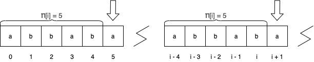
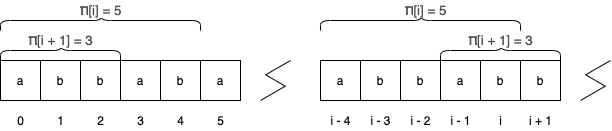

<Resources>
	<Resource source="CPC" title="11 - Strings" url="11_strings">
		String Matching, KMP, Tries
	</Resource>
	<Resource source="CP2" title="6.4 - String Matching" />
</Resources>

# Single String

<Info title="A Note on Notation:">

For a string $S$:
- $|S|$ denotes the size of string $S$
- $S[i]$ denotes the character at index $i$ starting from $0$
- $S[l:r]$ denotes the substring beginning at index $l$ and ending at index $r$
- $S[:r]$ is equivalent to $S[0:r]$, represents the prefix ending at $r$
- $S[l:]$ is equivalent to $S[l:|S| - 1]$, represents the suffix beginning of $l$.
- $S + T$ denotes concactinating $T$ to the end of $S$. Note that this implies that addition is **non-commutative**. 

</Info>

## Knuth-Morris-Pratt Algorithm

<Resources>
	<Resource
		source="cp-algo"
		title="Prefix Function"
		url="string/prefix-function.html"
	 />
	<Resource source="PAPS" title="14.2 - String Matching" />
	<Resource
		source="GFG"
		title="KMP Algorithm"
		url="searching-for-patterns-set-2-kmp-algorithm"
	 />
	<Resource
		source="TC"
		title="String Searching"
		url="introduction-to-string-searching-algorithms"
	 />
</Resources>

Define an array $\pi_S$ of size $|S|$ such that $\pi_S[i]$ is equal to the length of the longest nontrivial suffix of the prefix ending at position $i$ the coincides with a prefix of the entire string. Formally,

$$ 
\pi_S[i] = \max \{k \: | \: 1 \leq k < i \text{ and } S[0:k - 1] \equiv S[i - (k - 1): i] \} 
$$

In other words, for a given index $i$, we would like to compute the length of the longest substring that ends at $i$, such that this string also happens to be a prefix of the *entire* string. One such string that satisfies this criteria is the prefix ending at $i$; we will be disregarding this solution for obvious reasons. 

For instance, for $S = \text{``abcabcd"}$, $\pi_S = [0, 0, 0, 1, 2, 3, 0]$, and the prefix function of $S = \text{``aabaaab"}$ is $\pi_S = [0, 1, 0, 1, 2, 2, 3]$. In the second example, $\pi_S[4] = 2$ because the prefix of length $2$ ($\text{``ab"})$ is equivalent to the substring of length $2$ that ends at index $4$. In the same way, $\pi_S[6] = 3$ because the prefix of length $3$ ($\text{``abb"}$) is equal to the substring of length $3$ that ends at index $6$. For both of these samples, there is no longer substring that satisfies these criterias.

The purpose of the KMP algorithm is to efficiently compute the $\pi_S$ array in linear time. Suppose we have already computed the $\pi_S$ array for indices $0\dots i$, and need to compute the value for index $i + 1$. 

Firstly, note that between $\pi_S[i]$ and $\pi_S[i + 1]$, $\pi_S[i + 1]$ can be at most one greater. This occurs when $S[\pi_S[i]] = S[i + 1]$. 



In the example above, $\pi_S[i] = 5$, meaning that a the suffix of length $5$ is equivalent to a prefix of length $5$ of the entire string. It follows that if the character at position $5$ of the string is equal to the character at position $i + 1$, then the match is simply extended by a single character. Thus, $\pi_S[i + 1] = \pi_S[i] + 1 = 6$.  

In the general case, however, this is not necessarily true. That is to say, $S[\pi_S[i]] \neq S[i + 1]$. Thus, we need to find the largest index $j < \pi_S[i]$ such that the prefix property holds (ie $S[:j - 1] \equiv S[i - j + 1:i]$). For such a length $j$, we repeat the procedure in the first example by comparing characters at indicies $j$ and $i + 1$: if the two are equal, then we can conclude our search and assign $\pi_S[i + 1] = j + 1$, and otherwise, we find the next smallest $j$ and repeat. Indeed, notice that the first example is simply the case where $j$ begins as $\pi_S[i]$. 



In the second example above, we let $j = 2$. 

The only thing that remains is to be able to efficiently find all the $j$ that we might possibly need. To recap, if the position we're currently at is $j$, to handle transitions we need to find the largest index $k$ that satisfies the prefix property $S[:k - 1] \equiv S[j - k + 1 : j]$. Since $j < i$, this value is simply $\pi_S[j - 1]$, a value that has already been computed. All that remains is to handle the case where $j = 0$. If $S[0] = S[i + 1]$, $\pi_S[i + 1] = 1$, otherwise $\pi_S[i + 1] = 0$.

<LanguageSection>

<CPPSection>

```cpp
vector<int> pi(const string &s) {
	int n = (int)s.size();
	vector<int> pi_s(n);
	for (int i = 1, j = 0; i < n; i++) {
		while (j > 0 && s[j] != s[i]) {
			j = pi_s[j - 1]
		}
		if (s[i] == s[j]) {
			j++;
		}
		pi_s[i] = j;
	}
	return pi_s;
}
```

</CPPSection>

</LanguageSection>

**Claim:** The KMP algorithm runs in $\mathcal{O}(n)$ for computing the $\pi_S$ array on a string $S$ of length $n$. 

**Proof:** Note that $j$ doesn't actually change through multiple iterations. This is because on iteration $i$, we assign $j = \pi_S[i - 1]$. However, in the previous iteration, we assign $\pi_S[i - 1]$ to be $j$. Furthermore, note that $j$ is always non-negative. In each iteration of $i$, $j$ is only increased by at most $1$ in the if statement. Since $j$ remains non-negative and is only increased a constant amount per iteration, it follows that $j$ can only decrease by at most $n$ times through all iterations of $i$. Since the inner loop is completely governed by $j$, the overall complexity amortizes to $\mathcal{O}(n)$. $\blacksquare$

### Problems

<Problems problems="KMP" />


## Z Algorithm

The **Z-Algorithm** is another linear time string comparison algorithm like KMP,
but instead finds the longest common prefix of a string and all of its suffixes.

<Resources>
	<Resource
		source="cp-algo"
		title="Z Function"
		url="string/z-function.html"
	 />
	<Resource source="CPH" title="26.4 - Z-algorithm" />
	<Resource source="CF" title="Z Algorithm" url="3107" />
</Resources>

<Problems problems="Z" />

# Palindromes

## Manacher

<FocusProblem problem="manacherFocus" />

**Manacher's Algorithm** functions similarly to the **Z-Algorithm**. It
determines the longest palindrome centered at each character.

<Resources>
	<Resource
		source="HR"
		title="Manacher's Algorithm"
		url="https://www.hackerrank.com/topics/manachers-algorithm"
	 />
	<Resource
		source="CF"
		title="adamant - Manacher's algorithm and code readability"
		url="12143"
		starred
	>
		shorter code
	</Resource>
	<Resource
		source="cp-algo"
		title="Manacher's Algorithm"
		url="string/manacher.html"
	 />
</Resources>

<Info title="Don't Forget!">
	If s[l, r] is a palindrome, then s[l+1, r-1] is as well.
</Info>

<Problems problems="mana" />

## Palindromic Tree

A **Palindromic Tree** is a tree-like data structure that behaves similarly to
KMP. Unlike KMP, in which the only empty state is $0$, the Palindromic Tree has
two empty states: length $0$, and length $-1$. This is because appending a
character to a palindrome increases the length by $2$, meaning a single
character palindrome must have been created from a palindrome of length $-1$

<Resources>
	<Resource source="CF" title="adamant - Palindromic Tree" url="13959" />
	<Resource
		source="adilet.org"
		title="Palindromic Tree"
		url="http://adilet.org/blog/palindromic-tree/"
	/>
</Resources>

<Problems problems="pal" />

# Multiple Strings

## Tries

A **trie** is a tree-like data structure that stores strings. Each node is a
string, and each edge is a character. The root is the empty string, and every
node is represented by the characters along the path from the root to that node.
This means that every prefix of a string is an ancestor of that string's node.

<Resources>
	<Resource source="CPH" title="26.2" />
	<Resource source="CF" title="Algorithm Gym" url="15729" />
	<Resource source="PAPS" title="14.1 - Tries" />
</Resources>

<Problems problems="trie" />

## Aho-Corasick

**Aho-Corasick** is the combination of **trie** and **KMP**. It is essentially a
trie with KMP's "fail" array.

<Warning>

Build the entire trie first, and then run a _BFS_ to construct the fail array.

</Warning>

<Resources>
	<Resource
		source="cp-algo"
		title="Aho Corasick"
		url="string/aho_corasick.html"
	 />
	<Resource source="CF" title="adamant - Aho-Corasick" url="14854" />
	<Resource
		source="GFG"
		title="Aho-Corasick for Pattern Searching"
		url="aho-corasick-algorithm-pattern-searching"
	 />
</Resources>

<Problems problems="aho" />

<IncompleteSection>

1731 Word Combinations -> trie 

1732 Finding Borders -> string search 

1733 Finding Periods -> string search 

1110 Minimal Rotation -> string search 

1111 Longest Palindrome -> string search

1112 Required Substring -> string search

</IncompleteSection>
