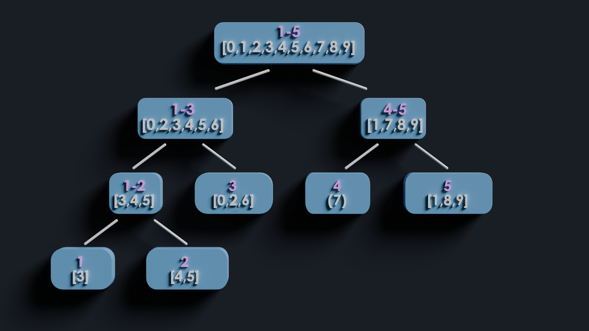

# Wavelet Tree
Wavelet trees are data structures that support efficient queries for the k-th minimum element in a range by maintaining a segment tree over values instead of indices.

<FocusProblem problem="waveletSam" />
<Resources>
	<Resource
		source = "IOI"
		title = "Wavelet Trees for Competitive Programming"
		url = "https://ioinformatics.org/journal/v10_2016_19_37.pdf"
		starred
	>
		Introduces Wavelet Tree
	</Resource>
	<Resource
		source="CF"
		title="Intro to New DS: Wavelet Trees"
		url="52854"
	>
		Link in blog post is broken, check my comment.
	</Resource>
</Resources>

## Wavelet Tree Structure

To answer value-based queries efficiently, we'll create a segment tree where each node represents a range of values, instead of indices. Just like a normal segment tree, each subsequent level splits the range into two halves. Note that an index can appear in at most $\log(M)$ nodes.

#### Wavelet Tree Visualization

Let's say our array is: $[3,5,3,1,2,2,3,4,5,5]$
Each node has an array representing the indices of every number between $l$ and $r$



### Solution - Range K-th Smallest
Before we solve this problem, let's consider a simpler version where we are asked, given a range, to count the number of occurrences of value $x$.

## Given a range $l$, $r$, count the number of occurrences of value x.

To calculate the number of occurrences from $𝑙$ to $𝑟$, we can use the following
formula:

$$
\begin{aligned}
\texttt{occurrences}(l, r) = \texttt{occurrences}(r) - \texttt{occurrences}(l)
\end{aligned}
$$
When $\texttt{occurrences}(y)$ is the number of occurences of x in the first y elements.
aka
$$
\text{occurrences} = \sum_{i=1}^{y} \mathbb{1}(x_i = x)
$$

This reduces the problem to counting the number of occurrences in a prefix.

One way to solve the problem is to go to the leaf node
and perform a binary search for the number of indices less than $𝑟$
However, let's explore a different approach that can also be extended to the
second type of query.

Instead of binary searching on the leaf, we update $𝑟$ as we recurse down the
tree.
If we can determine the position (index) of $r$ in the left and right children of a node, we can recurse down the tree and determine its position in the leaf node.

To find the position of $𝑟$ in a node's left and right children, we need to
determine how many indices are smaller than the middle value (mid) and precede
$𝑟$.
This can be done using a prefix sum.

Let's define:
- $c[i]$ = as $1$ if $\texttt{index}$[$i$] is smaller than mid otherwise $0$
- $\texttt{prefix\_b}$[$i$] as prefix sum of $c[i]$

Formally

$$
c[i] = \begin{cases}
    1, & \texttt{if } \texttt{index}[i] < \texttt{mid} \\
    0, & \texttt{otherwise}
\end{cases}
$$
$$
\texttt{prefix\_b}[i] = \texttt{prefix\_b}[i - 1] + c[i]
$$


To update $r$ as we recurse down, we do the following:
- To know the value of $r$ if we recurse left, we use $\texttt{prefix\_b}$[$r$]
- If we recurse right, we use $r$ - $\texttt{prefix\_b}$[$r$]

Now let's try to solve our main problem.
## Given a range $l$, $r$ find the k-th smallest element

We will determine whether the answer for a given node is in the left or the
right segment.
We can calculate how many times the elements within the segments' ranges appear
in our range $(l, r)$ using our first type of query.
Note that this also works for non-leaf nodes using the following formula:

$$
\texttt{occurrences}(l, r) = r - l
$$
<Info title="Similar">
This is similar to counting how many times a value appears up to index $r$ in our previous query. We did this by using the new $r$ value at the leaf node. But now, we consider the difference between the updated $r$ and $l$
</Info>

Therefore, the occurrences of the left node are

$$
\texttt{left\_occurrences} = \texttt{prefix\_b}[r] - \texttt{prefix\_b}[l]
$$

Note that $\texttt{left\_occurrences}$ is the number of indices between $l$ and $r$ whose value is less than $\texttt{mid}$

- If $\texttt{left\_occurrences}$ is greater or equal to $k$, it means the $k$-th smallest element is in
  the left subtree. Therefore, we update our range and recurse into the left
  child
- If $\texttt{left\_occurrences}$ is less than $k$, it means the
  $k$-th smallest element is in the right subtree. We adjust k by subtracting
  $\texttt{left\_occurrences}$ from $k$, update our range, and recurse into the right child

<Info title="Notice">
  Notice we still update $l, r$ accordingly when we go left or right
</Info>

The answer then will be the value of the node we end up on (leaf).

In conclusion we maintain our ranges l and r as we recurse down to our child, and when we reach the child node we can return $r$ - $l$.

## Implementation
**Time Complexity:** $\mathcal{O}(Q \cdot \log(M))$

<LanguageSection>
<CPPSection>

```cpp
#include <bits/stdc++.h>

using namespace std;
constexpr int MAX_VAL = 1e9 + 2;

struct Segment {
	Segment *left = nullptr, *right = nullptr;
	int l, r, mid;
	bool children = false;
	vector<pair<int, int>> indices;  // index, value
	vector<int> prefix_b;

	Segment(int l, int r, const vector<pair<int, int>> &indices)
	    : l(l), r(r), mid((r + l) / 2), indices(indices) {

		// Calculate the prefix B
		int i = 1;
		int j = 0;
		prefix_b.resize(indices.size() + 1);
		for (auto [ind, val] : indices) {
			if (val < mid) j++;
			prefix_b[i++] = j;
		}
	}

	// Sparse since values can go up to 1e9
	void update() {
		if (children) { return; }
		children = true;
		if (r - l > 1) {
			// Split the indices for left and right child
			vector<pair<int, int>> leftIndices, rightIndices;
			partition_copy(indices.begin(), indices.end(), leftIndices.begin(),
			               rightIndices.begin(), [this](const pair<int, int> &elem) {
				               return elem.second < mid;
			               });

			left = new Segment(l, mid, leftIndices);
			right = new Segment(mid, r, rightIndices);
		}
	}

	int find_k_smallest(int a, int b, int k) {
		update();
		if (r - l <= 1) { return l; }

		int lb = prefix_b[a];
		int lr = prefix_b[b];
		int inLeft = lr - lb;  // Amount of values in range (a,b) that are less the mid

		if (k <= inLeft) {
			return left->find_k_smallest(lb, lr, k);  // Appears in left
		} else {
			return right->find_k_smallest(a - lb, b - lr,
			                              k - inLeft);  // Appears in right
		}
	}
};

int main() {
	int n, q;
	cin >> n >> q;

	vector<pair<int, int>> indices;
	for (int i = 0; i < n; ++i) {
		int v;
		cin >> v;
		indices.emplace_back(i, v);
	}
	Segment seg(0, MAX_VAL, indices);

	for (int i = 0; i < q; ++i) {
		int a, b, k;
		cin >> a >> b >> k;
		k++;
		cout << seg.find_k_smallest(a, b, k) << " ";
	}
}
```
</CPPSection>
</LanguageSection>


## Supporting updates
Let's support updates that change the value at index $i$ to $y$.

We can traverse down to the leaf to remove the old element and also traverse down to add the new element.

Let's first solve for adding a new element; erasing is similar but the opposite.

So what do the updates change?

- Our indices vector
- Our prefix vector
At each step of our recursion, the indices vector will need to be modified; we need to insert the new index. Since we can no longer maintain a sorted vector of the indices, we will switch to a set.

On the other hand, to change the prefix vector, since each update could change our prefix vector a lot, we can't maintain just the normal vector. What we could do is use a sparse segment tree.
	- erasing and inserting can be done by just setting the value to $0$ or $1$ at the specific index
	- querying for a prefix can be done by querying the segment tree from $0$ to $i$
This approach is not memory efficient and requires a segment tree's implementation.
A more friendly approach would be using an order statistics tree, which is a binary search tree implementation in C++ that allows efficient queries for the rank of elements in a set. Querying for a prefix would then be equivalent to $\texttt{order\_of\_key}$($i$).
## Implemention
**Time Complexity:** $\mathcal{O}(Q \cdot \log(M) \cdot \log(N))$

<LanguageSection>
<CPPSection>
```cpp
#include <bits/stdc++.h>

using namespace std;

#include <ext/pb_ds/assoc_container.hpp>
using namespace __gnu_pbds;
template <class T>
using Tree =
        tree<T, null_type, less<T>, rb_tree_tag, tree_order_statistics_node_update>;

struct Segment {
    Segment *left = nullptr, *right = nullptr;
    int l, r, mid;
    bool children = false;
    Tree<pair<int,int>> indices; // index, value

    Segment(int l, int r,const Tree<pair<int,int>> &indices) :l(l), r(r), mid((r + l) / 2), indices(indices) {

    }

    // Sparse since values can go up to 1e9
    void update() {
        if (children) {return;}
        children = true;

        if (r - l > 1) {
            // Split the indices for left and right child
            Tree<pair<int, int>> leftIndices, rightIndices;
            for (auto [index, value] : indices) {
                if (value < mid)
                    leftIndices.insert({index, value});
                else
                    rightIndices.insert({index, value});
            }

            left = new Segment(l,mid, leftIndices);
            right = new Segment(mid,r, rightIndices);
        }
    }

    int find_k_smallest(int a, int b, int k) {
        update();
        if (r - l <= 1) return l;

        int lb = left->indices.order_of_key({a, -1});
        int lr = left->indices.order_of_key({b, -1});
        int inLeft = lr - lb;

        if (k <= inLeft)
            return left->find_k_smallest(a,b,k); // Appears in left
        else
            return right->find_k_smallest(a,b, k - inLeft); // Appears in right
    }

    void update(int index, int v, int old_v) {
        update(old_v, index, false);
        update(v, index, true);
    }

    void update(int v, int index, bool insert_operation) {
        if (insert_operation) indices.insert({index, v});
        else indices.erase({index, v});

        update();
        if (r - l <= 1) return;

        if (v < mid)
            left->update(v, index, insert_operation);
        else
            right->update(v, index, insert_operation);
    }
};


int main() {
    int n, q; cin >> n >> q;

    Tree<pair<int,int>> indices;
    for (int i = 0; i < n; ++i) {
        indices.insert({i,0});
    }

    Segment seg(0,1e9 + 2,indices);
    vector<int> arr(n);

    for (int i = 0; i < n; ++i) {
        int v; cin >> v;
        seg.update(i, v, arr[i]);
        arr[i] =v;
    }

    for (int i = 0; i < q; ++i) {
        int t; cin >> t;
        if (t == 1) {
            int a, b, k; cin >> a >> b >> k;
            k++;
            cout << seg.find_k_smallest(a,b,k) << " ";
        } else {
            int a, b; cin >> a >> b;
            seg.update(a, b, arr[i]);
            arr[i] = b;
        }
    }

    return 0;
}

```

</CPPSection>
</LanguageSection>

### Problems

<Problems problems="wavelet" />
