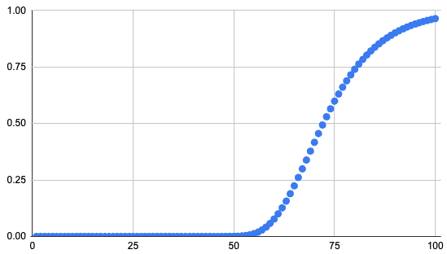

<Resources>
	<Resource
		source="CF"
		title="Randomized algorithms lecture, part 1 & 2"
		url="https://codeforces.com/blog/entry/71097"
	>
	</Resource>
	<Resource
		source="CF"
		title="Randomized Algorithms and Online Judges"
		url="https://codeforces.com/blog/entry/84215"
	>
	</Resource>
	<Resource
		source="Petr"
		title="Random problems"
		url="https://blog.mitrichev.ch/2016/07/random-problems.html"
	>
	</Resource>

</Resources>

Sometimes, we can use randomized algorithms to solve tasks quite difficult for deterministic algorithms.

## Example - Ghd

<FocusProblem problem="ghd" />

Let the answer be $k$. The key observation for this problem is that a randomly selected integer in $a$ has at least a $\frac{1}{2}$ chance to be divisible by $k$.

Thus, we can repeat the following procedure $S$ times to find the optimal answer with probability $1-\frac{1}{2^S}$:

- Let $x$ be a randomly selected value in $a$.
- For each divisor $d \mid x$, determine how many numbers $d$ divides into in $a$.
- Take our answer to be the maximum of all $d$ such that $\geq \frac{n}{2}$ numbers in $a$ are divisible by $d$

If we take $S = 15$, and estimate the number of testcases in Codeforces to be $500$, our probability of success is $(1-\frac{1}{2^{15}})^{500} \approx .984$, which is acceptable.

### Implementation

Our approach has a time complexity of $\mathcal{O}\left(S \cdot \left(N\log A + d(A)^2 + \sqrt{A}\right)\right)$
, with the log factor occurring due to GCD computation, and the sqrt due to factoring.

```cpp
#include <bits/stdc++.h>
using namespace std;

const int MAX_N = 1e6 + 5;
const int S = 15;

mt19937 rng(chrono::steady_clock::now().time_since_epoch().count());
long long a[MAX_N], dv[MAX_N], cnt[MAX_N];

int main() {
	ios::sync_with_stdio(false);
	cin.tie(nullptr);

	int n;
	cin >> n;
	for (int i = 0; i < n; i++) cin >> a[i];

	long long ans = 0;
	for (int s = 0; s < S; s++) {
		long long x = a[rng() % n];
		int ind = 0;
		for (int d = 1; 1ll * d * d <= x; d++) {
			if (x % d == 0) {
				dv[ind++] = d;
				if (d * d != x) dv[ind++] = x / d;
			}
		}

		sort(dv, dv + ind);
		fill(cnt, cnt + ind, 0);

		for (int i = 0; i < n; i++) cnt[lower_bound(dv, dv + ind, gcd(a[i], x)) - dv]++;

		for (int i = 0; i < ind; i++)
			for (int j = 0; j < i; j++)
				if (dv[i] % dv[j] == 0) cnt[j] += cnt[i];

		for (int i = 0; i < ind; i++)
			if (cnt[i] + cnt[i] >= n) ans = max(ans, dv[i]);
	}

	cout << ans << '\n';
}
```

## Example - Count on a Tree II Striking Back

<FocusProblem problem="coat2sb" />

Trying to solve this problem directly - explicitly finding values for $f(a,b)$ and $f(c,d)$ - is quite difficult. Supporting online queries of range count distinct along with updates is quite difficult to achieve on an array in reasonable complexity, and the fact that this problem occurs on a tree, with relative large bound for $n \leq 500$ $000$ makes it clear that solving for the value of $f$ is not intended.

Instead, we can attempt to use the property given in the statement that either $f(a,b) \geq 2f(c,d)$ or $f(c,d) \geq 2f(a,b)$. This inspires the following thought - if we map each color to a random number, the path minimum along the path with more distinct colors will *probably* be a smaller value.

We attempt to formalize this approach, and push the probability to an acceptable bound. Notably, the probability of failure is too high when we do the aforementioned random process once. To remedy this, we proceed as follows:

- First we fix $S$ to be the number of "simulations" that we run.
- Next, for each possible color $1 \leq c \leq n$, we define $v_{cj}$ as an independent random value within $[0,1]$, for each $1 \leq j \leq S$.
- Then, we construct $S$ trees $T_i$, of the same structure as the initial tree, but with $v_{c_u i}$ marked on a node $u$.
- For each query comparing $a,b,c,d$, we output $\texttt{Yes}$ if
$$
\sum_{i\leq S} \text{PathMin}(T_i,a,b) < \sum_{i\leq S} \text{PathMin}(T_i,c,d)
$$
and $\texttt{No}$ otherwise.

This approach should "combine" the probabilities in a way that makes the more likely event (the path with more distinct values achieving a smaller value) exponentially more likely. For some intuition on this, if we flip a coin weighted with $\frac{2}{3}$ probability to be heads once, there is a $\frac{1}{3}$ probability it comes up tails more than heads. However, if we flip it $99$ times, the probability it comes up more tails more than heads becomes

$$
\sum_{k=50}^{99} \binom{99}{k} \left(\frac{1}{3}\right)^k \left(\frac{2}{3}\right)^{99-k} \approx .000309
$$

Calculating the exact probability that our approach works is more difficult than the coin toss example, but follows the same principle of failure becoming exponentially more unlikely across several trials. We can use some assumptions (notably the central limit theorem) to calculate a rough approximation of the probability of success. Here is a graph of the probability of passing the problem given a certain value of $S$. Note that the probability of success remains is largely the same across different counts of distinct colors along the path.



The graph was generated for the probability of answering $4\cdot10^4$ queries correctly in a row. This assumption is reasonable because the test data consists of only 1 large test case.

The python code used to generate the estimates is shown below:

```py
import math
from scipy.stats import norm


def clt_probability(k, S):
	"""
	Computes the probability that the sum of S minima from 2k random draws
	is less than the sum of S minima from k random draws, as approximated by the CLT.

	The CLT approximation is given by:

	   P(B<A) ≈ Φ(  (sqrt(S) * [k/((k+1)(2k+1)]) ) / sqrt( k/((k+1)^2(k+2)) + 2k/((2k+1)^2(2k+2)) ) )

	:param k: The number of draws for each minimum:
			- The first group uses k draws.
	            	- The second group uses 2k draws.
	:param S: The number of independent trials (sums over S minima).
	:return: The approximated probability that the sum of the minima
		 from 2k draws is less than that from k draws.
	"""
	numerator = math.sqrt(S) * k / ((k + 1) * (2 * k + 1))

	var_X = k / (((k + 1) ** 2) * (k + 2))
	var_Y = 2 * k / (((2 * k + 1) ** 2) * (2 * k + 2))

	denominator = math.sqrt(var_X + var_Y)

	z_score = numerator / denominator

	probability = norm.cdf(z_score)

	return probability
```

### Implementation

By supporting path queries with HLD, we can solve this problem in $\mathcal{O}(S\cdot(n + m\log^2n))$.

```cpp
#include "bits/stdc++.h"
using namespace std;

using us = unsigned short;

const int MAX_N = 5e5 + 1;
const int S = 150;
const us INF = 65535;

us va[MAX_N][S];
int n, m, c[MAX_N];

namespace SGT {
const int L = 1 << 19;
us seg[2 * L][S];

void build() {
	for (int i = L - 1; i; i--) {
		for (int j = 0; j < S; j++) {
			seg[i][j] = min(seg[2 * i][j], seg[2 * i + 1][j]);
		}
	}
}

void point_update(int idx, int v) {
	int pos = L + idx;
	for (int j = 0; j < S; j++) { seg[pos][j] = va[v][j]; }
	pos /= 2;
	while (pos) {
		int left = pos * 2, right = left + 1;
		for (int j = 0; j < S; j++) { seg[pos][j] = min(seg[left][j], seg[right][j]); }
		pos /= 2;
	}
}

inline us range_min(int l, int r, int j) {
	us res = INF;
	for (l += L, r += L + 1; l < r; l /= 2, r /= 2) {
		if (l & 1) res = min(res, seg[l++][j]);
		if (r & 1) res = min(res, seg[--r][j]);
	}
	return res;
}
}  // namespace SGT

namespace HLD {
const int MAX_N = 5e5 + 1;
int f[MAX_N], depth[MAX_N], heavy[MAX_N], head[MAX_N], pos[MAX_N], cp = 0;
vector<int> adj[MAX_N];

void clear(int n) {
	for (int i = 0; i < n; i++) { adj[i].clear(); }
	cp = 0;
}

void add_edge(int u, int v) {
	adj[u].push_back(v);
	adj[v].push_back(u);
}

int dfs(int v) {
	int sz = 1, msz = 0;
	for (int nxt : adj[v]) {
		if (nxt != f[v]) {
			f[nxt] = v;
			depth[nxt] = depth[v] + 1;

			int csz = dfs(nxt);
			sz += csz;
			if (csz > msz) {
				msz = csz;
				heavy[v] = nxt;
			}
		}
	}

	return sz;
}

void decompose(int v, int h) {
	head[v] = h;
	pos[v] = cp++;
	for (int j = 0; j < S; j++) SGT::seg[SGT::L + pos[v]][j] = va[c[v]][j];
	if (heavy[v] != -1) decompose(heavy[v], h);
	for (int nxt : adj[v]) {
		if (nxt == f[v] || nxt == heavy[v]) continue;
		decompose(nxt, nxt);
	}
}

inline void init() {
	memset(heavy, -1, sizeof(heavy));
	dfs(0);
	decompose(0, 0);
}

us path_min(int a, int b, int j) {
	us res = INF;
	while (head[a] != head[b]) {
		if (depth[head[a]] > depth[head[b]]) swap(a, b);
		res = min(res, SGT::range_min(pos[head[b]], pos[b], j));
		b = f[head[b]];
	}

	if (depth[a] > depth[b]) swap(a, b);
	res = min(res, SGT::range_min(pos[a], pos[b], j));
	return res;
}
}  // namespace HLD

void solve() {
	cin >> n >> m;
	for (int i = 0; i < n; i++) cin >> c[i];
	HLD::clear(n);
	for (int i = 1; i < n; i++) {
		int u, v;
		cin >> u >> v;
		u--, v--;
		HLD::add_edge(u, v);
	}

	HLD::init();
	SGT::build();

	int cnt = 0;
	for (int i = 0; i < m; i++) {
		int tp;
		cin >> tp;
		if (tp == 1) {
			int x, y;
			cin >> x >> y;
			x ^= cnt;
			y ^= cnt;
			SGT::point_update(HLD::pos[x - 1], y);
		} else {
			int a, b, cc, d;
			cin >> a >> b >> cc >> d;
			a ^= cnt, b ^= cnt, cc ^= cnt, d ^= cnt;
			a--, b--, cc--, d--;

			long long c1 = 0, c2 = 0;
			for (int j = 0; j < S; j++) {
				c1 += HLD::path_min(a, b, j);
				c2 += HLD::path_min(cc, d, j);
			}

			if (c1 < c2) {
				cnt++;
				cout << "Yes\n";
			} else {
				cout << "No\n";
			}
		}
	}
}

int main() {
	ios::sync_with_stdio(false);
	cin.tie(nullptr);

	mt19937 rng(1434);
	for (int i = 1; i < MAX_N; i++) {
		for (int j = 0; j < S; j++) { va[i][j] = rng() % (INF + 1); }
	}

	int test_num;
	cin >> test_num;
	for (int t = 0; t < test_num; t++) { solve(); }
}
```

## Problems

Some of the listed problems do not require random algorithms as a solution, but can be made significantly easier through using random algorithms.

<Problems problems="general" />
