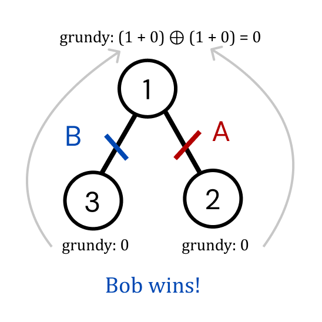

[Official Editorial (Japanese)](https://atcoder.jp/contests/agc017/editorial)

## Explanation

Since the game in the problem seems similar to Nim, let's try to use Sprague-Grundy numbers.

To solve the problem, for a certain root with subtrees, $s_1, s_2, ..., s_k$, we can try to convert all these subtrees into a stack of some size.
Then, by xoring all these stack sizes (like we do in Nim), we can tell whether we win or lose on this tree.

To compute the size of the stack for a subtree, we can recursively solve the problem.
For a subtree with $1$ node, the size of the stack will be $0$ because there are no edges that can be deleted.

If the grundy value of the root is positive, then Alice wins, otherwise if the grundy value of the root is $0$, Bob wins.

Notice that when we get the grundy numbers for each subtree we need to add $1$ to all of them before xoring.
This is because each stack's size increases by $1$ when you consider the edge from the root of $s_i$ to the root of the entire tree.

For example consider the tree:



For the subtrees rooted at $2$ and $3$, the grundy values will be $0$.
For the tree rooted at $1$, the grundy value will be $(1 + 0) \oplus (1 + 0) = 0$.
This makes sense because whichever edge that Alice chooses, Bob can choose the other one leaving Alice with no edge to delete and she will lose.

## Implementation

**Time Complexity:** $\mathcal{O}(N)$

<LanguageSection>
<CPPSection>

```cpp
#include <functional>
#include <iostream>
#include <vector>

using namespace std;

int main() {
	int n;
	cin >> n;
	vector<vector<int>> g(n + 1);
	for (int i = 0; i < n - 1; i++) {
		int u, v;
		cin >> u >> v;
		g[u].push_back(v);
		g[v].push_back(u);
	}

	function<int(int, int)> dfs = [&](int u, int p) {
		int sg = 0;
		for (int v : g[u]) {
			if (v ^ p) {
				/*
				 * Adding 1 because the edge from u to v increases the size of
				 * each stack by 1
				 */
				sg ^= dfs(v, u) + 1;
			}
		}
		return sg;
	};

	cout << (dfs(1, 0) ? "Alice" : "Bob") << endl;
}
```

</CPPSection>
<PySection>

<Warning>

The below solution only works when you submit with PyPy.
Submitting with normal Python will result in MLE.

</Warning>

```py
import sys, pypyjit

# improves performance for deeply recursive functions by allowing PyPy to skip unrolling
pypyjit.set_param("max_unroll_recursion=-1")

sys.setrecursionlimit(10**7)


def dfs(u: int, p: int) -> int:
	sg = 0
	for v in g[u]:
		if v != p:
			# Adding 1 because the edge from u to v increases the size of
			# each stack by 1
			sg ^= dfs(v, u) + 1

	return sg


n = int(input())
g = [[] for _ in range(n + 1)]

for _ in range(n - 1):
	u, v = map(int, input().split())
	g[u].append(v)
	g[v].append(u)

print("Alice" if dfs(1, 0) else "Bob")
```

</PySection>
</LanguageSection>
