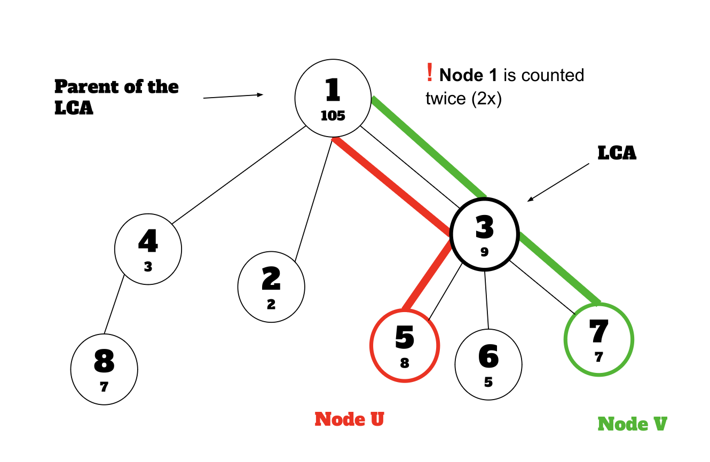

## Explanation

In this code, a persistent segment tree is built for each node in the tree by creating a new version based on its parent’s segment tree.

First, a persistent segment tree for the root node, which shows the frequency of the values encountered, is built. We set all of the values of this tree to zeros. To incorporate the value of the current node, we create a new version of the segment tree by adding nodes to the parent’s tree and incrementing the segment tree node corresponding to the current node’s value. We store the root node of the new version of the tree for future reference. This way, we don't need to build a completely new tree and modify only the necessary nodes while reusing the unchanged parts.

Each persistent segment tree keeps the frequency of numbers on the way from the root of the tree given in the input to itself. When asked for the kth minimum node in the path of $u$ to $v$, the code first determines the lowest common ancestor (LCA) of the tree in the input using binary lifting. Next, we run a binary search using the frequency values from the persistent segment tree versions of four nodes: $u$, $v$, the LCA, and the parent of the LCA.

Since the values that are not on the path of $u$ and $v$, but on the path from the root node to the nodes $u$ and $v$ are also counted in their persistent segment trees, just considering their persistent segment trees would produce the wrong results.



### Handling Overcounting

We subtract the frequencies of nodes from the root node to the LCA and its parent because we count the nodes twice from the root node to the LCA. In addition, since the LCA is on the path of $u$ to $v$, we subtract the frequencies from the LCA and the parent of the LCA to consider the value of the LCA.

$$
\texttt{leftCountFromUToV} = \texttt{leftCount}[u]+\texttt{leftCount}[v]−\texttt{leftCount}[\texttt{LCA}]−\texttt{leftCount}[\texttt{parentOfLCA}]
$$

This formula tracks the frequencies of values in the left subtree of the persistent segment tree along the path from $u$ to $v$.

<Info>

Value compression is used to effectively handle large numbers.

</Info>

## Implementation

**Time Complexity:** $\mathcal{O}((N+M) \cdot \log{N})$

<LanguageSection>
<CPPSection>

```cpp
#include <bits/stdc++.h>
using namespace std;
int timer = 0;
const int MAX_NODES_GRAPH = 1e5;

struct PersistentSegmentTree {
	static const int MAX_NODES_TREE = 2e6;
	int left_child[MAX_NODES_TREE + 1];
	int right_child[MAX_NODES_TREE + 1];
	int frequency[MAX_NODES_TREE + 1];
	int nxt = 1;

	/**
	 * Updates the tree at a given position by incrementing the frequency of the
	 * specific number added. It creates new nodes for every segment along
	 * the path from the root to the target position, preserving the
	 * previous version of the tree while modifying only the necessary parts.
	 */
	int update(int prev_node, int left, int right, int index) {
		// Create a new node for the updated tree version
		int new_node = ++nxt;

		if (left == right) {
			// At leaf, increment the value at position 'pos'
			frequency[new_node] = frequency[prev_node] + 1;
			return new_node;
		}
		// Copy left child from the previous version
		left_child[new_node] = left_child[prev_node];

		// Copy right child from the previous version
		right_child[new_node] = right_child[prev_node];
		int middle = (left + right) / 2;

		// Update the left or right child based on the position
		if (index <= middle) {
			left_child[new_node] = update(left_child[prev_node], left, middle, index);
		} else {
			right_child[new_node] =
			    update(right_child[prev_node], middle + 1, right, index);
		}

		// Update the current node's value by combining the values of its children
		frequency[new_node] =
		    frequency[left_child[new_node]] + frequency[right_child[new_node]];
		return new_node;
	}

	int get_kth_smallest(int a, int b, int anc, int pr, int l, int r, int k) {
		// If we've reached a leaf, return the current position
		if (l == r) { return l; }

		int m = (l + r) / 2;

		// Calculate the number of elements in the left child of the current range
		int left_subtree_count = frequency[left_child[a]] + frequency[left_child[b]] -
		                         frequency[left_child[anc]] - frequency[left_child[pr]];

		if (left_subtree_count >= k) {
			return get_kth_smallest(left_child[a], left_child[b], left_child[anc],
			                        left_child[pr], l, m, k);
		} else {
			return get_kth_smallest(right_child[a], right_child[b], right_child[anc],
			                        right_child[pr], m + 1, r, k - left_subtree_count);
		}
	}
};

PersistentSegmentTree pst;

struct Tree {
	int LOG;
	int roots[MAX_NODES_GRAPH + 1];
	int tin[MAX_NODES_GRAPH + 1];
	int tout[MAX_NODES_GRAPH + 1];
	int val[MAX_NODES_GRAPH + 1];
	vector<vector<int>> up;
	vector<int> graph[MAX_NODES_GRAPH + 1];

	Tree(int n) {
		LOG = ceil(log2(n));
		up.assign(n + 1, vector<int>(LOG + 1, 0));
	}

	void dfs(int from, int p) {
		int root = roots[p];
		root = pst.update(root, 1, MAX_NODES_GRAPH, val[from]);

		roots[from] = root;
		tin[from] = ++timer;

		// Set parent of the node
		if (from != 1) {
			up[from][0] = p;
		} else {
			up[from][0] = from;
		}

		// Precompute ancestors at each level
		for (int i = 1; i < LOG; i++) { up[from][i] = up[up[from][i - 1]][i - 1]; }

		for (int to : graph[from]) {
			if (to == p) continue;
			dfs(to, from);
		}
		tout[from] = timer;
	}

	// Checks if u is ancestor of v
	bool is_ancestor(int u, int v) { return tin[u] <= tin[v] && tout[u] >= tout[v]; }

	// Finds the lowest common ancestor (LCA) of u and v
	int lca(int u, int v) {
		if (is_ancestor(u, v)) { return u; }
		if (is_ancestor(v, u)) { return v; }

		// Traverse ancestors of 'u' from highest to lowest level
		for (int i = LOG - 1; i >= 0; i--) {
			// Skip if up[u][i] is an ancestor of v, otherwise update u
			if (is_ancestor(up[u][i], v)) { continue; }
			u = up[u][i];
		}
		return up[u][0];
	}
};

int main() {
	int n, m;
	cin >> n >> m;
	Tree g(n);

	vector<int> compr;
	compr.push_back(-INT_MAX);

	for (int i = 1; i <= n; i++) {
		cin >> g.val[i];
		compr.push_back(g.val[i]);
	}

	// Sort for compression
	sort(compr.begin(), compr.end());
	compr.resize(unique(compr.begin(), compr.end()) - compr.begin());

	// Map original values to compressed values
	for (int i = 1; i <= n; i++) {
		g.val[i] = lower_bound(compr.begin(), compr.end(), g.val[i]) - compr.begin();
	}

	// Build the graph
	for (int i = 1; i < n; i++) {
		int a, b;
		cin >> a >> b;
		g.graph[a].push_back(b);
		g.graph[b].push_back(a);
	}

	g.roots[0] = ++timer;
	g.dfs(1, 0);

	// Process each query
	for (int i = 0; i < m; i++) {
		int a, b, k;
		cin >> a >> b >> k;
		// Find LCA of a and b
		int common = g.lca(a, b);

		// Find the parent of the common ancestor
		int pr = (common == 1) ? 0 : g.up[common][0];

		int num = pst.get_kth_smallest(g.roots[a], g.roots[b], g.roots[common],
		                               g.roots[pr], 1, MAX_NODES_GRAPH, k);
		cout << compr[num] << '\n';
	}
}
```

</CPPSection>
</LanguageSection>
