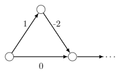

## Part 1 - shortest-path algorithms

In this subproblem, we're asked to create test cases that break certain
shortest-path algorithms through TLE.

This is very educational because it forces you to analyze the bottlenecks of
these algorithms and how exactly they work.

### Subtasks 1 and 3 - breaking Floyd-Warshall

The Floyd-Warshall algorithm always uses exactly $V^3$ iterations.

This means we can simply set $V$ to 101 and $E$ to 0 to force TLE.

#### Code

```py
print(101) # Generate the graph
for i in range(101):
	print(0)

print(1) # Single query
print(0, 1)
```

### Subtasks 2 and 5 - breaking Bellman-Ford

The Bellman-Ford algorithm normally uses exactly $E(V - 1)$ iterations, but in
this case, it's slightly optimized.

However, we can still force the algorithm to use exactly $E(V - 1)$ iterations.

Firstly, note that we must have $E \geq V$ or else the algorithm will break
early.

If we look at the implementation of this specific Bellman-Ford algorithm, note
that we "relax" edges connected to node 1, then node 2, etc.

This means that if we have a straight line from node $V - 1$ to node 0 (and no
other edges), then only 1 edge will be relaxed per loop!

We can also add some self-edges (with positive weights) from node 0 to itself to
increase $E$ without triggering an early break, since it's never optimal to go
from a node to itself via a self-edge.

$(V, E) = (100, 1100)$ for subtask 2 and $(V, E) = (300, 347)$ for subtask 5 let
us force TLE.

#### Code

```py
print(300) # Change (300, 48) to (100, 1011) for subtask 2
print(48, end=' ')
for i in range(48):
	print(0, 1, end=' ') # Self edges
print()
for i in range(1, 300):
	print(1, i - 1, 1)

print(10) # 10 queries
for i in range(10):
	print(299, 0)
```

### Subtasks 4 and 6 - breaking Dijkstra

At first glance, these subtasks seem impossible - Dijkstra's algorithm always
has a complexity of $\mathcal{O}(E \log V)$!

... or does it?

Note that the $\mathcal{O}(E \log V)$ complexity is only true if there are no
negative edges.

What happens when we have negative edges in the graph? Consider the following
construction:



If there were no negative edges, then we'd only iterate through the edges
connected to the rightmost node once.

However, notice how in the above construction, we will iterate through those
edges twice.

This means that if we chain $N$ of those triangles together, then Dijkstra's
algorithm will use $2^N$ iterations - far more than the expected $V \log E$!

Using 16 triangles, we are able to force TLE.

#### Code

```py
print(33)
print(0)
print(1, 0, 1)
print(1, 1, 1)
for i in range(2, 31, 2):
	print(1, i, -2 * (2**(i//2)))
	print(2, i + 1, 2**(i//2), i, 0)

print(7)
for i in range(7):
	print(32, 0)
```

## Part 2 - the "mystery" problem

### Subtask 7 - forcing TLE

<IncompleteSection />

#### Code

```py
print(250, 1501)
for i in range(300):
	for j in range(i + 1, 250, i + 1):
		print(i, j)
for i in range(88):
	print(1, 2 * i + 3)
```

### Subtask 8 - forcing not TLE

<IncompleteSection />

#### Code

```py
print(753, 1501)
for i in range(1, 752):
	if i != 1:
		print(0, i)
	print(i, 752)
```

<LanguageSection>

<CPPSection>

## Solution: Subtasks 1-6

```cpp
int main() {
	FOR(TC,1,7) {
		setOut("apio-2013-taskauthor_"+ts(TC)+".out");
		int V;
		vpi adj[300];
		vpi query;
		if (TC == 1 || TC == 3) {
			V = 101;
			query.pb({0,0});
		} else if (TC == 2) {
			V = 100;
			F0R(i,V-1) adj[i+1].pb({i,-1});
			F0R(i,950) adj[0].pb({1,1000});
			F0R(Q,10) query.pb({V-1,0});
		} else if (TC == 5) {
			V = 300;
			F0R(i,V-1) adj[i+1].pb({i,-1});
			F0R(i,40) adj[0].pb({1,1000});
			F0R(Q,10) query.pb({V-1,0});
		} else if (TC == 4 || TC == 6) {
			V = 33; // 1+V+(V/2)*6+1+6*2
			int wei = 999999;
			for (int i = 0; i < V-1; i += 2) {
				adj[i].pb({i+2,-1});
				adj[i].pb({i+1,0});
				adj[i+1].pb({i+2,-wei});
				wei /= 2;
			}
			F0R(i,6) query.pb({0,V-1});
		}
		ps(V);
		F0R(i,V) {
			pr(sz(adj[i]));
			trav(t,adj[i]) pr(' ',t.f,' ',t.s);
			ps();
		}
		ps(sz(query));
		trav(t,query) ps(t.f,t.s);
	}
}
```

</CPPSection>

<JavaSection>

</JavaSection>

<PySection>

</PySection>

</LanguageSection>
