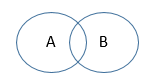
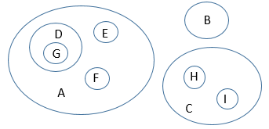
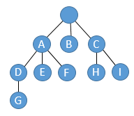

## Video Solution

<YouTube id="4YTijr0BbrA" />

<Spoiler title="Hint">

Try to construct a minimal set of cows that can't form a valid evolutionary tree.
How can we generalize to different trees?

</Spoiler>

<Spoiler title="Solution">

[Official Analysis (C++)](http://www.usaco.org/current/data/sol_evolution_bronze_open19.html)

## Explanation

First, it may help to think of an instance where we cannot form a proper evolutionary tree.
This would be an instance such that no matter how we form the tree, it would be inevitable that some characteristic would evolve in two distinct places in the tree.
It turns out that the minimal such bad example looks like this:

$$
\begin{align*}
&\texttt{population1: A } \\
&\texttt{population2: B } \\
&\texttt{population3: A B}
\end{align*}
$$

In other words, we have a population with just trait $A$, a population with just trait $B$, and a population with both.
If we want to build a tree out of this input, we would need to split on either $A$ or $B$ at the root, but then the remaining two subtrees would both need to have an edge that adds the other characteristic.
For example, if the root split into "$A$" and "not $A$" branches, then both branches would need to contain an edge that adds the $B$ trait.

It will help to actually look at things from the viewpoint of the characteristics instead of from the viewpoint of the populations, so let's "transpose" the input above:

$$
\begin{align*}
\texttt{A: population1 population3} \\
\texttt{B: population2 population3}
\end{align*}
$$

The fundamental problem here is that there are populations in $A$ only, populations in $B$ only, and populations in both $A$ and $B$.
If we look at the Venn diagram for the sets $A$ and $B$, the picture therefore looks like this:



Let's call this situation a "crossing" pair of sets.
In general, two sets can be disjoint (no overlap), nesting (one inside the other), or crossing (overlap but not nesting).
If any two of the characteristics $A$ and $B$ in our instance represent crossing sets as above, then we cannot build a proper tree.
On the other hand, if all the characteristics represent sets that don't cross (they are either disjoint or nested), then we get a Venn diagram like this:



If you look at this picture carefully, hopefully you see a tree formed by the nesting structure of the sets:



A tree like this is easy to convert into a proper evolutionary tree: if we have three children $A$, $B$, and $C$, we could just make three sequential two-way splits that add the $A$, $B$ and $C$ characteristics.

So we actually don't need to build a proper evolutionary tree; we just need to test if any of our characteristics represent crossing sets.

## Implementation

**Time Complexity:** $\mathcal{O}(N^2)$

<LanguageSection>
<CPPSection>

```cpp
#include <fstream>
#include <iostream>
#include <set>
#include <string>
#include <vector>

using std::cout;
using std::endl;
using std::set;
using std::string;
using std::vector;

int main() {
	std::ifstream read("evolution.in");
	int n;
	read >> n;

	vector<set<string>> cows;
	set<string> all_char_set;
	for (int c = 0; c < n; c++) {
		int char_num;
		read >> char_num;
		set<string> curr_cow;
		for (int i = 0; i < char_num; i++) {
			string characteristic;
			read >> characteristic;
			curr_cow.insert(characteristic);
		}
		all_char_set.insert(curr_cow.begin(), curr_cow.end());
		cows.push_back(curr_cow);
	}

	vector<string> all_chars(all_char_set.begin(), all_char_set.end());

	std::ofstream written("evolution.out");
	// Iterate over every pair of characteristics and check if the tree is
	// evolutionarily proper relative to that pair
	for (int a = 0; a < all_chars.size(); a++) {
		for (int b = a + 1; b < all_chars.size(); b++) {
			bool both = false, only_a = false, only_b = false;
			for (const set<string> &c : cows) {
				bool has_a = c.count(all_chars[a]);
				bool has_b = c.count(all_chars[b]);

				if (has_a && has_b) {
					both = true;
				} else if (has_a && !has_b) {
					only_a = true;
				} else if (!has_a && has_b) {
					only_b = true;
				}
			}

			/*
			 * If we find a cow which has the characteristic a,
			 * another cow which has the characteristic b, and
			 * another cow with both characteristics a and b, then
			 * the tree isn't evolutionarily proper.
			 */
			if (only_a && only_b && both) {
				written << "no" << endl;
				return 0;
			}
		}
	}

	written << "yes" << endl;
}
```

</CPPSection>
<JavaSection>

```java
import java.io.*;
import java.util.*;

public class Evolution {
	public static void main(String[] args) throws IOException {
		BufferedReader read =
		    new BufferedReader(new FileReader("evolution.in"));
		int n = Integer.parseInt(read.readLine());

		List<Set<String>> cows = new ArrayList<>();
		Set<String> allCharSet = new HashSet<>();
		for (int c = 0; c < n; c++) {
			StringTokenizer chars = new StringTokenizer(read.readLine());
			int charNum = Integer.parseInt(chars.nextToken());
			Set<String> currCow = new HashSet<>();
			for (int i = 0; i < charNum; i++) {
				currCow.add(chars.nextToken());
			}
			allCharSet.addAll(currCow);
			cows.add(currCow);
		}
		read.close();

		List<String> allChars = new ArrayList<>(allCharSet);

		PrintWriter written = new PrintWriter("evolution.out");
		// Iterate over every pair of characteristics and check if the tree is
		// evolutionarily proper relative to that pair
		for (int a = 0; a < allChars.size(); a++) {
			for (int b = a + 1; b < allChars.size(); b++) {
				boolean both = false, onlyA = false, onlyB = false;
				for (Set<String> c : cows) {
					boolean hasA = c.contains(allChars.get(a));
					boolean hasB = c.contains(allChars.get(b));

					if (hasA && hasB) {
						both = true;
					} else if (hasA && !hasB) {
						onlyA = true;
					} else if (!hasA && hasB) {
						onlyB = true;
					}
				}

				/*
				 * If we find a cow which has the characteristic a,
				 * another cow which has the characteristic b, and
				 * another cow with both characteristics a and b, then
				 * the tree isn't evolutionarily proper.
				 */
				if (onlyA && onlyB && both) {
					written.println("no");
					written.close();
					System.exit(0);
				}
			}
		}

		written.println("yes");
		written.close();
	}
}
```

</JavaSection>
<PySection>

```py
import sys

with open("evolution.in") as read:
	n = int(read.readline())
	cows = []
	all_chars = set()
	for _ in range(n):
		chars = set(read.readline().split()[1:])
		cows.append(chars)
		all_chars.update(chars)

all_chars = list(all_chars)

written = open("evolution.out", "w")
# Iterate over every pair of characteristics and check if the tree is
# evolutionarily proper relative to that pair
for a in range(len(all_chars)):
	for b in range(a + 1, len(all_chars)):
		both, only_a, only_b = False, False, False
		for c in cows:
			has_a = all_chars[a] in c
			has_b = all_chars[b] in c

			if has_a and has_b:
				both = True
			elif has_a and not has_b:
				only_a = True
			elif has_b and not has_a:
				only_b = True

		"""
		If we find a cow which has the characteristic a,
		another cow which has the characteristic b, and
		another cow with both characteristics a and b, then
		the tree isn't evolutionarily proper.
		"""
		if only_a and only_b and both:
			print("no", file=written)
			sys.exit()

print("yes", file=written)
```

</PySection>
</LanguageSection>

</Spoiler>
