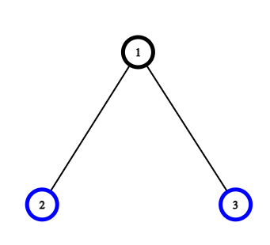
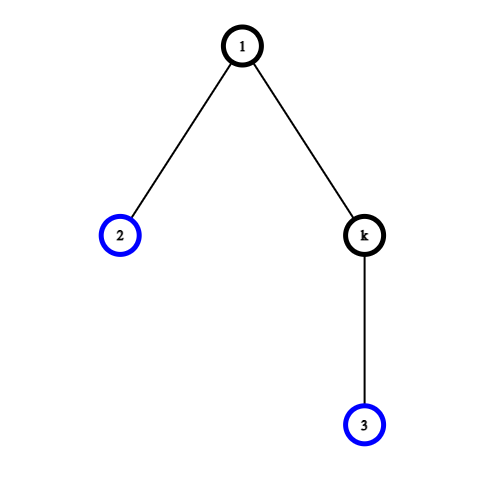

[Official Analysis](http://www.boi2020.lv/data/spoilers/village.pdf)

## Explanation

This problem can be solved by a greedy approach. In particular, we perform a
depth-first search on the given tree. For each node (villager) that is still at
its original position, we swap it with its only neighbor, namely its parent
node. For the root node which does not have a parent node, we can swap it with
any of its children.

By swapping two nodes where at least one of them is not processed yet, we can
guarantee that no node will be swapped back to its original position. We can
also show that swapping between neighbors is the optimal solution: Suppose we
would swap two unprocessed nodes which are not neighbors. The distance the two
nodes need to travel would then be equal or larger than 4. If we instead just swap them
with their respective neighbors, the distance they need to travel is exactly 4.
Therefore, swapping nodes that are not neighbors never lead to a better
solution.

To illustrate this idea, let's consider the following example:



Nodes 2 and 3 are not swapped yet. Now, if we swap node 2 and 3 directly, the
total distance travelled would be $2 * 2 = 4$. It will never be less than just
swapping the nodes with their neighbors, which in this case means swapping node
1 with 2 and then node 2 with 3, resulting in a total distance of
$2 * (2 * 1) = 4$.

If there are more nodes between node 2 and 3, then the distance required to swap
them directly will be more than 4. In the following graph, the total distance
travelled would be $2 * 3 = 6$, while the distance of just swapping nodes with
their neighbors remains the same, i.e. 4.



## Implementation

**Time Complexity:** $\mathcal{O}(N)$

<LanguageSection>
<CPPSection>

```cpp
#include <bits/stdc++.h>
using namespace std;

/**
 * Perform a depth-first search on the given node and swap villagers if
 * necessary.
 * @return the sum of distances villagers need to travel
 */
int dfs(int node, int parent, vector<int> &changed_to,
        const vector<vector<int>> &adj) {
	int length_added = 0;

	for (int &child : adj[node]) {
		if (child == parent) { continue; }
		length_added += dfs(child, node, changed_to, adj);
	}

	/*
	 * If the current node (villager) is still in its original house, exchange
	 * its position with its parent node.
	 */
	if (parent >= 0 && changed_to[node] == node) {
		changed_to[node] = changed_to[parent];
		changed_to[parent] = node;
		length_added += 2;
	} else if (parent < 0 && changed_to[node] == node) {
		/*
		 * If the current node is the root and did not swap its position yet,
		 * swap it with any of its children.
		 */
		changed_to[node] = changed_to[adj[node][0]];
		changed_to[adj[node][0]] = node;
		length_added += 2;
	}

	return length_added;
}

int main() {
	int N;
	cin >> N;

	/*
	 * Villager i will move to house changed_to[i]. At the beginning, all
	 * villagers are in their own house, i.e. changed_to[i] = i
	 */
	vector<int> changed_to(N);
	vector<vector<int>> adj(N);
	for (int i = 0; i < N - 1; i++) {
		int a, b;
		cin >> a >> b;
		a--, b--;
		adj[a].push_back(b);
		adj[b].push_back(a);
		changed_to[i] = i;
	}
	changed_to[N - 1] = N - 1;

	int total_length = dfs(0, -1, changed_to, adj);

	cout << total_length << endl;
	for (int &i : changed_to) { cout << i + 1 << " "; }
	cout << endl;
}
```

</CPPSection>
</LanguageSection>
