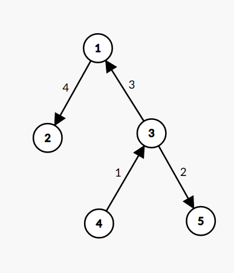

[Official Editorial](https://codeforces.com/blog/entry/68111)

## Explanation

Notice that choosing a leaf node is more optimal than
choosing anything in the middle because that way we have the entire size of the
rest of the tree as a part of the leftover connected component. This hints for a
DP on Trees solution, where we choose one leaf node, work our way up through
that leaf node's ancestors and work our way down for each of our ancestor's
siblings, incorporating the maximum possible cost for each of their subtrees.
For example, for the following tree:



If we select the 4th node as our starting point, then the process would look
like the following:

1. Work our way up to 3
2. Work our way down to 5
3. Work our way up to 1
4. Work our way down to 2

We need to maintain the cost of two different scenarios for each node: working
up from a leaf node to the current node and working down from the current node
throughout its whole subtree, meaning that we have to maintain 2 DP arrays.
Let's define the DP transitions for each of the arrays. We will use $dp_1$ for
the cost of working down and $dp_2$ for the cost of working up and $sz$ for the
size of a subtree.

$$
\begin{align*}
sz[u] &= 1 + \sum_{c\in child(u)} sz[c] \\
dp_1[u] &= sz[u] + \sum_{c\in child(u)} dp_1[c]
\end{align*}
$$

We can calculate this DP array with a single DFS search. Now, for the second DP
array:

$$
dp_2[u] = \max_{c\in child(u)} (((sz[u] - sz[c])\cdot (\texttt{distance to initial node}+1)) + dp_2[c] + \sum_{d\in sibling(c)}dp_1[d])
$$

There is still one problem though. The cost of $sz[u] - sz[c]$ is multiplied by
the number of nodes between the current node and the initial node inclusive.
However, we can't anticipate this number beforehand, and we might have some
ancestor node later on which would have prefered a higher distance over a higher
cost. This means that we need to incorporate the $sz[u] - sz[c]$ for every
ancestor node when initializing the $dp_2$ value for leaf nodes. That way we, it
will be incorporated into the cost beforehand and we don't need to worry about
choosing the wrong initial node with an inoptimal ending cost.

We can calculate these initial values with another DFS search before the one
calculating the values for $dp_2$. That way we can remove the term including
$sz[u] - sz[c]$ from the recurrence formula for $dp_2$. To calculate these
initial values, we notice that every time we go down by one depth, we add size
of all the siblings and parent combined two times, one for the parent, and once
for the current node. We also add the cost of all the ancestor's siblings and
parent combined once more. Let's say $p_2[u]$ is the initial cost for a leaf
node $u$, and $p_1[u]$ is the cost of the ancestor's siblings and parent
combined till $u$. Then we can calculate $p_1[u]$ and $p_2[u]$ using the
following recurrence:

$$
\begin{align*}
p_1[u] &= p_1[p] + sz[p] - sz[u] \\
p_2[u] &= p_2[p] + p_1[u] + sz[p] - sz[u]
\end{align*}
$$

## Implementation

**Time Complexity:** $\mathcal{O}(N)$

<LanguageSection>

<CPPSection>

```cpp
#include <bits/stdc++.h>
using namespace std;
typedef long long ll;

vector<vector<int>> g;
vector<ll> dp1, dp2;
vector<ll> p1, p2;
vector<ll> sz;

// Calculate sz and dp1
void dfs1(int u, int p) {
	sz[u] = 1;
	for (int &v : g[u]) {
		if (v == p) { continue; }
		dfs1(v, u);
		sz[u] += sz[v];
		dp1[u] += dp1[v];
	}
	dp1[u] += sz[u];
}

// Calculate cost incorporated for initial value of dp2
void dfs2(int u, int p) {
	if (p != -1) {
		p1[u] = p1[p] + sz[p] - sz[u];
		p2[u] = p2[p] + p1[u] + sz[p] - sz[u];
	}
	for (int &v : g[u]) {
		if (v == p) { continue; }
		dfs2(v, u);
	}
}

// Calculate dp2
void dfs3(int u, int p) {
	dp2[u] = (g[u].size() == 1 ? p2[u] + 1 : 0);
	ll tot = 0;
	for (int &v : g[u]) {
		if (v == p) { continue; }
		tot += dp1[v];
	}
	for (int &v : g[u]) {
		if (v == p) { continue; }
		dfs3(v, u);
		if (dp2[v] + tot - dp1[v] > dp2[u]) { dp2[u] = dp2[v] + tot - dp1[v]; }
	}
}

int main() {
	int n;
	cin >> n;

	g.resize(n);
	dp1.resize(n);
	dp2.resize(n);
	sz.resize(n);
	p1.resize(n);
	p2.resize(n);
	for (int i = 1; i < n; i++) {
		int x, y;
		cin >> x >> y;
		g[--x].push_back(--y);
		g[y].push_back(x);
	}

	// Run first DFS to calculate sz and dp1
	dfs1(0, -1);

	// Run second DFS to calculate p1 and p2
	dfs2(0, -1);

	// Run third DFS to calculate dp2
	dfs3(0, -1);

	// Find maximum dp1/dp2 among all nodes
	ll ans = 0;
	for (int i = 0; i < n; ++i) { ans = max(ans, max(dp1[i], dp2[i])); }

	cout << ans << endl;
}
```

</CPPSection>

</LanguageSection>
