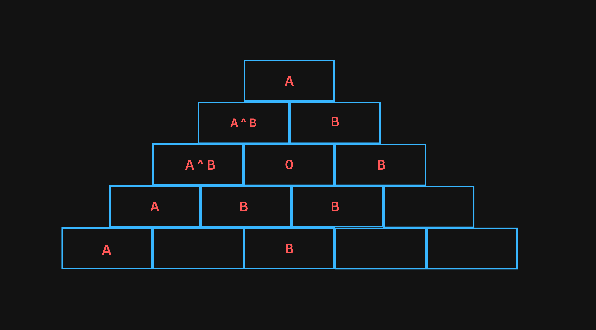

## Explanation

Simulating the process, similarly to [Pascal's triangle](https://en.wikipedia.org/wiki/Pascal%27s_triangle), isn't efficient,
because of $n$ being too large. One good practice when dealing with such problems is analyzing how the answer is affected by each single value. Keeping in mind that xor is its
own inverse, a value $x$ xored with itself an **even** number of times will result in $0$, thus canceling each other out; on the other hand, the value $x$ xored
with itself and **odd** number of times will simply result in $x$. Consequently, we can shift our focus to finding for each bottom value the number of times it will affect
in the top value.

Let's take a look at how bottom values modify the final result.



As you can see, the value $B$ does not appear in the final result, thus it can be ignored. Additionally, the bottom row values in
Pascal's triangle of height five are $1,4,6,4,1$. We can think of these values as the number of occurrences of each bottom row value.
In the above image, value $A$ will be xored one time in the result, while value $B$ will be xored four times in the result. Therefore,
the parity of the frequency tells us that value $A$ contributes to the result, while value $B$ cancels out itself.

Because we are only interested in the parity of the binomial coefficient, there is no need to compute its actual value. We can simply check the parity by
counting the power of two in $\binom{n}{k}=\frac{n!}{k! \cdot (n-k)!}$. With this in mind, precompute $\texttt{pref}_i=p$ where $p$ is the power of two in $i!$ factorization.
Therefore, the binomial coefficient is odd if: $\texttt{pref}_n-\texttt{pref}_k-\texttt{pref}_{n-k}=0$.

## Implementation

**Time Complexity:** $\mathcal{O}(N)$

<LanguageSection>
<CPPSection>

```cpp
#include <iostream>
#include <vector>

using namespace std;

int main() {
	int n;
	cin >> n;
	vector<int> pref(n + 1);
	for (int i = 2; i <= n; i++) {
		int num = i;
		while (num % 2 == 0) {
			pref[i]++;
			num /= 2;
		}
		pref[i] += pref[i - 1];
	}

	int ans = 0;
	for (int i = 0; i < n; i++) {
		int num;
		cin >> num;
		if (pref[n - 1] - pref[i] - pref[n - i - 1] == 0) { ans ^= num; }
	}

	cout << ans << endl;
}
```

</CPPSection>
<JavaSection>

```java
import java.io.*;
import java.util.*;

public class XorPyramid {
	public static void main(String[] args) throws IOException {
		BufferedReader f = new BufferedReader(new InputStreamReader(System.in));
		PrintWriter out = new PrintWriter(System.out);
		StringTokenizer st = new StringTokenizer(f.readLine());

		int n = Integer.parseInt(st.nextToken());

		// Precompute the powers of 2 in the factorization of i!
		int[] pref = new int[n + 1];
		for (int i = 2; i <= n; i++) {
			int num = i;
			while (num % 2 == 0) {
				pref[i]++;
				num /= 2;
			}
			pref[i] += pref[i - 1];
		}

		int ans = 0;
		st = new StringTokenizer(f.readLine());
		for (int i = 0; i < n; i++) {
			int num = Integer.parseInt(st.nextToken());

			/*
			 * Determine if the i-th binomial coefficient in
			 * Pascal's Triangle is odd by determining the number of
			 * 2s in the factorization of n choose k.
			 */
			if (pref[n - 1] - pref[i] - pref[n - i - 1] == 0) {
				/*
				 * If there are no 2s, then the i-th coefficient is odd.
				 * This means num will show up in our answer,
				 * so we xor it to our answer.
				 */
				ans ^= num;
			}
		}

		out.println(ans);
		out.close();
	}
}
```

</JavaSection>
<PySection>

```py
n = int(input().strip())

# Initialize prefix array
pref = [0] * (n + 1)

# Calculate the number of trailing zeros in each number up to n
for i in range(2, n + 1):
	num = i
	while num % 2 == 0:
		pref[i] += 1
		num //= 2
	pref[i] += pref[i - 1]

ans = 0

data = list(map(int, input().strip().split()))

# Calculate the result using XOR
for i in range(n):
	num = data[i]
	if pref[n - 1] - pref[i] - pref[n - i - 1] == 0:
		ans ^= num

print(ans)
```

</PySection>
</LanguageSection>
