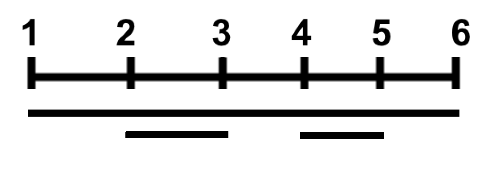

[Official Analysis (C++)](http://www.usaco.org/current/data/sol_help_gold_feb20.html)

## Solution

The brute force approach of this problem would be to iterate over all subsets and count the number of connected components for each subset.

However, this approach has a time complexity of $\mathcal{O}(2^N * N)$ and is too large to fit the time constraints of the problem except for the first three test cases. To optimize this, we can figure out how much each segment contributes to the total answer.

Consider the sample test case



For each segment we can list the subsets where the segment is counted. We must only list the subsets where the segment is the beginning of a connected component, since we would overcount otherwise.

Using the sample test case, the segments will be the following:
* 1st segment: $[1,2,3]$, $[1,2]$, $[1,3]$, and $[1]$
* 2nd segment: $[2,3]$ and $[2]$
* 3rd segment: $[2,3]$ and $[3]$

We can iterate over the whole length of the segment (from $1$ to $2N$). Call a segment open at a certain point if it contains that point and closed if it does not. At each step, we maintain the number of open segments. If a new segment opens, we can figure out how much it contributes to the answer while making sure we don't overcount. We need to find the number of subsets where this segment is the beginning of a connected component.

We don't include subsets that have the already open segments because in that case, the segment will not be the beginning of the connected component. In addition, we must include the current segment in the subset. Thus, there will be $2^{N - open}$ subsets where the current segment contributes $1$ to the answer and where 'open' is the number of open segments including the newly opened segment. We can add this value to the final answer.

## Implementation

**Time Complexity:** $\mathcal{O}(N)$

<LanguageSection>

<CPPSection>

```cpp
#include <bits/stdc++.h>
using namespace std;

using ll = long long;
using vi = vector<int>;
using vl = vector<ll>;

const ll MOD = 1e9 + 7;

int main() {
	freopen("help.in", "r", stdin);
	int n;
	cin >> n;
	// Mark the points where a segment opened or closed
	vi a(2 * n + 1, 0);
	for (int i = 0; i < n; i++) {
		int x, y;
		cin >> x >> y;
		a[x]++;
		a[y]--;
	}

	// Precalculate powers of 2
	vl pow(n);
	pow[0] = 1;
	for (int i = 1; i <= n - 1; i++) { pow[i] = pow[i - 1] * 2 % MOD; }

	int open_segs_num = 0;
	ll ans = 0;
	for (int i = 1; i <= 2 * n; i++) {
		// Update the number of open segments
		open_segs_num += a[i];
		/*
		 * If a new segment is opened, count the number of subsets
		 * where this new segment is the beginning of a connected component
		 */
		if (a[i] == 1) { ans = (ans + pow[n - open_segs_num]) % MOD; }
	}
	freopen("help.out", "w", stdout);
	cout << ans << endl;
}
```
</CPPSection>
<PySection>

```py
MOD = 1000000007

n = int(open("help.in".readline()))

# If the segment is open the value will be positive else negative
a = [0] * (2 * n + 1)
for i in range(n):
	x, y = map(int, filein.readline().split())
	a[x] += 1  # open
	a[y] -= 1  # close

# precalculating the powers of 2
power = [1] * n
for i in range(1, n):
	power[i] = power[i - 1] * 2 % MOD

open_segs = 0
ans = 0
for i in range(1, 2 * n + 1):
	open_segs += a[i]
	if a[i] == 1:
		ans = (ans + power[n - open_segs]) % MOD

print(ans, file=open("help.out", "w"))
```

</PySection>
</LanguageSection>
