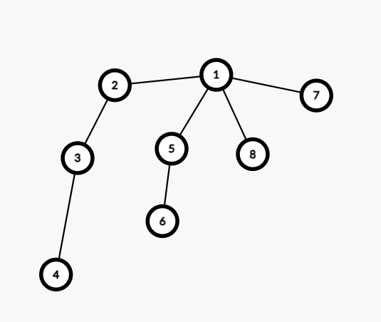

[Official Analysis (C++)](http://www.usaco.org/current/data/sol_deleg_gold_feb20.html)

## Explanation

First, note that if $K$ is not a divisor of the $N - 1$, then the edges can never be evenly partitioned.
Thus, we only need to check divisors of $N - 1$.

We can arbitrarily root the tree at node $1$.
Let $\mathtt{toBeMerged[i]}$ store the length of the path passes through node $i$ and its length has not reached $K$ yet.
Since only $1$ of such path exist, all of the other paths which source from the subtrees of $i$ must be evenly paired.

For each node $j$ such that $j$ is a child of node $i$, there must be another node $k$ such that $\mathtt{toBeMerged[j]+toBeMerged[k]} + 2 = K$ in order to complete the path.
If no such $k$ exist, then we will store the current length of the path in $\mathtt{toBeMerged[i]}$, but there can only be one such $j$.



In the above tree, assume $K = 3$.
Then $\mathtt{toBeMerged[2]} = 2$, $\mathtt{toBeMerged[5]} = 1$, $\mathtt{toBeMerged[7]} = 0$, and $\mathtt{toBeMerged[8]} = 0$.
Since there are two paths with length $0$ and only one path with length $1$, we have a path of length $0$ left over, so $\mathtt{toBeMerged[1]} = 0 + 1 = 1$.

It can be proven the maximum number of divisors for an integer up to the constraints of $N$ will be small enough for us to run an linear time algorithm for each divisor.

<Info title="True upper bound">

This upper bound is around $N^{o(1)}$, using the [little o notation](https://en.wikipedia.org/wiki/Big_O_notation#Little-o_notation).
The exact formula can be found [here](https://math.stackexchange.com/a/1053070/713952).
A table for the upper bound of the number of divisors can be found [here](https://wwwhomes.uni-bielefeld.de/achim/highly.txt).

</Info>

## Implementation

**Time Complexity:** $\mathcal{O}(N \cdot N^{o(1)})$

<LanguageSection>
<CPPSection>

```cpp
#include <bits/stdc++.h>
using namespace std;

const int N = 1e5;
vector<int> g[N];
int to_be_merged[N];

bool dfs(int node, int p, int k) {
	// count length of path not merged yet in subtrees
	map<int, int> to_be_merged_count;

	for (int i : g[node]) {
		if (i == p) { continue; }
		if (!dfs(i, node, k)) { return false; }
		int cur_merge = to_be_merged[i] + 1;
		if (cur_merge != k) { to_be_merged_count[cur_merge]++; }
	}

	/*
	 * all subtrees must be paired except one, where the length of the path
	 * is stored in to_be_merged[node]
	 */
	for (auto [key, value] : to_be_merged_count) {
		if (key == k - key) {
			// merge paths with length k / 2
			if (value % 2 == 1) {
				// there is a leftover path
				if (to_be_merged[node]) { return false; }
				to_be_merged[node] = key;
			}
		} else {
			// merge paths with lengths adding up to k
			if (value > to_be_merged_count[k - key]) {
				// there is more than one path or we have already found a path
				if (value - to_be_merged_count[k - key] > 1 || to_be_merged[node]) {
					return false;
				}
				// store leftover path
				to_be_merged[node] = key;
			}
		}
	}

	return true;
}

int main() {
	ifstream cin("deleg.in");
	int n;
	cin >> n;
	for (int i = 0; i < n - 1; i++) {
		int u, v;
		cin >> u >> v;
		g[--u].push_back(--v);
		g[v].push_back(u);
	}

	ofstream cout("deleg.out");
	for (int k = 1; k <= n - 1; k++) {
		if ((n - 1) % k != 0) {
			cout << 0;
		} else {
			fill(to_be_merged, to_be_merged + n, 0);
			cout << dfs(0, 0, k);
		}
	}
}
```

</CPPSection>
</LanguageSection>
