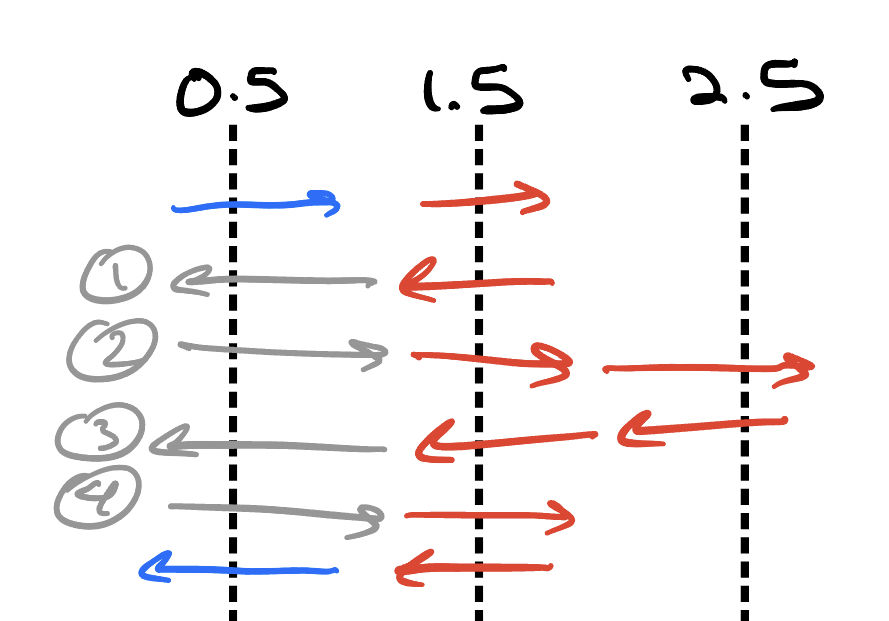
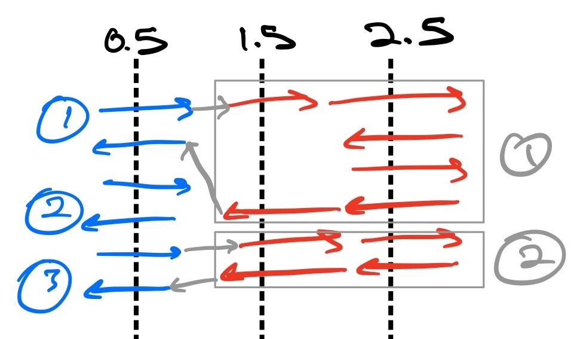
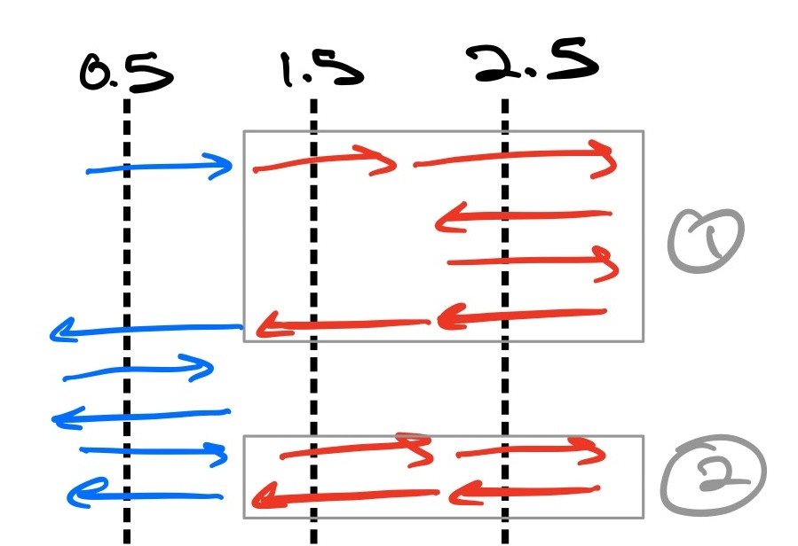

[Official Analysis (Python)](http://www.usaco.org/current/data/sol_prob3_gold_jan23.html)

<Spoiler title="Hint 1">

Try visualizing paths like this:


</Spoiler>

<Spoiler title="Hint 2">

Consider recursively constructing a solution.
If we construct a path that satisfies constraints $A_{i + 1}...A_n$, how can we get a path that satisfies $A_i...A_n$?

</Spoiler>

<Spoiler title="Solution">

Consider recursively constructing a solution. If we construct a path that satisfies constraints $A_{i + 1}...A_n$, how can we get a path that satisfies $A_i...A_n$? And if we know $C_{i + 1}$, the number of paths that satisfy $A_{i + 1}...A_n$, how do we get $C_i$?

### Case 1: $A_i \leq A_{i + 1}$

Let's say $A = [4, 6, 2]$. If we take a path that satisfies $A_1...A_2$ (*red*), how can we extend it to a path that satisfies $A_0...A_2$?



The moves in blue are mandatory: our path must start from 0 and end at 0. However, we need to pick two more gray moves to satisfy $A_0 = 4$. If we pick move 1, we must also pick move 2; otherwise, our path won't connect. Similarly, if we pick 3, we must also pick 4. Note that picking the gray paths doesn't increase the number of turns!

To generalize, assuming that our constructed path for $A_{i + 1}...A_n$ minimizes turns, this also means any path we construct in the above way for $A_i...A_n$ will minimize turns as well. For $C_i$'s relationship to $C_{i + 1}$, note that in the above example, we have 2 "units" (moves 1, 2 and moves 3, 4) of which we need to pick 1: we already have 1 unit, the two blues, and we need $B_i = \frac{A_i}{2}$ units total. Thus in general, we will have to pick $B_i - 1$ units from $B_{i + 1} - 1$ units, which gives us that $\boxed{C_i = {B_{i + 1} - 1 \choose B_i - 1} * C_{i + 1}}$.

### Case 2: $A_i > A_{i + 1}$

Let's say $A$ is now $[6, 4, 6]$. Let's take a valid path for $A_1...A_2$ (red) and transform it into one for $A_0...A_2$:



There's a reason I've drawn it like this, but here's how it would look normally:



However, going back to the first diagram, how many ways are there to draw the gray links? Well, we need to link the 2 red units to the 3 blue units, and the order of the red units is fixed (we can't link red unit 2 to blue unit 1 and red unit 1 to blue unit 2, for example); therefore, the number of ways to draw gray links is simply $3 \choose 2$ in this case.

Note that this construction also minimizes turns, as we "reuse" as many turns as possible (e.g. blue unit 1 and red unit 1 linked together has the same amount of turns as red unit 1 alone).
Thus, when $A_i > A_{i + 1}$, $\boxed{C_i = {B_i \choose B_{i + 1}} * C_{i + 1}}$.

## Implementation

**Time Complexity**: $\mathcal{O}(N + A\log{M})$

<LanguageSection>
<CPPSection>

```cpp
#include <iostream>
using namespace std;
using ll = long long;

const int A = 1e6 + 1;
const int M = 1e9 + 7;
const int N = 1e5;
ll fact[A], inv_fact[A], a[N];

// binary exponentiation:
// https://usaco.guide/gold/modular#modular-exponentiation
ll exp(ll x, ll n) {
	x %= M;
	ll res = 1;
	while (n > 0) {
		if (n % 2 == 1) { res = res * x % M; }
		x = x * x % M;
		n /= 2;
	}
	return res;
}

// https://usaco.guide/gold/combo#method-2-factorial-definition-modular-inverses---mathcalon--log-mod
ll C(ll n, ll k) { return fact[n] * inv_fact[n - k] % M * inv_fact[k] % M; }

int main() {
	// precompute factorials and inverses
	fact[0] = inv_fact[0] = 1;
	// fact[i] = i!, inv_fact[i] = inverse of i!
	for (int i = 1; i < A; i++) {
		fact[i] = fact[i - 1] * i % M;
		// inverse of x mod M = x^(M - 2) when M is prime
		inv_fact[i] = exp(fact[i], M - 2);
	}

	int n;
	cin >> n;
	for (int i = 0; i < n; i++) {
		cin >> a[i];
		// convert a[i] to b[i]
		a[i] /= 2;
	}

	ll ans = 1;  // base case: C_{n - 1} = 1
	for (int i = n - 2; i >= 0; i--) {
		// calculate C_i
		if (a[i] > a[i + 1]) {
			ans = ans * C(a[i], a[i + 1]) % M;
		} else {
			ans = ans * C(a[i + 1] - 1, a[i] - 1) % M;
		}
	}

	cout << ans << endl;
}
```

</CPPSection>
</LanguageSection>

</Spoiler>
