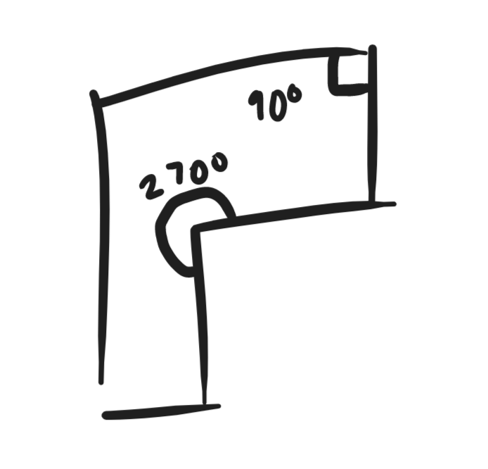

[Official Analysis (C++)](http://www.usaco.org/current/data/sol_lightsout_gold_jan16.html)

## Explanation
The official solution just doesn't use hashing.

We want to be able to pinpoint Bessie's location after traversing some edges and
vertices, and then add the shortest distance to the exit from this location for
each starting index. Then, we want to compare this total distance to the
shortest distance to the end just from the starting vertex to find the answer.
Finding the minimum distance to the end from each vertex can be done in
$\mathcal{O}(N^2)$ time, as illustrated in the code. The question that remains
is how to pinpoint Bessie's location after traversing some edges and vertices
from each starting point.

As the official solution states, it is better to visualize the map as a string
consisting of angles and edges rather than a polynomial. We can pinpoint
Bessie's location if the current path is not repeated somewhere else in the map.
If we were to frame this as a string-matching problem, we would want to find the
shortest substring of the map such that it only appears once.

To handle angles, we can note that there are only two possible interior angles, $90^\circ$ and $270^\circ$.



We use hashing to find the shortest substring of the map. Distinguishing
vertices from angles, we brute force through lengths in increasing order and use
a one-base polynomial hash to check if the substring appears only once. If we
find an appropriate substring, we find the total distance that we travelled
before finding out where we were.

## Implementation
**Time Complexity:** $\mathcal{O}(N^3)$

<LanguageSection>
<CPPSection>

```cpp
#include <bits/stdc++.h>
using namespace std;

using ll = long long;

const ll P = 31;
const ll MOD = 1e9 + 7;
// maximum vertical/horizontal distance
const int MX = 2e5;

struct Coord {
	int x, y;
};

int main() {
	freopen("lightsout.in", "r", stdin);
	freopen("lightsout.out", "w", stdout);

	int n;
	cin >> n;

	vector<Coord> dt(n);
	for (int i = 0; i < n; i++) { cin >> dt[i].x >> dt[i].y; }

	function<int(int i, int j)> calc_dist = [&](int i, int j) {
		return abs(dt[i].x - dt[j].x) + abs(dt[i].y - dt[j].y);
	};

	vector<vector<vector<int>>> dist(
	    n, vector<vector<int>>(n, vector<int>(2, INT32_MAX)));

	/*
	 * dist[i][j][0] - clockwise dist from i -> j
	 * dist[i][j][1] - counter-clockwise dist from i -> j
	 */
	for (int i = 0; i < n; i++) {
		for (int j = i; j < i + n; j++) {
			if (i == j) {
				dist[i][j][0] = 0;
			} else {
				int x = (j + n) % n;
				int y = (j - 1 + n) % n;
				dist[i][x][0] = dist[i][y][0] + calc_dist(x, y);
			}
		}
	}

	for (int i = 0; i < n; i++) {
		for (int j = i; j > i - n; j--) {
			if (i == j) {
				dist[i][j][1] = 0;
			} else {
				int x = (j + n) % n;
				int y = (j + 1 + n) % n;
				dist[i][x][1] = dist[i][y][1] + calc_dist(x, y);
			}
		}
	}

	vector<int> ang(n);
	for (int i = 0; i < n; i++) {
		int prev = (i - 1 + n) % n;
		int nxt = (i + 1) % n;

		/*
		 * two types of possible angles (90 deg either on inside or outside)
		 * reminder: all edges are parallel to either x or y axis & alternate
		 */

		// derived from slope
		ll rt = ((dt[i].y - dt[prev].y) * (dt[nxt].x - dt[i].x) -
		         (dt[nxt].y - dt[i].y) * (dt[i].x - dt[prev].x));

		// no angle should ever be colinear
		assert(rt);

		ang[i] = rt > 0 ? MX + 2 : MX + 1;
	}

	vector<int> hash(1);
	hash[0] = 0;

	vector<ll> poly(2 * n + 1);

	poly[0] = 1;
	for (int i = 1; i < (int)(poly.size()); i++) {
		poly[i] = (int)(poly[i - 1] * P % MOD);
	}

	for (int i = 1; i < n; i++) {
		hash.push_back((hash.back() * P + dist[(i - 1 + n) % n][i][0]) % MOD);
		hash.push_back((hash.back() * P + ang[i]) % MOD);
	}
	hash.push_back(hash.back() * P + dist[n - 1][0][0]);

	function<int(int i, int j)> get_hash = [&](int i, int j) {
		// gets the hash for the substring from i -> j
		// you can also compute this using the mod inverse of poly_i
		return ((hash[j] - ((hash[i] * poly[j - i]) % MOD) + MOD) % MOD);
	};

	int ans = 0;
	for (int i = 1; i < (int)(hash.size()) - 2; i++) {
		int fin = -1;

		for (int len = 1; len < (int)(hash.size()) - i; len++) {
			int cr = get_hash(i, i + len);
			int occ = 0;

			for (int j = 0; j < (int)(hash.size()) - len; j++) {
				if (get_hash(j, j + len) == cr) { occ++; }
			}

			// bessie can uniquely identify her position
			if (occ == 1) {
				fin = (i + len + 1) / 2;
				break;
			}
		}

		int start = (i + 2) / 2;
		if (fin >= n) { fin = -1; }

		int a = dist[start][0][0];
		if (fin != -1) {
			// time to get to unique point + best dist from there
			a = min(dist[fin][0][0], dist[fin][0][1]) + dist[start][fin][0];
		}
		// default time to get to exit from start
		int b = min(dist[start][0][0], dist[start][0][1]);

		ans = max(ans, a - b);
	}

	cout << ans << endl;
}
```
</CPPSection>
</LanguageSection>
