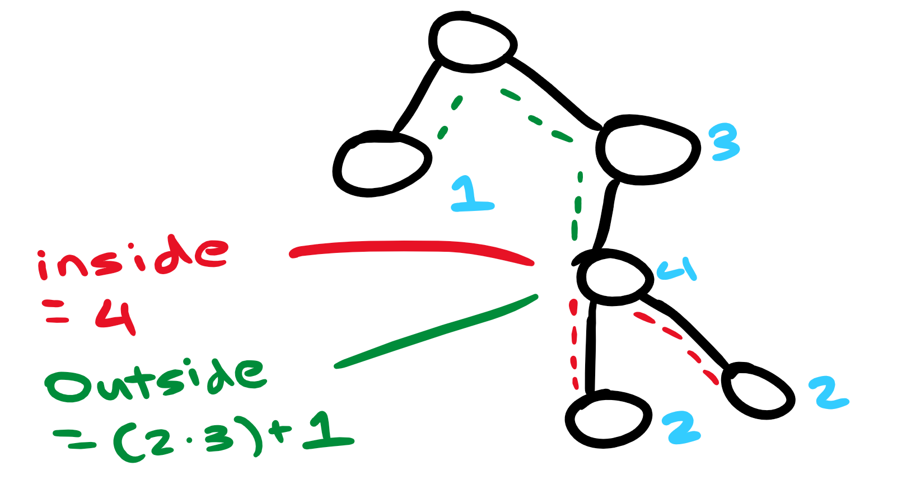

<Spoiler title="Hint 1">

If you're not sure where to start, think about what the directories and files represent. Then, you should be able to restructure the problem into one that seems easier to approach.

</Spoiler>

<Spoiler title="Answer to Hint 1">

They form a tree where the lengths of the file/directory names represent the weights.

Now, we can phrase the problem as follows:

> For each node in a tree, what's the minimum sum of path lengths from a node to all of the tree's leaves?

</Spoiler>

<Spoiler title="Solution">

## Explanation

To compute the distances from each node, we'll calculate the "inside" and "outside" distances for each node.

The "inside" distance is the sum of path lengths from a node to the leaves **inside** its subtree.

The "outside" distance is the sum of path lengths from a node to the leaves **outside** its subtree.

For example, in the following tree, the inside distance for node $4$ would equal $4$, and the outside distance would equal $7$.



*Note: For the outside value, we also have to include the two `../`s that are required to backtrack.*

<Optional title="Keep Thinking!">

Now that you've made it here, try figuring out a way to calculate this by yourself. :)

</Optional>

<Spoiler title="Calculating inside distances">

We can solve this with a [DFS](/silver/graph-traversal) through the tree since the inside value of the parent is just the inside value of the child (plus a slash).

</Spoiler>

<Spoiler title="Calculating outside distances">

Surprisingly, we can also solve this with a DFS!

Note that if we have already calculated the outside value for a node's parent, we have all the information we need to calculate itself as well.

This is because every outside node must be in the parent's subtree ($\texttt{inside}[p] - \texttt{inside}[n]$), or outside that parent's subtree ($\texttt{outside}[p]$). Here, $p$ represents the parent, and $n$ represents the current node.


</Spoiler>

## Implementation

**Time Complexity:** $\mathcal{O}(N)$

<LanguageSection>
<CPPSection>

```cpp
#include <bits/stdc++.h>
using namespace std;

struct Data {
	bool is_file;  // is it a leaf
	int len;       // length of name
	int nleaves;   // number of leaves in subtree
	vector<int> children;
};

int main() {
	freopen("dirtraverse.in", "r", stdin);

	int n;
	cin >> n;

	vector<Data> bessie(n);
	int total_leaves = 0;
	for (int i = 0; i < n; i++) {
		string s;
		int m;
		cin >> s >> m;

		bessie[i].len = (int)s.size();

		if (m == 0) {
			bessie[i].is_file = 1;
			total_leaves++;
		}

		for (int j = 0; j < m; j++) {
			int x;
			cin >> x;
			--x;
			bessie[i].children.push_back(x);
		}
	}

	// compute insides
	vector<long long> inside(n);
	function<void(int)> search_inside = [&](int v) {
		if (bessie[v].children.empty()) {
			bessie[v].nleaves = 1;
			return;
		}

		for (int u : bessie[v].children) {
			search_inside(u);

			// need a slash if it isn't a file
			bool slash = !bessie[u].is_file;
			bessie[v].nleaves += bessie[u].nleaves;
			inside[v] += inside[u] + ((bessie[u].len + slash) * bessie[u].nleaves);
		}
	};
	search_inside(0);

	// and then compute outsides
	vector<long long> outside(n);
	function<void(int)> search_outside = [&](int v) {
		for (int u : bessie[v].children) {
			long long same =
			    (inside[v] - inside[u]) -
			    ((bessie[u].len + !bessie[u].is_file) * (bessie[u].nleaves));

			// add all ../s too
			outside[u] = same + outside[v] + (3 * (total_leaves - bessie[u].nleaves));
			search_outside(u);
		}
	};
	search_outside(0);

	long long ans = LONG_LONG_MAX;
	for (int i = 0; i < n; i++) { ans = min(ans, outside[i] + inside[i]); }

	freopen("dirtraverse.out", "w", stdout);
	cout << ans << endl;
}
```

</CPPSection>
</LanguageSection>

</Spoiler>
