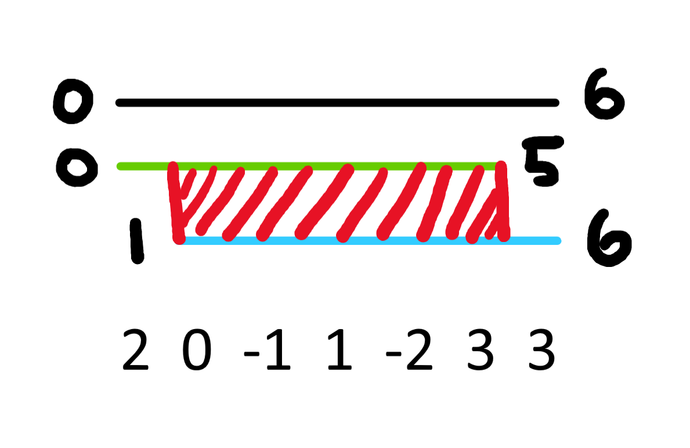

[Official Analysis (C++ and Java)](http://www.usaco.org/current/data/sol_threesum_gold_jan20.html)

## Explanation

Although the problem may be daunting at first, it helps to think about how a smaller range is connected to another.

If $\texttt{ways}[i][j]$ equals the number of unordered triplets which sum to zero between $[i, j]$, then what states does this rely on?


We can choose to exclude one endpoint or the other, which gives us a picture like this (reminder to make sure not to double count the overlap).



While this'll count all the triplets in between them, we aren't taking into account any triplets which use both the elements at $i$ and $j$, since those aren't included in our "PIE-like" transition.<Asterisk>Our transition takes all triplets from $[i + 1, j]$ and $[i, j - 1]$</Asterisk>

To do this, we can precalculate the number of triplets which start at $i$ and end at $j$ in $\mathcal{O}(N^2)$ time by storing the occurences of the compliment of $i$ and $j$ in an array.

More formally, our final transition is:

$\texttt{ways}[i][j] = \texttt{ways}[i + 1][j] + \texttt{ways}[i][j - 1] - \texttt{ways}[i + 1][j - 1] + \texttt{trp}[i][j]$

where $\texttt{trp}[i][k]$ equals the number of triplets which sum to zero and start at $i$ and end at $k$.

## Implementation

**Time Complexity:** $\mathcal{O}(N^2)$

Note that we can't store $\texttt{trp}$ in its own array due to memory constraints.

<LanguageSection>

<CPPSection>

```cpp
#include <bits/stdc++.h>
using namespace std;

using ll = long long;
const int MAX_VAL = 1e6;

int main() {
	freopen("threesum.in", "r", stdin);
	freopen("threesum.out", "w", stdout);
	cin.tie(0)->sync_with_stdio(0);

	int n, q;
	cin >> n >> q;

	vector<int> val(n);
	for (int i = 0; i < n; i++) {
		cin >> val[i];
		val[i] += MAX_VAL;
	}

	// number of triplets such that i and k are fixed
	vector<vector<ll>> ways(n, vector<ll>(n, 0));
	vector<int> frq(2 * MAX_VAL);

	for (int i = n - 2; i >= 0; i--) {
		// be careful to only consider values in between i and j
		frq[val[i + 1]]++;

		for (int j = i + 2; j < n; j++) {
			// separate val from shifted amt
			int compliment = (MAX_VAL * 3) - (val[i] + val[j]);

			if (compliment >= 0 && compliment < (2 * MAX_VAL)) {
				ways[i][j] = frq[compliment];
			}
			frq[val[j]]++;
		}

		for (int j = i + 1; j < n; j++) { frq[val[j]]--; }
	}

	// essentially 2D prefix sum on ways
	for (int i = n - 1; i >= 0; i--) {
		for (int j = i + 1; j < n; j++) {
			ways[i][j] +=
			    (ways[i + 1][j] + ways[i][j - 1] - ways[i + 1][j - 1]);
		}
	}

	for (int _ = 0; _ < q; _++) {
		int l, r;
		cin >> l >> r;
		cout << ways[l - 1][r - 1] << '\n';
	}
}
```
</CPPSection>
<JavaSection>

```java
import java.io.*;
import java.util.*;
public class Threesum {
	static final int MAX_VAL = 1000000;
	public static void main(String[] args) throws IOException {
		Kattio io = new Kattio("threesum");
		int N = io.nextInt();
		int Q = io.nextInt();
		int[] a = new int[N];
		for (int i = 0; i < N; i++) { a[i] = io.nextInt(); }
		long[][] dp = new long[N + 1][N + 1];
		int[] cnt = new int[2 * MAX_VAL + 1];
		// Calculate the number of k such that a[i] + a[j] + a[k] = 0 given i
		// and j
		for (int i = 0; i < N - 1; i++) {
			for (int j = 0; j < N; j++) { cnt[a[j] + MAX_VAL] = 0; }
			for (int j = i + 1; j < N; j++) {
				int k = -a[i] - a[j];
				if (k >= -MAX_VALUE && k <= MAX_VALUE) {
					dp[i + 1][j + 1] += cnt[k + MAX_VAL];
				}
				cnt[a[j] + MAX_VAL]++;
			}
		}

		for (int i = N; i >= 1; i--) {
			for (int j = i + 1; j <= N; j++) {
				dp[i][j] += dp[i + 1][j] + dp[i][j - 1] - dp[i + 1][j - 1];
			}
		}
		for (int i = 0; i < Q; i++) {
			int a1 = io.nextInt();
			int b = io.nextInt();
			io.println(dp[a1][b]);
		}
		io.close();
	}

	// CodeSnip{Kattio}
}
```
</JavaSection>
</LanguageSection>
