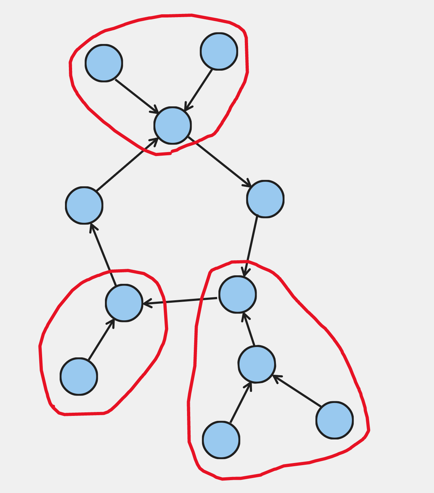

In this problem, we are given a functional graph and asked $q$ queries for the
minimum distance between two vertices $u$ and $v$.

## Structure of the Graph

Notice that all functional graphs can be broken down into a bunch of "components".
Each of these components consists of many trees directed towards the root, and
a single cycle composed of said roots and some other nodes.

Here's an example of a possible "component". The trees are circled in red:



Given this, we can essentially break down each query into three cases:

## Both in Tree

If both $u$ and $v$ are in a tree, we first have to get the distance from
each node to the cycle. This can be precalculated for all nodes
with [BFS](/gold/unweighted-shortest-paths).

First of all, if $v$'s distance is greater than that of $u$'s,
we can't get to $v$ because using a teleporter can only *decrease* our distance
to the cycle.

But if this condition isn't satsified, we start at $u$ and use the teleporters
until our distance to the cycle is equal to that of $v$'s. If we've actually
ended up at $v$, then our answer is the difference between the distances.
Otherwise, it's impossible to reach $v$.

To see which planet we end up at if we teleport $t$ times, we can use
[binary jumping](/plat/bin-jump).

## Both in Cycle

If both are in a cycle, we get both $u$ and $v$'s index in the cycle.
Let's call these indices $u_i$ and $v_i$ respectively.
Now, if $u_i \leq v_i$, then our answer is $v_i - u_i$.
On the other hand, if $u_i > v_i$, then our answer is
$\texttt{cycle\_len} - (u_i - v_i)$.


## One in Each

This case is really two cases, but we only really need to consider one of them.

If $u$ is in a cycle but $v$ is in a tree, it's impossible to reach $v$ from $u$
because we can only go from a tree to a cycle, not vice versa.

On the other hand, if $u$ is the one in the tree, we get which node in the cycle
$u$'s tree connects to, which is also the root. Then this reduces to a version
of the second case: we just have to add the distance from $u$ to the root as well.

<Warning>

Note that all three of these cases assume $u$ and $v$ are in the same component.
If they're in different components, we can't reach $v$ from $u$.

</Warning>

## Implementation

**Time Complexity:** $\mathcal{O}((n+q)\log n)$

<LanguageSection>
<CPPSection>

```cpp
#include <cmath>
#include <iostream>
#include <map>
#include <vector>

using std::cout;
using std::endl;
using std::vector;

int main() {
	int planet_num;
	int query_num;
	std::cin >> planet_num >> query_num;
	vector<int> next(planet_num);
	vector<vector<int>> before(planet_num);
	for (int p = 0; p < planet_num; p++) {
		std::cin >> next[p];
		next[p]--;
		before[next[p]].push_back(p);
	}

	/*
	 * -2 = We haven't even got to processing this planet yet.
	 * -1 = This node is part of a tree.
	 * >= 0: the ID of the cycle the planet belongs to.
	 */
	vector<int> cycle_id(planet_num, -2);
	// Each map, given a planet #, returns the index of that planet in the
	// cycle.
	vector<std::map<int, int>> cycles;
	for (int p = 0; p < planet_num; p++) {
		if (cycle_id[p] != -2) { continue; }
		vector<int> path{p};
		int at = p;
		while (cycle_id[next[at]] == -2) {
			at = next[at];
			cycle_id[at] = -3;  // Leave breadcrumbs for this iteration
			path.push_back(at);
		}

		std::map<int, int> cycle;
		bool in_cycle = false;
		for (int i : path) {
			in_cycle = in_cycle || i == next[at];
			if (in_cycle) { cycle[i] = cycle.size(); }
			cycle_id[i] = in_cycle ? cycles.size() : -1;
		}
		cycles.push_back(cycle);
	}

	/*
	 * Precalculate the distance from each planet to its cycle with BFS.
	 * (cyc_dist[p] = 0) if p is part of a cycle.
	 */
	vector<int> cyc_dist(planet_num);
	for (int p = 0; p < planet_num; p++) {
		// Check if this planet is part of a cycle.
		if (cycle_id[next[p]] == -1 || cycle_id[p] != -1) { continue; }
		cyc_dist[p] = 1;
		vector<int> stack(before[p]);
		while (!stack.empty()) {
			int curr = stack.back();
			stack.pop_back();
			cyc_dist[curr] = cyc_dist[next[curr]] + 1;
			stack.insert(stack.end(), before[curr].begin(), before[curr].end());
		}
	}

	// Intialize the binary jumping arrays.
	int log2 = std::ceil(std::log2(planet_num));
	vector<vector<int>> pow2_ends(planet_num, vector<int>(log2 + 1));
	for (int p = 0; p < planet_num; p++) { pow2_ends[p][0] = next[p]; }
	for (int i = 1; i <= log2; i++) {
		for (int p = 0; p < planet_num; p++) {
			pow2_ends[p][i] = pow2_ends[pow2_ends[p][i - 1]][i - 1];
		}
	}

	/*
	 * Given a starting planet & dist, returns the planet we end up at
	 * if we use the teleporter dist times.
	 */
	auto advance = [&](int pos, int dist) {
		for (int pow = log2; pow >= 0; pow--) {
			if ((dist & (1 << pow)) != 0) { pos = pow2_ends[pos][pow]; }
		}
		return pos;
	};
	for (int q = 0; q < query_num; q++) {
		int u, v;  // going from u to v
		std::cin >> u >> v;
		u--;
		v--;
		if (cycle_id[pow2_ends[u][log2]] != cycle_id[pow2_ends[v][log2]]) {
			cout << -1 << '\n';
			continue;
		}
		if (cycle_id[u] != -1 || cycle_id[v] != -1) {
			if (cycle_id[v] == -1 && cycle_id[u] != -1) {
				cout << -1 << '\n';
				continue;
			}
			// Handle the 2nd & 3rd cases at the same time.
			int dist = cyc_dist[u];
			int u_cyc = advance(u, cyc_dist[u]);  // The root of u's tree

			std::map<int, int> &cyc =
			    cycles[cycle_id[u_cyc]];  // u and v's cycle
			int u_ind = cyc[u_cyc];
			int v_ind = cyc[v];
			int diff =
			    u_ind <= v_ind ? v_ind - u_ind : cyc.size() - (u_ind - v_ind);
			cout << dist + diff << '\n';
		} else {
			if (cyc_dist[v] > cyc_dist[u]) {
				cout << -1 << '\n';
				continue;
			}
			int diff = cyc_dist[u] - cyc_dist[v];
			cout << (advance(u, diff) == v ? diff : -1) << '\n';
		}
	}
}
```

</CPPSection>
</LanguageSection>
