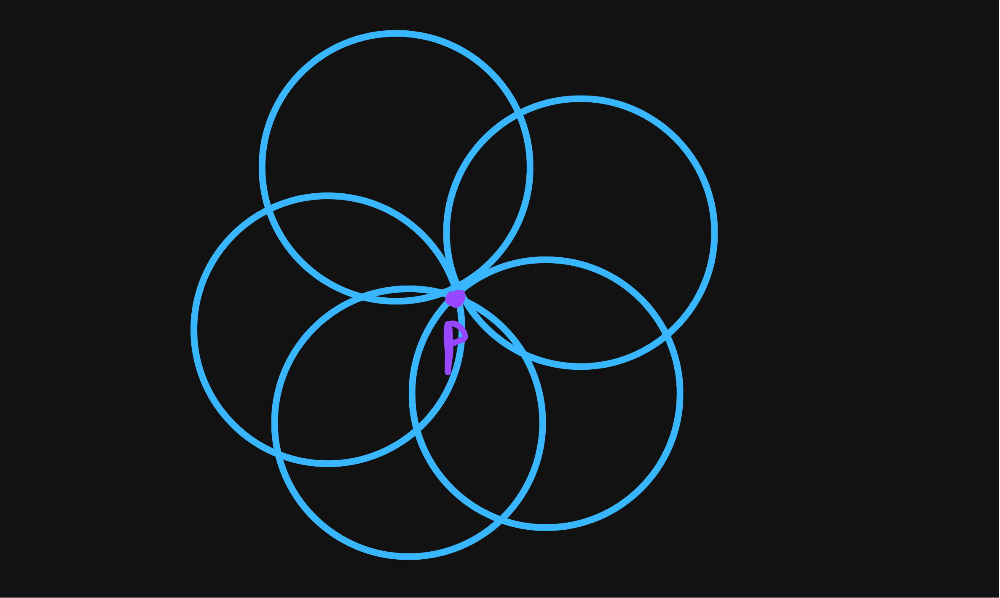
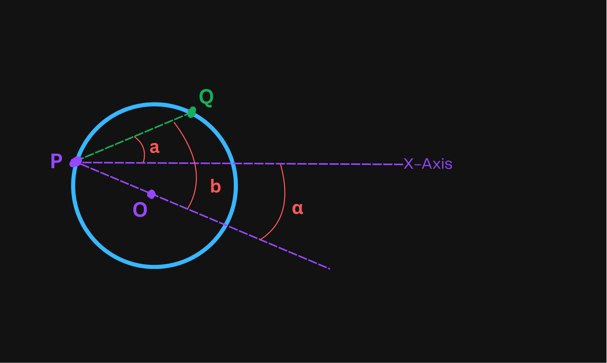
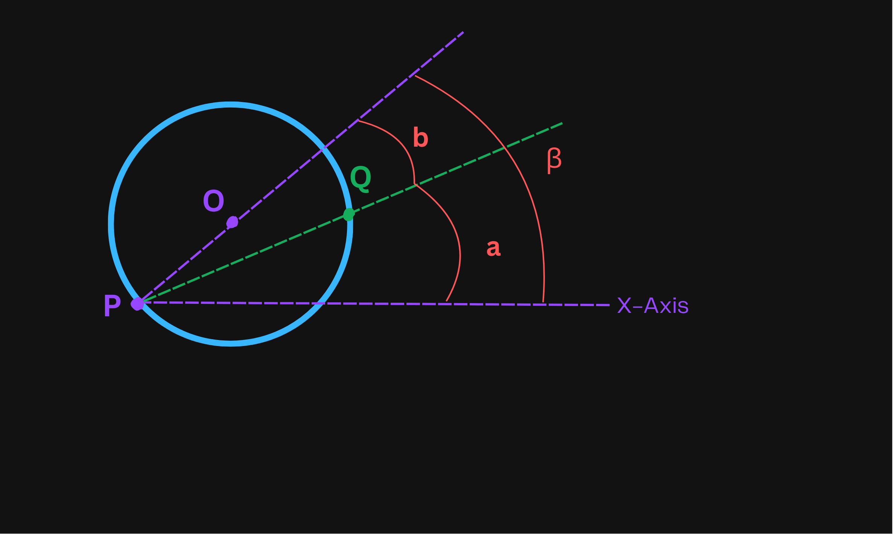

## Explanation

The general idea is the following: we can try finding the answer
by placing the circle's boundary on each point, then sweep - or rotate -
the circle around the point to see the maximum number of points that can be inside the circle.
The picture below depicts how the sweep works:



The sweeping around point $p$ can be done in $\mathcal{O}(N \cdot \log{N})$ by
computing for each point the angle of entering and exiting the circle. Afterward
traverse the sorted array of angles while keeping track of active points i.e.
points lying inside the circle. The considered angles will be relative
to the center of the circle. Let's analyze how to find the entrance angle for
a point:


<i><center>$O$ - circle's center; $Q$ - arbitrary point included in the list of points; $r$ - radius of circle; $a, b, \alpha$ - angles</center></i>

We'll express the values of the angles in radians. The angle of entering the circle in this case is $\alpha$
which can be expressed as: $\alpha = b - a$. Angle $a$ is right above the x-axis so it's just $\arctg$.
Consider that $b=\angle{QPO}$ is an angle in the right triangle $\triangle QPL$, where $L$ is the dimetral opposite point of $P$ on the
circle, therefore $\angle{PQL}=90\degree$. In this case, knowing that $PL=2 \cdot r$ - diameter - and $PQ=\texttt{dist}(P,Q)$, the angle $B$
can be conveniently expressed as $\arccos$. Consequently, the angles $a, b$ have the following formulas:

$$
a=\arctg{\frac{Q_y-P_y}{Q_x-P_x}}\\
b=\arccos{\frac{\texttt{dist}(P,Q)}{2 \cdot r}}
$$

Now that we know how to find the entrance angle, it'll be easier to find the exit angle.
With the same notations as the previous one - $a, b$ having the same formulas - consider this:


<i><center>$O$ - circle's center; $Q$ - arbitrary point included in the list of points; $r$ - radius of circle; $a, b, \alpha$ - angles</center></i>

It can be observed that: $\beta = a + b$.

This algorithm is known as [angular sweep](https://www.geeksforgeeks.org/angular-sweep-maximum-points-can-enclosed-circle-given-radius/)
or *disk partial covering problem*.

## Implementation

**Time Complexity:** $\mathcal{O}(N^2 \cdot \log{N})$

<LanguageSection>
<CPPSection>

```cpp
class Solution {
  public:
	int numPoints(vector<vector<int>> &darts, int r) {
		vector<vector<double>> dist(darts.size(), vector<double>(darts.size()));
		// Compute the distance between points
		for (int i = 0; i < darts.size(); i++) {
			for (int j = i + 1; j < darts.size(); j++) {
				int dx = darts[i][0] - darts[j][0];
				int dy = darts[i][1] - darts[j][1];
				dist[i][j] = dist[j][i] = sqrt(dx * dx + dy * dy);
			}
		}

		int ans = 1;
		for (int i = 0; i < darts.size(); i++) {
			// Store the angles of other points relative to darts[i]
			vector<pair<double, bool>> angles;
			for (int j = 0; j < darts.size(); j++) {
				// Continue if it's the same point or if it lies outside any
				// circle
				if (i == j || dist[i][j] > 2 * r) { continue; }
				double a = atan2(darts[j][1] - darts[i][1], darts[j][0] - darts[i][0]);
				double b = acos(dist[i][j] / (2.0 * r));
				double alpha = a - b, beta = a + b;
				// The angle at which the point enters the circle
				angles.push_back({alpha, false});
				// The angle at which the point leaves the circle
				angles.push_back({beta, true});
			}

			// Sort all the angles
			sort(angles.begin(), angles.end());

			int active_points = 1;
			for (const pair<double, int> &angle : angles) {
				if (!angle.second) {
					active_points++;
				} else {
					active_points--;
				}
				ans = max(ans, active_points);
			}
		}

		return ans;
	}
};
```

</CPPSection>
<PySection>

```py
class Solution:
	def numPoints(self, darts: List[List[int]], r: int) -> int:
		# Compute the distances between all pairs of points
		dist = [[0] * len(darts) for _ in range(len(darts))]
		for i in range(len(darts)):
			for j in range(i + 1, len(darts)):
				dx = darts[i][0] - darts[j][0]
				dy = darts[i][1] - darts[j][1]
				dist[i][j] = dist[j][i] = math.sqrt(dx * dx + dy * dy)

		ans = 1
		for i in range(len(darts)):
			# Store the angles of other points relative to darts[i]
			angles = []
			for j in range(len(darts)):
				# Continue if it's the same point or if it lies outside any circle
				if i == j or dist[i][j] > 2 * r:
					continue

				a = math.atan2(darts[j][1] - darts[i][1], darts[j][0] - darts[i][0])
				b = math.acos(dist[i][j] / (2.0 * r))
				alpha = a - b
				beta = a + b

				# The angle at which the point enters the circle
				angles.append((alpha, False))
				# The angle at which the point leaves the circle
				angles.append((beta, True))

			# Sort all the angles
			angles.sort()

			active_points = 1
			for angle, is_exit in angles:
				active_points += -1 if is_exit else 1
				ans = max(ans, active_points)

		return ans
```

</PySection>
</LanguageSection>
