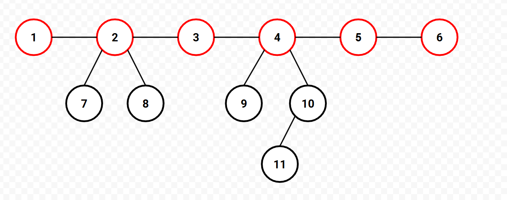

<Spoiler title = "Hint 1">

The furthest distance from a node is always to one endpoint of a diameter of
the tree. After adding a node, how can we maintain the diameter of its tree?

</Spoiler>

<Spoiler title = "Answer to Hint 1">

Consider using the diameter before adding this node to find the diameter after
adding the node in question.

</Spoiler>

<Spoiler title = "Explanation">

Consider answering all the queries online. As given in Hint 1, the furthest
distance from a given node is to an endpoint of a diameter of our current tree.
Now the problem boils down to keeping track of the diameter of each tree inside
our graph after we add a node.

Observe that if we add a leaf to the tree that becomes an endpoint of our
new diameter, then the other endpoint of our new diameter is one of the endpoints
of our old diameter. To understand why this is the case, consider laying out
the tree in the following manner:



Say we add a child to node 11. We now have a new diameter starting from that
child, and need to find a suitable endpoint. Note that it is always optimal
to pick one endpoint of the current diameter because if there was a better
option within one of the "subtrees", it would be the endpoint of the previous
diameter.

With this fact, we can easily maintain the diameter for each tree in our graph
online. Finding the distance between each pair of nodes can be done using binary
lifting.

## Implementation

**Time Complexity:** $\mathcal{O}(N\log{N})$

<LanguageSection>
<CPPSection>

```cpp
#include <bits/stdc++.h>
using namespace std;

class Tree {
  private:
	const int q, log2dist;
	vector<vector<int>> up;
	vector<pair<int, int>> diameter;
	vector<int> root;
	vector<int> dep;
	int curr = -1;

  public:
	Tree(int q)
	    : q(q), log2dist(ceil(log2(q))), up(log2dist, vector<int>(q)), diameter(q),
	      root(q), dep(q) {}

	/** @return the LCA of nodes u and v */
	int lca(int u, int v) {
		if (dep[u] < dep[v]) { swap(u, v); }
		for (int i = log2dist - 1; i >= 0; i--) {
			if (((dep[u] - dep[v]) >> i) & 1) { u = up[i][u]; }
		}
		if (u == v) { return u; }
		for (int i = log2dist - 1; i >= 0; i--) {
			if (up[i][u] != up[i][v]) {
				u = up[i][u];
				v = up[i][v];
			}
		}
		return up[0][u];
	}

	/** @return the distance betweens nodes u and v */
	int dist(int u, int v) { return dep[u] + dep[v] - 2 * dep[lca(u, v)]; }

	/** adds the given node into the tree it belongs to */
	void add_node(int par) {
		curr++;
		if (par == -2) {
			diameter[curr] = {curr, curr};
			for (int i = 0; i < log2dist; i++) { up[i][curr] = curr; }
			root[curr] = curr;
		} else {
			up[0][curr] = par;
			for (int i = 1; i < log2dist; i++) {
				up[i][curr] = up[i - 1][up[i - 1][curr]];
			}

			root[curr] = root[par];
			dep[curr] = dep[par] + 1;

			const auto [a, b] = diameter[root[curr]];
			int dist_a = dist(curr, a);
			int dist_b = dist(curr, b);
			int cur_dist = dist(a, b);
			if (dist_a > cur_dist) {
				diameter[root[curr]] = {a, curr};
			} else if (dist_b > cur_dist) {
				diameter[root[curr]] = {b, curr};
			}
		}
	}

	/** @return the furthest distance from node u */
	int query_dist(int u) {
		const auto [a, b] = diameter[root[u]];
		return max(dist(u, a), dist(u, b));
	}
};

int main() {
	freopen("newbarn.in", "r", stdin);
	freopen("newbarn.out", "w", stdout);
	int q;
	cin >> q;
	Tree tree(q);
	for (int i = 0; i < q; i++) {
		char type;
		int node;
		cin >> type >> node;
		node--;
		if (type == 'B') {
			tree.add_node(node);
		} else {
			cout << tree.query_dist(node) << "\n";
		}
	}
}
```

</CPPSection>
</LanguageSection>

</Spoiler>
