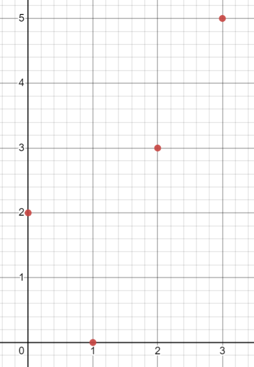
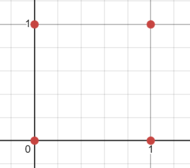
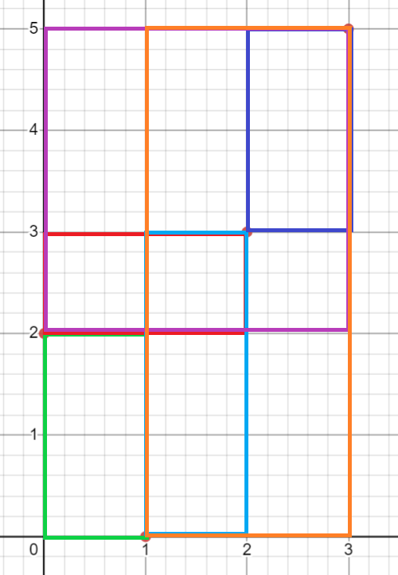
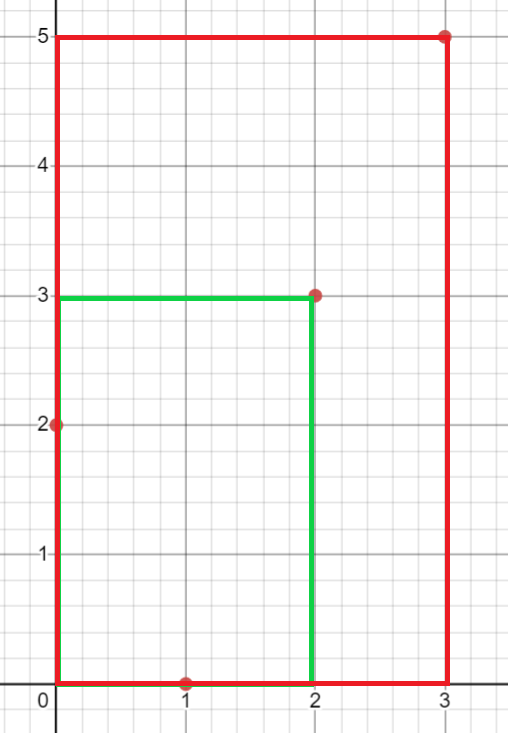

[Official Analysis (C++)](http://www.usaco.org/current/data/sol_prob2_silver_dec20.html)

## Explanation

Let's analyze the sample case a bit more:



The bound of $N \leq 2500$ suggests a complexity of $\mathcal{O}(N^2)$,
so let's try to think about this problem from the perspective of each pair of cows.

Notice that for any two pair of cows, we can always create a unique box, with one cow
at a corner and the other cow at the opposing corner.

Note that we can do this because the problem stipulates that all x-positions and y-positions
are distinct. If they weren't, we could form the same box with two different pairs of points like so:



Drawing out the boxes created by this observation, we now have the following boxes:



This only gives us $6$ rectangles, though, which is less than the actual answer.
The reason for this is because we've failed to account for the boxes where there's only one or
no points at the corners.
Fortunately, we can construct such rectangles from the ones we initially have
by expanding the top and/or bottom border to include any cows that weren't initially
included in the fence.

More specifically, if we let $a$ be the number of cows above the initial bounding box and
$b$ be the number of cows below the initial bounding box, there are $(a+1)(b+1)$ distinct
bounding boxes from the perspective of the initial box.
The $+1$ is because a choice is to simply not include any cows above and/or below the box.

Using the method of construction described above, we can now have the following additional boxes:



However, if we iterate through all cows to find the number of cows above and below a bounding box,
this would give us a complexity of $\mathcal{O}(N^3)$, since we're already iterating
through all pairs of cows.
Thus, we need a constant-time method to find the number of cows that are above or below a certain
y-coordinate and also between two certain x-coordinates.

This is possible with prefix sums.
For each y-coordinate that a cow is at, we iterate through all the cows in order of x-coordinate,
and construct two prefix sum arrays for the given y-coordinate:
one for how many cows are above the coordinate and another for how many cows are below the coordinate.
Now, we have our constant-time method!

Notice, though, that our $6+2=8$ rectangles still falls short of the $13$ stipulated.
This is because we've failed to account for the cases where FJ encases a single cow or none at all.
Thus, we have to add $N+1$ to our subtotal, which in our case gives us the $4+1=5$ extra needed sets!

## Video Solution

<YouTube id="AH1wyxq8nPM" />

## Implementation

**Time Complexity:** $\mathcal{O}(N^2)$

<LanguageSection>
<CPPSection>

```cpp
#include <algorithm>
#include <cassert>
#include <iostream>
#include <map>
#include <set>
#include <vector>

using namespace std;

int main() {
	int cow_num;
	cin >> cow_num;

	set<int> seen_x, seen_y;
	vector<pair<int, int>> cows(cow_num);
	for (pair<int, int> &c : cows) {
		cin >> c.first >> c.second;
		assert(!(seen_x.count(c.first) || seen_y.count(c.second)));
		seen_x.insert(c.first);
		seen_y.insert(c.second);
	}

	// we do a little coordinate compression
	sort(cows.begin(), cows.end());  // sort by x
	map<int, int> reduced_x;
	for (int c = 0; c < cow_num; c++) { reduced_x[cows[c].first] = c; }

	auto cmp = [&](const pair<int, int> &c1, const pair<int, int> &c2) {
		return c1.second < c2.second;
	};
	sort(cows.begin(), cows.end(), cmp);  // sort by y
	map<int, int> reduced_y;
	for (int c = 0; c < cow_num; c++) { reduced_y[cows[c].second] = c; }

	for (auto &[x, y] : cows) {
		x = reduced_x[x];
		y = reduced_y[y];
	}

	// sort by x again
	sort(cows.begin(), cows.end());
	// make our prefix sums for the y-lines
	vector<vector<int>> lt_y(cow_num, vector<int>(cow_num + 1));
	vector<vector<int>> gt_y(cow_num, vector<int>(cow_num + 1));
	for (int c = 0; c < cow_num; c++) {
		int curr_y = cows[c].second;
		for (int x = 1; x <= cow_num; x++) {
			lt_y[curr_y][x] =
			    (lt_y[curr_y][x - 1] + (cows[x - 1].second < curr_y));
			gt_y[curr_y][x] =
			    (gt_y[curr_y][x - 1] + (cows[x - 1].second > curr_y));
		}
	}

	long long total = 0;
	for (int c1 = 0; c1 < cow_num; c1++) {
		for (int c2 = c1 + 1; c2 < cow_num; c2++) {
			int bottom = min(cows[c1].second, cows[c2].second);
			int top = max(cows[c1].second, cows[c2].second);

			int bottom_total = 1 + lt_y[bottom][c2 + 1] - lt_y[bottom][c1];
			int top_total = 1 + gt_y[top][c2 + 1] - gt_y[top][c1];
			total += (long long)bottom_total * top_total;
		}
	}

	/*
	 * we didn't count the boxes where fj just contains
	 * either a single cow or none at all
	 */
	total += cow_num + 1;

	cout << total << endl;
}
```

</CPPSection>
<JavaSection>

```java
import java.io.*;
import java.util.*;

public class RPasture {
	public static void main(String[] args) throws IOException {
		BufferedReader read =
		    new BufferedReader(new InputStreamReader(System.in));

		int cowNum = Integer.parseInt(read.readLine());

		Set<Integer> seenX = new HashSet<>();
		Set<Integer> seenY = new HashSet<>();
		int[][] cows = new int[cowNum][2];
		for (int c = 0; c < cowNum; c++) {
			StringTokenizer cow = new StringTokenizer(read.readLine());
			cows[c][0] = Integer.parseInt(cow.nextToken());
			cows[c][1] = Integer.parseInt(cow.nextToken());
			assert !(seenX.contains(cows[c][0]) || seenY.contains(cows[c][1]));
			seenX.add(cows[c][0]);
			seenY.add(cows[c][1]);
		}

		// we do a little coordinate compression
		Arrays.sort(cows, Comparator.comparingInt(c -> c[0]));  // sort by x
		Map<Integer, Integer> reducedX = new HashMap<>();
		for (int c = 0; c < cowNum; c++) { reducedX.put(cows[c][0], c); }

		Arrays.sort(cows, Comparator.comparingInt(c -> c[1]));  // sort by y
		Map<Integer, Integer> reducedY = new HashMap<>();
		for (int c = 0; c < cowNum; c++) { reducedY.put(cows[c][1], c); }

		for (int c = 0; c < cowNum; c++) {
			cows[c][0] = reducedX.get(cows[c][0]);
			cows[c][1] = reducedY.get(cows[c][1]);
		}

		// sort by x again
		Arrays.sort(cows, Comparator.comparingInt(c -> c[0]));
		// make our prefix sums for the y-lines
		int[][] ltY = new int[cowNum][cowNum + 1];
		int[][] gtY = new int[cowNum][cowNum + 1];
		for (int c = 0; c < cowNum; c++) {
			int currY = cows[c][1];
			for (int x = 1; x <= cowNum; x++) {
				ltY[currY][x] =
				    (ltY[currY][x - 1] + (cows[x - 1][1] < currY ? 1 : 0));
				gtY[currY][x] =
				    (gtY[currY][x - 1] + (cows[x - 1][1] > currY ? 1 : 0));
			}
		}

		long total = 0;
		for (int c1 = 0; c1 < cowNum; c1++) {
			for (int c2 = c1 + 1; c2 < cowNum; c2++) {
				int bottom = Math.min(cows[c1][1], cows[c2][1]);
				int top = Math.max(cows[c1][1], cows[c2][1]);

				int bottomTotal = 1 + ltY[bottom][c2 + 1] - ltY[bottom][c1];
				int topTotal = 1 + gtY[top][c2 + 1] - gtY[top][c1];
				total += (long)bottomTotal * topTotal;
			}
		}

		/*
		 * we didn't count the boxes where fj just contains
		 * either a single cow or none at all
		 */
		total += cowNum + 1;

		System.out.println(total);
	}
}
```

</JavaSection>
</LanguageSection>
