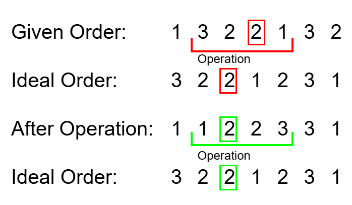
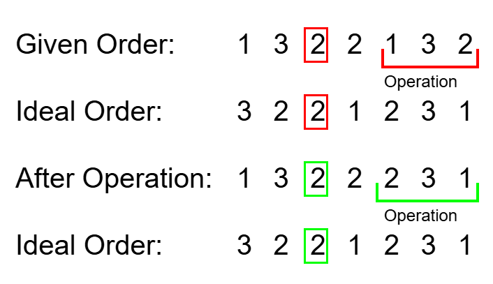
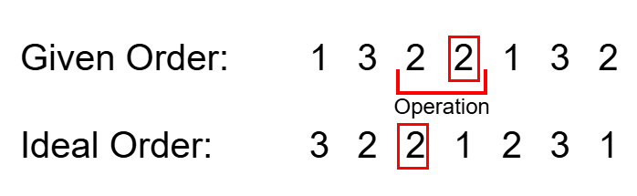
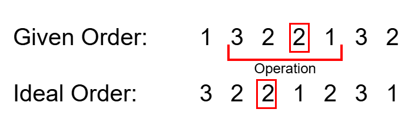
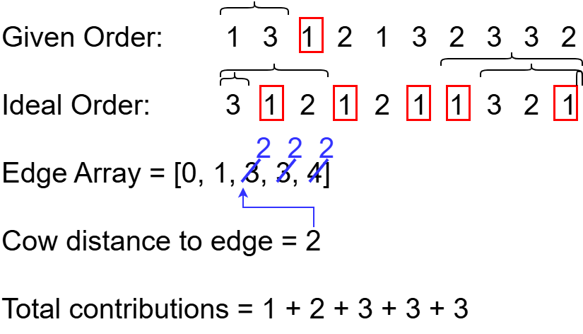

[Official Analysis (C++)](https://usaco.org/current/data/sol_prob1_silver_jan25.html)

## Explanation

Let's analyze the last test case in detail:

We denote a "desirable location" of a cow as a location where a cow of that species will be checked by the bovine veterinarian.

We denote a "contribution" as one instance of a cow being moved to a desirable location.

Note that a contribution can only be achieved in one of two ways.

    A cow was not in a desirable location, and the cow was moved to a desirable location during an operation.



    A cow was already in a desirable location, and the cow was not moved during an operation.



Let's consider how to calculate the contributions created strictly by the first scenario.

Let a cow at location $i$ try to reach a desirable location at location $j$, where $i < j$.

The most intuitive way to achieve this is by setting $l$ to $i$ and $r$ to $j$, so that after the operation, $i$ is moved to $j$



We observe that the same is true if we set $l$ to $i - 1$ and $r$ to $j + 1$.



Thus, the amount of contributions that can be made from a cow at location $i$ and desirable location at location $j$ is limited by the minimum distance to either end of the order, as after that $l$ or $r$ would violate the given constraints for a valid operation.


This can be written as

$$
\min(i - 1, N - j) + 1
$$

Note that we add $1$ to the end because $l$ and $r$ can equal $i$ and $j$ respectively.

Now we consider how to calculate contributions created strictly by the second scenario.

Let a cow at position $i$ already be at a desirable location.

We note that the amount of contributions created is equal to the number of operations that can occur which do not involve *i*.

In the problem, we are given that the number of operations that can occur between $1$ and $N$ can be written as

$$
\frac{N \cdot (N + 1)}{2}
$$

Thus, the amount of contributions created from a cow at location $i$ at a desirable location can be written as the sum of all the possible operations before  after $i$

\frac{i \cdot (i + 1)}{2} + \frac{(N - i - 1) \cdot (N - i)}{2}
$$

Now we need to figure out how to implement this. Given the constraint of $N \leq 5 \cdot 10^5$, it is natural to assume $\mathcal{O}(N \log N)$ time complexity.

This means for each cow, we must be able to find how many contributions it is involved in in at most $\mathcal{O}(log N)$ time.

Given that each cow either is or isn't already at a desirable location, the second scenario can be implemented simply in $\mathcal{O}(1)$ time per cow.

However, for the first scenario, there may be multiple desirable locations a cow could move to.

Let's denote a cow and a desirable location that can create contributions as described in the first scenario as a pair.

If we naively checked each pair, this would take $\mathcal{O}(N)$ time, as in the worst case scenario every single location is a desirable location for every cow.

Let's denote a desirable location's minimum distance to the edge as $d_{desirable}$ and a cow's minimum distance to the edge as $d_{cow}$ where $i$ denotes the cow's location and $j$ denotes the desired location as

$$
d_{desirable} = \min(j - 1, N - j)
$$
$$
d_{cow} = \min(i - 1, N - i)
$$

Recall earlier the amount of contributions that can occur is equal to $\min(d_{cow}, d_{desirable}) + 1$

We can optimize this by precomputing $d_{desirable}$ for a certain cow species, then binary searching over this array to see how many pairs are limited by $d_{desirable}$, and how many pairs are limited by $d_{cow}$



But we're not done yet. Even after finding out how many pairs are limited by $d_{cow}$ and how many pairs are limited by $d_{desirable}$, we still need to sum the contributions, which would take $\mathcal{O}(N)$ time!

We can optimize yet again by implementing prefix arrays. All contributions from pairs limited by $d_{desirable}$ can be found in  $\mathcal{O}(1)$ using the prefix array, and all contributions from pairs limited by $d_{cow}$ can be found by multiplying $d_{cow}$ by the number of pairs limited.

Note that precomputation is guranteed to take only  $\mathcal{O}(N)$ time total, since there are only $N$ cows to sum.

## Implementation

**Time Complexity:** $\mathcal{O}(N \log N)$

<LanguageSection>

<CPPSection>

```cpp
#include <bits/stdc++.h>
using namespace std;

int main() {
	ios::sync_with_stdio(0);
	cin.tie(0);

	int num_cows;
	cin >> num_cows;

	vector<int> initial_order;

	int cow;
	for (int i = 0; i < num_cows; i++) {
		cin >> cow;
		initial_order.push_back(cow);
	}

	vector<int> ideal_order;

	for (int i = 0; i < num_cows; i++) {
		cin >> cow;
		ideal_order.push_back(cow);
	}

	// Map a cow's species to an array of minimum distances to the edge for that speices
	// in the ideal ordering
	unordered_map<int, vector<int>> edge_arrays;

	for (int i = 0; i < num_cows; i++) {

		int min_distance_to_edge = min(i, num_cows - i - 1);

		// If an array doesn't already exist for a cow species, create a new array for
		// that species
		if (edge_arrays.count(ideal_order[i]) == 0) {
			vector<int> new_edge_array = {min_distance_to_edge};
			edge_arrays.insert(make_pair(ideal_order[i], new_edge_array));
		}

		else {
			edge_arrays.at(ideal_order[i]).push_back(min_distance_to_edge);
		}
	}

	// Map a cow's species to a prefix array that sums the countributions limited by
	// d_desirable
	unordered_map<int, vector<long long>> prefix_arrays;

	for (auto &[species, edge_array] : edge_arrays) {

		// Sort edge arrays as we iterate so we can binary search over it later
		sort(edge_array.begin(), edge_array.end());

		vector<long long> new_prefix_array = {0};
		for (int &distance : edge_array) {
			new_prefix_array.push_back(
			    new_prefix_array.back() + distance +
			    1);  // +1 so that the prefix array represents sum of contributions
			         // rather than sum of edge distances
		}

		prefix_arrays.insert(make_pair(species, new_prefix_array));
	}

	long long total_contributions = 0;

	for (long long i = 0; i < num_cows; i++) {

		int &species = initial_order[i];

		// Catches edge case where a cow species exists in the initial ordering but not
		// in the ideal ordering
		if (edge_arrays.count(species) == 0) { continue; }

		// Scenario 1 computation
		long long min_distance_to_edge = min(i, num_cows - i - 1);
		vector<int> &edge_array = edge_arrays.at(species);
		int index =
		    upper_bound(edge_array.begin(), edge_array.end(), min_distance_to_edge) -
		    edge_array.begin();  // Returns breakoff point where d_cow < d_desirable

		total_contributions += prefix_arrays.at(
		    species)[index];  // Adds contributions limited by d_desirable
		total_contributions += (min_distance_to_edge + 1) *
		                       ((long long)edge_array.size() -
		                        index);  // Adds contributions limited by d_cow

		// Scenario 2 computation
		if (initial_order[i] == ideal_order[i]) {
			total_contributions +=
			    ((i * (i + 1)) / 2) + ((num_cows - i - 1) * (num_cows - i) / 2);
		}
	}

	cout << total_contributions << endl;
}
```

</CPPSection>

<PySection>

```py
import bisect

num_cows = int(input())
initial_order = [int(x) for x in input().split()]
ideal_order = [int(x) for x in input().split()]

# Map a cow's species to an array of minimum distances to the edge for that speices in the ideal ordering
edge_arrays = dict()

for i in range(num_cows):

	min_distance_to_edge = min(i, num_cows - i - 1)

	# If an array doesn't already exist for a cow species, create a new array for that species
	if ideal_order[i] not in edge_arrays:
		edge_arrays[ideal_order[i]] = [min_distance_to_edge]

	else:
		edge_arrays[ideal_order[i]].append(min_distance_to_edge)

# Map a cow's species to a prefix array that sums the countributions limited by d_desirable
prefix_arrays = dict()

for species, edge_array in edge_arrays.items():

	# Sort edge arrays as we iterate so we can binary search over it later
	edge_array.sort()

	new_prefix_array = [0]
	for distance in edge_array:
		new_prefix_array.append(
			new_prefix_array[-1] + distance + 1
		)  # +1 so that the prefix array represents sum of contributions rather than sum of edge distances

	prefix_arrays[species] = new_prefix_array

total_contributions = 0

for i in range(num_cows):

	species = initial_order[i]

	# Catches edge case where a cow species exists in the initial ordering but not in the ideal ordering
	if species not in edge_arrays:
		continue

	# Scenario 1 computation
	min_distance_to_edge = min(i, num_cows - i - 1)
	index = bisect.bisect(edge_arrays[species], min_distance_to_edge)

	total_contributions += prefix_arrays[species][index]
	total_contributions += (min_distance_to_edge + 1) * (
		len(edge_arrays[species]) - index
	)

	# Scenario 2 computation
	if initial_order[i] == ideal_order[i]:
		total_contributions += ((i * (i + 1)) // 2) + (
			((num_cows - i - 1) * (num_cows - i)) // 2
		)

print(total_contributions)
```

</PySection>

</LanguageSection>
