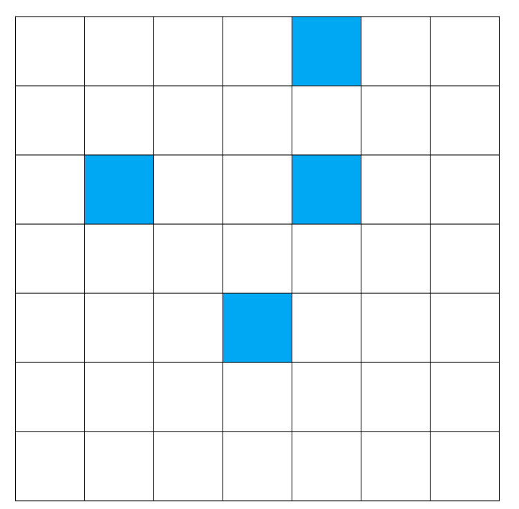
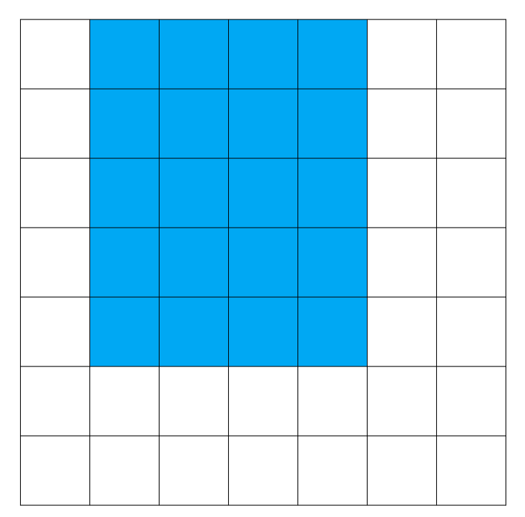

[Official Editorial (C++)](http://www.usaco.org/current/data/sol_art_platinum_open17.html)

## Explanation

### Initial Observation

There's just one small observation we should make before continuing with the actual problem,
and it's that given the final canvas, it's optimal to assume that each color takes up only
the minimum rectangle needed to cover the cells that are shown.

For example, if only these blue cells are present in the canvas:



It's best to think that this is the rectangle Picowso painted:



### Analysis

The main issue with this problem is finding out which rectangles *must* overlap other rectangles,
because as long as we know that color A overlaps color B, then color A can't possibly have been painted first.

However, we can't iterate through all pairs of colors, since that would result in a complexity of at least $\mathcal{O}(N^4)$.
Since that rules out considering things from the colors' angle, why not try considering it from each canvas cell's angle?

Given the observation we made, we know the bounding box of each rectangle.
Thus, with prefix sums, it's possible for us to figure out how many rectangles have been painted
on a single cell.

With this, we can construct our answer with the fact that if a cell has more than
2 rectangles painted over it, than the color shown in the given painting can't possibly have been painted first.
Thus, we keep a set of all colors shown and update it accordingly, removing a color that's found to overlap some other color.
All colors not shown in the final canvas could have been painted first.

## Implementation

**Time Complexity:** $\mathcal{O}(N^2)$

<LanguageSection>
<CPPSection>

```cpp
#include <fstream>
#include <iostream>
#include <map>
#include <set>
#include <vector>

using std::cout;
using std::endl;
using std::vector;

struct Bound {
	int min_r, max_r, min_c, max_c;
};

int main() {
	std::ifstream read("art.in");

	int width;
	read >> width;
	vector<vector<int>> canvas(width, vector<int>(width));
	std::map<int, Bound> visible;
	for (int r = 0; r < width; r++) {
		for (int c = 0; c < width; c++) {
			read >> canvas[r][c];
			if (!visible.count(canvas[r][c])) {
				visible[canvas[r][c]] = Bound{r, r, c, c};
			}
			Bound &bounds = visible[canvas[r][c]];
			bounds.min_r = std::min(r, bounds.min_r);
			bounds.max_r = std::max(r, bounds.max_r);
			bounds.min_c = std::min(c, bounds.min_c);
			bounds.max_c = std::max(c, bounds.max_c);
		}
	}
	visible.erase(0);  // 0 isn't a color

	// all the non-visible colors could've been painted first
	int poss_first = width * width - visible.size();
	// handle the edge case where there's only 1 color
	if (visible.size() > 1) {
		/*
		 * rect_num[r][c] is *going* to contain the # of rectangles
		 * that must contain the point (r, c)
		 */
		vector<vector<int>> rect_num(width + 1, vector<int>(width + 1));
		std::set<int> valid_colors;
		for (const auto &[c, b] : visible) {
			// initialize it as a difference array
			valid_colors.insert(c);
			rect_num[b.min_r][b.min_c]++;
			rect_num[b.min_r][b.max_c + 1]--;
			rect_num[b.max_r + 1][b.min_c]--;
			rect_num[b.max_r + 1][b.max_c + 1]++;
		}

		for (int r = 0; r < width; r++) {
			for (int c = 0; c < width; c++) {
				if (r > 0) { rect_num[r][c] += rect_num[r - 1][c]; }
				if (c > 0) { rect_num[r][c] += rect_num[r][c - 1]; }
				if (r > 0 && c > 0) {
					rect_num[r][c] -= rect_num[r - 1][c - 1];
				}

				/*
				 * if 2 rectangles overlap, the one at the top
				 * (aka the shown one) can't have been painted first
				 */
				if (rect_num[r][c] > 1) { valid_colors.erase(canvas[r][c]); }
			}
		}
		poss_first += valid_colors.size();
	}

	std::ofstream("art.out") << poss_first << endl;
	;
}
```

</CPPSection>
<JavaSection>

```java
import java.io.*;
import java.util.*;

public class Art {
	// BeginCodeSnip{Color Rectangle Bound Class}
	static class Bound {
		public int minR, maxR, minC, maxC;
		public Bound(int minR, int maxR, int minC, int maxC) {
			this.minR = minR;
			this.maxR = maxR;
			this.minC = minC;
			this.maxC = maxC;
		}
	}
	// EndCodeSnip

	public static void main(String[] args) throws IOException {
		BufferedReader read = new BufferedReader(new FileReader("art.in"));

		int width = Integer.parseInt(read.readLine());
		int[][] canvas = new int[width][width];
		Map<Integer, Bound> visible = new HashMap<>();
		for (int r = 0; r < width; r++) {
			canvas[r] = Arrays.stream(read.readLine().split(" "))
			                .mapToInt(Integer::parseInt)
			                .toArray();
			for (int c = 0; c < width; c++) {
				if (!visible.containsKey(canvas[r][c])) {
					visible.put(canvas[r][c], new Bound(r, r, c, c));
				}
				Bound bounds = visible.get(canvas[r][c]);
				bounds.minR = Math.min(r, bounds.minR);
				bounds.maxR = Math.max(r, bounds.maxR);
				bounds.minC = Math.min(c, bounds.minC);
				bounds.maxC = Math.max(c, bounds.maxC);
			}
		}
		visible.remove(0);  // 0 isn't a color

		// all the non-visible colors could've been painted first
		int possFirst = (int)Math.pow(width, 2) - visible.size();
		// handle the edge case where there's only 1 color
		if (visible.size() > 1) {
			/*
			 * rectNum[r][c] is *going* to contain the # of rectangles
			 * that must contain the point (r, c)
			 */
			int[][] rectNum = new int[width + 1][width + 1];
			for (Bound b : visible.values()) {
				// initialize it as a difference array
				rectNum[b.minR][b.minC]++;
				rectNum[b.minR][b.maxC + 1]--;
				rectNum[b.maxR + 1][b.minC]--;
				rectNum[b.maxR + 1][b.maxC + 1]++;
			}

			Set<Integer> validColors = visible.keySet();
			for (int r = 0; r < width; r++) {
				for (int c = 0; c < width; c++) {
					if (r > 0) { rectNum[r][c] += rectNum[r - 1][c]; }
					if (c > 0) { rectNum[r][c] += rectNum[r][c - 1]; }
					if (r > 0 && c > 0) {
						rectNum[r][c] -= rectNum[r - 1][c - 1];
					}

					/*
					 * if 2 rectangles overlap, the one at the top
					 * (aka the shown one) can't have been painted first
					 */
					if (rectNum[r][c] > 1) { validColors.remove(canvas[r][c]); }
				}
			}
			possFirst += validColors.size();
		}

		PrintWriter written = new PrintWriter("art.out");
		written.println(possFirst);
		written.close();
	}
}
```

</JavaSection>
</LanguageSection>
