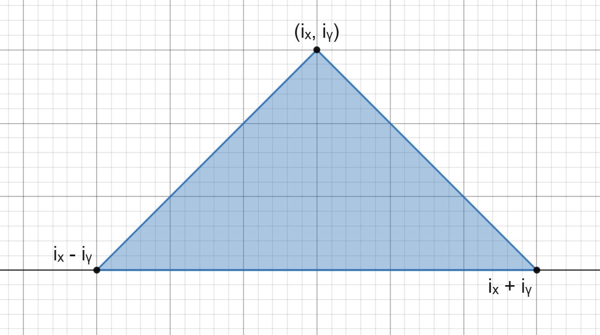
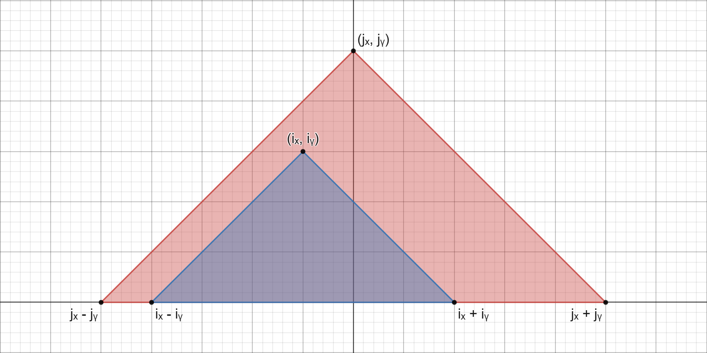
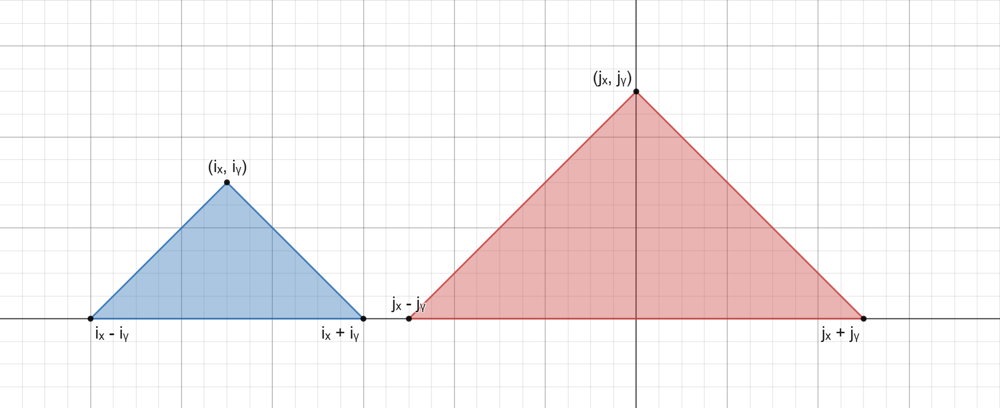
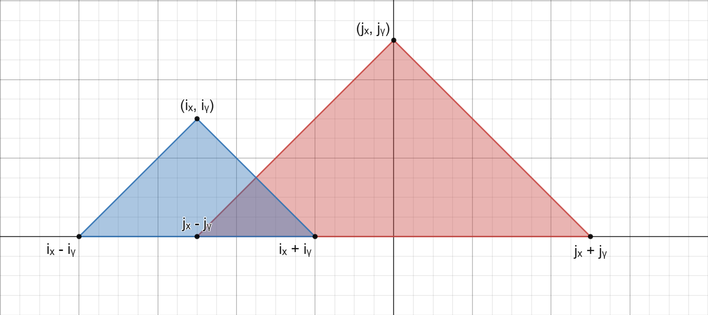

[Official Analysis (C++)](http://usaco.org/current/data/sol_mountains_silver_jan19.html)
## Explanation

There is one key understanding that is needed to solve this problem:

A mountain is obscured by another mountain if and only if the base or the mountain (the area the mountain takes up on the ground) is contained within the base of the other mountain. 

Since each mountain is made up of a right triangle, for any mountain $\mathcal{i}$ the right side of the base is $\mathcal{i}_{x}+{i}_y$ and the left side is $\mathcal{i}_{x}-{i}_y$. This is shown below:



Therefore, for a mountain $\mathcal{i}$ to be contained in another mountain $\mathcal{j}$, $\mathcal{i}_{x}+{i}_{y}\le{j}_{x}+{j}_{y}$ and $\mathcal{i}_{x}-{i}_{y}\ge{j}_{x}-{j}_{y}$.

We can see this concept in the graphs below:



In this case, In this case, $\mathcal{j}$, $\mathcal{i}_{x}+{i}_{y}\le{j}_{x}+{j}_{y}$ and $\mathcal{i}_{x}-{i}_{y}\ge{j}_{x}-{j}_{y}$, meaning  that the left and rightmost end of the mountain $\mathcal{i}$ are contained within mountain $\mathcal{j}$.



In this case, $\mathcal{j}$, $\mathcal{i}_{x}+{i}_{y}\le{j}_{x}+{j}_{y}$, but $\mathcal{i}_{x}-{i}_{y}<{j}_{x}-{j}_{y}$, meaning  that the  rightmost end of the mountain $\mathcal{i}$ is to the left of the rightmost end of mountain $\mathcal{j}$, but the leftmost end of mountain $\mathcal{i}$ is not to the right of the leftmost end of mountain $\mathcal{j}$, meaning it is not contained within mountain j. 

This same reasoning can also work if the mountains overlap, as shown below:



Using this information, we can loop through every pair of mountains and check if one is occluded by another, and complete this problem in $\mathcal{O}(n^2)$ time complexity, but that may be too slow and not complete every testcase (our Java implementation of this method completed 10/11 testcases), so we can use an alternative approach.

If we sort the mountains in increasing order of $\mathcal{i}_{x}-{i}_{y}$ for each mountain $\mathcal{i}$, we have essentially sorted all of the left sides of the mountains. Then we can loop through the list and keep track of the largest value of $\mathcal{i}_{x}+{i}_{y}$, which will be the farthest right end of the mountains. Then, as we loop through the list, if the right side of the current mountain lies within the largest value of $\mathcal{i}_{x}+{i}_{y}$, we can assume that the mountain is occluded by another since the list is sorted by the leftmost values, meaning that the left side also lies within another mountain.

## Implementation

**Time Complexity:** $\mathcal{O}(n\log n)$

<LanguageSection>
<CPPSection>

```cpp
#include <bits/stdc++.h>
using namespace std;

struct Mountain {
	int start, end;
};

bool operator<(const Mountain &m1, const Mountain &m2) {
	// sort by start and tiebreak by putting the larger mountains first
	if (m1.start == m2.start) { return m1.end > m2.end; }
	return m1.start < m2.start;
}

int main() {
	std::ifstream read("mountains.in");
	int mountain_num;
	read >> mountain_num;

	vector<Mountain> mountains;
	for (int m = 0; m < mountain_num; m++) {
		int x, y;
		read >> x >> y;
		// store the mountains by the interval they cover
		mountains.push_back({x - y, x + y});
	}
	sort(mountains.begin(), mountains.end());

	int rightmost = -1;
	int visible_num = 0;
	for (const Mountain &m : mountains) {
		if (m.end > rightmost) {
			visible_num++;
			rightmost = m.end;
		}
	}

	std::ofstream("mountains.out") << visible_num << endl;
}
```

</CPPSection>
<JavaSection>

```java
import java.io.*;
import java.util.Arrays;
import java.util.StringTokenizer;

public class Mountains {
	public static void main(String[] args) throws IOException {
		BufferedReader br = new BufferedReader(new FileReader("mountains.in"));
		int mountainNum = Integer.parseInt(br.readLine());

		Mountain[] mountains = new Mountain[mountainNum];
		for (int m = 0; m < mountainNum; m++) {
			StringTokenizer st = new StringTokenizer(br.readLine());
			int x = Integer.parseInt(st.nextToken());
			int y = Integer.parseInt(st.nextToken());
			// store the mountains by the interval they cover
			mountains[m] = new Mountain(x - y, x + y);
		}
		Arrays.sort(mountains);

		int rightmost = -1;
		int visibleNum = 0;
		for (Mountain m : mountains) {
			if (m.end > rightmost) {
				visibleNum++;
				rightmost = m.end;
			}
		}

		PrintWriter pw = new PrintWriter("mountains.out");
		pw.println(visibleNum);
		pw.close();
	}
}

class Mountain implements Comparable<Mountain> {
	public int start, end;

	public Mountain(int start, int end) {
		this.start = start;
		this.end = end;
	}

	public int compareTo(Mountain other) {
		// sort by start and tiebreak by putting the larger mountains first
		if (this.start != other.start) {
			return Integer.compare(this.start, other.start);
		}
		return Integer.compare(other.end, this.end);
	}
}
```

</JavaSection>
<PySection>

```py
class Mountain:
	def __init__(self, start: int, end: int):
		self.start = start
		self.end = end

	def __lt__(self, other: "Mountain"):
		# sort by start and tiebreak by putting the larger mountains first
		if self.start == other.start:
			return self.end > other.end
		return self.start < other.start


with open("mountains.in") as read:
	mountain_num = int(read.readline())
	mountains = []
	for _ in range(mountain_num):
		x, y = [int(i) for i in read.readline().split()]
		# store the mountains by the interval they cover
		mountains.append(Mountain(x - y, x + y))

mountains.sort()

rightmost = -1
visible_num = 0
for m in mountains:
	if m.end > rightmost:
		visible_num += 1
		rightmost = m.end

print(visible_num, file=open("mountains.out", "w"))
```

</PySection>
</LanguageSection>
