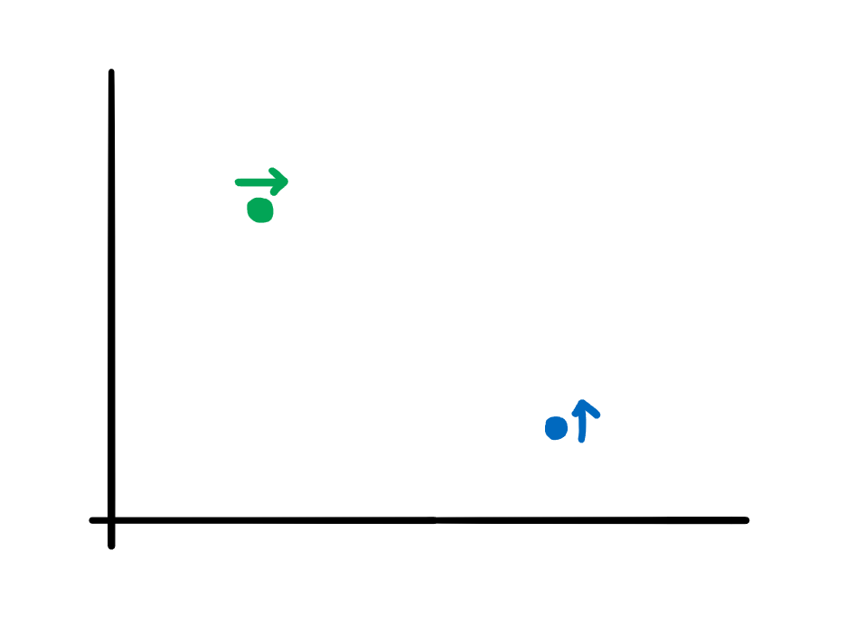

[Official Analysis (C++ and Java)](http://www.usaco.org/current/data/sol_prob3_bronze_dec20.html)

## Solution

Since $x, y \leq 10^9$, we can't simulate each time period. Instead, try to identify when pairs of cows intersect. 

One important observation is that cows can't move backwards, so the only way for two cows to collide is if $n[x] > e[x] $ and $n[y] < e[y]$. 

This ensures that the cows are positioned like this:



Now we can sort cows by their static coordinates, which ensures that earlier collisions will execute first (i.e., simulating left to right), and simulate those collisions.


## Implementation

**Time Complexity:** $\mathcal{O}(N^2)$
<LanguageSection>
<CPPSection>
	
```cpp
#include <bits/stdc++.h>
using namespace std;

int main() {
	int N; cin >> N;
	vector<array<int, 3>> n_cows, e_cows;

	for (int i = 0; i < N; i++) {
		string dir;
		int x, y;
		cin >> dir >> x >> y;

		// we need to add i as well because we need to output them in order
		if (dir == "N") {
			n_cows.push_back({x, y, i});
		} else {
			e_cows.push_back({x, y, i});
		}
	}

	// sort north cows by x value
	sort(n_cows.begin(), n_cows.end());

	// sort east cows by y value
	sort(e_cows.begin(), e_cows.end(), [](auto &left, auto &right) {
		return left[1] < right[1];
	});

	/* 
	 * we sort them by x/y value because we know that, for a single cow, 
	 * it reaches a lower x/y value and then a higher one. 
	 * Thus, it is more we would not miss any earlier collisions
	 * if we iterate from lower to a higher value. 
	 */

	// stores the amount of grass it eats
	vector<int> stop(N);
	for (int i = 0; i < N; i++) {
		stop[i] = -1;
  	}


	for (auto n_cow : n_cows) {
    		for (auto e_cow : e_cows) {
      			/*
			 * make sure that the north cow's x coord is less than the east cow's x coord,
      			 * and the north cow's y coord is less than an east cow's y coord.
			 */
      			if (n_cow[0] > e_cow[0] && n_cow[1] < e_cow[1]) {
				int n_dist = e_cow[1] - n_cow[1];
        			int e_dist = n_cow[0] - e_cow[0];

        			/*
				 * we need to check that the east cow is not stopped previously.
        			 * (Technically we need to check north cow too, but we don't need to 
        			 * because we break out of the loop once a north cow stops.)
				 */
        			if (n_dist < e_dist && stop[e_cow[2]] == -1) {
          				stop[e_cow[2]] = e_dist;
        			} else if (e_dist < n_dist && stop[e_cow[2]] == -1) {
					/*
					 * once we know that this north cow stops, we can move on to the next one, 
          				 * i.e. skip all of the rest of east cows.
					 */
          				stop[n_cow[2]] = n_dist;
          				break;
        			}
			} 
		}
	}

  	for (int i = 0; i < N; i++) {
    		if (stop[i] == -1) {
      			cout << "Infinity" << '\n';
    		} else {
      			cout << stop[i] << '\n';
    		}
  	}
}
```
</CPPSection>
<PySection>
  
```py
n = int(input())
ncows = []
ecows = []

for i in range(n):
	dir, x, y = input().split()
	# Also append i since we have to return them
	# in the same order they were given to us.
	if dir == 'N':
		ncows.append((int(x), int(y), i))
	elif dir == 'E':
		ecows.append((int(x), int(y), i))

# Sort north cows by x coordinates.
ncows.sort()
# Sort east cows by y coordinates.
ecows.sort(key=lambda cow: cow[1])

# Stores times which cows stop.
stoppin = [None] * n
# Checking every combination of cows.
for ncow in ncows:
	for ecow in ecows:
		"""
		The north cows can't move down and east cows
		can't move backwards, so a north cow's x coord must
		be less than an east cow's x coordinate, and an north 
		cow's y coordinate must be less than an east cow's y coordinate
		for them to collide.
		"""
		if ncow[0] > ecow[0] and ncow[1] < ecow[1]:
			# Distance they travel.
			ntrav = ecow[1] - ncow[1]
			etrav = ncow[0] - ecow[0]

			"""
			If the north cow gets to the meeting place before
			the east cow and the east cow has not been stopped
			already,
			"""
			if ntrav < etrav and stoppin[ecow[2]] == None:
				"""
				then we can set the east cow's stopping point.
				We only save the x coordinate because the y coord 
				stays constant.
				"""
				stoppin[ecow[2]] = ncow[0]

			# If the east cow gets there before, then we can save the 
			# north cow's position.
			if ntrav > etrav and stoppin[ecow[2]] == None:
				stoppin[ncow[2]] = ecow[1]
				# We iterate per north cow, so we can move on to the
				# next north cow if this cow doesn't move anymore.
				break

# Tracks how much they eat.
eat = [-1] * n
for nc in ncows:
	# If the element is None, then the cow never stops
	# and eats forever.
	if stoppin[nc[2]] != None:
		# Eaten is (current position - original position)
		eat[nc[2]] = stoppin[nc[2]] - nc[1]
		
for ec in ecows:
	if stoppin[ec[2]] != None:
		eat[ec[2]] = stoppin[ec[2]] - ec[0]

for x in eat:
	# Never stops.
	if x == -1:
		print('Infinity')
	else:
		print(x)
```

</PySection>

<JavaSection>

```java
import java.io.*;
import java.util.*;

public class StuckInARut {
	public static void main(String[] args) throws IOException {
		BufferedReader r = new BufferedReader(new InputStreamReader(System.in));
		PrintWriter pw = new PrintWriter(System.out);
		StringTokenizer st = new StringTokenizer(r.readLine());

		int n = Integer.parseInt(st.nextToken());
		List<int[]> northCows = new ArrayList<>();
		List<int[]> eastCows = new ArrayList<>();
		for (int i = 0; i < n; i++) {
			st = new StringTokenizer(r.readLine());
			String dir = st.nextToken();
			int x = Integer.parseInt(st.nextToken());
			int y = Integer.parseInt(st.nextToken());

			/*
			 * Also append i since we have to return them
			 * in the same order they were given to us.
			 */
			if (dir.equals("N")) {
				northCows.add(new int[]{x, y, i});
			} else {
				eastCows.add(new int[]{x, y, i});
			}
		}
		/*
		 * https://docs.oracle.com/javase/8/docs/api/java/util/Comparator.html
		 * sort east cows by comparing x positions
		 * (second element in array)
		 */
		eastCows.sort(Comparator.comparingInt(o -> o[1]));
		/*
		 * sort east cows by comparing y positions
		 * (first element in array)
		 */
		northCows.sort(Comparator.comparingInt(o -> o[0]));

		// stores locations of stopped cows
		int[] stoppedLocations = new int[n];
		Arrays.fill(stoppedLocations, -1);
		// check every combination of cows
		for (int[] northCow : northCows) {
			for (int[] eastCow : eastCows) {
				/*
				 * The north cows can't move down, and the east cows
				 * can't move backwards, so a north cow's x coordinate must
				 * be less than an east cow's x coordinate, and a north
				 * cow's y coordinate must be less than an east cow's y coordinate
				 * for them to collide.
				 */
				if (northCow[0] > eastCow[0] && northCow[1] < eastCow[1]) {
					// Distance they travel
					int northDistance = eastCow[1] - northCow[1];
					int eastDistance = northCow[0] - eastCow[0];
					/*
					 * If the north cow gets to the meeting place before
					 * the east cow and the east cow has not been stopped
					 * already,
					  */
					if (northDistance < eastDistance && 
						stoppedLocations[eastCow[2]] == -1) {
						/*
						 * then we can set the east cow's stopping point.
						 * We only save the x coordinate because the y coordinate
						 * stays constant.
						 */
						stoppedLocations[eastCow[2]] = northCow[0];
					}

					/*
					 * If the east cow gets there before, 
					 * we can save the north cow's position.
					 */
					if (northDistance > eastDistance && 
						stoppedLocations[eastCow[2]] == -1) {
						stoppedLocations[northCow[2]] = eastCow[1];
						/*
						 * We iterate per north cow, so we can move on to the
						 * next north cow if this cow can't move anymore
						 */
						break;
					}
				}
			}
		}

		// Tracks distance traveled.
		int[] distances = new int[n];
		Arrays.fill(distances, -1);
		for (int[] northCow : northCows) {
			/*
			 * If this array element hasn't been touched, 
			 * the cow never stops and eats forever.
			 */
			if (stoppedLocations[northCow[2]] != -1) {
				// Eaten is (current position - original position) 
				distances[northCow[2]] = stoppedLocations[northCow[2]] - northCow[1];
			}

		}

		for (int[] eastCow : eastCows) {
			if (stoppedLocations[eastCow[2]] != -1) {
				distances[eastCow[2]] = stoppedLocations[eastCow[2]] - eastCow[0];
			}
		}

		for (int x : distances) {
			// Ternary operator
			pw.println(x == -1 ? "Infinity" : x);
		}
		pw.close();
	}
}

```

<Info title="Ternary Operator">
	A ternary operator is like a condensed if/else statement. 
	If a logical expression inside the parantheses is true, 
	the operator "returns" the first value in a pair seperated by a colon. 
	Otherwise, it uses the second value. 
	The general structure is as follows:
	
	`foo = logic ?` [set `foo` to this value if `logic` evaluates to true] `:` [set `foo` to this value `logic` evaluates to false]

    <a href="https://docs.oracle.com/javase/tutorial/java/nutsandbolts/op2.html#:~:text=Another%20conditional%20operator,value2%20to%20result.%22">
    	Oracle tutorial on ternary statements
    </a>

</Info>
</JavaSection>

</LanguageSection>
