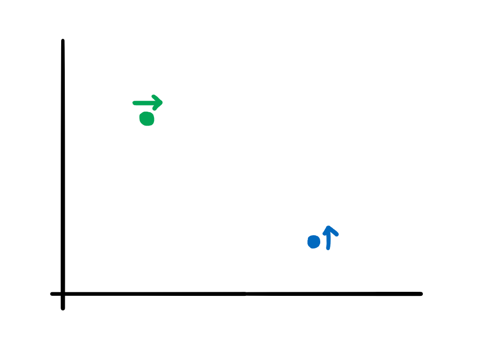

[Official Analysis (C++ and Java)](http://www.usaco.org/current/data/sol_prob3_bronze_dec20.html)

## Solution

Since $x, y \leq 10^9$, we can't simulate each time period. Instead, we should look for signs which allow two cows to intersect. 

One important observation is that cows can't move backwards, so the only way for two cows to collide is if $n[x] > e[x] $ and $n[y] < e[y]$. 

This ensures that the cows are positioned like this:



From here, we can track which cows will collide and how much grass they'll eat.


## Implementation

**Time Complexity:** $\mathcal{O}(N^2)$
<LanguageSection>
<PySection>
  
```py
n = int(input())
ncows = []
ecows = []

for i in range(n):
	dir, x, y = input().split()
	# Also append i since we have to return them
	# in the same order they were given to us.
	if dir == 'N':
		ncows.append((int(x), int(y), i))
	else:
		ecows.append((int(x), int(y), i))

# Sort north cows by x coordinates.
ncows.sort()
# Sort east cows by y coordinates.
ecows.sort(key = lambda cow: cow[1])

# Stores times which cows stop.
stoppin = [None] * n
# Checking every combination of cows.
for ncow in ncows:
	for ecow in ecows:
		"""
		The north cows can't move down and east cows
		can't move backwards, so a north cow's x coord must
		be less than an east cow's x coord, and an north 
		cow's y coord must be less than an east cow's y coord
		for them to collide.
		"""
		if ncow[0] > ecow[0] and ncow[1] < ecow[1]:
			# Distance they travel.
			ntrav = ecow[1] - ncow[1]
			etrav = ncow[0] - ecow[0]

			"""
			If the north cow gets to the meeting place before
			the east cow, and the east cow has not been stopped
			already,
			"""
			if ntrav < etrav and stoppin[ecow[2]] == None:
				"""
				then we can set the east cow's stopping point.
				We only save the x coordinate because the y coord 
				stays constant.
				"""
				stoppin[ecow[2]] = ncow[0]

			# If the east cow gets there before, then we can save the 
			# north cow's position.
			if ntrav > etrav and stoppin[ecow[2]] == None:
				stoppin[ncow[2]] = ecow[1]
				# We iterate per north cow, so we can move on to the
				# next north cow if this cow doesn't move anymore.
				break

# Tracks how much they eat.
eat = [-1] * n
for nc in ncows:
	# If the element is None, then the cow never stops
	# and eats forever.
	if stoppin[nc[2]] != None:
		# Eaten is (current position - original position)
		eat[nc[2]] = stoppin[nc[2]] - nc[1]
		
for ec in ecows:
	if stoppin[ec[2]] != None:
		eat[ec[2]] = stoppin[ec[2]] - ec[0]

for x in eat:
	# Never stops.
	if x == -1:
		print('Infinity')
	else:
		print(x)
```

</PySection>

</LanguageSection>
