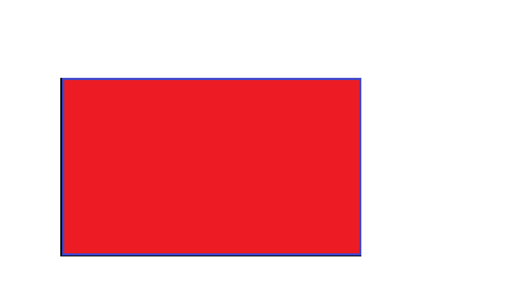
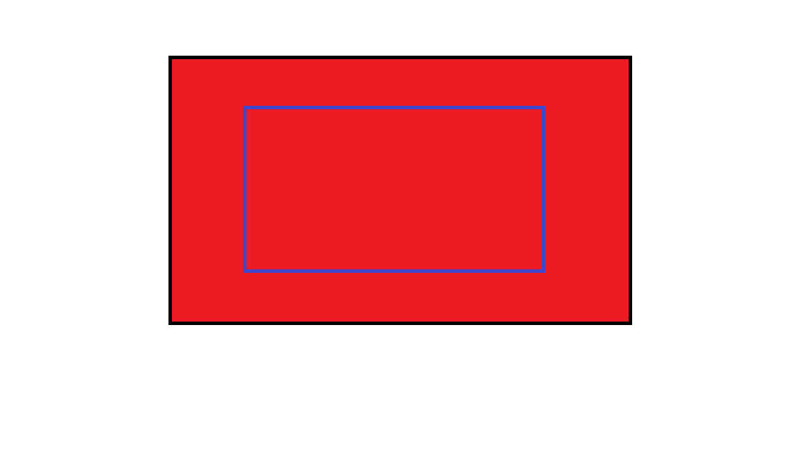
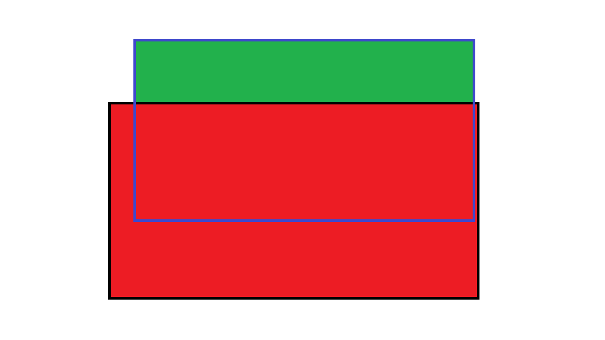
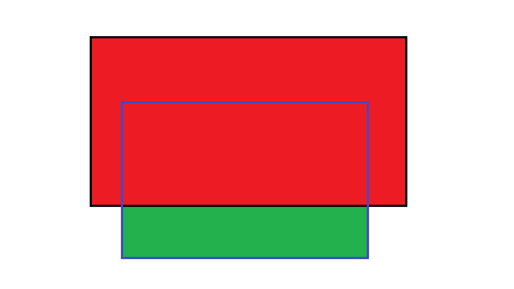
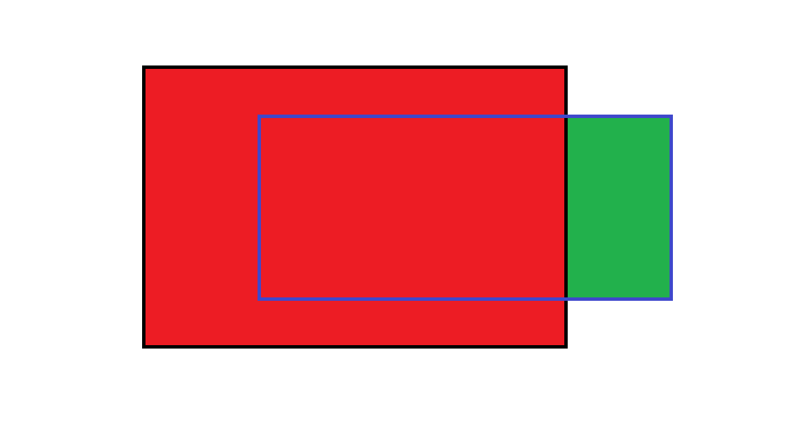
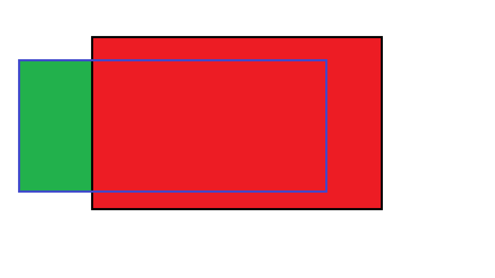
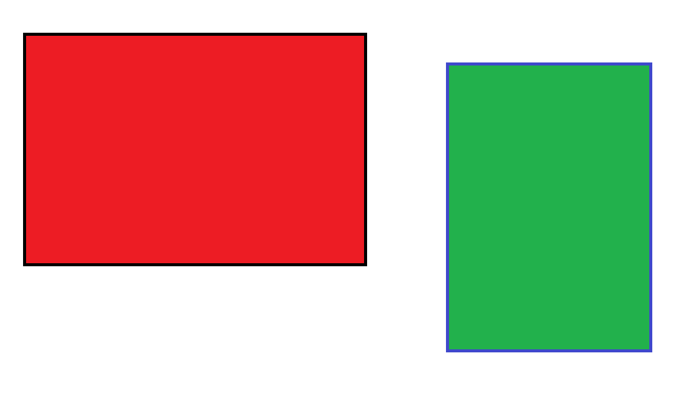
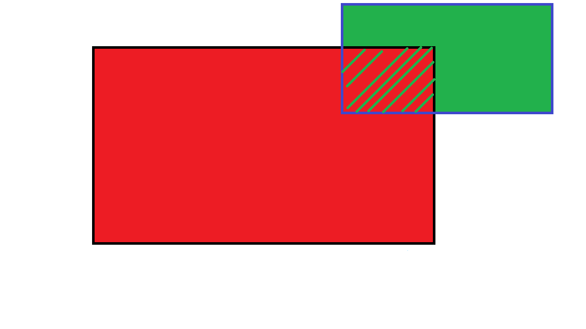

[Official Analysis](http://www.usaco.org/current/data/sol_billboard_bronze_jan18.html)

## Solution 1

As described in the aforementioned editorial.

## Implementation

<LanguageSection>

<CPPSection>

```cpp
#include <iostream>
#include <cstdio>

using namespace std;

bool covered(int x, int y, int x1, int y1, int x2, int y2) {
	/*
	 * returns true if (x, y) is covered by the rectangle bounded by
	 * (x1, y1) and (x2, y2) and false otherwise
	 */
	return x >= x1 && x <= x2 && y >= y1 && y <= y2;
}

int main() {
	freopen("billboard.in","r",stdin);
	freopen("billboard.out","w",stdout);

	int x1, y1, x2, y2;
	cin >> x1 >> y1 >> x2 >> y2;
	int x3, y3, x4, y4;
	cin >> x3 >> y3 >> x4 >> y4;

	// count how many corners of the billboard are covered
	int corner_num = 0;
	if (covered(x1, y1, x3, y3, x4, y4)) corner_num++;
	if (covered(x1, y2, x3, y3, x4, y4)) corner_num++;
	if (covered(x2, y1, x3, y3, x4, y4)) corner_num++;
	if (covered(x2, y2, x3, y3, x4, y4)) corner_num++;

	// if fewer than 2 corners are covered, the whole rectangle must be covered
	if (corner_num < 2) {
		cout << (x2 - x1) * (y2 - y1);
	} else if (corner_num == 4) {
		// if all 4 corners are covered, then nothing needs to be covered
		cout << 0;
	} else {
		// we only need to cover some portion of the rectangle
		// find the intersection of the two rectangles
		int xl = max(x1, x3);
		int xr = min(x2, x4);
		int yl = max(y1, y3);
		int yr = min(y2, y4);
		// subtract away the area of the intersection
		cout << (x2 - x1) * (y2 - y1) - (xr - xl) * (yr - yl);
	}
}
```

</CPPSection>

<JavaSection>

```java
import java.io.*;
import java.util.StringTokenizer;

public class Billboard {
	public static void main(String[] args) throws IOException {
		BufferedReader read = new BufferedReader(new FileReader("billboard.in"));
		StringTokenizer badBoard = new StringTokenizer(read.readLine());
		int x1 = Integer.parseInt(badBoard.nextToken());
		int y1 = Integer.parseInt(badBoard.nextToken());
		int x2 = Integer.parseInt(badBoard.nextToken());
		int y2 = Integer.parseInt(badBoard.nextToken());
		StringTokenizer goodBoard = new StringTokenizer(read.readLine());
		int x3 = Integer.parseInt(goodBoard.nextToken());
		int y3 = Integer.parseInt(goodBoard.nextToken());
		int x4 = Integer.parseInt(goodBoard.nextToken());
		int y4 = Integer.parseInt(goodBoard.nextToken());

		// count how many corners of the billboard are covered
		int corner_num = 0;
		if (covered(x1, y1, x3, y3, x4, y4)) corner_num++;
		if (covered(x1, y2, x3, y3, x4, y4)) corner_num++;
		if (covered(x2, y1, x3, y3, x4, y4)) corner_num++;
		if (covered(x2, y2, x3, y3, x4, y4)) corner_num++;

		PrintWriter written = new PrintWriter("billboard.out");
		// if fewer than 2 corners are covered, the whole rectangle must be covered
		if (corner_num < 2) {
			written.println((x2 - x1) * (y2 - y1));
		} else if (corner_num == 4) {
			// if all 4 corners are covered, then nothing needs to be covered
			written.println(0);
		} else {
			// we only need to cover some portion of the rectangle
			// find the intersection of the two rectangles
			int xl = Math.max(x1, x3);
			int xr = Math.min(x2, x4);
			int yl = Math.max(y1, y3);
			int yr = Math.min(y2, y4);
			// subtract away the area of the intersection
			written.println((x2 - x1) * (y2 - y1) - (xr - xl) * (yr - yl));
		}
		written.close();
	}

	private static boolean covered(int x, int y, int x1, int y1, int x2, int y2) {
		/*
		 * returns true if (x, y) is covered by the rectangle bounded by
		 * (x1, y1) and (x2, y2) and falsle otherwise
		 */
		return x >= x1 && x <= x2 && y >= y1 && y <= y2;
	}
}
```

</JavaSection>

<PySection>
```py
fin, fout = open("billboard.in"), open("billboard.out", "w")

x1, y1, x2, y2 = map(int, fin.readline().split())
x3, y3, x4, y4 = map(int, fin.readline().split())

# which corners are covered by the feed billboard
tl_corner = x3 <= x1 and y4 >= y2
tr_corner = y4 >= y2 and x4 >= x2
br_corner = x4 >= x2 and y3 <= y1
bl_corner = y3 <= y1 and x3 <= x1

corner_num = sum([tl_corner, tr_corner, br_corner, bl_corner])
# if these two corners are covered, the lawnmower billboard is completely covered
if bl_corner and tr_corner:
	fout.write(str(0))

elif corner_num in [0, 1]:
	fout.write(str(abs(x2 - x1) * abs(y2 - y1)))

elif br_corner and tr_corner:
	fout.write(str(abs(y2 - y1) * abs(x2 - x4)))

elif bl_corner and tl_corner:
	fout.write(str(abs(y2 - y1) * abs(x2 - x4)))

elif tr_corner and tl_corner:
	fout.write(str(abs(x2 - x1) * abs(y3 - y1)))

elif br_corner and bl_corner:
	fout.write(str(abs(x2 - x1) * abs(y3 - y1)))
```

</PySection>
</LanguageSection>

## Solution 2

As the problem statement says, the remaining cow feed billboard is situated in
front of the lawnmower billboard, potentially obscuring it; therefore, we can
split it into six cases to consider.

Images will be used to visualize the cases, so note these things: The red
color shows the area covered by the second rectangle (whose borders are black),
while the green one represents the area of the first rectangle (whose edges are
blue). If two rectangles intersect, the red color will appear as the cow feed
billboard block the lawnmower billboard.

We have to calculate the area of the first rectangle not obscured by the second
one. There are 6 cases to consider, illustrated by the images below:

### Case 1

In this case, both rectangles have the same coordinates, or the first rectangle
lies in the area of the second one, so the answer is 0.





### Case 2



### Case 3



### Case 4



### Case 5



### Case 6



The sixth case also includes a corner case where two rectangles intersect with
their corners. In this case, if the intersection of two rectangles is at the
corners (the top/down-left/right corners of the rectangles), we have to
calculate **the entire area** of the first rectangle (the blue-edged rectangle).
The image below illustrates the case:



## Implementation

<LanguageSection>

<CPPSection>

```cpp
#include <iostream>
#include <cstdio>
#include <vector>

using namespace std;

int main() {
	freopen("billboard.in", "r", stdin);
	freopen("billboard.out", "w", stdout);

	vector<int> x(5);  // we'll be using 1-indexing
	vector<int> y(5);
	for (int i = 1; i <= 4; i++) {
		cin >> x[i] >> y[i];
	}

	// Case 1
	if (x[4] >= x[2] && x[3] <= x[1] && y[4] >= y[2] && y[3] <= y[1]) {
		cout << 0;
	} 
	// Case 2
	else if (x[3] <= x[1] && y[3] <= y[1] && y[4] > y[1] && x[4] >= x[2]) {
		cout << (x[2] - x[1]) * (y[2] - y[4]);
	}
	// Case 3
	else if (y[3] < y[2] && x[3] <= x[1] && y[4] >= y[2] && x[4] >= x[2]) {
		cout << (x[2] - x[1]) * (y[3] - y[1]);
	}
	// Case 4
	else if (x[4] > x[1] && x[3] <= x[1] && y[4] >= y[2] && y[3] <= y[1]) {
		cout << (x[2] - x[4]) * (y[2] - y[1]);
	}
	// Case 5
	else if (x[3] < x[2] && x[4] >= x[2] && y[4] >= y[2] && y[3] <= x[1]) {
		cout << (x[3] - x[1]) * (y[2] - y[1]);
	}
	// Case 6 and the corner case
	else {
		cout << (x[2] - x[1]) * (y[2] - y[1]);
	}
}
```

</CPPSection>

<JavaSection>

```java
import java.io.*;
import java.util.Scanner;

public class Billboard {
	public static void main(String[] args) throws IOException {
		Scanner scanner = new Scanner(new FileReader("billboard.in"));
		// we'll be using 1-indexing to make things more obvious
		int[] x = new int[4 + 1];
		int[] y = new int[4 + 1];
		for (int i = 1; i <= 4; i++) {
			x[i] = scanner.nextInt();
			y[i] = scanner.nextInt();
		}
	
		PrintWriter written = new PrintWriter("billboard.out");
		// Case 1
		if (x[4] >= x[2] && x[3] <= x[1] && y[4] >= y[2] && y[3] <= y[1]) {
			written.println(0);
		} 
		// Case 2
		else if (x[3] <= x[1] && y[3] <= y[1] && y[4] > y[1] && x[4] >= x[2]) {
			written.println((x[2] - x[1]) * (y[2] - y[4]));
		}
		// Case 3
		else if (y[3] < y[2] && x[3] <= x[1] && y[4] >= y[2] && x[4] >= x[2]) {
			written.println((x[2] - x[1]) * (y[3] - y[1]));
		}
		// Case 4
		else if (x[4] > x[1] && x[3] <= x[1] && y[4] >= y[2] && y[3] <= y[1]) {
			written.println((x[2] - x[4]) * (y[2] - y[1]));
		}
		// Case 5
		else if (x[3] < x[2] && x[4] >= x[2] && y[4] >= y[2] && y[3] <= x[1]) {
			written.println((x[3] - x[1]) * (y[2] - y[1]));
		}
		// Case 6 and the corner case
		else {
			written.println((x[2] - x[1]) * (y[2] - y[1]));
		}
		written.close();
	}
}
```

</JavaSection>

<PySection>

```py
fin, fout = open("billboard.in"), open("billboard.out", "w")

x1, y1, x2, y2 = map(int, fin.readline().split())
x3, y3, x4, y4 = map(int, fin.readline().split())

# we'll be using one-indexing to make things more obvious
x = [0, x1, x2, x3, x4]
y = [0, y1, y2, y3, y4]

# Case 1
if x[4] >= x[2] and x[3] <= x[1] and y[4] >= y[2] and y[3] <= y[1]:
	fout.write(str(0))
# Case 2
elif x[3] <= x[1] and y[3] <= y[1] and y[4] > y[1] and x[4] >= x[2]:
	fout.write(str((x[2] - x[1]) * (y[2] - y[4])))
# Case 3
elif y[3] < y[2] and x[3] <= x[1] and y[4] >= y[2] and x[4] >= x[2]:
	fout.write(str((x[2] - x[1]) * (y[3] - y[1])))
# Case 4
elif x[4] > x[1] and x[3] <= x[1] and y[4] >= y[2] and y[3] <= y[1]:
	fout.write(str((x[2] - x[4]) * (y[2] - y[1])))
# Case 5
elif x[3] < x[2] and x[4] >= x[2] and y[4] >= y[2] and y[3] <= x[1]:
	fout.write(str((x[3] - x[1]) * (y[2] - y[1])))
# Case 6 and the corner case
else:
	fout.write(str((x[2] - x[1]) * (y[2] - y[1])))
```

</PySection>

</LanguageSection>
