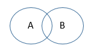

## Solution 
[Official Analysis (C++)](http://www.usaco.org/current/data/sol_evolution_bronze_open19.html)

## Video Solution
<Youtube id="4YTijr0BbrA" />

## Explanation

First, it may help to think of an instance where we cannot form a proper evolutionary tree. This would be an instance such that no matter how we form the tree, it would be inevitable that some characteristic would evolve in two distinct places in the tree. It turns out that the minimal such bad example looks like this:

$\texttt{population1: A } \\
\texttt{population2: B } \\
\texttt{population3: A B}$

In other words, we have a population with just trait $\texttt{A}$, a population with just trait $\texttt{B}$, and a population with both. If we want to build a tree out of this input, we would need to split on either $\texttt{A}$ or $\texttt{B}$ at the root, but then the remaining two subtrees would both need to have an edge that adds the other characteristic. For example, if the root split into "$\texttt{A}$" and "$\texttt{not A}$" branches, then both branches would need to contain an edge that adds the $\texttt{B}$ trait.

It will help to actually look at things from the viewpoint of the characteristics instead of from the viewpoint of the populations, so let's "transpose" the input above:

$\texttt{A: population1 population3 } \\
\texttt{B: population2 population3}$

The fundamental problem here is that there are populations in $\texttt{A}$ only, populations in $\texttt{B}$ only, and populations in both $\texttt{A}$ and $\texttt{B}$. If we look at the Venn diagram for the sets A and B, the picture therefore looks like this:



Let's call this situation a "crossing" pair of sets. In general, two sets can be disjoint (no overlap), nesting (one inside the other), or crossing (overlap but not nesting). If any two of the characteristics A and B in our instance represent crossing sets as above, then we cannot build a proper tree. On the other hand, if all the characteristics represent sets that don't cross (they are either disjoint or nested), then we get a Venn diagram like this:


If you look at this picture carefully, hopefully you see a tree formed by the nesting structure of the sets:


A tree like this is easy to convert into a proper evolutionary tree. E.g., if we have three children A, B, and C, we could just make three sequential two-way splits that add the A, B and C characteristics.

So, at the end of the day, we actually don't need to build a proper evolutionary tree, but we just need to test of any of our characteristics represent crossing sets; if so (and only if so), a proper tree is impossible to build. This leads to probably the easiest solution of the problem, shown in my code below where I build all the sets of populations having each characteristic and then just test if any pair of these sets is crossing.

## Implementation

**Time Complexity:** $\mathcal{O}(N^2)$

<LanguageSection>
<PySection>
  
```py
import sys
sys.stdin = open('evolution.in', 'r')
sys.stdout = open('evolution.out', 'w')

n = int(input())
cows = []
allchars = set()

for i in range(n):
	line = input().split()
	chars = list(line[1:])
	cows.append(chars)
	allchars.update(chars)

allchars = list(allchars)

# Check if the tree is evolutionarily proper relative to characteristics a and b
def scan(a, b):
	""""
	If we find a cow which has the characteristic a, 
	another cow which has the characteristic b, and 
	another cow with both characteristics a and b, then 
	the tree isn't evolutionarily proper.
	
	Returns a boolean
	"""
	onlya, onlyb, both = 0, 0, 0
	# Iterating through every branch.
	for i in range(n):
		hasa, hasb = 0, 0
		# Iterating through the characteristics of that branch.
		for j in range(len(cows[i])):
			if cows[i][j] == allchars[a]:
				hasa = 1
			if cows[i][j] == allchars[b]:
				hasb = 1
		if hasa and not hasb: 
			onlya = 1
		if hasb and not hasa:
			onlyb = 1
		if hasa and hasb:
			both = 1
	return onlya and onlyb and both
	
# Iterating through every pair of characteristics.
for i in range(len(allchars)):
	for j in range(i + 1, len(allchars)):
		if scan(i, j):
			print('no')
			sys.exit()
print('yes')
```
</PySection>

<JavaSection>

```java
import java.util.*;
import java.io.*;

public class CowEvolution {
	public static void main(String[] args) throws IOException {
		BufferedReader in = new BufferedReader(new FileReader("evolution.in"));
		PrintWriter out = new PrintWriter("evolution.out");

		int N = Integer.parseInt(in.readLine());
		// cows with their characteristics
		String[][] cows = new String[N][];
		// a distinct set of characteristics from all cows
		Set<String> characteristics = new HashSet<String>();
		for (int i = 0; i < N; i++) {
			String[] line = in.readLine().split(" ");
			cows[i] = Arrays.copyOfRange(line, 1, line.length);
			Collections.addAll(characteristics, cows[i]);
		}
		in.close();

		String[] characs = characteristics.toArray(new String[0]);
		// iterate through every pair of characteristics
		for (int a = 0; a < characs.length; a++) {
			for (int b = a + 1; b < characs.length; b++) {
				if (existsOverlap(characs[a], characs[b], cows)) {
					out.println("no");
					out.close();
					return;
				}
			}
		}
		out.println("yes");
		out.close();
	}

	// tests for each pair of characteristics (a, b),
	// whether there exists at least three cows with characteristic a, b, and ab.
	// if it's the case, then there is no proper evolutional tree
	// as explained in the official editorial
	private static boolean existsOverlap(String a, String b, String[][] cows) {
		boolean onlyA = false, onlyB = false, both = false;
		// interate through every cow
		for (int i = 0; i < cows.length; i++) {
			boolean hasA = false, hasB = false;
			// and their characteristics
			for (String charac : cows[i]) {
				if (charac.equals(a))
					hasA = true;
				if (charac.equals(b))
					hasB = true;
			}

			if (hasA) {
				if (hasB)
					both = true;
				else
					onlyA = true;
			} else if (hasB)
				onlyB = true;
		}

		return onlyA && onlyB && both;
	}
}
```

</JavaSection>

<CPPSection>

```cpp
// Taken from official analysis by Brian Dean
#include <iostream>
#include <fstream>
#include <vector>
using namespace std;
 
int N;
vector<string> characteristics[25];
vector<string> all_characteristics;
 
// Do two sets "cross" -- I.e., are there elements in A, B, and A intersect B?
bool crossing(int a, int b)
{
	int A = 0, B = 0, AB = 0;
	for (int i = 0; i < N; i++) {
	vector<string> &v = characteristics[i];
	bool has_a = false, has_b = false;
	for (int j = 0; j < v.size(); j++) {
	  if (v[j] == all_characteristics[a]) has_a = true;
	  if (v[j] == all_characteristics[b]) has_b = true;
	}
	if (has_a && has_b) AB++;
	else if (has_a) A++;
	else if (has_b) B++;
	}
	return AB > 0 && A > 0 && B > 0;
}
 
int main(void)
{
	ifstream fin ("evolution.in");
	fin >> N;
	string s;
	for (int i = 0; i < N; i++) {
	int K;
	fin >> K;
	for (int j = 0; j < K; j++) {
		fin >> s;
		characteristics[i].push_back(s);
		bool found = false;
		for (int k = 0; k < all_characteristics.size(); k++)
	if (all_characteristics[k] == s) found = true;
		if (!found) all_characteristics.push_back(s);
	}
}
	
	int M = all_characteristics.size();
	bool ok = true;
	for (int a = 0; a < M; a++)
	for (int b = a + 1; b < M; b++)
		if (crossing(a, b)) ok = false;
 
	ofstream fout ("evolution.out");
	if (ok) fout << "yes\n";
	else fout << "no\n";
	return 0;
}
```

</CPPSection>
</LanguageSection>
