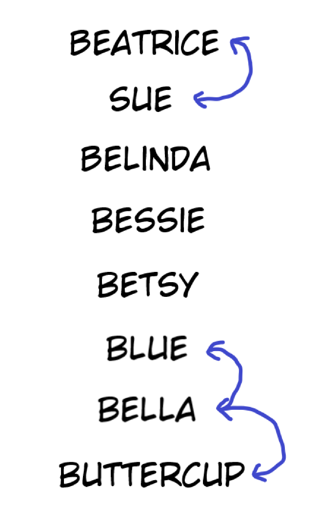

[Official Analysis (C++)](http://www.usaco.org/current/data/sol_lineup_bronze_dec19.html)

## $\mathcal{O}(N)$ Solution With Graphs

While the solutions provided in the editorial work for the given bounds,
there *is* a solution that works in just $\mathcal{O}(N)$, involving graphs!

Notice that since the input is guaranteed to be valid, we're always going to end
up with "chains" of cows that we can arrange as we please. Using the sample given
in the problem, we'd get a "chain" representation like this:



Note that cows that are not part of any chain can be considered their own chains
of length 1 for implementation purposes.

With this representation in mind, we can iterate through the cows in
lexicographical order. When we visit a cow that could be a possible
start of a chain (a cow that only has one required neighbor),
we go through its neighbors, adding cows as we go along, until we hit an end.

## Implementation

**Time Complexity:** $\mathcal{O}(N)$

<LanguageSection>
<CPPSection>

```cpp
#include <fstream>
#include <vector>
#include <map>
#include <string>
#include <algorithm>

using std::endl;
using std::string;
using std::vector;

//CodeSnip{Cow Names}
// Lambda expression - see /general/lambda-funcs
const vector<string> COWS = []() {
	vector<string> tmp{
		"Bessie",
		"Buttercup",
		"Belinda",
		"Beatrice",
		"Bella",
		"Blue",
		"Betsy",
		"Sue"
	};
	// sort names lexicographically
	std::sort(std::begin(tmp), std::end(tmp));
	return tmp;
}();
//EndCodeSnip

int main() {
	std::map<string, int> cow_inds;
	for (int i = 0; i < COWS.size(); i++) {
		cow_inds[COWS[i]] = i;
	}

	std::ifstream read("lineup.in");
	int req_num;
	read >> req_num;
	vector<vector<int>> neighbors(COWS.size());
	for (int r = 0; r < req_num; r++) {
		string cow1;
		string cow2;
		string trash;
		read >> cow1 >> trash >> trash >> trash >> trash >> cow2;

		// Convert the names to their index in the list
		int c1 = cow_inds[cow1];
		int c2 = cow_inds[cow2];
		neighbors[c1].push_back(c2);
		neighbors[c2].push_back(c1);
	}

	vector<int> order;
	vector<bool> added(COWS.size());
	for (int c = 0; c < COWS.size(); c++) {
		if (!added[c] && neighbors[c].size() <= 1) {
			added[c] = true;
			order.push_back(c);

			if (neighbors[c].size() == 1) {
				int prev = c;
				int at = neighbors[c][0];
				while (neighbors[at].size() == 2) {
					added[at] = true;
					order.push_back(at);
					
					int a = neighbors[at][0];
					int b = neighbors[at][1];
					int temp_at = a == prev ? b : a;
					prev = at;
					at = temp_at;
				}
				added[at] = true;
				order.push_back(at);
			}
		}
	}

	std::ofstream out("lineup.out");
	for (int c : order) {
		out << COWS[c] << endl;
	}
}
```

</CPPSection>
<JavaSection>

```java
import java.io.*;
import java.util.*;

public class LineUp {
	// Assumed to be in sorted order (which it is)
	static final String[] COWS = new String[] {
		"Beatrice",
		"Belinda",
		"Bella",
		"Bessie",
		"Betsy",
		"Blue",
		"Buttercup",
		"Sue"  
	};

	public static void main(String[] args) throws IOException {
		Map<String, Integer> cowInds = new HashMap<>();
		for (int i = 0; i < COWS.length; i++) {
			cowInds.put(COWS[i], i);
		}

		BufferedReader read = new BufferedReader(new FileReader("lineup.in"));
		int reqNum = Integer.parseInt(read.readLine());

		List<Integer>[] neighbors = new ArrayList[COWS.length];
		for (int c = 0; c < COWS.length; c++) {
			neighbors[c] = new ArrayList<>();
		}
		for (int r = 0; r < reqNum; r++) {
			String[] words = read.readLine().split(" ");

			// Convert the names to their index in the list
			int cow1 = cowInds.get(words[0]);
			int cow2 = cowInds.get(words[words.length - 1]);
			neighbors[cow1].add(cow2);
			neighbors[cow2].add(cow1);
		}

		List<Integer> order = new ArrayList<>();
		boolean[] added = new boolean[COWS.length];
		for (int c = 0; c < COWS.length; c++) {
			/*
			 * Check that:
			 * 1. This cow hasn't already been added yet.
			 * 2. This cow could be the possible start of a chain.
			 */
			if (!added[c] && neighbors[c].size() <= 1) {
				added[c] = true;
				order.add(c);

				// If the chain length > 1, we keep on going
				if (neighbors[c].size() == 1) {
					int prev = c;
					int at = neighbors[c].get(0);
					while (neighbors[at].size() == 2) {
						added[at] = true;
						order.add(at);
						
						int a = neighbors[at].get(0);
						int b = neighbors[at].get(1);
						int temp_at = a == prev ? b : a;
						prev = at;
						at = temp_at;
					}
					// Add the final element
					added[at] = true;
					order.add(at);
				}
			}
		}

		PrintWriter out = new PrintWriter("lineup.out");
		for (int c : order) {
			out.println(COWS[c]);
		}
		out.close();
	}
}
```

</JavaSection>
<PySection>

```py
COWS = sorted([
	'Bessie',
	'Buttercup',
	'Belinda',
	'Beatrice',
	'Bella',
	'Blue',
	'Betsy',
	'Sue'
])

cow_inds = {c: i for i, c in enumerate(COWS)}

neighbors = [[] for _ in range(len(COWS))]
with open('lineup.in') as read:
	for _ in range(int(read.readline())):
		words = read.readline().strip().split()

		# Convert the names to their index in the list
		cow1 = cow_inds[words[0]]
		cow2 = cow_inds[words[-1]]
		neighbors[cow1].append(cow2)
		neighbors[cow2].append(cow1)

order = []
added = [False for _ in range(len(COWS))]
for c in range(len(COWS)):
	"""
	Check that:
	1. This cow hasn't already been added yet.
	2. This cow could be the possible start of a chain.
	"""
	if not added[c] and len(neighbors[c]) <= 1:
		added[c] = True
		order.append(c)

		# If the chain length > 1, we keep on going
		if len(neighbors[c]) == 1:
			prev = c
			at = neighbors[c][0]
			while len(neighbors[at]) == 2:
				added[at] = True
				order.append(at)
				a, b = neighbors[at]
				at, prev = b if a == prev else a, at

			# Add the final element
			added[at] = True
			order.append(at)

with open('lineup.out', 'w') as out:
	for c in order:
		print(COWS[c], file=out)
```

</PySection>
</LanguageSection>
