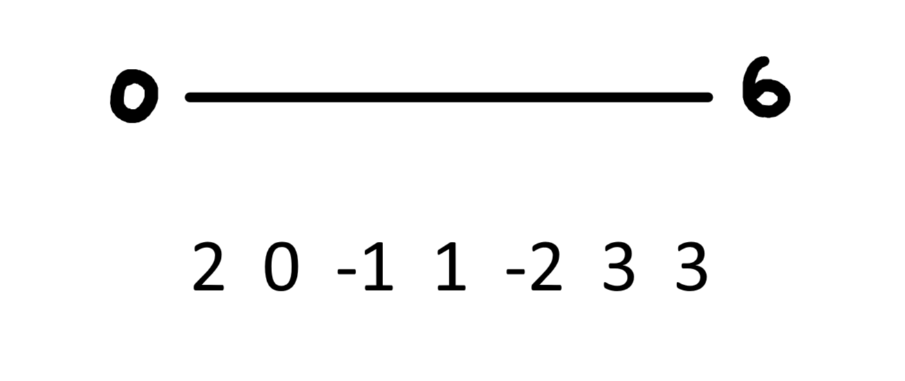
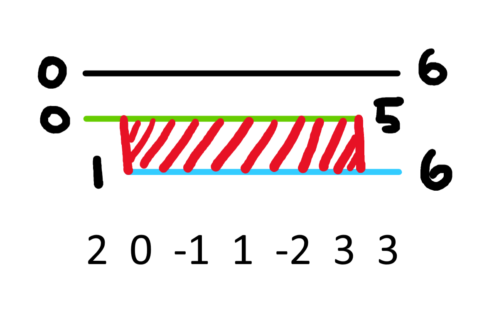

[Official Analysis (C++ and Java)](http://www.usaco.org/current/data/sol_threesum_gold_jan20.html)

## Explanation

Although the problem may be daunting at first, it helps to break down the problem into separate components.

Let's use a DP!

If $\texttt{ways}[i][j]$ equals the number of unordered triplets which sum to zero between $[i, j]$, then what states does this rely on?



Well intuitively, we can choose to exclude one point or the other, which gives us a picture like this (reminder to make sure not to double count the overlap).



However, we're missing something! We aren't taking account for the for any triplets which start at $i$ and end at $j$, since those aren't included in our "PIE-like" transition.

To do this, we can precalculate the number of triplets which start at $i$ and end at $j$ in $\mathcal{O}(N^2)$ time by storing the occurences of elements between $i$ and $j$ in an array.

More formally, our final transition is:

$\texttt{ways}[i][j] = \texttt{ways}[i + 1][j] + \texttt{ways}[i][j - 1] - \texttt{ways}[i + 1][j - 1] + \texttt{trp}[i][j]$

where $\texttt{trp}[i][k]$ equals the number of triplets which sum to zero and start at $i$ and end at $k$.

Note that we can't store $\texttt{trp}$ in it's own array due to memory constraints.


## Implementation

**Time Complexity:** $\mathcal{O}(N^2)$

<LanguageSection>

<CPPSection>

```cpp
#include <bits/stdc++.h>
using namespace std;

using ll = long long;
const int max_val = 1e6;

int main() {
	freopen("threesum.in", "r", stdin);
	freopen("threesum.out", "w", stdout);
	cin.tie(0)->sync_with_stdio(0);
	
	int n, q;
	cin >> n >> q;

	vector<int> val(n);
	for (int i = 0; i < n; i++) {
		cin >> val[i];
		val[i] += max_val;
	}

	// number of triplets such that i and k are fixed
	vector<vector<ll>> ways(n, vector<ll>(n, 0));
	vector<int> frq(2 * max_val);

	for (int i = n - 2; i >= 0; i--) {
		/*
		 * be careful to only consider values
		 * in between i and j
		 */
		frq[val[i + 1]]++;
		
		for (int j = i + 2; j < n; j++) {
			// separate val from shifted amt
			int rem = (max_val * 3) - (val[i] + val[j]);
			
			if (rem >= 0 && rem < (2 * max_val)) {
				ways[i][j] = frq[rem];
			}
			frq[val[j]]++;
		}

		for (int j = i + 1; j < n; j++) {
			frq[val[j]]--;
		}
	}

	// essentially 2D prefix sum on ways
	for (int i = n - 1; i >= 0; i--) {
		for (int j = i + 1; j < n; j++) {
			ways[i][j] += (
				ways[i + 1][j] +
				ways[i][j - 1] -
				ways[i + 1][j - 1]
			);
		}
	}

	for (int _ = 0; _ < q; _++) {
		int l, r;
		cin >> l >> r;
		cout << ways[l - 1][r - 1] << '\n';
	}
}
```
</JavaSection>
</LanguageSection>
